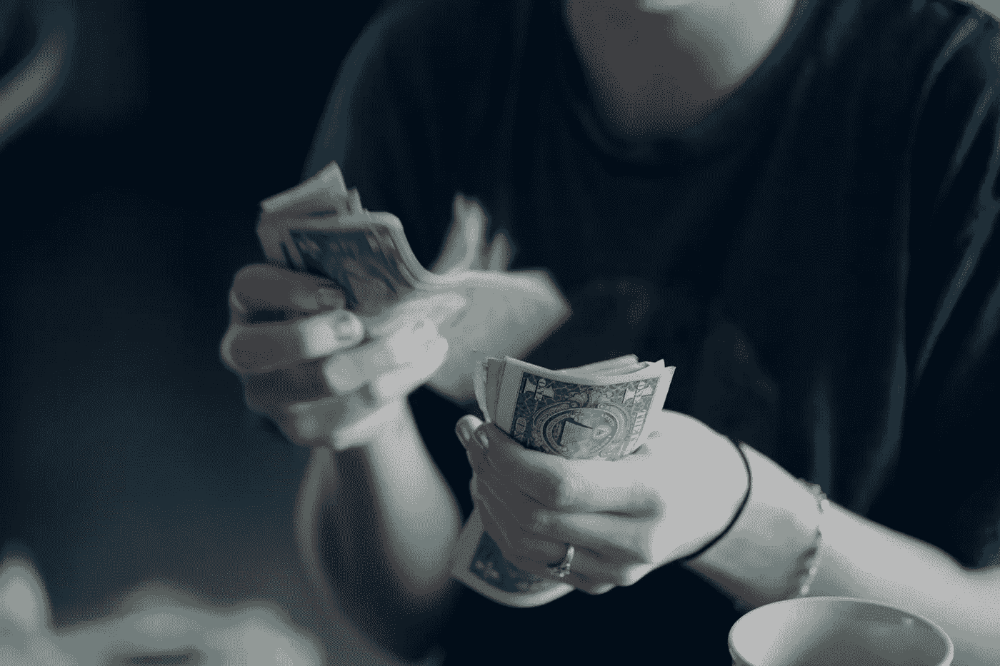
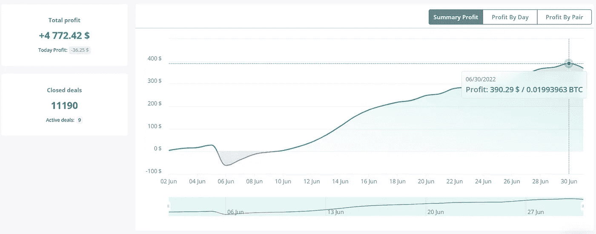
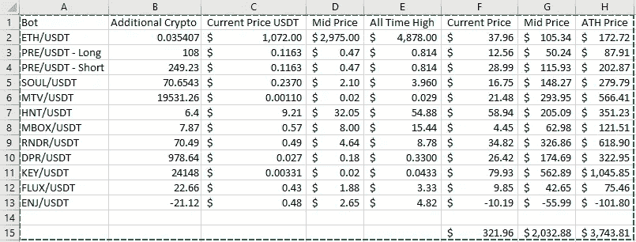

# 6 月:来自机器人、矿工和 Stepn 的 1099 美元被动收入！

> 原文：<https://medium.com/coinmonks/june-1-099-in-passive-income-from-bots-miners-stepn-feaa4cf9a276?source=collection_archive---------4----------------------->

又到了新的一个月，从 6 月份开始，收入被动更新。我会在下面留下一些前几个月更新的链接。

[4 月](/coinmonks/how-much-passive-income-have-i-made-with-my-crypto-miners-dca-bots-in-the-last-30-days-bcfb4c46a25a)——被动收入 705 美元

[五月](/coinmonks/may-1-400-in-passive-income-from-bots-miners-a-couple-of-new-projects-3c824d798f7b)——1400 美元的被动收入

1.  **M2 职业矿工**

我有两个这样的矿工。这些矿工每人给我赚了 3495 MXC，按目前的价格计算，总共相当于 565 美元。如果我把这些放在 ATH，这个月会跳到 933 美元！

自从我买下这些矿工——一个在 2 月底，一个在 5 月初——我已经开采了 6000 美元投资中的 2026 美元，支付了大约 3 美元的电费！

如果我等待 MXC 到达之前的 ATH 时卖出，我已经积累了 3286 美元，超过 50%的投资回报率。

完整评论&优惠 50 美元[此处](https://realisticcrypto.medium.com/my-highest-paying-2-electric-per-month-plug-play-crypto-miner-makes-me-around-12-per-day-per-375ccc604988)

**2。氦矿工**

这个月有点失望但是被动收入还是被动收入！

因此，我有 2 个 Sensecap M1 氦矿工设置了 5.8dbi 无线天线。我有另外 2 个山猫 300 矿工刚刚到达，所以我们下个月应该会看到更多的 HNT！

一人总共获得了 3.72 HNT，另一人获得了 2.57 HNT，总计约 60 美元。

如果我等待 HNT 到达之前的 ATH 时卖出，这个月的总额将是 345 美元。

> 交易新手？尝试[加密交易机器人](/coinmonks/crypto-trading-bot-c2ffce8acb2a)或[复制交易](/coinmonks/top-10-crypto-copy-trading-platforms-for-beginners-d0c37c7d698c)

**3。步骤**

上个月新添的。我在 STEPN 上写了一篇文章([这里](/coinmonks/stepping-in-to-stepn-get-paid-for-your-walk-or-run-heres-my-strategy-and-expected-roi-2a900feb96ba))然后 STEPN 决定发布一个更新，搞乱我的策略！不过，关于我的新策略的新文章！

我有一双 23 级的普通运动鞋，这个月赚了 660.68 英镑。按目前的价值计算，这个月相当于 80.73 美元。

我不会将此与历史最高水平进行比较，因为我不认为商品及服务税会回到接近历史最高水平的水平，但我会继续将任何收入投入到该项目中。

**4。DCA 机器人**

这个月我总共从 3 个商业机器人那里赚了 390 美元。

这里发生了一些变化。首先，我介绍了一个新的机器人。我的 Bybit 账户中有一点 ETH，所以我创建了一个新的 bot，以 5 倍的杠杆在 Bybit 上运行，自 6 月 12 日以来，它已经取得了 48 美元的净收入，因此我很高兴看到它在 7 月份的表现。

我还为 Presearch (PRE)添加了另一个新的机器人，这是一个分散的搜索引擎。这里的条[。现在我有一个短的 bot &一个长的 both 积累 PRE。](/coinmonks/do-you-want-a-good-search-engine-that-pays-you-in-crypto-to-use-it-a545f11df840)

我如何设置机器人的指南可以在[这里](/coinmonks/dca-bots-do-they-actually-work-and-are-they-actually-passive-income-im-undecided-90846b04db2a)找到。

最后一点，鉴于过去几个月的价格暴跌，我想就我对这些机器人的策略提出一些看法。我在下面附上了一个截屏，显示了上个月我在每个机器人身上积累了多少额外的加密。**如果**这些密码回到历史高点，这个月的利润将是 3743 美元。如果他们只达到了现价和历史最高价的中间点，这将值 2032 美元。

我的策略，积累复合密码！

**5。SCPrime**

这是一个我非常看好的长期项目。一篇深入的文章可以在[这里](https://realisticcrypto.medium.com/scprime-long-term-investment-providing-your-own-storage-c2ab374c754a)找到。除了我赚了 13.3 SCP，我没有更多要说的了。按现价 3 美元。

总数

M2 专业版——565 美元

氦气——60 美元

stepn——81 美元

DCA 机器人——390 美元

SCPrime——3 美元

**总计:1099 美元**

最后，在价格创下历史新高之前，我持有的总价值为 5105 美元。

**附属链接**

更多优惠还可以在这里找到:[https://linktr.ee/RealisticCrypto](https://linktr.ee/RealisticCrypto)

还有，如果你想请我喝杯咖啡或者啤酒:) :

BTC—BC 1 qaxaq 2 q 9 js 89 gyzhr 0202 sxt 6 hgchprqjga 5 px

基于 ETH、BNB、AVAX、SOL 和 FTM 的令牌—0 x3b 7b 843d 8125 Fe 7 EBA 541 e 1d 751 a4 a 73 f 0 cfad 4c

**免责声明**

这不是财务建议，我不是财务顾问或会计或税务专家。这是我对帮助过我的软件工具的体验，以及我使用它们的经历。

我在本指南中使用了推荐链接。使用这些工具有助于以后的文章，所以如果你觉得这篇文章有用，并且想看看我提到的工具，请使用它们。我还会叫出你在哪里打折——双赢对吧？