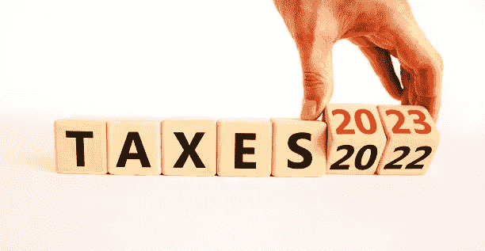

# 正好赶上纳税季

> 原文：<https://medium.com/coinmonks/just-in-time-for-tax-season-74fd0ddf2c3c?source=collection_archive---------56----------------------->

istockphoto

美国国税局发布了针对加密的 2022 年纳税申报的更新(草案)说明。在新语言中，“虚拟货币”被替换为“数字资产”。

根据指令草案，“数字资产是记录在加密保护的分布式账本或任何类似技术上的价值的任何数字表示”。“例如，数字资产包括…