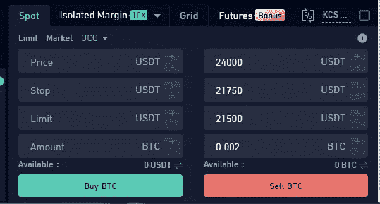

# 什么是 OCO 订单，它具体是如何工作的？(库币)

> 原文：<https://medium.com/coinmonks/just-what-is-an-oco-order-and-how-exactly-does-it-work-e77dde2020b3?source=collection_archive---------5----------------------->

*OCO 订单:自动交易，结合限价订单和止损限价订单*

承认吧。加密技术已经走过了漫长的道路。回到 2011 年，谁会想到 BTC 会涨到 1 万美元？现在，在撰写本文时，1 BTC 价值高达 24574 美元。哦，我们不要忘记它在 2021 年 11 月达到历史最高水平 69，000 美元的那一刻。

随着时间的推移，所有其他替代硬币都纷纷效仿，从而将加密空间重新定义为有效的投资资产。

嗯，所有这些因素导致 crypto 最终得到了应有的尊重。与此同时，加密货币交易所迅速崛起，让用户可以直接购买、出售和交易加密资产。

然而，自由伴随着责任。交易者想出确保持续盈利的策略是很重要的。OCO 订单仍然是从技术和基本面分析交易机会的可靠策略。

在这篇博文中，我们将探讨如何利用 OCO 订单进行交易，并在 Kucoin 加密交易平台上将交易策略提升到一个新的水平。

## 一言以蔽之，OCO 订单

OCO 全称是“*一个取消另一个*”。OCO 订单本质上是一种独家订单，给予交易者同时下两个不同订单的最终选择。

这通常包括在同一时刻将限价单和止损单结合起来；但是，只允许实现一个。因此，一个订单执行后，另一个订单会立即自动取消。

## 限价和止损限价单

在进一步研究 OCO 订单之前，理解它的核心功能是很重要的；限价和止损限价单。

***限价单*** 是以更有利的价格买入或卖出资产的指定订单。这也是大多数交易者在购买 crypto 时的首选订单类型。在“*买入限价*”订单上，该订单旨在以限价或更低的价格独家执行。或者，在“*卖单限价*”订单中，订单仅在限价或限价以上执行。

与市价订单不同的是，“*买入限价*”订单实质上是给投资者一个机会，以他们希望的友好价格甚至更低的价格买入资产。重要的是要注意，如果价格没有达到指定的价格，就不可能完成限价单。

***止损限价单*** 从根本上将止损触发与限价单合并在一起。有了止损限价单，交易者就有能力设定他们愿意带走的最小利润和他们愿意亏损的最大利润。

当达到触发价格时，无论交易者是否在场，限价单都会自动执行。实际上，止损价格是交易所执行限价单的触发价格。

交易者可以改变限价，限价通常高于买入订单的止损价，低于卖出订单的止损价。

## 使用 OCO 订单并在 Kucoin 上执行

OCO 订单带来了结合限价和止损限价订单的自动化功能。这样，交易者可以通过在获利和实现亏损两种情况下下 OCO 订单来自动退出头寸。

OCO 订单在波动的市场中表现很好，价格会很快转向不同的方向。有了自动化功能，交易者就不需要整天呆在交易站里了。

众所周知，高级交易者会根据阻力位和支撑位，并结合资产的波动性，方便地下达限价止损单。

***在库币*中执行 OCO 指令**

如果你还没有开一个 Kucoin 账户，你可能会错过一个在加密领域掀起波澜的加密交换平台。

凭借其低廉的费用、强大的用户基础、先进的交易功能和强大的客户支持，该交易所正在打破常规，为密码交易员提供急需的价值。是的，它是领先的替代硬币加密交易所，又名*人民交易所。*

作为一个交易者，拥有一个充满活力和坚实的交易平台是至关重要的。库科恩当然晋级了。

*在 Kucoin 上使用 OCO 订单需要几个简单的步骤:*

1.  登录库币。无论您打算交易哪种货币对，请导航至其交易界面。对于这个例子，让我们使用 [**BTC/USDT**](https://www.kucoin.com/trade/BTC-USDT?spm=kcWeb.B3creator.Header4.1) 密码对。

OCO 订单将位于“*点*部分，并在“*停止限制*下。

2.选择 OCO 订单后，您将看到如下所示的界面:

*让我们探索每个领域及其代表的含义:*

*   ***价格*** -这通常代表您限价单的价格。本质上，这是将出现在您的订单簿上的金额，您可以自由地将其设置为您愿意退出您的头寸并获利的金额。*(在场景* *中* *交易对你有利)*
*   *-这代表限价止跌触发价格。因此，当资产价格达到指定的触发点时，它将继续用止损限价单取代常规限价单。在许多情况下，众所周知，交易者会将止损触发点设置得比限价止损点稍高或稍低，以便给订单时间以正确的价格执行。*
*   ****限价***——这代表你的限价止损单的价格。当止损价格被触发时，该金额将出现在您的订单簿上。你可以自由设定这个金额，直到你想退出你的头寸并接受损失。*(在交易不按你的方式进行时)**
*   ****金额*** -这代表您订单的确切价值。*

*假设你以 22，500 美元买入 0.002BTC，并认为价格最终会上涨。然而，你不能完全确定价格会上涨，甚至会进一步下跌；因此，你想尽量减少你的损失。*

**

*在这种情况下，您可以下一个 OCO 订单，在 24，000 USDT 执行获利了结限价订单，在 21，500 USDT 执行损失最小化止损限价订单，该订单在 21，750 USDT 触发。*

*一旦您下了 OCO 订单，您的未平仓合约将出现在“高级订单”选项卡中，您可以在此自由监控或取消订单。*

**

*如果你够幸运，BTC 的价格确实达到了 24，000 USDT，你的卖单将被执行，限价止蚀单将被自动取消。*

*或者，如果 BTC 价格跌至或低于 21，750 USDT，21，500 USDT 的限价止蚀单将被触发。万一价格进一步下跌，这一因素会使你的损失最小化。*

*请注意，除非您的订单被触发，否则您的资产不会被锁定。如果您的资产在达到触发价格时不足，订单将不会执行，但您的资产将被锁定。*

## *结论*

*OCO 订单为优化交易结果创造了必要的平衡。它迎合了交易可以双向进行的可能性。这样，你就消除了基于情绪和偏见的交易。*

*因此，这是一个简单而强大的功能，让 Kucoin 用户以自动化和安全的方式进行交易。*

*你使用过 OCO 订单吗？*

*[***在这里开立您的 Kucoin 账户，让我们用 OCO 指令来平衡您的交易> >***](https://www.kucoin.com/ucenter/signup?rcode=rP1HTX2)*

****关联披露:*** *本帖可能包含关联链接* s*

> *交易新手？试试[加密交易机器人](/coinmonks/crypto-trading-bot-c2ffce8acb2a)或者[复制交易](/coinmonks/top-10-crypto-copy-trading-platforms-for-beginners-d0c37c7d698c)*