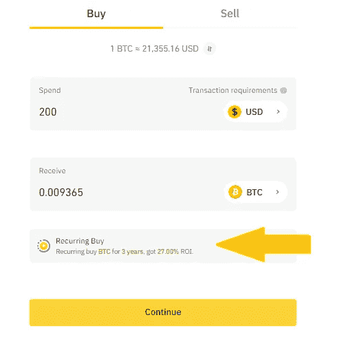
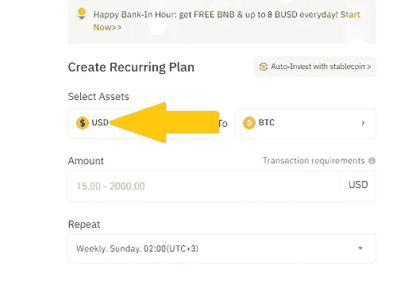
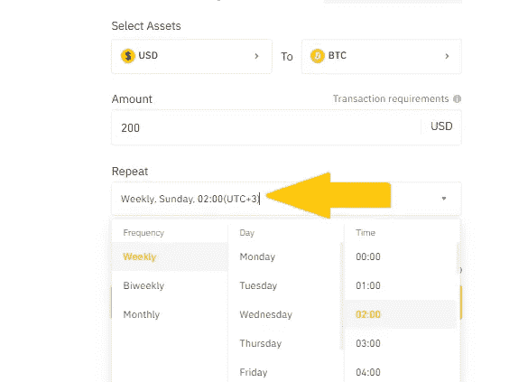
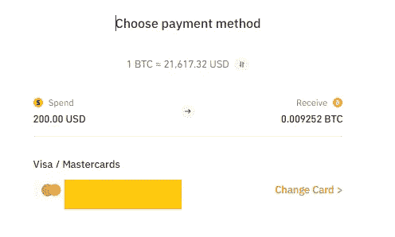

# 什么是平均成本？

> 原文：<https://medium.com/coinmonks/just-what-is-dollar-cost-averaging-d1ea68aa6a5e?source=collection_archive---------21----------------------->

*DCA:稳定的秘密增长，定期&持续投资*

不言而喻，积极交易不适合胆小的人。这是一项伴随着一系列挑战的技能。在投资方面，制定策略来改善你的投资组合是很方便的。众所周知，长期交易者和投资者会采用长期交易方法来降低风险。对于大多数交易者来说，平均成本是成功交易的最大优势。

## 什么是平均成本？

美元成本平均法通常涉及在特定时间内定期投资固定金额。随着加密市场的波动，平均成本法提供了降低风险的完美方案。

“*美元平均成本*这个名字来源于该战略降低购买资产的平均成本的潜力。

## 这一切是如何运作的？

美元成本平均法本质上为投资者提供了一种在高价时购买较少资产，在低价时购买较多资产的可能性。这是一种相对更准确的定位方式，而不是一步到位。

*举例:*假设你有 5000 美元的资本，你打算投资。你查看了市场，并根据以太坊的位置确定它可能是一笔巨大的资产。

你可以把钱分成 50 块，每天投资，而不是一次性把 5000 美元全部投资在以太坊上。这意味着无论当天 Eth 的价格如何，你都必须购买价值 50 美元的 Eth。这样你就把进场时间延长了，目的是降低风险。

但是如果以太坊刚刚进入熊市，我们还应该用这个策略吗？在熊市刚刚开始，但我们最终预见到长期牛市的情况下，美元平均成本仍然是实用的，但有不同的主计划。

这个想法是延长进入一个位置的时间。在这种情况下，我们将每周投资 50 美元，而不是每天。这样，你的投资就分散在一个更长的时期，让下跌趋势自然发展。

然而，重要的是要注意，这种策略毕竟是有风险的，因为我们仍在下跌趋势中买入。一些投资者更愿意在熊市结束、上升趋势刚刚开始后建仓。

## 平均成本的好处

美元平均成本有一些好处，对交易者来说是相当有利可图的。由于这种策略有助于长期进入市场，它被证明是非常方便的，特别是对第一次交易者。

1.  ***稳定的投资组合增长***

美元成本平均法是指在固定的时间间隔内对特定的资产进行投资。这意味着不管市场气候如何，尽管价格可能会不时波动，你也能留在市场上。从长远来看，无论市场如何波动，这种策略都能让你通过持续的投资创造秘密财富。

***2。便利性&灵活性***

当交易者能够以较小的金额进入市场时，美元平均成本就很方便。此外，你可以选择每天、每周或每月的计划。在像币安这样的平台上，平均每美元有 50 多种加密货币可用，每两周增加一种。

***3。轻松进入币安生态系统***

币安恰好是通过经常性买入实行美元成本平均的终极交易所。此外，你可以逐步进入其他币安产品，如产量农业，赌注，贸易和发射台。

## 如何在币安平均计算美元成本

开始在币安重复购买从未变得如此简单。只需几个步骤，您就可以启动并运行您的第一个 DCA 项目。

1.  ***选择您的加密并启用定期购买***

登录您的币安账户，点击主页上的“*贷记/借记*”选项。继续选择您需要的加密，并启用重复购买选项，如下所示:

**②*。选择你喜欢的法定货币***

你将被重定向到一个经常性的购买页面，你可以继续选择你喜欢的法定货币购买。

> 交易新手？试试[加密交易机器人](/coinmonks/crypto-trading-bot-c2ffce8acb2a)或者[复制交易](/coinmonks/top-10-crypto-copy-trading-platforms-for-beginners-d0c37c7d698c)

***3。选择*频率**

你喜欢每周、每两周或每月投资吗？如下所示选择您想要的频率。

***4。选择您的付款方式***

完成定期购买详情后，选择您的付款方式。在撰写本文时，币安只接受 Visa 或 Mastercard 支付。

***5。确认您的详细信息***

需要注意的是，在订单页面上，加密价格会在一分钟内重新计算。因此，请在时限内检查并确认您的详细信息，或者在超出时限时点击刷新。确认您的订单详情后，您就可以开始了。

## 结论

通过平均成本对市场进行预热提供了一个很好的加密交易策略。随着加密市场的波动，重要的是要制定长期战略，确保随着时间的推移获得更高的收益。

[***在此了解更多> >***](https://www.binance.com/en/blog/fiat/how-to-grow-your-crypto-portfolio-with-recurring-buy-421499824684903346?ref=431277160)

[***今天开始使用美元成本平均法> >***](https://www.binance.com/en/buy-sell-crypto?channel=card&fiat=EUR&recurring=open?ref=431277160)

[***还不是个 Binancian？在这里报名> >***](https://accounts.binance.com/en/register?ref=431277160)

***关联披露:*** *本帖包含关联链接。如果您使用这些链接购买一些东西，我们可能会赚取佣金，对您没有额外的费用。感谢*。

> 加入 Coinmonks [电报频道](https://t.me/coincodecap)和 [Youtube 频道](https://www.youtube.com/c/coinmonks/videos)了解加密交易和投资

# 另外，阅读

*   [币安 vs FTX](https://coincodecap.com/binance-vs-ftx) | [最佳(SOL)索拉纳钱包](https://coincodecap.com/solana-wallets)
*   [如何在 Uniswap 上交换加密？](https://coincodecap.com/swap-crypto-on-uniswap) | [A-Ads 评论](https://coincodecap.com/a-ads-review)
*   [加密货币储蓄账户](/coinmonks/cryptocurrency-savings-accounts-be3bc0feffbf) | [YoBit 审核](/coinmonks/yobit-review-175464162c62)
*   [Botsfolio vs nap bots vs Mudrex](/coinmonks/botsfolio-vs-napbots-vs-mudrex-c81344970c02)|[gate . io 交流回顾](/coinmonks/gate-io-exchange-review-61bf87b7078f)
*   [CoinFLEX 评论](https://coincodecap.com/coinflex-review) | [AEX 交易所评论](https://coincodecap.com/aex-exchange-review) | [UPbit 评论](https://coincodecap.com/upbit-review)