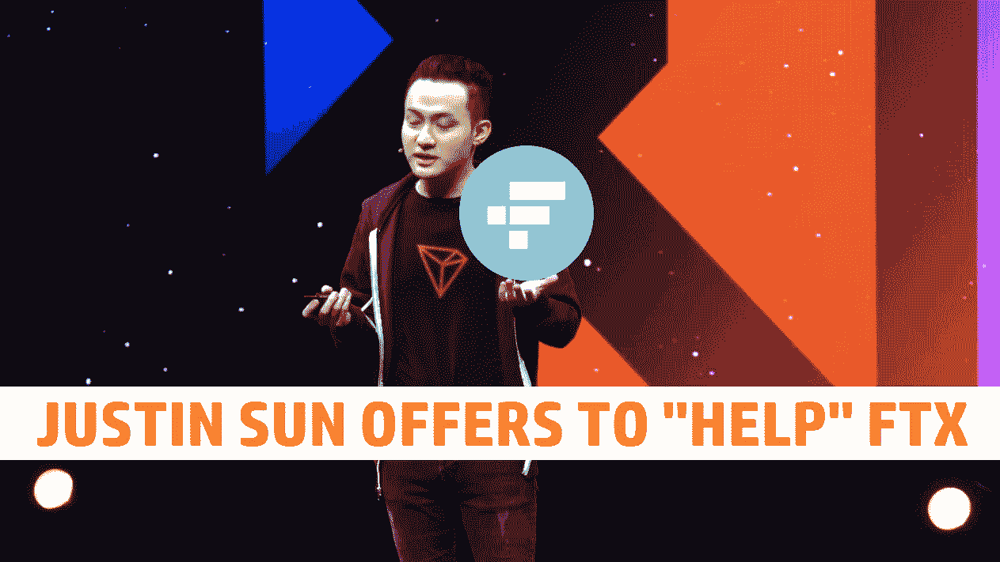
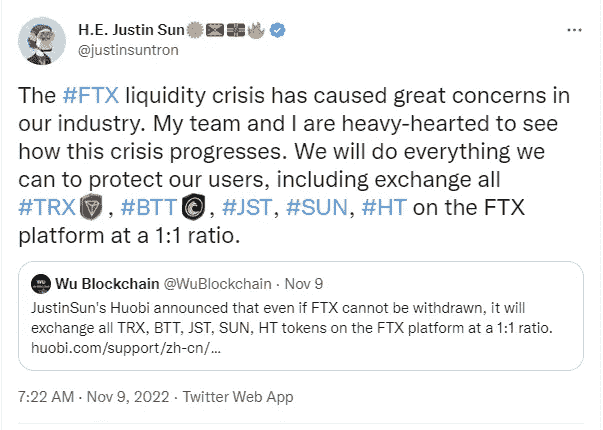
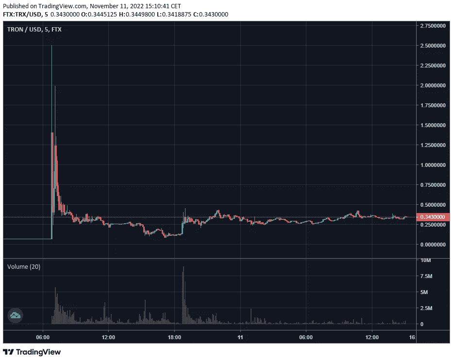
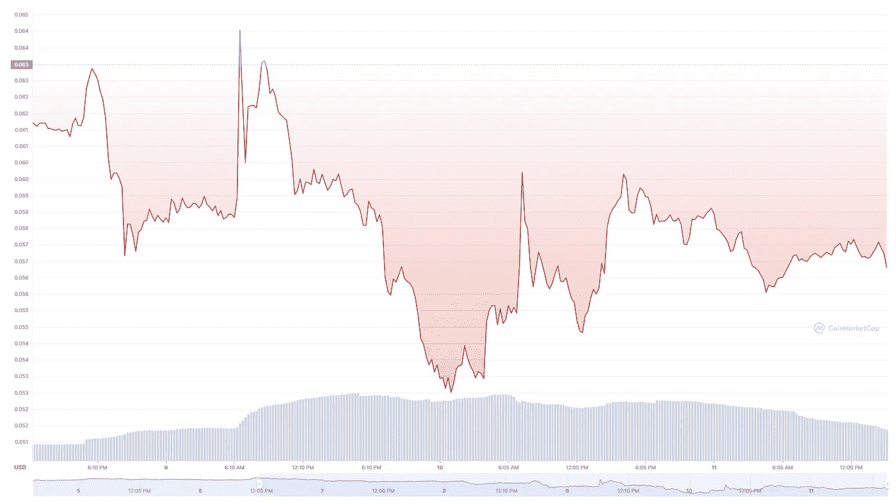
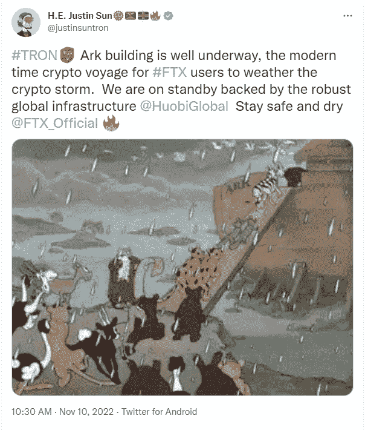

# 孙正义向 FTX 用户提供帮助，但为什么？

> 原文：<https://medium.com/coinmonks/justin-sun-offers-help-to-ftx-users-but-why-85c20b303fb?source=collection_archive---------12----------------------->

只要我在头条上看到贾斯汀·孙的名字，它就会在我脑海中弹出警告声和危险信号。但是让我们看看这个，也许这次会有所不同。也许这不仅仅是他最新的“致富计划”,而是真正帮助社区的事情。

# 让我们简单看看孙正义和他的最新投资

在合并期间，孙宣布他将支持以太坊的 PoW 形式，并准备投入数十亿美元来支持新生态系统的发展。$ETHPoW fork 随后出现。但是就像魔法一样，以太坊也有第三个分支。孙改变了主意。由于某种原因，他没有支持以太坊战俘叉，而是制作了自己的叉子。很可能留下两个磨损的叉字。据我所知，这是 Sun 最近一次参与项目。

# 向 FTS 用户伸出援手

据报道，孙被最近的事件搞得心力交瘁。他和他的团队努力帮助“他们的用户”，即持有$TRX、$BTT、$JST、$SUN 和$HT 硬币和代币的人。最终达成的协议是，Sun 将帮助促成一对一的交易。这意味着如果你在 FTX 持有一张价值 100 美元的 SUN 代币.现在你可以用这个代币换一个不在 FTK 的代币。意味着你现在可以拿回你的密码了。

这真是一件了不起的事情。只有心地善良的人才能做的事，对吗？对吗？忽略了“保护我们的用户”这一部分，这是非常勇敢的，也可能是自私的。让我们看看这笔交易及其影响。

发生的第一件事是所有受影响的加密 FTX 价格飙升。你问有多糟糕，好吧，TRX 一度交易价为 2.5 美元，相比之下外部价格为 0.05-6 美元。这对任何人来说都不足为奇。如果你打开一间满是人的房间的门，那些人认为他们会死在那间屋子里。当然，他们会抓来抓去，试图找到出口。这是基本的生存本能。

好吧，你可能会说。但这有什么关系呢？人们现在可以从平台中获取他们的密码，这最终是一件好事，对吗？是的，如果从个体的角度来看。一个人在 FTX 有密码，这些密码现在被锁起来，可能永远丢失了。现在，这个人能够以高价取回一些密码。但从逻辑上讲，溢价并不重要，因为拥有一些密码，即使只是很小的数量。逻辑上比没有密码要好。

这很容易让人想起一个叫做独裁者游戏的心理实验。在这个实验中，独裁者得到一笔钱。他们可以决定与陌生人分享多少钱。警告是陌生人可以决定他们是否接受交易，然后他们都得到分配的钱。或者他们可以拒绝这笔交易。那么双方都一无所获。从一个完全合乎逻辑的角度来看，陌生人应该总是接受任何超过 0 美元的交易。这是因为无论多少钱都意味着他们比以前拥有更多的钱。

然而，人类很少是纯逻辑的。如果我们在《星际迷航》里，火山就没有存在的理由了，现在呢？相反，除了其他外星种族，每个人都是火山人，每个伏尔甘人都是我们现在的样子。实验的结果是，很少有人会接受他们得到“更少”钱的交易。人们宁愿选择没有人得到任何东西。

回到 FTX。目前，TRX 在 FTX 的交易价格比 FTX 以外的交易价格高出 600%。我想其他人也是以类似的价格交易的。这意味着，如果你想把你的密码带出 FTX，你必须承受 6:1 的损失。这意味着你在 FTX 每赚 1 美元，就意味着你在 FTX 花了 6 美元。5 美元的价值损失就是所谓的套利。但是这 5 美元不会消失，它一定会去某个地方。

# “宾，奉。下一站投机站”

为什么猜测站，嗯，这只是因为这些都没有得到证实。可能永远也不会。但是，由于这种疯狂的高额套利，人们可能会认为，FTX 正试图摆脱他们背在客户身上的数十亿美元的亏空。或者，孙正义已经与 FTX 达成协议，他们在某种程度上分享套利。

*All hail our lord and savior*

我打赌是后者。这仅仅是因为 FTX 和萨姆·班克曼-弗里德的处境非常糟糕。他们之前唯一的出路，与币安的交易，泡汤了。没有发现其他交易。尽管有报道称 SBF 向所有人和所有事献殷勤。以及对 FTX 和 SBF 采取法律行动的真实前景。唯一剩下的交易似乎是对付魔鬼。现在，如果我们再回到独裁者游戏。这意味着，孙正义不仅有钱，而且还能决定业务的划分或交易。他还有相当于用枪指着 SBF 脑袋的东西。

在最后一天，有报道称一些其他的基金，比如巴哈马群岛，已经被撤回。这可能是因为 SBF 正利用其套利部分，试图让尽可能多的人重新完整起来。但也很有可能是 SBF 试图通过简单地支付某些地区的所有人来减轻法律后果。而不是面对法律诉讼。但他也可能试图为他将面临的法律麻烦买回一些失去的商誉。

虽然对的评价仍然不尽人意，但就我个人而言，我很难想象孙在没有赚大钱的情况下也能做到这一点。

我想听听您对这笔太阳 FTX 交易的看法。你认为我太愤世嫉俗了，还是不够愤世嫉俗？请在下面的评论中发表意见。如果你觉得这篇文章内容丰富或有趣。请考虑关注我，并阅读我的其他帖子，或者为什么不两者都做呢？

网络上见！

图片提供:截图自[https://www.youtube.com/watch?v=DUhBTrqrXro&、](https://www.youtube.com/watch?v=DUhBTrqrXro&t,)、[https://coinmarketcap.com/,](https://coinmarketcap.com/)、[https://ftx.com/trade/TRX/USD](https://ftx.com/trade/TRX/USD)

> 交易新手？尝试[加密交易机器人](/coinmonks/crypto-trading-bot-c2ffce8acb2a)或[复制交易](/coinmonks/top-10-crypto-copy-trading-platforms-for-beginners-d0c37c7d698c)