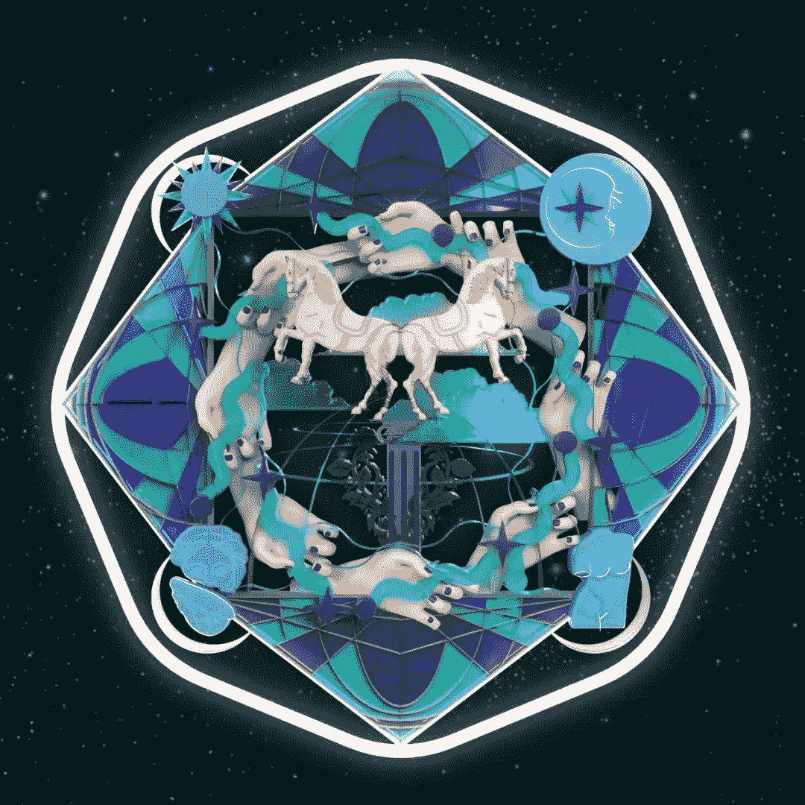

# “万花筒”元宇宙设计大赛奖项揭晓

> 原文：<https://medium.com/coinmonks/kaleidoverse-metaverse-design-contest-awards-announced-e5e0cf5c977e?source=collection_archive---------28----------------------->

# 背景

“万花筒”来源于“万花筒”和“元宇宙”，表示从一个狭小的空间里对浩瀚宇宙的一瞥。手握万花筒，有的人看到的是天空中的深渊，有的人看到的是万物中的虚无。我们鼓励创造者找到他们自己的世界，创造他们自己的精彩宇宙。

大赛设置了学生和专业两个类别，每个类别四个赛道，包括视觉、时尚、产品和空间。我们的合作伙伴是全球知名的设计媒体、加密媒体、全球设计师社区、顶尖大学的学生会。评委是来自顶尖大学的学者、知名设计师、加密艺术家和加密资助天使。比赛的媒体曝光已经超过 500 万。

# 奖金；奖品

我们设置了六个奖项:最佳服装设计奖、最佳视觉艺术奖、最佳产品设计奖、最佳空间设计奖、最佳人气奖、入围奖。此外，还有由合作伙伴(Style3D、上海马兰戈尼研究所)设立的奖项

大赛开展以来，收到了来自世界各地的大量优秀作品。经过预判，共有五十七部作品入围[(点击此处阅读)](/@beamstudio/kaleidoverse-metaverse-design-contest-finalist-list-announced-2940cb9ad6d8)。经过最后的评审，所有奖项已经产生。以下是清单:

**最佳视觉艺术奖(学生类)**

蜀王|《网格虚拟现实》

**最佳产品设计奖(学生类)**

朱|《饶泽计划 Cybe 花卉产品展示设备及品牌设计》

**最佳服装设计奖(学生类)**

林如凡|《精神境界》

**最佳空间设计奖(学生类)**

麦昊然|《和谐杂交》

**最佳视觉艺术奖(专业类)**

刘婉婷|《菌灵》

**最佳服装设计奖(专业类)**

粉红细雨(刘洋&孔羽西&魏芳)|《一切悲伤都会烟消云散》

**最佳人气奖**

和方|《铸日铸月》

**标题奖(Style3D)**

**头衔奖(上海马兰戈尼学院)**

**入围奖**

经过预判，共有 57 件作品入围决赛入围奖。[(点击此处查看列表)](/@beamstudio/kaleidoverse-metaverse-design-contest-finalist-list-announced-2940cb9ad6d8)

*附言*

*   最佳奖项和冠名奖从入围作品中选出。
*   为了保证作品质量，在专业类优秀作品接收有限的情况下，部分赛道可能会有一些空缺。

**恭喜以上创作者和团队！**

# NFT 徽章

Kaleidoverse Finalist Badge

Kaleidoverse Best Award Badge

Kaleidoverse Memorial Bedge

# 元宇宙颁奖典礼

时间:2022 年 8 月 6 日

地点:分散地的 Crypto Valley 会议中心

地点:Crypto Valley 会展中心 66，17 号

所有获奖者、评审团成员、竞赛协办方和合作媒体将受邀见证获奖者的加冕仪式。

# 元宇宙展览会

时间:2022 年 8 月 7 日至 8 月 14 日

地点:英格兰中部的 Crypto Valley 美术馆

地点:Crypto Valley 艺术画廊 52，22 号

颁奖典礼结束后，所有获奖和入围作品将在分散地的 Crypto Valley 美术馆展出一周。

# 联系我们

如果您有任何问题或建议，请随时联系我们。您还可以了解大赛的最新消息，并有机会从世界各地的大学教授和行业专家那里获得灵感。

电子邮件:postmaster1@beamstudio.pro

推特:【https://twitter.com/BEAMstudio_pro 

不和:【https://discord.gg/QKHhNq8RzD】T4

> 交易新手？尝试[加密交易机器人](/coinmonks/crypto-trading-bot-c2ffce8acb2a)或[复制交易](/coinmonks/top-10-crypto-copy-trading-platforms-for-beginners-d0c37c7d698c)