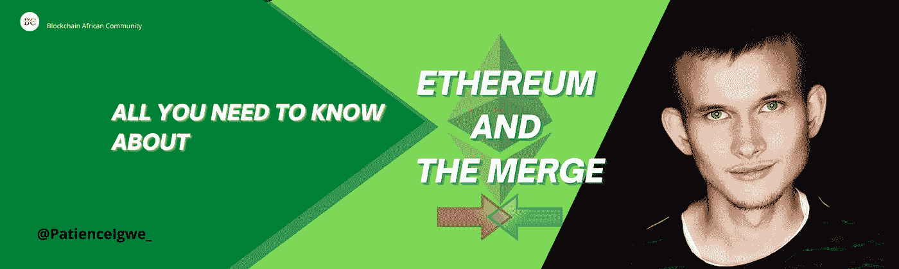
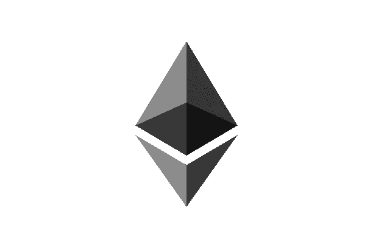
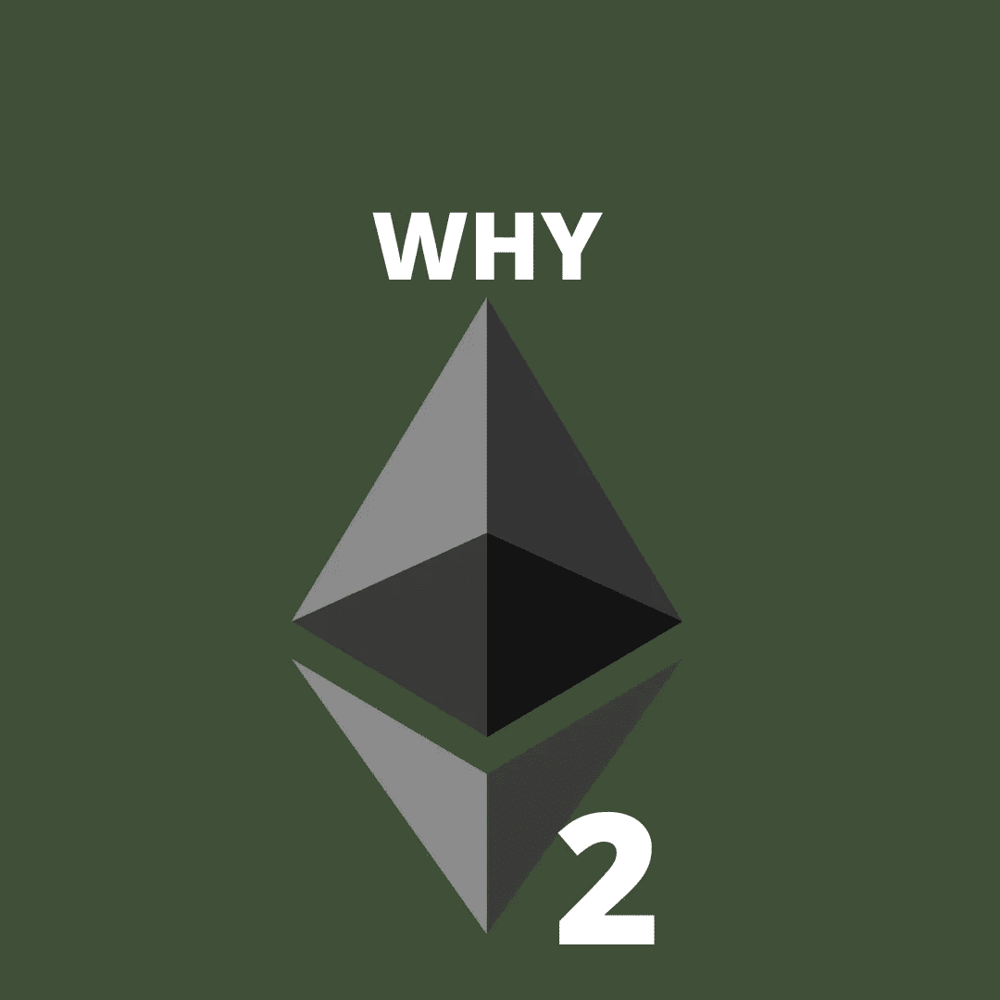

# 关于以太坊和合并你需要知道的

> 原文：<https://medium.com/coinmonks/kall-you-need-to-know-about-ethereum-and-the-merge-eb8b7e40e0e5?source=collection_archive---------12----------------------->

ETHEREUM AND THE MERGE

你们很多人听说过以太坊 2.0，但不一定了解以太坊本身是什么以及为什么需要 Eth 2.0，因此，在本文中，我将阐述以太坊创始人认为构建 Eth 2.0 合适的原因。所以，拿些爆米花坐下来，我们揭开这个秘密。但在继续之前，我们先来看看以太坊的创始人是谁。

所以，对于大多数不知道以太坊创始人的人来说，他来了。

他叫 Vitalik Buterin，是一名加拿大程序员和作家。他自 2011 年以来一直在比特币社区工作，是《比特币》杂志的撰稿人。如果你不知道比特币是什么，比特币是第一种成功的加密货币，作为一种支付网络，促进跨境交易。这意味着你不需要银行的服务，甚至不需要害怕可能影响你财务的外力。

尽管如此，在比特币杂志上，Vitalik 提出了这种技术不应终结的想法，因此，有必要增加其可持续性，但比特币几乎没有或根本没有改变或复制其网络的方法，因此，他认为建立另一个项目是明智的，这将允许其他项目建立在其上。以太坊之旅就是这样开始的。那么，以太坊到底是什么？

What is Ethereum

以太坊是一种区块链技术，可以使用智能合约进行编程(这允许在其上构建其他项目)。[要更好地了解智能合约，请点击此处](/coinmonks/smart-contracts-simplified-1c20bc55a4f)。

智能合约的利用是以太坊和比特币最大的区别。因此，虽然比特币是一个支付网络，但以太坊更像是一个市场，包含所有金融服务、社交网络、游戏和其他尊重隐私的应用。

以太坊有一个名为 Ether 或 Eth 的本地令牌，在以太坊区块链上被用作燃气费或交易费。这意味着你必须有一些以太币才能使用以太币区块链。以下是以太坊可以做的一些提示，包括:

1.  借贷服务的机会都是通过互联网连接获得的
2.  它允许你把钱和其他数字资产从一个人传送到另一个人，而不需要中介
3.  它还允许隐私的例子，你不需要在使用任何以太坊应用程序之前提供你所有的个人信息。
4.  此外，没有政府机构控制以太坊，这意味着没有人能阻止你接受金钱。

根据以太坊白皮书，您可以使用以太坊做的事情没有限制，因为以太坊本身是一个仍在编写的故事，其用途尚未被发现，这为更多的开发和改进提供了空间。[点击此处了解更多关于以太坊的信息](https://ethereum.org/en/what-is-ethereum/)

现在，如果以太坊可以做到所有这些，那么为什么还需要以太坊 2.0 呢？

毫无疑问，区块链理工大学仍处于其早期阶段，以太坊是其中的一部分。然而，由于区块链的高采用率，也存在一些明显的限制，包括低可扩展性、网络安全和安全缺陷，这就是为什么 Vitalik Buterin 认为有必要将以太坊网络从 Eth1 升级到 Eth2。

此次升级旨在提高整个以太坊网络的可扩展性和安全性，为了实现这一目标，需要将以太坊基础设施从工作证明(比特币也在使用)改为利益一致机制证明。他们旨在转换这些共识的众多原因之一是工作证明需要高计算能力，这也使得它很慢。因此，当这一切完成后，以太坊网络有望变得更加高效、可扩展并促进更多的交易。[点击此处了解更多关于共识机制的信息](/coinmonks/layer-1-blockchain-masterclass-the-journey-for-scalability-14e94d34da9a)

那么，这个 Eth 2.0 什么时候出现呢？

When is Eth 2.0 taking place

Eth 2.0 之旅已经开始，但这并不意味着要立即启动，因为需要测试和重新测试，这也是启动过程分为 3 个不同阶段的原因。因此，

*   信标链
*   合并和
*   碎片链。

信标链是升级的第一阶段，自 2020 年起投入使用。这个阶段将赌注特征引入以太坊区块链。这意味着你现在可以把你的 eth 作为被动收入。

第二阶段被称为合并，这是我们目前正在期待的。这个阶段的目标是合并信标链和以太坊主网(即 Eth1)。

最后一个阶段是碎片链。这一阶段旨在升级以太坊的可扩展性和容量，这意味着通过将交易分散到碎片中，处理交易将变得更加容易。为此，建议在网络中部署 64 个链。因此，我们期待 eth2 推出后，以太坊区块链会更好。

我知道你现在在想什么。这是否意味着 Eth 1 将被清除？

根据 Vitalik 的说法，对此的回答是否定的，然而，这就是合并的目的，合并将使 eth 1 和 eth 2 结合在一起，这样它们中没有一个遭受灭绝。这就是为什么你们已经听说了合并，因为这是我们目前期待的下一个阶段。要了解更多关于合并的信息，请点击这里。

最后，以太坊的出现带来了区块链技术的发展和转变，给了其他项目发展和持续的机会。不过，你怎么看待这次升级？这是必要的还是浪费时间？

请在评论环节分享你的观点。我也希望你学到了一些东西。

# 关于作者

Igwe Ihuoma Patience 是一名自学成才的创意和特定行业内容作家，也是一名加密货币爱好者，拥有 2 年多的经验和不断发展的区块链空间的知识。

我擅长内容创作、文案撰写、字幕管理、视频编辑和手机图形设计，我教其他人如何在加密货币和区块链领域起步，我的目标是让区块链的学习和更新易于任何人理解。

> 交易新手？试试[密码交易机器人](/coinmonks/crypto-trading-bot-c2ffce8acb2a)或者[复制交易](/coinmonks/top-10-crypto-copy-trading-platforms-for-beginners-d0c37c7d698c)