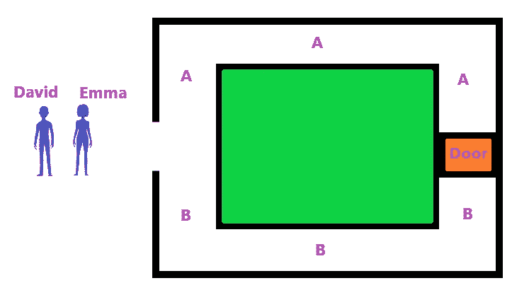

# 什么是零知识证明？—您需要知道的一切

> 原文：<https://medium.com/coinmonks/key-insights-4073475d8b93?source=collection_archive---------42----------------------->

# 关键见解

*   零知识证明(zkp)被定义为除了需要证明的命题的正确性之外，不传递任何额外知识的证明。
*   最直观的真实例子是荷兰 ING 银行使用零知识范围证明
*   阿里和色盲的例子是展示 ZKP 互动的两个假设
*   零知识证明的主要好处是隐私和安全。
*   零知识证明在区块链正被广泛使用
*   零知识证明可能会继续获得广泛的采用和投资关注

‍

# 介绍

‍

在我们越来越全球化的数字化经济中，越少的零散信息对我们的隐私和安全越有利。

‍

将您的个人信息保密，不暴露给互联网上的任何服务，您就越安全。

‍

尽管减少你的个人数据共享是非常困难的，因为仍然有相当多的信息在线服务经常需要知道。

‍

幸运的是，被称为“零知识证明”(ZKPs)的不断发展和创新的加密技术使互联网用户能够在不暴露信息的情况下验证信息。

‍

1985 年，沙菲·戈德瓦瑟、希尔维奥·米卡利和查理斯·拉科夫在他们的论文《交互式证明系统的知识复杂性》中首次提出了零知识证明。

‍

零知识证明只是现在才获得更多的技术发展和投资者的关注。零知识证明的使用案例与日俱增。

‍

零知识证明使用许多复杂的密码方程来允许用户证明信息是真实的，而无需暴露实际证明的信息。

‍

让我们深入探讨一下零知识证明法。

‍

# 什么是零知识证明？

‍

零知识证明被定义为除了需要证明的命题的正确性之外，不传递任何额外知识的证明。

‍

零知识证明是一种密码学方法，其中被称为证明者的一方可以向被称为验证者的另一方证明他们知道一组信息，而无需向验证者展示实际信息。

‍

创建 zk proof 的原因是为了维护一个人的内容的隐私，即使您确实想要处理这些内容。

‍

即使你拥有知识，但通过透露来证明你拥有知识通常是不可取的。零知识证明的挑战是证明你拥有信息，而不必透露信息本身。

‍

零知识证明的主要形式是交互式零知识证明。这种交互式输入的形式是证明者从验证者处接收到的挑战。

‍

为了证明他们拥有所述知识，示证者必须成功通过这些密码挑战。本文后面将提供一些例子。

‍

因此，交互式零知识证明中的证明过程不是固定的、静态的一次性交互，而是验证者和证明者交互的随机的、交互式的过程。

本质上，你可以认为这种互动是由验证者提出的棘手问题组成的，证明者必须准确地回答这些问题。

‍

零知识证明的另一种形式是非交互式零知识证明。在这种情况下，证明完全依赖于计算加密哈希函数。

‍

# 为什么叫零知识？

‍

该过程被称为零知识证明(ZKP ),因为为了让验证者确认证明者对所述信息的知识，证明者不需要透露他们知道的任何信息。

# 不同类型的零知识证明

‍

零知识证明有很多变种。这些不同的类型包括 zk-SNARKS、zk-STARKS、zk-SNARGS、Bulletproofs 和 zk Rollups。

‍

关于不同零知识证明的深度文章可以在这里找到。

‍

# 零知识证明示例

‍

ZKP 用例的一个简单例子是荷兰银行 ING 对 ZKPs 的使用。ING 使用零知识范围证明(ZKRP)来允许他们的客户证明他们账户中的金额，而不实际显示金额。

‍

ZKRP 允许在一个数字范围内验证数字数据。 **ING 新的零知识范围证明解决方案允许用户证明他们有一个在已知范围内的秘密数字。**

‍

例如，一个抵押贷款申请人可以证明他们的工资在一定范围内，而不用透露他们的确切工资。

‍

# 阿里巴巴洞穴

‍

用来直观演示交互证明的最常见的例子是阿里巴巴洞穴的例子(图 1)。阿里巴巴的例子介绍了一个只有一个入口，但有两条通道(A 和 B)的洞穴，这两条通道在一个由密码锁定的公共门处相连。

‍

Emma 想向 David 证明她知道从路径 A 到路径 B 的门的密码，但是不想告诉 David 密码。

‍

作为解决方案，大卫留在洞穴外面，艾玛走进洞穴，在大卫不知道的情况下选择了两条路中的一条。大卫大声叫艾玛走哪条路回到他身边。

‍

如果艾玛最初选择走小路进入洞穴，然后大卫让她走小路 B 回来，艾玛这样做的唯一方法就是知道门的密码。这个过程可以重复多次，以证明艾玛不仅仅是偶然选择了正确的道路。

‍

在这个过程完成了无数次之后，大卫非常确信艾玛知道门的密码。这种自信是在没有向大卫透露密码的情况下获得的。

‍

**虽然 cave 的例子肯定是一个简化的例子，但是 ZKPs 部署了同样的方法，使用加密技术在不泄露数据的情况下证明数据的知识。**

‍

在高层次上，这种形式的交互式证明涉及验证者要求证明者执行一系列动作，这些动作只有在证明者知道底层信息的情况下才能准确执行。

‍

如果证明者只是猜测这些行为的结果，那么验证者的测试最终会以很高的概率证明这些行为是错误的。

‍

*图 1 阿里巴巴洞穴示例*

‍

# 色盲的朋友

‍

交互式证明的色盲朋友示例介绍了具有全色觉的 Emma(证明者)和色盲的 David(验证者)。

‍

想象艾玛有两个球:一个红色，一个蓝色。

‍

对大卫来说，这些球看起来没什么区别。然而，艾玛想向大卫证明这些球是不同的颜色，有一种方法可以做到这一点。

‍

大卫将不得不拿着两个球，并在艾玛看不到的情况下开始混合它们(记住哪个球在哪个手里)。

‍

当大卫展示这些球时，艾玛将能够根据颜色正确地区分这些球。

‍

只做一次这个过程的谬误在于，大卫可能认为艾玛只是通过 50/50 概率的猜测展示了她对右球的知识。

‍

**就像阿里巴巴洞穴的例子一样，大卫和艾玛将不得不重复这个交互式零知识证明过程，直到概率被消除。**

‍

这个过程被归类为零知识过程，因为 David(验证者)从来不需要知道这两个球是什么颜色，验证者只知道 Emma(证明者)实际上知道这两个球是什么颜色。

‍

# 零知识证明的优点

‍

零知识证明的主要好处是隐私和安全。

‍

使用零知识证明，用户可以创建一个身份认证系统，而没有信息被窃取的风险。

‍

不仅可以避免信息窃取，而且通过在任何时候都不必向任何第三方透露任何信息，隐私也得到全面提高。

‍

# 零知识证明的‍The 缺点

‍

零知识证明每个交互大约有两千次计算，所有的交互都需要一定的时间来处理，这通常会使这个过程相当漫长。

‍

ZKPs 中的另一个潜在谬误是，如果有人能够访问用于创建证明协议参数的代码，他们就可以篡改证明，并创建在验证者看来有效的假证明。

‍

# 零知识证明用在哪里？

‍

零知识证明在加密货币项目开发中使用最多。Zcash (ZEC)是最流行的零知识协议之一，它使用零知识证明在区块链交易中创建隐私。

‍

另一个提供自己的零知识区块链解决方案的著名加密货币项目是 MINA 协议(Mina)。Mina 开发了自己的区块链，通过零知识协议存储其块，将其区块链保持在 22kb 的存储大小，使其成为加密货币领域最轻的区块链。

‍

前面提到的荷兰银行 ING bank 是最早广泛采用区块链和零知识证明的机构之一。

‍

ING 有自己的区块链团队，最近还开发了另一个零知识证明解决方案，称为零知识集成员(ZKSM)。

‍

例如，ZKSM 的解决方案允许银行验证客户居住在欧盟国家，而无需透露具体的国家。

‍

一篇关于当前所有 ZKP 支持的加密项目的深入文章可以在这里找到。

‍

# 零知识证明未来能用在哪里？

‍

最终，零知识证明的最终愿景将是能够在透明系统(如以太坊这样的公共区块链网络)中使用私人信息保护，而实际上根本不会公开泄露您的敏感数据/个人信息。

‍

在 Mina 的案例中，这一整合过程已经开始。Mina 有着巨大的抱负，已经开始用 nil 基金会建造一座以太坊 x Mina 桥，应该很快就能投入使用。

‍

这一过程将同时提高透明度、安全性和隐私性，这看起来肯定是自相矛盾的。

‍

**虽然区块链被设计成完全透明，但 ZKP 技术应该能够允许区块链用户在区块链上使用他们的私人信息，而不会实际泄露他们在区块链上的敏感信息。**

**‍**

在更大的范围内，它可以用于更多的地方，包括全球身份、密码和成员身份验证。

‍

你可以在这里阅读更多关于零知识证明用例[的深入内容。](https://www.boomish.org/blogs/what-is-zero-knowledge-proof-used-for)

‍

# 结论

从本质上讲，零知识证明是一种密码学方法，其中一方向另一方声称他们知道一组信息，而不会泄露这些信息，从而维护隐私。

‍

这种隐私保险的方法在加密货币和区块链领域获得了很多关注。

‍

它被认为是主要的技术发展之一，机构可能不得不采用，以遵守用户的隐私问题。

**参观 BOOMISH.ORG**

 [## 及时发现金融趋势

### BOOMISH 的目标是为交易者、投资者和商业人士带来透明性和对加密经济的理解

www.boomish.org](https://www.boomish.org/) 

> 交易新手？试试[加密交易机器人](/coinmonks/crypto-trading-bot-c2ffce8acb2a)或者[复制交易](/coinmonks/top-10-crypto-copy-trading-platforms-for-beginners-d0c37c7d698c)