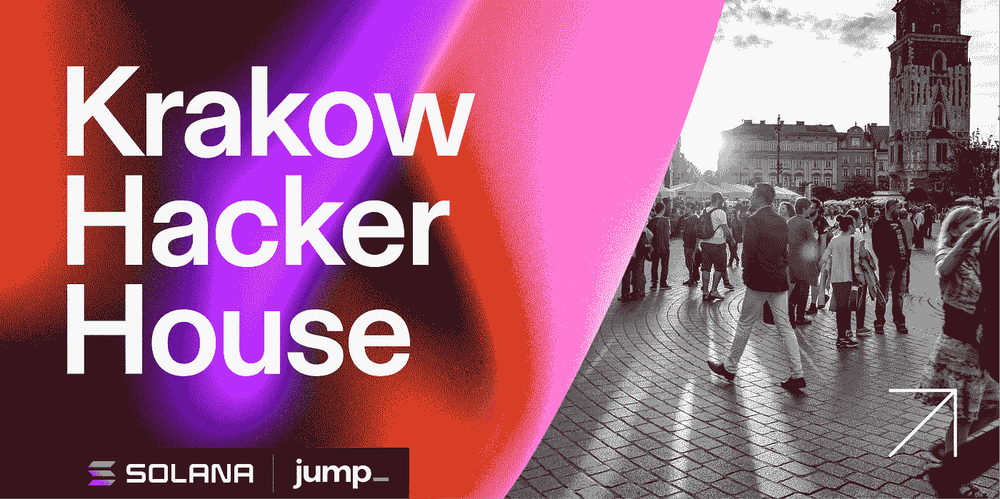
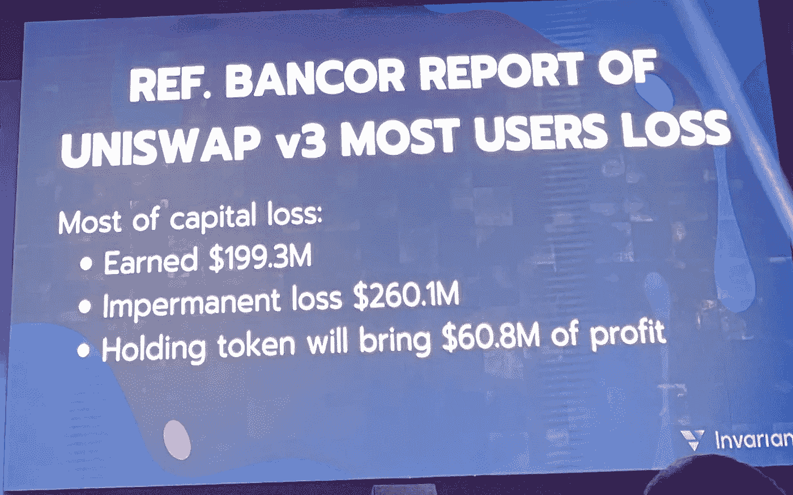
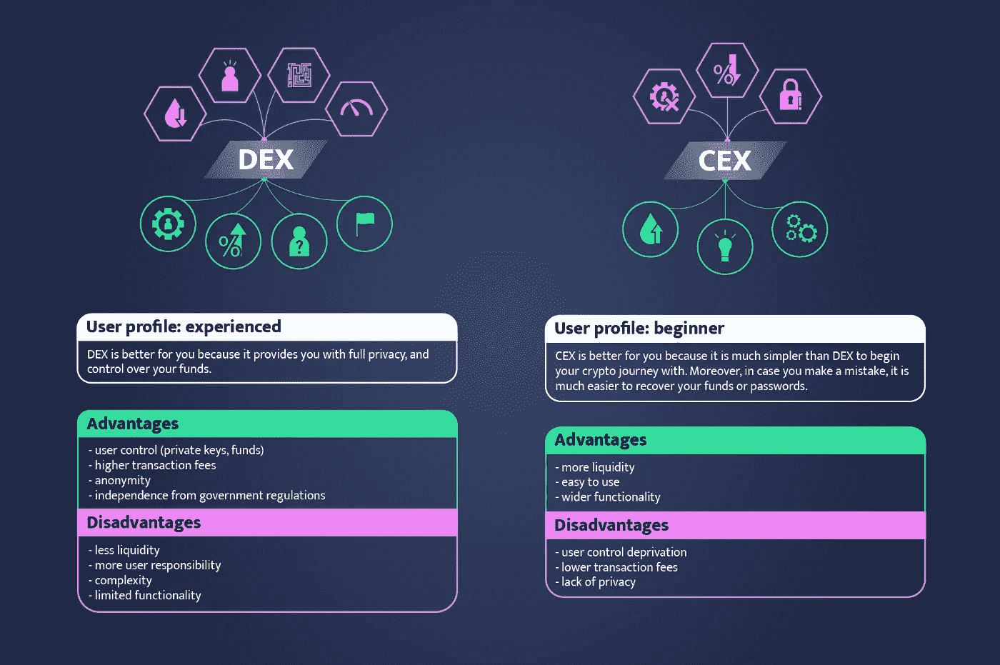
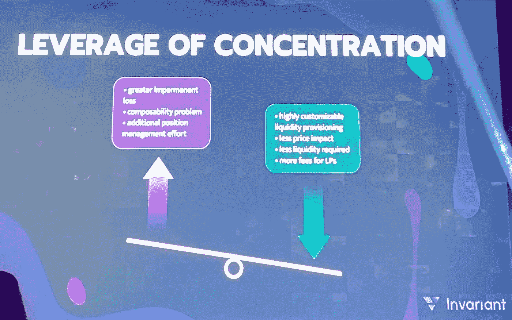
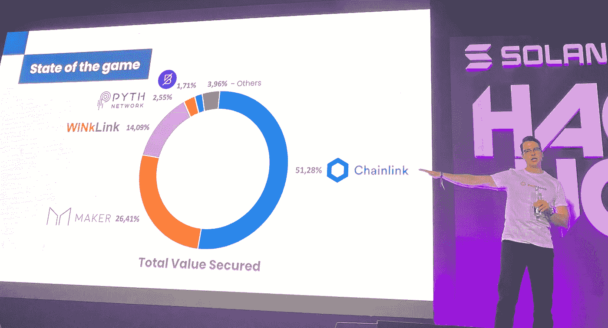
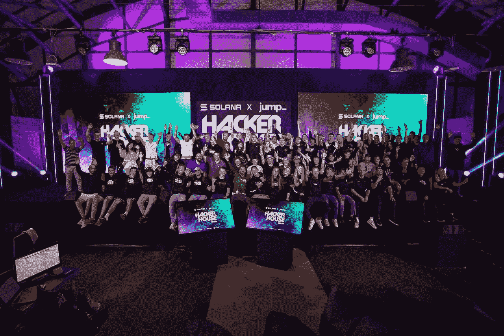

# 克拉科夫 Solana Hacker House 的关键要点

> 原文：<https://medium.com/coinmonks/key-takeaways-from-solana-hacker-house-in-krakow-f880be66159e?source=collection_archive---------28----------------------->

短暂的损失、产量农业、神谕、硬件钱包……只是在波兰国王和王后的中世纪所在地——克拉科夫的 Solana x jump_ Hacker House 编写代码时讨论的一些话题。

## 关键要点

1.  由于非永久性损失，60%的农民没有任何收入。随着持续的流动性 AMM，你可以减轻它。
2.  Oracle 业务被 ChainLink 垄断，拥有 51%的业务。
3.  硬件钱包被证明是最安全的
4.  加密市场可能会下跌，但没有更好的时间成为一个 rust 开发者。

# 具有持续流动性的固定产量农业

起初， [Invariant](https://medium.com/u/24b91111fbd0?source=post_page-----f880be66159e--------------------------------) app 看起来只是 Solana 的另一个 DEX。然而，正如 [Wojciech Cichocki](https://medium.com/u/9b648f207cba?source=post_page-----f880be66159e--------------------------------) 所解释的，不变量应用持续的流动性来保护你的产量农业。

根据 Bancor 报告，60%的产量农民由于非永久性损失而遭受损失。那么什么是无常的损失，它如何影响你？

## CEX 对德克斯

**CEXs(集中交易所)**如币安或 CoinBase 使您能够将法定货币(如美元)兑换成加密货币(如索尔)。使用匹配买家和卖家的所谓**订单簿模型**计算交易价格，例如 USD-SOL。

虽然 cex 使 DeFi 成为可能，但它们并不是 **DeFi(分散财务)**的一部分，而是 **CeFi(集中财务)**的一部分。从 IT 架构的角度来看，CEXs 是集中式的、非链式的 IT 系统。

**dex(分散交换)**也使您能够在加密令牌之间交换，但 dex 是完全在区块链上执行交换交易的 dApps(分散应用程序)。dex 是 DeFi 的一个(大)部分。

## 非永久性损失

DEXs 使用所谓的 **AMM(自动做市)**模型，该模型应用该公式来计算代币买入或卖出价格

> x*y=常数

其中 x 是一个令牌的价格(例如 SOL)，y 是另一个令牌的价格(例如 USDH)。我希望你还和我在一起。

为了产出农场，你获得代币 x 和 y(例如索尔和 USDH)，并将这对代币添加到流动性池中，并在未来获得一些回报。然而，仅仅持有 x 和 y(如索尔和 USDH)的回报可能会高于产量农业，这种情况也会发生。**差额称为非永久性损失**。

## 持续流动性

持续流动性是一种新的减少非永久性损失的 DEX 模型。它修改了公式 x*y = const，使其更能抵抗 IL。你可以在[不变的](/@invariant_labs)博客中阅读更多关于这个主题的内容——[德克斯 vs CEX](/@invariant_labs/dex-vs-cex-the-differences-between-crypto-exchanges-34ccf3410a34) 、[产量农业、流动性开采和赌注的区别。](/@invariant_labs/yield-farming-how-to-make-your-cryptocurrency-grow-for-you-f3076b57af13)

# 神谕

Oracles 是允许 dApps(在区块链上运行的应用程序)从真实数据中访问数据的基本构件。

根据雷石东的说法，甲骨文公司今天的业务是由 ChainLink 主导的，它拥有超过一半的业务。

为了获得真正的去中心化金融(DeFi ),我们需要整个技术栈的去中心化，包括 oracles。幸运的是，有新的挑战者，如红石金融，在这里帮助和挑战现状。

## 最近的黑客攻击

八月初，索拉纳社区被新的消息震惊了，8000 个钱包被盗，估计有 800 万美元被盗。调查显示，盗窃是可能的，因为其中一个钱包背后的代码存在缺陷——Slope。

硬件钱包的持有者没有受到黑客攻击的影响。**现在就去买硬件钱包吧！**

# 结束语

密码市场可能会下跌，但建设者继续建设。更重要的是，区块链的开发商仍然有需求！[白令沃特斯大学将帮助您学习 Rust](https://bering-waters.medium.com/bering-waters-university-announces-worlds-first-solana-based-ai-challenge-cb3ed7a75441) —智能合同开发的编程语言之一。索拉纳智能合约是在 Rust 开发的。值得学习！如果你想继续你的项目，或者开始一些新的东西，不要错过下一个[黑客之家——在斯德哥尔摩](https://solana.com/news/solana-jump-hacker-houses-europe-tour-summer-2022)。

参考文献:
1。[unis WAP v3 中的非永久性损失，Bancor，2021](https://arxiv.org/abs/2111.09192)

让我们保持联系:

📌在推特[上关注我的实时更新](https://twitter.com/cYanusTech)

📌加入关于[不和](https://discord.gg/tbNPjFDm)的讨论！

📌请访问[网站](http://www.yanus.tech/)

> 加入 Coinmonks [电报频道](https://t.me/coincodecap)和 [Youtube 频道](https://www.youtube.com/c/coinmonks/videos)了解加密交易和投资

# 另外，阅读

*   [CoinFLEX 评论](https://coincodecap.com/coinflex-review) | [AEX 交易所评论](https://coincodecap.com/aex-exchange-review) | [UPbit 评论](https://coincodecap.com/upbit-review)
*   [AscendEx 保证金交易](https://coincodecap.com/ascendex-margin-trading) | [Bitfinex 赌注](https://coincodecap.com/bitfinex-staking) | [bitFlyer 审核](https://coincodecap.com/bitflyer-review)
*   [Bitget 回顾](https://coincodecap.com/bitget-review)|[Gemini vs block fi](https://coincodecap.com/gemini-vs-blockfi)cmd |[OKEx 期货交易](https://coincodecap.com/okex-futures-trading)
*   [AscendEx Staking](https://coincodecap.com/ascendex-staking)|[Bot Ocean Review](https://coincodecap.com/bot-ocean-review)|[最佳比特币钱包](https://coincodecap.com/bitcoin-wallets-india)
*   [霍比评论](https://coincodecap.com/huobi-review) | [OKEx 保证金交易](https://coincodecap.com/okex-margin-trading) | [期货交易](https://coincodecap.com/futures-trading)