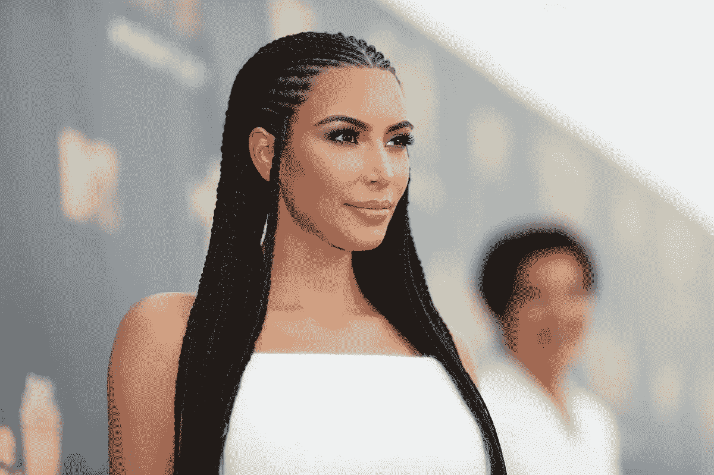

# 金·卡戴珊的法律团队申请驳回 EthereumMax 加密诉讼

> 原文：<https://medium.com/coinmonks/kim-kardashians-legal-team-files-motion-to-dismiss-ethereummax-crypto-lawsuit-7a4439ffdc05?source=collection_archive---------36----------------------->

金·卡戴珊(Kim Kardashian)的律师提交了一份联合动议，要求驳回对这位美国女商人的集体诉讼，因为她推销了一种所谓的“抽水转储”加密令牌。

金·卡戴珊的法律团队提出动议，搁置针对这位女商人和其他美国名人的集体诉讼。

卡戴珊和其他几位知名的美国社交媒体影响者在 2022 年 1 月受到了集体诉讼，指控他们通过社交媒体推广一种名为 EthereumMax 的加密货币令牌误导了投资者。

卡戴珊在 2021 年 6 月发布了 Instagram 故事帖子来推广该项目，拳击大师弗洛伊德·梅威瑟等也卷入了诉讼，此前他在同一时期与优图罗根·保罗的名人拳击赛中推广了基于以太坊的令牌。

粉丝可以用代币购买按次付费的门票，这在卡戴珊和其他有影响力的人推广后激增。此后，EthereumMax 的价值大幅下跌，让许多人赔了钱。

最初的法庭文件列出了卡戴珊，梅威瑟和其他八人，声称公司高管与名人赞助商合作，就代币和他们对大多数代币的控制做出误导性陈述。史蒂夫·真蒂莱和乔瓦尼·佩罗尼被列为该项目的联合创始人。

卡戴珊的法律团队在 Cointelegraph 审查的法庭文件中主张驳回集体诉讼，回击了针对这位影响者的十项指控。一个关键点是卡戴珊的 Instagram 故事:

> “重要的是，没有一个指名的原告声称他们在相关时间内购买代币之前确实浏览过 Instagram 上的帖子。”

该文件还称，原告声称影响者在以太坊(ETH)获得报酬以推广 EMAX 是没有根据的，因为他们缺乏证据证明卡戴珊因她的 Instagram 帖子获得了经济补偿。

卡戴珊的法律团队还强调，没有证据表明卡戴珊曾购买、接受或出售代币。被告共同提出了一项综合动议，要求驳回全部集体诉讼请求。

虽然卡戴珊试图撇清自己与 EthereumMax 事件的关系，但这是梅威瑟参与秘密加密货币项目推广的最新例子。

这名拳击手此前曾在 2017 年与美国音乐制作人 DJ Khaled 一起推广欺诈性的 Centra Tech ICO 后逃脱了一场诉讼。法官裁定，由于梅威瑟和哈立德的促销努力，投资者未能证明他们购买了代币，这两人摆脱了困境。

点击 关注我们了解更多故事 [*。*](http://t.me/etellworld)

> 交易新手？试试[密码交易机器人](/coinmonks/crypto-trading-bot-c2ffce8acb2a)或[复制交易](/coinmonks/top-10-crypto-copy-trading-platforms-for-beginners-d0c37c7d698c)