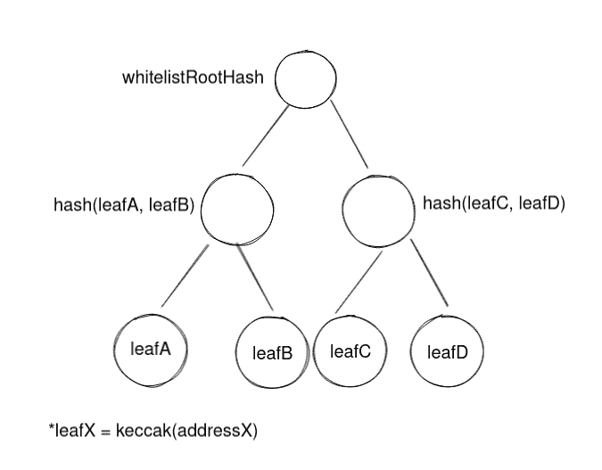
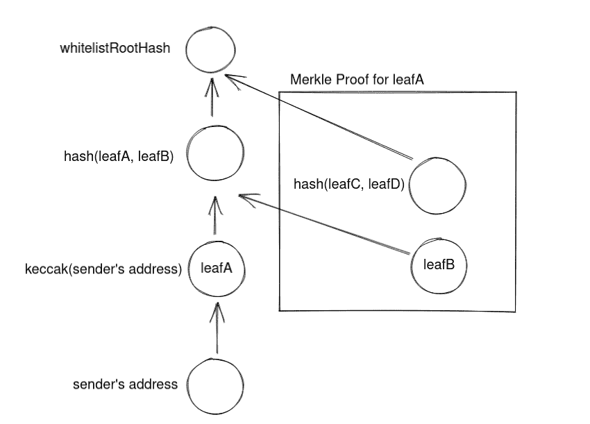
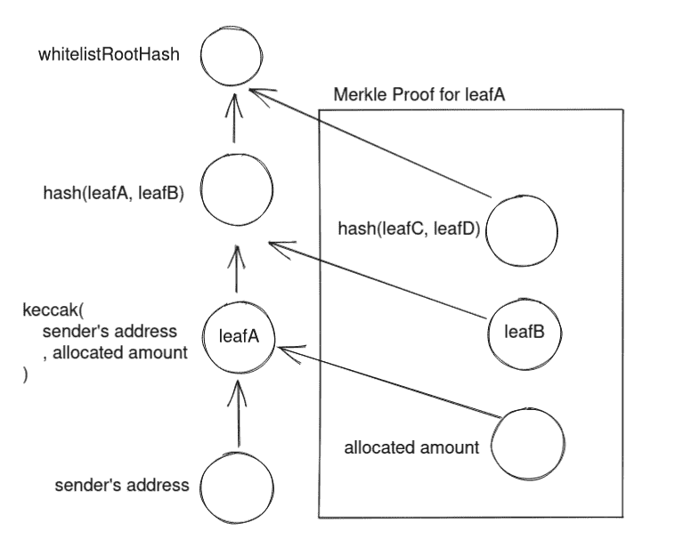

# 在以太坊上高效存储大量任意数据

> 原文：<https://medium.com/coinmonks/kind-of-storing-a-large-amount-of-arbitrary-data-on-ethereum-efficiently-1504335f2cd2?source=collection_archive---------28----------------------->


Gas 一直是智能合约开发中的一个大话题。存储在区块链上的每一点数据都要耗费汽油。除非必要，否则我们不喜欢在链上存储数据。有些情况下，我们需要存储大量数据。例如，我们需要将白名单地址存储在链上，用于白名单 NFT 创建。
LooksRare 采用 merkle 树方法将这些数据“存储”在链上。数据实际上并没有上传到外链，但是我们上传了证明来验证用户提交的数据是否有效。

```
 /**
     * @notice Check whether it is possible to claim and how much based on previous distribution
     * @param user address of the user
     * @param treeId id of the merkle tree
     * @param amount amount to claim
     * @param merkleProof array with the merkle proof
     */
    function _canClaim(
        address user,
        uint8 treeId,
        uint256 amount,
        bytes32[] calldata merkleProof
    ) internal view returns (bool, uint256) {
        // Compute the node and verify the merkle proof
        bytes32 node = keccak256(abi.encodePacked(user, amount));
        bool canUserClaim = MerkleProof.verify(merkleProof, treeParameters[treeId].merkleRoot, node);

        if (!canUserClaim) {
            return (false, 0);
        } else {
            uint256 adjustedAmount = amount - amountClaimedByUserPerTreeId[user][treeId];
            return (true, adjustedAmount);
        }s
```

[](https://github.com/LooksRare/contracts-token-staking/blob/bc99c5c84137aa9b359780aa2967a5c319772ed6/contracts/MultiRewardsDistributor.sol#L233) [## 位于 BC 99 C5 c 84137 aa9b 359780 aa 2967 a5c 319772 ed 6 的 contracts-token-staking/multi rewards distributor . sol…

### LOOKS are(LOOKS)token 和 staking contracts。通过创建……为 looks rare/contracts-token-staking 开发做出贡献

github.com](https://github.com/LooksRare/contracts-token-staking/blob/bc99c5c84137aa9b359780aa2967a5c319772ed6/contracts/MultiRewardsDistributor.sol#L233) 

为了验证用户是否是白名单中的用户，只需要在 chain 上存储一个名为`merkleRoot`的变量。

当用户提出索赔时，他们需要提供 merkle 证明，以及要索赔的分配金额和用户的地址。然后，契约将验证上述内容的散列是否与 merkle 根匹配。如果它们匹配，则证明该用户是具有正确分配量的白名单用户。

让我们深入了解一下它是如何工作的…

# 生成 merkle 根

为了简单起见，我们现在忽略分配的数量。merkle 根是通过递归散列前导节点(在这种情况下是地址的 keccak)来计算的。在获得 merkle 根之后。我们将它存储在智能合约中。这比存储所有的叶子节点消耗的汽油要少得多。



Creating root hash by hashing leaf nodes recursively

# 验证用户提供的 merkle 校样

这就是复杂性所在。用户必须提交由服务提供商离线生成的 merkle 证明。合同将散列用户的地址和 merkle 证明，看它是否能获得相同的 merkle 根。因为很难用自定义输入生成 merkle 校样。如果结果匹配，就可以肯定地说输入是有效的。



Verifying an address with the corresponding merkle proof

# 更进一步—还存储分配的数量

我们可以做得更多，而不是将用户地址作为叶节点。例如，在叶节点中存储用户地址和分配量的散列。这样，我们可以在同一个节点中存储地址和数量，但仍然只生成一个 merkle 根。

用户还需要提交一件事——分配的金额。该合同将首先使用相应的金额散列用户的地址，然后沿着 merkle 证明散列以检查 merkle 根。



Verifying address and allocated amount with the corresponding merkle proof

理论上，我们可以存储任何可以散列并适合叶节点的东西。

可能的使用案例:

*   通过散列语句存储预测，并将其放入叶节点
*   存储更复杂的数据结构，如{地址，数量，时间，标准 1，标准 2，…}

好看的工具:
Solidity 实用工具:[https://docs . open zeppelin . com/contracts/3 . x/API/cryptography # merkle proof](https://docs.openzeppelin.com/contracts/3.x/api/cryptography#MerkleProof)Javascript 库:【https://github.com/OpenZeppelin/merkle-treePython 库:[https://github.com/Tierion/pymerkletools](https://github.com/Tierion/pymerkletools)Go libray:[https://github.com/txaty/go-merkletree](https://github.com/txaty/go-merkletree)

> 交易新手？尝试[加密交易机器人](/coinmonks/crypto-trading-bot-c2ffce8acb2a)或[复制交易](/coinmonks/top-10-crypto-copy-trading-platforms-for-beginners-d0c37c7d698c)
> 
> 多样化的密码持有，了解币安的选择
> 
> 加入 Coinmonks [电报频道](https://t.me/coincodecap)和 [Youtube 频道](https://www.youtube.com/c/coinmonks/videos)获取每日[加密新闻](http://coincodecap.com/)

## 另外，阅读

*   [复制交易](/coinmonks/top-10-crypto-copy-trading-platforms-for-beginners-d0c37c7d698c) | [加密税务软件](/coinmonks/crypto-tax-software-ed4b4810e338)
*   [网格交易](https://coincodecap.com/grid-trading) | [加密硬件钱包](/coinmonks/the-best-cryptocurrency-hardware-wallets-of-2020-e28b1c124069)
*   [密码电报信号](/coinmonks/top-3-telegram-channels-for-crypto-traders-in-2021-8385f4411ff4) | [密码交易机器人](/coinmonks/crypto-trading-bot-c2ffce8acb2a)
*   [最佳加密交易所](/coinmonks/crypto-exchange-dd2f9d6f3769) | [印度最佳加密交易所](/coinmonks/bitcoin-exchange-in-india-7f1fe79715c9)
*   [开发人员的最佳加密 API](/coinmonks/best-crypto-apis-for-developers-5efe3a597a9f)
*   最佳[密码借贷平台](/coinmonks/top-5-crypto-lending-platforms-in-2020-that-you-need-to-know-a1b675cec3fa)
*   [免费加密信号](/coinmonks/free-crypto-signals-48b25e61a8da) | [加密交易机器人](/coinmonks/crypto-trading-bot-c2ffce8acb2a)
*   [杠杆代币的终极指南](/coinmonks/leveraged-token-3f5257808b22)