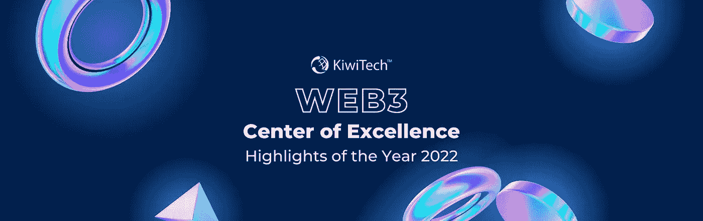

# 凯维科技的 Web3 卓越中心——2022 年回顾

> 原文：<https://medium.com/coinmonks/kiwitechs-web3-center-of-excellence-a-recap-of-2022-ad2e4d7d9dfe?source=collection_archive---------38----------------------->

只有当你一直生活在岩石下，你才敢忽略过去一年的 Web3 空间。每个人都沉浸在 2021 年的 Web3 狂欢中，很难相信事情会在 2022 年年底前发生，这种愤怒从未停止过；只是发生了没人预料到的转变。

尽管对安全和合法化的担忧总是在人们的脑海中挥之不去，但直到像最近 FTX 崩溃这样的大规模事件发生后，才有人费心将其置于中心舞台。

> 交易新手？在[最佳密码交易所](/coinmonks/crypto-exchange-dd2f9d6f3769)上尝试[密码交易机器人](/coinmonks/crypto-trading-bot-c2ffce8acb2a)或[复制交易](/coinmonks/top-10-crypto-copy-trading-platforms-for-beginners-d0c37c7d698c)

它从上到下质疑加密货币的所有方面，并抹去了它之前吹嘘的信任。然而，尽管对整个行业来说这是不可预测和挫折的一年，但该领域的一些发展和进步显然已经使 crypto 黯然失色。

因此，有一件事变得非常清楚，那就是 ***Web3 不仅仅是加密，加密也不是 Web3*** *的唯一应用。*

它可能是以加密作为其风帽开始的，但今天 Web3 已经以多样化的形式表现出来，分散的应用程序和协议脱颖而出。

因此，对于 Web3，今天的空间有更多的东西要提供，有更多的东西要征服，有更多的东西要探索。从一开始，对于我们的 Web3 团队来说，这一年就是充满惊喜和成长的一年，他们只着眼于不断向前发展。

**推动进程**

今年，我们见证了 Web3 技术的巨大进步，见证了一些基于区块链的令人惊叹的项目、协议和应用。

我们的专家和顾问团队孜孜不倦地帮助不同的项目实现他们的愿景，同时支持一些最具创新性的项目。

**灌输卓越文化**

*   持续的技能提升、交叉培训和获得认证，无论是许可的分布式账本技术，如 R3 Corda，还是 EVM 的公共区块链。
*   为我们的武器库增加多种技能——无论是不同的协议，如 Polygon、Palm、Algorand、XRPL、币安等。或者利用最新的工具和技术，如 Infura、Pinata、IPFS、Exchanges 等。

**将愿景变为现实**

本着真正的协作精神，我们与合作伙伴紧密合作，帮助他们将产品愿景转化为真正的消费者服务平台。凭借各种产品和领域，我们的专家能够协助交付从基本的基于数字令牌的解决方案到复杂的 DeFi 解决方案的各种产品。

其中一些是:

*   **NFT launch pad 解决方案** —一个联合品牌的 NFT 市场，集成了区块链网络，如以太坊、Palm、Algorand、Polygon、XRP 分类帐等。
*   **分散支付&奖励生态系统** —在补充性&替代医学(CAM)行业中利用基于反射的令牌。
*   **实物的数字化展示—** 一个为收藏家出售独家实物艺术品和收藏品的平台。
*   **MVP 辛迪加借贷应用—** 在获得许可的区块链网络上，如 R3 Corda 和 AWS 利用 Hyperledger Fabric 管理区块链

**构思&发现**

我们从一开始就与合作伙伴合作，了解他们的需求，并与他们深入探讨，以实现高效的发现。无论是否需要验证或指导，我们的专家都会随时提供帮助。我们很高兴能够参与以下项目并为其增值:

*   **面向购房者的配对应用/生态系统**基于标记化房地产资产的部分股份共同拥有房屋，通过借贷协议激励房地产投资以建立股权和产出农业。
*   [**prop tech 公司**](https://www.kiwitech.com/casestudy/proptech) 将土地开发商和投资者联系在一起，我们的合作使他们明确了他们的需求，以增强他们现有的应用程序，并利用可用和不可信的 Web3 原则。
*   **一个可持续的比特币开采平台**，旨在将普通投资者与可再生能源开采设施联系起来。他们的业务模式包括一个基于弹性供应的令牌，以数字化平台&社区的价值，从而为其客户带来“实际收益”。
*   构思一个 Web2、**游戏内奖励交换平台**的增强功能，通过一个基于区块链的解决方案来增强包容性，以实现令牌化、互动学习、入口&出口解决方案。
*   [**跨境支付解决方案**](https://www.kiwitech.com/casestudy/stellar) 是一个基于 DLT 的跨境汇款平台，可以作为传统解决方案的革命性替代方案。

**合作成功**

在 KiwiTech，我们正积极努力以多种方式构建 Web3 社区。其中一个社区是我们与 T2 硅协会合作的纽约 Web3 协会，我们在那里举行会议，就这项强大技术的实际使用案例开发和授权给所有人。

**赋能 Web3 教育**

我们的网络研讨会已被证明是许多企业家、开发者和爱好者了解 Web3 基础发展的门户，而不仅仅是促进炒作。我们录制的一些网络研讨会包括:

*   [*Web3-它是什么&为什么重要？*](https://youtube.com/watch?v=BxJulrGzaSw&feature=share)
*   [*NFT 发射台的演变*](https://youtube.com/watch?v=iP_H_1JKH-w&feature=share)
*   [*用 Stellar*](https://youtu.be/o-5QE3zghxk) 解码跨境支付

**年度重要亮点**

全国失业人数创历史新高

他们继续通过更具创造性的想法创造价值，在行业中处于领先地位。

**以太坊合并的出现**

尽管被推迟了，以太坊主网的显著发展释放了 Web3 在可持续发展领域的真正潜力。

**加密崩溃**

2021 年的加密热潮停止了，最初 8 个月看似加密的冬天到年底变成了 Web3 投资者最糟糕的噩梦。

因此，许多问题浮出水面，需要为未来的 **Web3 制定一个万无一失的计划，以保护 Web3 社区免受欺诈和洗钱案件的影响，并发展成为 Web3 具有巨大潜力的行业。**

**Web3 寻求密码法规**

人们都在寻找加密合法化，以保护他们免受任何未来的欺诈，并恢复他们对加密的信任。

**所有用于游戏的游戏**

游戏玩家也开始涉足 Web3 游戏，因为我们看到了游戏行业的显著发展，基于区块链的游戏随处可见。

**该 Defi 了**

作为镇上的话题，Defi 有许多项目和协议在优化金融业的道路上。

**再见 2022，你好 2023！**

留在这个空间的是发展和壮大 Web3 行业的热情的先驱和建设者，我们迫不及待地想看到区块链的未来。

我们对新的一年感到兴奋，并对未来有一些激动人心的计划和项目。如果你想用未来的技术建立或改变你的企业，KiwiTech 在这里帮助你驾驭这个不断变化的局面，并提供最佳的解决方案。今天就联系我们的 [*Web3 专家*](https://www.kiwitech.com/web3-center-of-excellence?utm_source=Medium&utm_medium=Blog&utm_campaign=Web3&utm_id=campaign1) *！*