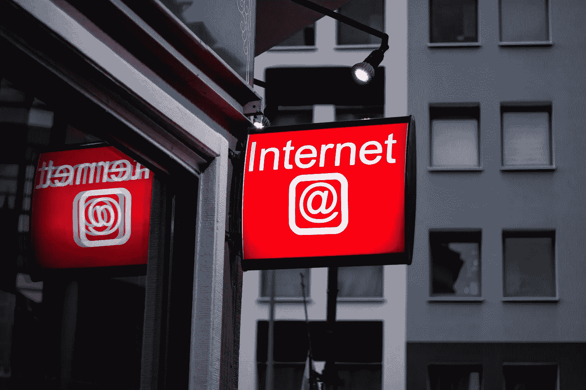

# 了解 web3 域

> 原文：<https://medium.com/coinmonks/know-about-web3-domains-3e8a2eb0a802?source=collection_archive---------42----------------------->

## 什么是 web3？

读取、写入和信任的网络是互联网的第三次迭代，由智能合约、加密货币、NFT 和区块链技术驱动，以实现去中心化的网络。这意味着它不是被集中控制，而是分布在一个计算机网络中，使它更加安全和有弹性。

## 什么是 Web3 域？

让我们从这样一个事实开始:web3 域是以一种不同于我们在当前互联网中所知的方式构思的基础设施，除了结构变化之外，还有谁管理它的变化，如果我们了解一点 DNS，我们就会意识到它们是由诸如亚马逊、谷歌、微软等大公司控制的；web3 中的 DNS 将被分散，以将数据和内容的控制从用户返回给用户；一个主要的区别是，DNS 将沉浸在区块链中，提供必要的数据并验证交易的真实性。

Web3 是指网络的下一代法律、技术和货币架构，包括智能合约、区块链和加密货币。Web3 项目分为几个类别，如数字服务、市场、分散金融(DeFi)、DAOs 和收藏品(NFTs)。

分散加密域是一个人类可读的地址，作为加密钱包的代理，而不是像 IP 地址一样提供一组人类可读的字符。这些 Web3 域名是不可替代的令牌(NFT)或有效的数字证书，可以在 Solana 的 Solsea 或 OpenSea、以太坊的 ens 等平台上交易。这些扩展可以是。加密。道，。nft，。目前，有许多基于 Web3 核心技术的应用程序。除了各种加密货币(可能是最突出的例子)，还有前面提到的 NFT。然而，全新的概念，如分散的自治组织或不同链上的视频游戏，也可以在 Web3 应用程序中找到。

web3 域名的吸引力或优势之一是我们可以很容易地记住相关的地址或钱包，因此金融市场将更加自然。

区块链组织需要一个命名服务来建立公共地址中的数字身份。此外，消费者会发现与一个命名的地址进行交互要比与一串任意的字母和数字进行交互容易得多。例如，分散式 Web3 名称服务(如 RIF 名称服务)是一种受 DNS 启发的分层名称空间。RNS 的设计旨在提供一个命名约定，用于引用资源。

很明显，web3 域的主要用途是将它们链接到加密货币钱包中的公共地址；然而，这不是唯一的事情。它们也可以用来创建分散的网站，甚至可以配置子域。也可以用现有的 DNS 来配置它们，简而言之，所有的 web3 服务都可以无缝地融入当前的互联网。

基本上，域名是通向 web3 的门户。也就是说，人们可以拥有某种带有扩展名的“用户名”。eth，。溶胶，。加密。nft 和许多其他可以在前面已经提到的不同服务中使用的技术。

photo by S[hubham Dhage](https://unsplash.com/@theshubhamdhage?utm_source=unsplash&utm_medium=referral&utm_content=creditCopyText) on [Unsplash](https://unsplash.com/es/s/fotos/web3?utm_source=unsplash&utm_medium=referral&utm_content=creditCopyText)

这些域与密码世界中的大量实用程序兼容。我们谈论的是 Trust 和 Metamask 这样的钱包，Uniswap 和 Etherscan 这样的应用程序，以及 Opera 和 Brave 这样的 web 浏览器，仅举几例。这份清单在每个领域都非常广泛，而且有望变得更长。

所谓的 Web3 将允许机器解释更多的数据。这将允许我们与来自任何平台的其他用户进行更深入的互动。

尽管区块链安全性因其分散的体系结构和可审核性而对我来说似乎是安全的，但我们应该始终注意以下安全建议:

Photo by G[uerrillaBuzz Blockchain PR Agency](https://unsplash.com/ja/@guerrillabuzz_blockchain_pr_agency?utm_source=unsplash&utm_medium=referral&utm_content=creditCopyText) on [Unsplash](https://unsplash.com/es/s/fotos/web3?utm_source=unsplash&utm_medium=referral&utm_content=creditCopyText)

*   **练习基本的安全基础知识:**选择强密码，使用多因素身份验证，检查 web 域名 3 和加密货币地址中隐藏的拼写错误，绝不点击社交网络或电子邮件中未经请求的链接。
*   **保护种子短语:**在元宇宙，加密货币钱包越来越多地用于用户的身份识别和个性化。不应与任何人共享(尤其是以二维码的形式)，因为失去种子短语意味着失去对个人身份和所有个人数字财产的控制。
*   **使用硬件钱包:**使用硬件钱包为加密货币/NFT 增加了另一层安全性，因为你必须连接设备，用 PIN 进行验证，并批准/拒绝任何涉及钱包地址的交易。
*   **研究购买:**在购买/挖掘 NFT 之前，查找智能合约地址，看看是否发布了源代码。未发布的源代码是一个危险信号。还建议使用新生成的仅包含购买所需资金的钱包地址。

> 交易新手？尝试[加密交易机器人](/coinmonks/crypto-trading-bot-c2ffce8acb2a)或[复制交易](/coinmonks/top-10-crypto-copy-trading-platforms-for-beginners-d0c37c7d698c)