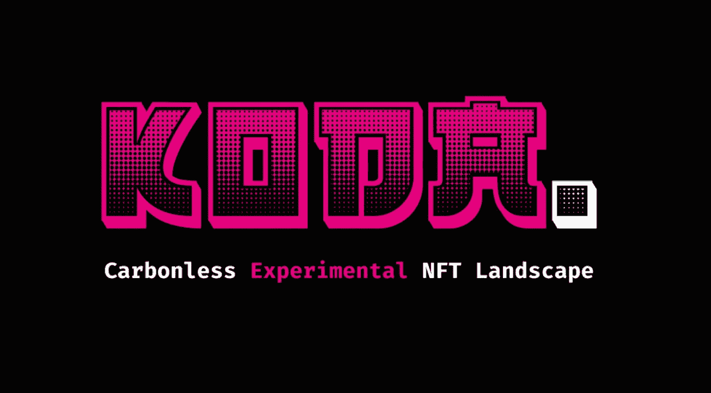
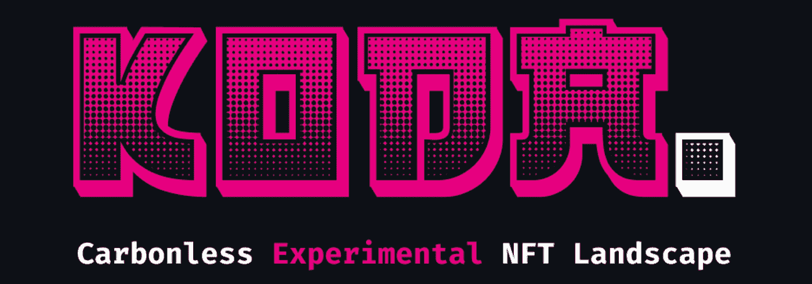
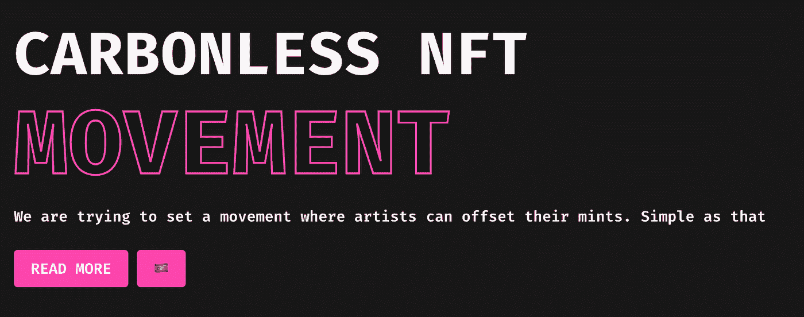
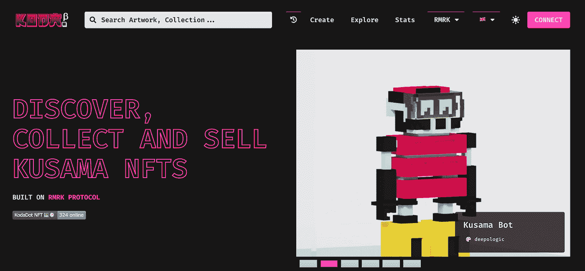
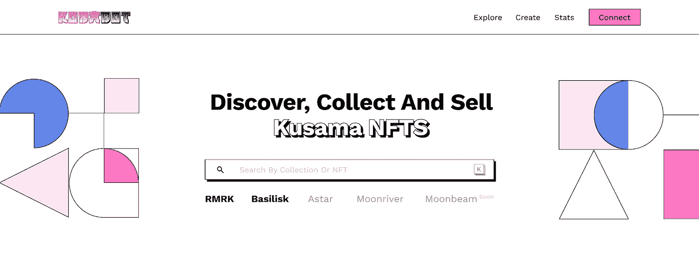
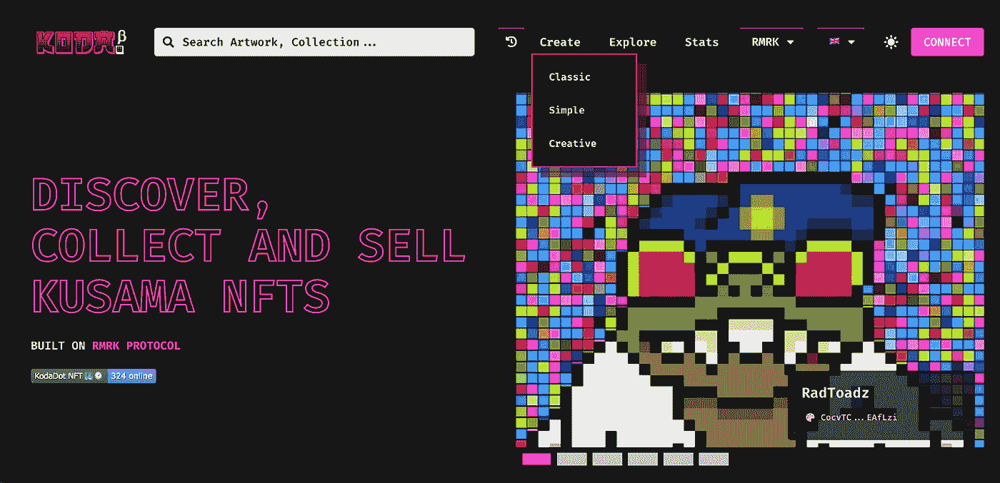
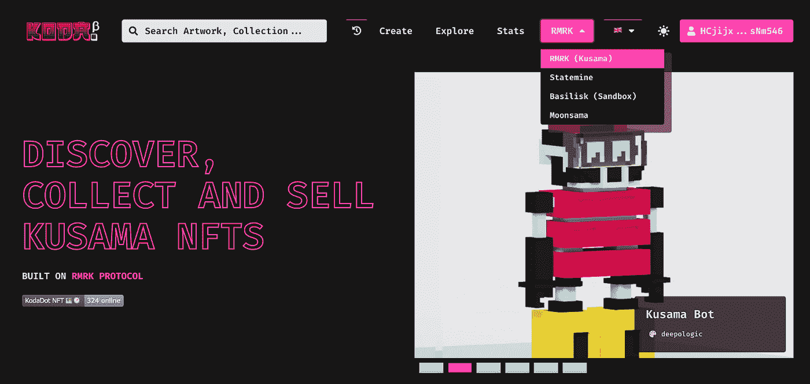
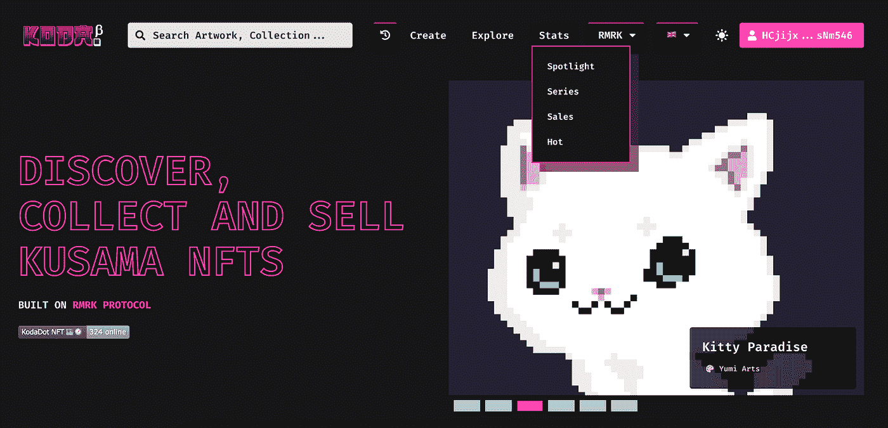
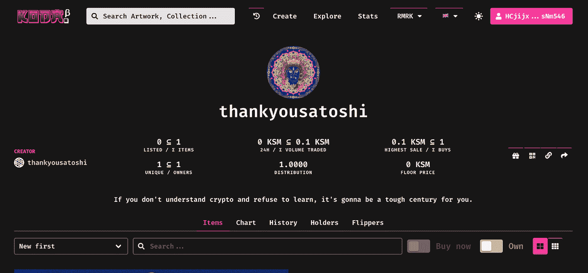

# Koda dot——dot sama 无碳 NFT 市场概述

> 原文：<https://medium.com/coinmonks/kodadot-an-overview-of-dotsamas-carbonless-nft-marketplace-e4851f5c617a?source=collection_archive---------13----------------------->

**Primer**:dot sama(草间弥生/波尔卡多特)生态系统的第一个公益物，Kodadot 是一个草间弥生本地碳中和 NFT 平台，使用户能够铸造、转移和燃烧 NFT。

不可替代令牌(NFT)受欢迎程度的飙升可以从 2021 年近 200 万活跃钱包的 150 亿美元市场评估中确定。然而，尽管非功能性交易获得了关注和收入，但对许多人来说，它们的定义仍然不清楚。

**NFTs** 代表不可替换的代币。

但是什么是可替代和不可替代的项目呢？

让我们借助例子来理解同样的道理。

可替代项目有资格进行替换/替代(例如，美钞、比特币)，而不可替代项目(例如，机票、交易卡和房地产)是唯一的，不可互换。简而言之，一个不可替代的项目不能完全等同于另一个项目。

既然我们理解了术语不可替代性，让我们回到 NFTs。
NFT 是代表现实世界物品所有权的独特数字资产，如艺术品、视频剪辑、音乐、收藏品、游戏中的物品等。所有权是作为真实性证书内置的。NFT 由区块链技术驱动，类似于加密货币。然而，与加密货币不同，NFT 是不可复制的唯一加密令牌(不可替代)。把它想象成真实性的物理评估的数字等价物。区块链技术使任何人都能为自己的原创作品颁发真品证书。

# 科达多特

Kodadot 是众多用户可以展示、交易、甚至创建和存储 NFT 的市场之一。NFT 市场是指一个数字资产平台，是购买和销售非功能性交易的理想工具。

一些市场提供专门的服务，比如创建和存储 NFT。然而，通过市场进行的 NFT 交易往往伴随着高额费用。此外，一些平台往往会限制艺术家的创造力，在这些平台上导航并不像它应该的那样简单和高质量。

虽然非传统艺术给了艺术家对他们作品的巨大控制权，以及无中介进入主流的能力，但非传统艺术的铸造有一个巨大的负面影响，即大量的碳排放。大多数加密技术都在以太坊区块链上运行，它利用了 PoW 共识模型。虽然向 PoS 的转变指日可待，但人们不能否认已经造成的损害。

Kodadot 的不同之处是我们将在本文的下一节讨论的。

Kodadot 是一个通用的 NFT 资源管理器和市场，建立在草间弥生之上，使用 RMRK 协议来管理和创建 NFT。

我们试图发起一场运动，让艺术家们可以抵消他们的薄荷糖。

Kodadot 是为那些想在保持碳中和的同时尝试区块链和 NFTs 的创作者和收藏家设计的。更重要的是，Kodadot 有一个反应灵敏的基于网络的 NFT 浏览器，它提供了一个直观的用户界面。

# 科达多特平台一览

## 直观的用户界面(UI)

用户界面简单而直观，易于使用，以深色主题为特色，并称赞内容。顶部的搜索选项可以让你根据艺术品、收藏和列表来搜索 NFT，确保 NFT 的顺利交易。这是一个强大的功能，确保用户可以根据自己的喜好从可用的 NFT 中进行搜索。

在 Kodadot 上，新的列表和热门收藏会自动出现在搜索栏中。这对于不认识路但对探索 NFT 空间感兴趣的新手来说尤其有用，因为这使他们能够查看草间弥生网络上最热门的 NFT。

此外，将鼠标悬停在一件藏品上，会以最佳方式显示所有关键信息，包括 NFT 的名称、价格、物品数量、底价等。有关详细信息，您可以查看集合的单个页面。

## 高级搜索

这里先睹为快 Kodadot 的高级搜索功能，预计将很快推出。Kodadot 正在使用[sub quid](https://twitter.com/subsquid)来加速他们原生的多链 NFT 平台上的搜索。

## 支持多种语言

KodaDot 支持多种语言，努力成为多语言和本地优先。它认为语言是访问 Web3 工具的障碍，因此提供了这种支持。

## 创建 NFT

KodaDot 提供了三种选择——经典、简单和创造性地创建 NFT。Classic 允许创建一个集合并向其中添加 NFT。用户可以通过简单的选项在一个步骤中创建 NFT，而 Creative 则使用人工智能驱动的流程来创建 NFT。

## 过滤

过滤器不仅方便了搜索，还增强了用户体验。所有可用的过滤器，如类别、可用性、上市日期和收藏，提供了通过上市 NFT 的简单灵活的导航，确保了流畅的体验。用户可以根据构建的链(RMRK、Statemine、Basilisk 和 Moonsama)过滤掉 NFT。

## 统计数据

Kodadot 的统计或统计页面为用户提供了额外的功能，以确保无缝交易。统计有四个部分(RMRK)。第一个是**聚光灯**。用户可以选择 Spotlight 查看 RMRK 的顶级收藏家和艺术家。该显示包括 Kodadot 平台上最流行的 NFT，因此有术语 spotlight。第二部分，**系列**，展示了 RMRK 顶级的 NFT 收藏品，按总量、底价和其他统计数据排序。接下来是**销售**部分，显示最近在 RMRK 上出售的 NFT，以及其他信息，如出售价格、买家、日期等。最后，最后一部分的标题是 **Hot** ，显示前一周的销售情况。它包括诸如最后一次销售、自从最后一次销售以来的时间等项目。

## Kodadot 系列功能

当收藏者查看收藏页面时，他们会看到几个功能，以确保无缝体验。

**项目** —基于下面突出显示的一系列因素启用导航(插入图片)。

**图表**——提供 NFT 价格演变的可视化表示，并通过跟踪藏品的底价、售价和跟踪平均价格来分析价格。

**历史** —让用户查看基于列表、造币、购买、刻录和礼品的 NFT 历史。它包括的日期

**持有者** —列出购买了 NFT 的用户，包括他们的姓名、购买数量、购买/出售价格以及活动日期。

**Flippers** —显示集合中所有购买和出售 NFT 的前持有者的列表。它包括名称、NFT 的买卖价格、日期等。

# 结束语

Kodatdot 解决了围绕 NFTs 的气候争议，是 DotSama 的第一个碳中和、可访问和用户友好的 NFT 创作和交易平台。

凭借对可持续发展的承诺，Kodadot 重新定义了创作者和收藏家与非物质文化遗产和区块链的互动方式，为那些由于非物质文化遗产对环境的深远影响而没有进入该空间的人提供了一个切入点。

如果你觉得这很有帮助，请考虑通过小费、订阅和关注来支持。

**一切区块链—** 追求简化元宇宙链的不同区块。

**社交**

[Substack](https://everythingblockchain.substack.com/account?utm%5Fsource=menu-dropdown) ， [Twitter](https://twitter.com/EverythingB0x) ， [Youtube](https://www.youtube.com/channel/UCkcc6EceEAu1sMoi2dKczCQ) ， [Medium](/@everythingblockchain) ， [Reddit](https://www.reddit.com/user/cyekmyster)

**下线**

[智囊团](https://app.usebraintrust.com/r/everything1/)，[预研](https://www.presearch.org/signup?rid=2491437)，[币安](https://accounts.binance.com/en/register?ref=12626399)，[库科恩](https://www.kucoin.com/ucenter/signup?rcode=rJCLFS2)

本文提供的信息仅用于教育目的，不得视为投资建议。在正确呈现任何信息方面的任何失误都是我们的责任。我们否认与使用此内容相关的任何责任。

> 交易新手？试试[加密交易机器人](/coinmonks/crypto-trading-bot-c2ffce8acb2a)或者[复制交易](/coinmonks/top-10-crypto-copy-trading-platforms-for-beginners-d0c37c7d698c)