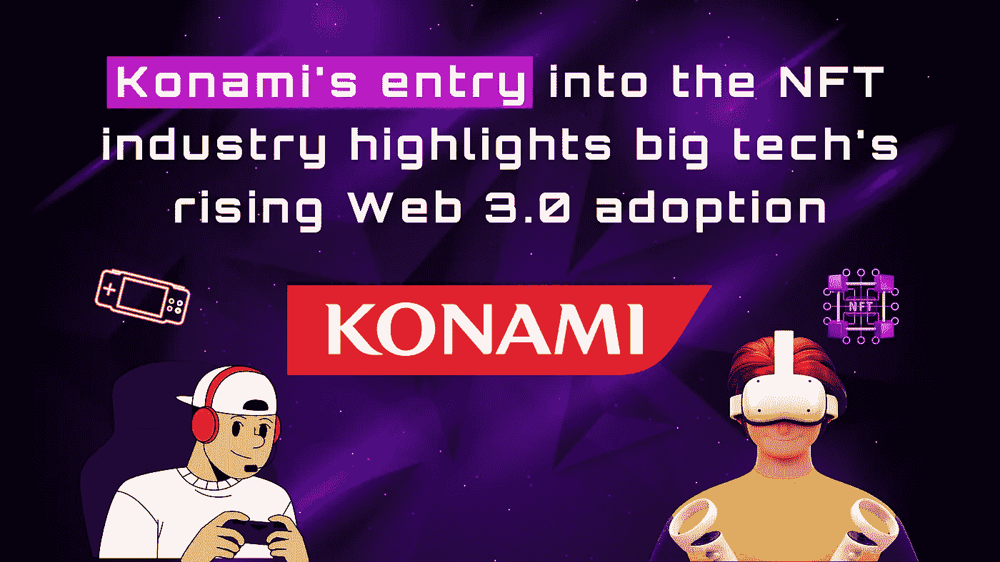
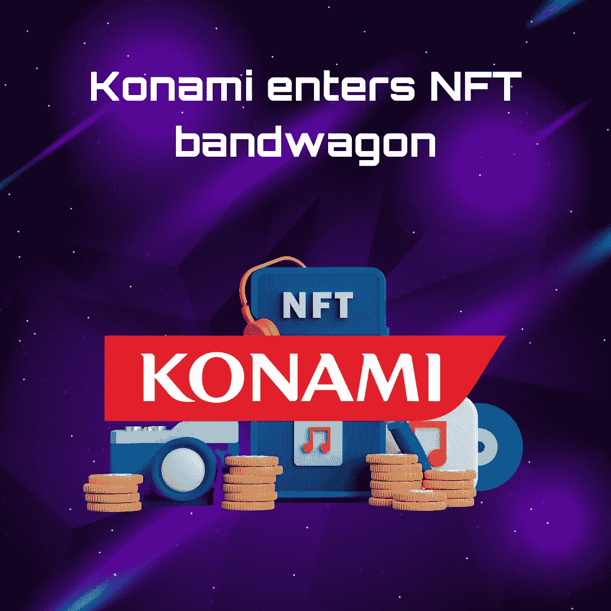

# Konami 进入 NFT 行业凸显了大科技公司对 Web 3.0 的日益采用

> 原文：<https://medium.com/coinmonks/konamis-entry-into-the-nft-industry-highlights-big-tech-s-rising-web-3-0-adoption-69cf861187ee?source=collection_archive---------32----------------------->

“隐私”这个词意味着一种不可预测的感觉，一种神秘的气氛，以及保护某种对我们来说很重要的东西的需要。如今，隐私与我们的信息联系最为紧密，无论是个人信息还是职业信息。然而，即使在过去，我们中的许多人也更愿意隐藏自己的财务信息，即使是我们最亲密的血亲也不知道。由于 Web 2.0 的快速发展，我们接触到了社交媒体平台，这导致了与世界各地我们不认识的人进行快速而广泛的信息交流。因此，可以有把握地说，由于技术进步，我们与互联网互动的方式发生了巨大变化。

# **web 3 现象**

Web3 描述了一个分散的 Web 集群，用户可以在其中交流、制作和拥有自己的数字材料，而不受外部影响。下一代技术引入了互联网去中心化和数字化的概念。Web 3.0 是互联网发展的下一个阶段，它使用[区块链技术](/@orbis86/blockchain-as-a-service-an-explainer-4853a4156708?source=user_profile---------7----------------------------)作为其主要的基础设施工具。去中心化的网络正在迅速发展，企业正在敏锐地评估它的应用和他们自己的运作，以最大限度地利用它的潜力。

区块链技术包括一个分散的数字账本，用于存储交易等。数据保存在区块链的数据块中，每个数据块都链接到它旁边的数据块。使用密码加密，两个块链接在一起，每个块都添加了时间戳以增加透明度。此外，在分散的集群中，也没有集中的权威机构来验证或监督数据和活动。该系统由几个网络节点组成，这些节点验证保存在分类账上的信息。与 Web 1 和 Web 2 相反，每个网络节点都可以很容易地访问数据记录。不变性得到了保证，因此存储的数据受到保护，不会被入侵。web3 专家使用区块链技术为用户开发安全的解决方案。

# **Konami 进军 NFT**

日本公司 Konami 是世界上最受好评的视频游戏公司之一，[最近透露了](https://www.konami.com/games/corporate/en/news/release/20221013/)其计划引入一个市场，用于交换游戏中的 NFT 以及各种其他与 Web3 相关的商品和服务。为了创造像 Web3 和元宇宙这样的创新体验，这家娱乐巨头表示，它正在寻找新的人才，并将聘请各种专业知识。游戏巨头长期以来一直在寻找将最新技术进步融入游戏的方法，Konami 很清楚 NFT 有各种应用的事实。除了通常用于表示娱乐的独特游戏内对象之外，该技术还可以表示粉丝令牌和活动门票，使用户能够参与各种服务和社区。

迄今为止，3 个部门共列出了 13 个职位。这些职位的主要目标是让参与者展示他们的 web3 知识和技能。程序员、设计师、系统工程师、项目经理和业务开发人员只是许多不同职责的几个例子。该公司还计划将不断扩展的 NFT 功能纳入他们的游戏，允许玩家完全拥有和访问他们在游戏中的对象和资源。

但这并不是 Konami 首次进军区块链领域。今年早些时候，Konami 出售了一系列与恶魔城品牌相关的 NFT，以纪念视频游戏 35 周年。收集的大部分是在不同家用电脑上玩的前三个恶魔城游戏的游戏短片的 gif。其余的收藏品包括来自《恶魔城:月亮圆》的原版艺术品和游戏地图的复制品。随着越来越多的组织过渡到将 Web3 集成到他们的[游戏](/@orbis86/introduction-to-gamefi-an-explainer-66e079c0f718?source=user_profile---------17----------------------------)中，许多顶级科技公司今天正在努力增强他们的 Web3 技术兼容性，并充分利用其巨大的潜力。

# **Web3 和全球科技巨头**

不把脸书列入这份杰出的 Web3 采纳者名单是愚蠢的，尤其是考虑到该公司最近将自己更名为“Meta”的事实 Meta 的创始人马克·扎克伯格直言不讳地表达了他想把这个社交媒体平台变成一个完全的元宇宙组织的愿望。实现这一战略转变的关键第一步是更名。这位技术领袖表示，他希望建立一个更加用户友好、可互操作的网络集群。该公司还向加密货币行业的监管机构提交了多项商标申请。这些应用包括区块链软件、代币、加密货币交易、元宇宙钱包和加密钱包解决方案的概念。

[insta gram 的负责人 Adam Mosseri](https://www.wired.com/story/adam-mosseri-instagram/) 透露，该公司计划在 2021 年早些时候调查 NFTs，目的是扩大 Web3 技术的覆盖范围。根据扎克伯格的说法，NFTs 将很快成为 Instagram 生态系统的一部分。Meta Chief 强调，在接下来的几个月里，他们将能够通过整合 NFT，无缝地通过 Instagram 联系到人们。该公司还打算让 NFT 明廷加入知名照片分享应用的框架。马克·扎克伯格的主要目标之一是创建 Web 3，他正努力通过社交媒体平台来实现这一目标。

推特[也给了](https://techcrunch.com/2022/01/20/twitter-blue-subscription-users-are-first-gain-access-to-a-new-nft-profile-picture-feature/)推特蓝用户选择 NFT 作为他们的个人资料图片的权利。对于那些已经验证了 NFTs 的用户，数字资产以六边形模式显示在用户简档上。居住在美国、加拿大、新西兰和澳大利亚的 iPhone 用户可以使用该设备。此外，该网站还将这项服务限制在以太坊上创建并保存在 OpenSea exchange 上的 NFT 上。Twitter 对 NFTs 日益浓厚的兴趣反映了其在该领域实现更大发展的雄心。

随着亚马逊管理的区块链的推出，杰夫·贝索斯的科技集团已经超越了它的竞争对手。通过开源框架，完全托管服务的客户可以创建、操作和监督可扩展的区块链网络。它是现有开源项目的改进版本，因为它支持公共和私有区块链解决方案。由于这项服务，客户在启动或加入任何公共网络时不再需要支付管理费。为了快速处理数百万笔交易，自动缩放非常有用。一旦网络启动，该设施将帮助管理证书并向新用户发出邀请。

特斯拉，世界上最大的电动汽车制造商，去年为了一个特定的目标使用了区块链技术。该用例需要创建一个开放、透明和统一的记录结构，以便跟踪从矿场到电池的钴。据透露，在[比特币 2022 大会](https://b.tc/conference/2022)期间，Blockstream 和 Block 已经开始在得克萨斯州建设一个测试加密矿。特斯拉的太阳能电池阵列和电池将安装在矿井上提供电力。该倡议旨在展示 BTC 矿业如何帮助资助绿色能源倡议。

# **Web 3.0 的未来**

由于物联网、机器学习和数据分析等技术的集成，Web3 将具有难以置信的丰富价值。以简单、方便和尽可能有效的方式向最终用户提供这些好处是推动该行业取得实质性进步的动力。随着去中心化工具和资源的普及，Web 3.0 预计将扩展到新的工业和非工业领域，未来几年将有更多的大型和小型企业加入进来。毫无疑问，这将改变我们与数字世界打交道的方式，对个人、企业甚至整个地球产生深远的破坏性影响。

> 交易新手？尝试[加密交易机器人](/coinmonks/crypto-trading-bot-c2ffce8acb2a)或[复制交易](/coinmonks/top-10-crypto-copy-trading-platforms-for-beginners-d0c37c7d698c)