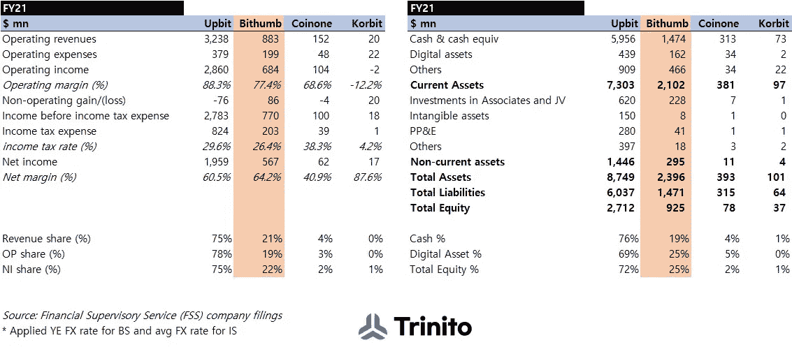
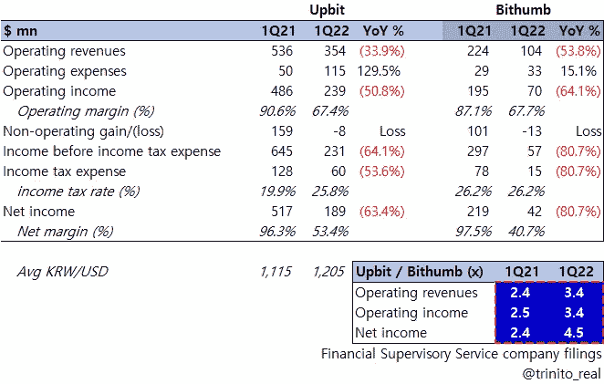
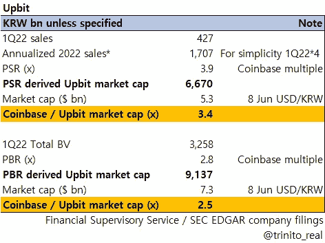
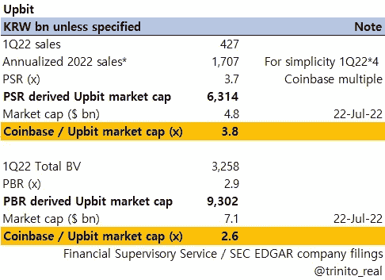
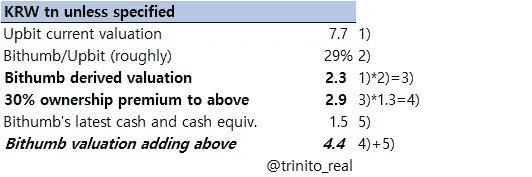

# 如果是真的，40 万亿韩元的比特币似乎很贵

> 原文：<https://medium.com/coinmonks/krw-4tn-for-bithumb-seems-expensive-if-true-1e28e4ea7d5c?source=collection_archive---------13----------------------->

**“韩国四大 CEX”2011 财年快照【大/中/小/极小】**

在过去的几天里，有大量的新闻报道(韩国和国外)称山姆·班克曼-弗里德(SBF)的 FTX 公司正在就收购比森银行进行深入的谈判。我们在[之前的一篇帖子](/coinmonks/bithumb-fs-comparison-vs-upbit-1q22-616426d1d3e5) [ *中提到过，“Bithumb 肯定更加保守，增加了额外的招聘和 SG & A 费用(考虑到所有者想要出售公司)”*，Bithumb 的所有者确实愿意出售。虽然我们无法确认最近的传言是否属实，但回顾一下比森布在韩国的现状可能会有所帮助。

* Please click the image for expanded view *

如上所述，Bithumb 是(现在仍然是)韩国所有类别中排名第二的 CEX 公司。粗略地说，该平台占据了目前由 Upbit 主导的韩国 CEX 市场约 20%的份额。

正如我们在之前的帖子中提到的，Upbit 和 Bithumb 之间的差距在 2022 年有所扩大，但尽管如此，Bithumb 在韩国仍然是第二名，遥遥领先于 Coinone 和 Korbit。

当地媒体的一篇文章说，FTX 为 Bithumb(韩语链接:[http://www.s-today.co.kr/news/articleView.html?idxno=4326](http://www.s-today.co.kr/news/articleView.html?idxno=4326))标价 4 万亿韩元，我们认为这看起来很奇怪。

早在 6 月份，我们提到 Upbit 的估值(与比特币基地反复核对)约为 9 万亿韩元(如下所示)。下表发布时，Bithumb 的估值约为 1 万亿韩元。

现在，如果我们用来自彭博的最新比特币基地共识估计来更新数字，Upbit 的估值不会发生巨大变化(9.3 万亿韩元)。然而，众所周知，Upbit 的估计估值最近已降至约 7.6 万亿韩元，因为交易量下降了 30%以上。因此，反对比特币基地的公司夸大了当前相对于实际价值的乐观估值。

如果我们对 Bithumb 做同样的练习(如下)，我们得到 3.2 万亿韩元。然而，正如几行前所讨论的，与现实相比，这是一个非常乐观的数字。最近的场外交易实际上对 Bithumb 的估值约为 0.7 万亿韩元。

如果我们认为 Bithumb 的价值约为 Upbit 的 30%(已披露的财务数据也是如此)，我们得出的值约为 2.2 万亿韩元(7.6 万亿韩元的 30%)，与 4 万亿韩元相差甚远。即使我们加上 30%的典型所有权溢价，也仅达到 2.9 万亿韩元。

只有当我们加上 Bithumb 的 1Q22 现金余额时，我们才能看到 4 万亿韩元左右的水平。

无论如何，如果目前的传言是真的(老实说，我们认为不是)，FTX 非常“乐观”，或者可能高估了比瑟姆的价值(从我们目前的立场来看)。

另一方面，Bithumb 的公司治理非常复杂，在韩国市场，Bithumb 相关的股票交易被称为 Vidente (121800。KQ)，水桶工作室(066410。KQ)，因比奥根(101140。KS)自今天(7 月 25 日)开市以来都上涨了很多。有意思…

由 Trinito 联合创始人 Eric Yoo 撰写，Trinito 投资主管 SungPil Huh 供稿。

**免责声明**

这不是投资建议，仅供参考。您不应将任何此类信息或其他材料理解为法律、税务、投资、财务或其他建议。

# Bithumb # Upbit # Coinone # Korbit #比特币基地# Crypto # CEX #估价# Vidente # bucket studio # Inbiogen # FTX

> 由[学会发布的内容。Block6.tech](https://learn.block6.tech)
> 
> 👉[不和](https://discord.gg/5SUs8QTJ8a) —现场直播
> 
> 👉[推特](https://twitter.com/block6_tech) —最新文章
> 
> 👉 [LinkTr.ee](https://linktr.ee/block6)
> 
> 交易新手？尝试[加密交易机器人](/coinmonks/crypto-trading-bot-c2ffce8acb2a)或[复制交易](/coinmonks/top-10-crypto-copy-trading-platforms-for-beginners-d0c37c7d698c)