# 库币期货:你需要知道的一切

> 原文：<https://medium.com/coinmonks/kucoin-futures-everything-you-need-to-know-50c0cf6736a9?source=collection_archive---------6----------------------->

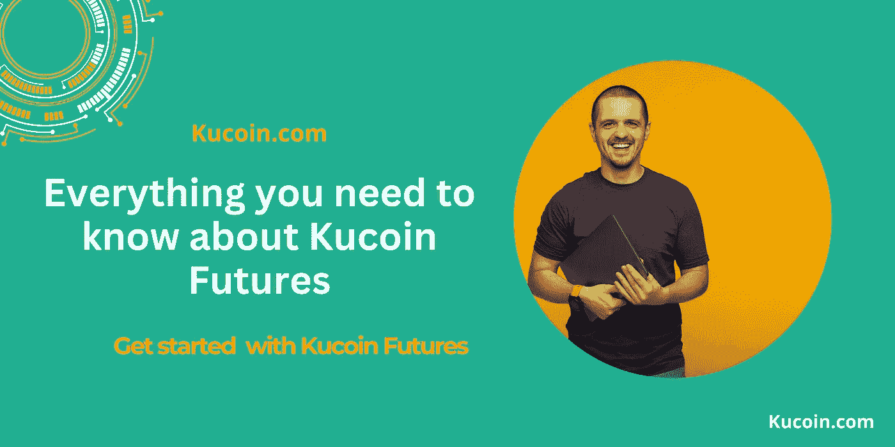

库币期货刚刚庆祝了三周年。为了纪念这一点，我将一步一步地告诉你如何开始库币期货交易。

但是首先要上一堂历史课。Kucoin 于 2017 年开始运营，总部位于塞舌尔。Kucoin 已经成为一家全球加密货币交易所，其面向用户的平台因其社区覆盖面和包容性而脱颖而出。

***这里有几个关于 Kucoin 的事实:***

*   Kucoin 通常被称为“*人民交易所*”，因为它具有包容性，允许所有类别的投资者进入。
*   Kucoin 在 Altcoin 领域脱颖而出，成为排名第一的 Altcoin 交易所。它提供 700+资产和 1200+交易对。Kucoin 很喜欢成为 VR、BLOK、、DAO 和 CHMB 等几个加密宝石的家；在库币网上首次上市后。
*   正如我们所说，Kucoin 为 207 个国家和地区的 1800 多万用户提供保证金交易、现货交易、P2P 菲亚特交易、赌注、期货交易和贷款。
*   根据 CoinGecko 和 CoinMarketCap 的报告，Kucoin 是世界上五大加密交易所之一。

## 库币期货交易解释

Kucoin Futures 拥有一个基于金融衍生品交易的平台，由 Kucoin 团队设计。期货交易，通常被称为“*合约交易*”，通常涉及买卖标准化的期货合约。

本质上，当你参与期货交易时，你参与了市场运动，有动机通过做空或做多期货合约来获利，同时利用杠杆增加你的收益。

因此，交易者可以做多一份期货合约，希望它升值。或者，交易者也可以做空期货合约，如果他们预测价格会在未来下跌。

Kucoin Futures 目前支持高达 100 倍的杠杆，利用智能算法进行指数计算，并支持 14 种不同的语言。此外，它还提供约 100 份永久和季度合约。这包括硬币保证金、USDT 保证金和季度交割合同。

**交割合约 vs 永久合约**

库币期货支持交割合约和永久合约。

交割合同涉及在未来指定时间以预先约定的价格购买或出售资产的协议。或者，永久合约可以永久交易，没有到期日。因此，对大多数投资者来说，永久合约变得有利可图。

**USDT 保证金对硬币保证金**

USDT 保证金合同通常雇佣 USDT 进行加密资产的合同交易，因此基础价格随着收入线性上升和下降。

线性合约的特点是 USDT 被用于交易和结算，因此持有一些 USDT 将意味着直接与众多主流货币进行合约交易。

另一方面，硬币保证金合同将涉及交易者仅使用基础加密资产，如 ETH 和 BTC 作为保证金，以便交易该特定合同。

一个例子是在以太币保证金合同中使用以太币作为基础资产。

**建兴版和期货大战**

Kucoin 热衷于让初学者变得简单。它的 Lite 版本为新手提供了一个简单且用户友好的界面。在 Kucoin Futures Brawl 上，初学者可以获得关于期货交易的信息，以获得简化的体验。

两个平台让新手轻松开始自己的期货交易之旅。

**库币期货三周年**

[**库币期货**](https://www.kucoin.com/futures/trade/XBTUSDTM) ，庆祝其[三周年](https://www.kucoin.com/news/en-exclusive-kucoin-futures-3rd-anniversary-event-2nd-round-of-play-to-earn-enjoy-40000-usdt-in-rewards)，并为其新注册用户提供了几项优惠。如果他们遭受损失，他们将获得补贴，参加测验，获胜者将获得奖励，并且完成任务以获得奖励。

*本次活动的优惠活动在 2022 年 8 月 22 日至 2022 年 9 月 6 日期间有效。*

## 库币期货的优势

1.  **易用性** - Kucoin Futures 推出了专业版和精简版，以满足新手的需求。此外，期货争吵改善了用户的期货交易体验。
2.  **用更少的资金放大利润的能力** - Kucoin 期货提供高达 100 倍的杠杆，让用户有机会成倍增加利润。只需价值 1 美元的 BTC，你就可以开始你的旅程。
3.  **包括所有类别的投资者** - Kucoin Futures 支持各种合约和高级订单，包含 120 多种不同的硬币和代币。这一因素在欢迎不同交易胃口的不同投资者方面发挥了作用。
4.  **稳健安全的交易系统** -库币期货拥有先进的智能指数算法，指数参考 6 家知名加密交易所的现货市场价格，避免异常平仓。

## Kucoin 期货交易分步指南

1.  **启用期货交易** -为了导航到期货交易区，登录 Kucoin 并将鼠标悬停在菜单上的*衍生品*上，然后继续点击*期货经典*。

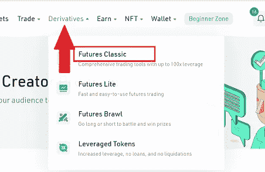

点击*期货经典*选项，会弹出一个窗口，点击*启用期货交易*按钮。继续通读相关文本，并勾选“*我已阅读并同意*”选项。

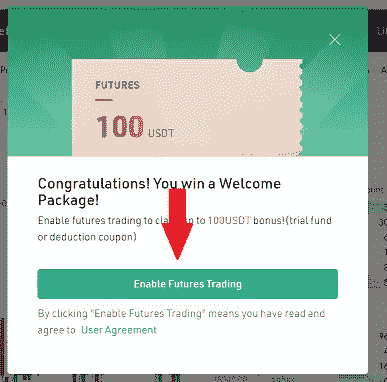

**2。将资产转移到您的期货账户** -为了查看您在 Kucoin Futures 上的资产，请将光标定位在钱包图标上，然后选择“*期货账户*”。此选项将引导您进入期货资产页面。

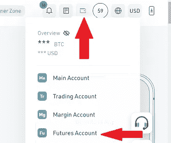

Kucoin 通常提供两种主要方法将资金存入您的期货账户。

*方法 1:* 如果您的加密资产在另一个平台上，您可以直接点击存款选项，将 USDT 或 BTC 存入特定地址。

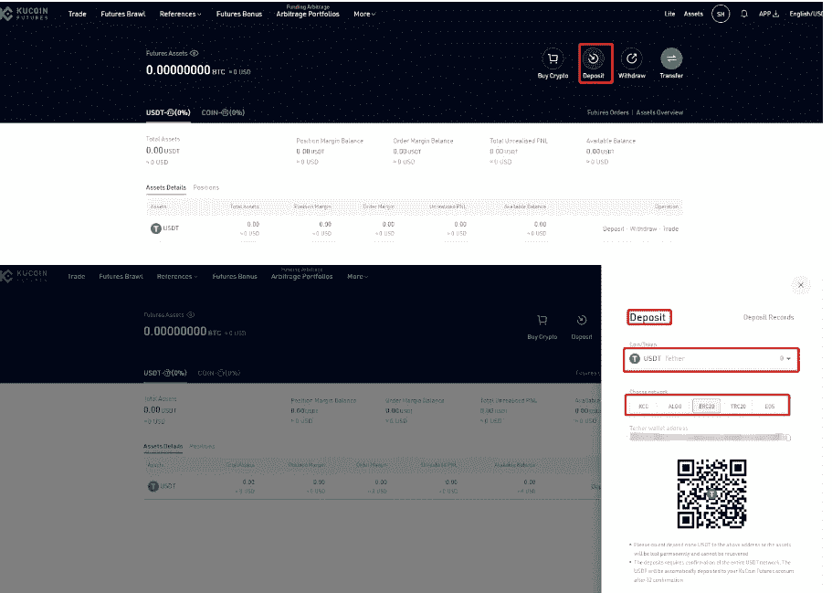

*方法二*:如果你在 Kucoin 上有一些 USDT 或 BTC，只需点击“*转账*选项，现在就可以将 USDT/BTC 转账到你的期货账户。

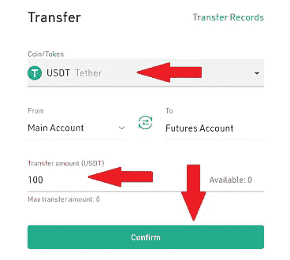

3.**如何交易-** 登录您的期货账户，导航至“交易”选项，搜索期货产品。

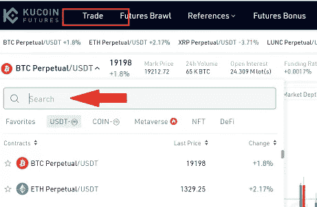

为了在 Kucoin 期货上下单，您需要选择订单类型和杠杆，然后选择您的订单数量。

库币期货支持 3 种订单类型； ***限价单，市价单&止损单。***

*   ***限价单***——限价单利用预先确定的价格买入或卖出产品。而在 Kucoin Futures Classic 上，您可以输入订单价格和数量，并选择“*买入/做多*或“*卖出/做空*”来发起限价订单。
*   ***市价订单***——市价订单是指在现有市场上以最佳价格购买或出售产品的订单。在 Kucoin Futures Classic 平台上，用户可以输入订单数量，并点击“*买入/做多*或“*卖出/做空*”成功发起市场订单。
*   **在 Kucoin Futures Classic 上，您可以选择触发类型，并设置止损价格、订单价格&订单数量来启动止损订单。**

选择杠杆比率——杠杆是用来放大你的收益的。因此，杠杆越高，收益越高；然而，这个因素也会导致你的损失。渴望做出更好的选择。

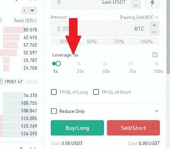

Kucoin Futures 还具有高级设置，包括，“**仅发布**”，“隐藏”，以及生效时间政策，如 GTC、国际奥委会订单。这些设置仅适用于止损单和限价单。

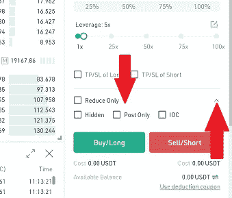

买入/做多&卖出/做空——在 Kucoin 期货上，一旦你输入了订单信息，你可以点击“买入/做多”进行多头交易，或者点击“卖出/做空”进行空头交易。

如果你做多了一个头寸，期货价格上涨了，你就会获利。如果你做空一个头寸，期货价格下跌，你就赚了。反之亦然。

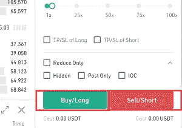

4.**查看您的头寸** -在库币期货上，成功提交订单后，您可以在头寸列表中查看甚至取消您未平仓的&止损单。

要检查您的头寸，只需导航到期货交易页面左下角的头寸页面。

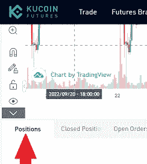

*岗位各类别定义:*

*   数量——代表特定订单中期货的数量。
*   进场价格——这代表你当前现有头寸的进场价格。
*   清算价格——清算价格代表如果价格比期货价格更低，你将被清算的价格。
*   未实现 PNL-代表现有头寸的浮动损益。在一种情况下，如果是正数，你就赚了，如果是负数，你就亏了。百分比表示利润和损失占订单金额的比例。
*   已实现 PNL——代表头寸的进场价格和出场价格之间的差额。此处包含交易和融资费用。
*   保证金——代表一个人为了保持一个头寸，必须持有的最小资金量。如果保证金余额低于维护保证金，清算引擎将自动接管一个人的头寸进行清算。
*   自动存入保证金-当此功能启用时，可用余额中的现有资金将在清算时添加到当前的现有头寸中；试图阻止头寸被完全平仓。
*   获利/止损-启用此功能允许系统自动进行获利和止损操作，以防止波动性导致的损失。

**5。平仓**——你可以用市价单平仓，也可以用限价单平仓。

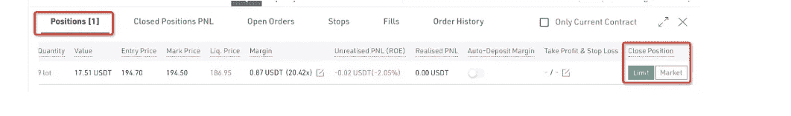

*平仓市价单:*设定您计划平仓的头寸规模，进行确认，您的头寸将按当前市价平仓。

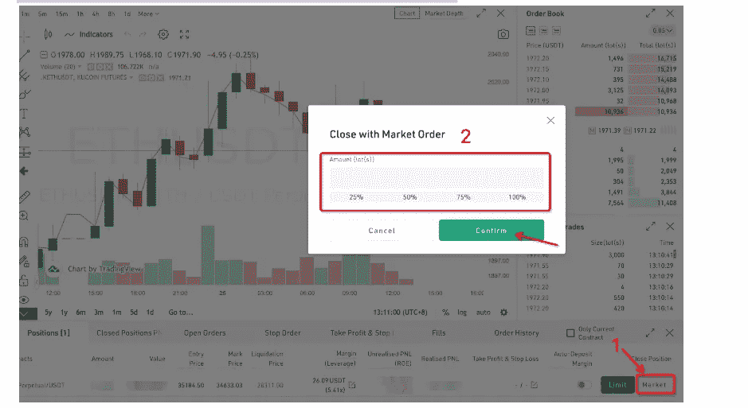

*限价单平仓:*下单您打算平仓的仓位大小&价格并确认，以便平仓。

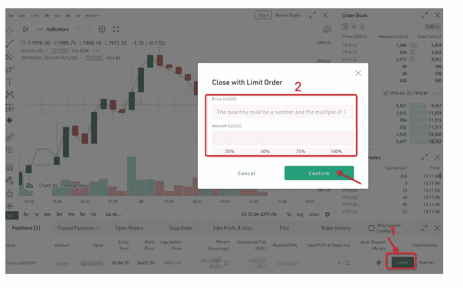

## 结论

期货交易新手？Kucoin 可能是你开始这段旅程的最佳平台。我们肯定会让新手平台的流程变得最简单。通过库币期货交易将交易提升到一个新的水平。

[***在这里打开您的 Kucoin 账户> >***](https://www.kucoin.com/ucenter/signup?rcode=rP1HTX2)

***关联披露:*** *本帖可能包含关联链接* s。

> 交易新手？尝试[加密交易机器人](/coinmonks/crypto-trading-bot-c2ffce8acb2a)或[复制交易](/coinmonks/top-10-crypto-copy-trading-platforms-for-beginners-d0c37c7d698c)