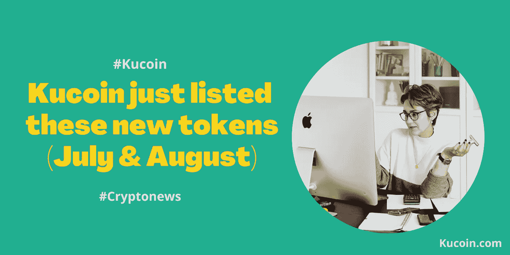

# Kucoin 刚刚列出了新的代币(7 月和 8 月)

> 原文：<https://medium.com/coinmonks/kucoin-just-listed-new-tokens-july-august-8c44def32442?source=collection_archive---------16----------------------->

*加密新闻:库科恩刚刚升级了一些新代币*

Kucoin 是目前在 Altcoin 领域掀起波澜的加密交换平台。被称为“*人民交易所*”的库币因其相当低的交易费用而闻名。它的本土硬币 KCS 赋予了这个平台在 [**密码市场**](https://www.kucoin.com/markets) 的终极杠杆。

作为霍德勒，谁不想从库科恩的利润中分得 50%呢？说到打破僵局。

嗯，Kucoin 总是热衷于“*紧跟潮流*”，他们刚刚在 7 月和 8 月上市了几款新代币。但首先要做的是。*您为什么想在 Kucoin 加密交易所购买/投资这些代币？*

***下面是几个原因:***

1.  Kucoin 是排名第一的 Altcoin 交易所，拥有超过 700+的资产和 1200 个交易对。此外，一些加密宝石，如 KMA，布洛克，道，CHMB 和虚拟现实已经在库币上市。
2.  Kucoin 提供现货交易、P2P 交易、保证金交易、赌注、期货交易和贷款，面向全球超过 207 个国家的 2000 万用户。
3.  Kucoin 包括所有类别的投资者，因此吸引了更多的观众。
4.  根据 CoinGecko 和 CoinMarketCap 的数据，Kucoin 是排名前五的加密交易所之一。

## 7 月和 8 月新上市的代币

1.  **开放杠杆**——这种无需许可的保证金和贷款交易协议使交易者能够以安全有效的方式在 DEX 上做多或做空任何交易对。因此，任何人都有能力创建贷款池，以支持 dex 上具有流动性池的特定令牌对的保证金交易。

该令牌目前在 KCC 联邦理工学院和 BNB 连锁店使用。

*   总供应量:10 亿奥莱
*   市值:230 万美元
*   发行价格:0.05 元
*   交易时间:2022 年 7 月 7 日

**2。邪教道(CULT)** -这是一种分散的投资道，使其持有者能够对其邪教进行投资，以便参与选择由前 50 名投资者*(也称为监护人)提出的投资项目。*

监护人可以提供建议，但是，他们没有足够的权力对其进行投票。因此，他们不得不依靠前 50 名利益相关者之外的实体来批准/拒绝提案。

CULT 的本质是授权和资助贡献者参与建设一个分散的未来。

总供应量:6 666 666 666 666 邪教

市值:43702782 美元

发行价格:0.00000025 美元

交易时间:2022 年 7 月 8 日

**3。利多** -利多；以太坊上的一个液体赌注解决方案，通常给用户一个机会去赌他们的 Eth，而不需要有最低存款。这都是在参加链上活动的时候。

LDO 是一个 ERC20 令牌，本质上提供了丽都道的治理权。lido DAO 负责一组液体打桩协议，确定关键参数，并执行协议升级以确保有效性和稳定性。LDO 代币持有者在丽都岛内享有投票权。

总供应量:10 亿 LDO

市值:174，206，147 美元

交易时间:2022 年 7 月 8 日

**4。邦菲达(FIDA** )-邦菲达自诩为索拉纳最早的建造者之一。它努力展示在最强大的区块链能取得什么样的成就。

总供应量:10 亿 FIDA

市值:22，418，991 美元

发行价格:0.1 元

交易时间:2022 年 7 月 22 日

**5。袋熊** -袋熊作为一个 Web 3 游戏平台脱颖而出，为玩家提供了一个体验 Web 3 游戏的互动平台。它为游戏玩家提供了一个“*一站式商店*”应用程序来发现和玩高质量的 Web 3.0 游戏，并与所有其他主要区块链的 NFT 链接。

袋熊通过在两个世界提供最流畅的体验，带来了 Web 2 和 Web 3 的优点。

总供应量:100 亿只袋熊

市值:100.8 万美元

发行价格:0.006 美元

交易时间:2022 年 7 月 29 日

**6。起源美元治理(OGV)**——OGV 恰好是你钱包里第一个稳定的硬币。OGV 充当 Origin Dollar (OUSD)的治理和价值累积令牌。

*   总供应量:4,035,935,258 OGV
*   市值:2343639 美元
*   交易时间:2022 年 7 月 29 日

**7。希拜克** -由 NFT 拜克支持，希拜克属于分数令牌。1 HiBAYC 代表在 Fracton 协议上部署的链上 BAYC 元交换池中的 1/1，000，000 个 BAYC。

流通中的 HiBAYC 的供应量等于总供应量，并根据 BAYC 元交换池中的实际 BAYC 量，由公共地址跟踪。用户可以随时从 Fracton 协议中自由赎回 BAYC。

*   总供应量:600 万 HIBAYC
*   交易时间:2022 年 7 月 29 日

**8。HIPUNKS** - HIPUNKS 由 CryptoPunks NFT 支持，是一个分数代币。

1 HIPUNK 代表部署在 Fracton 协议上的链上元交换池中的 1/1，000，000 个 CryptoPunk。

流通中的 HIPUNK 的供应量等于总供应量，并根据元交换池中的实际密码朋克数量，由公共地址跟踪。

*   总供应量:600 万希庞克
*   交易时间:2022 年 8 月 5 日

**9。Fracton 协议(FT)-** Fracton 协议旨在通过投票治理开发一个无许可的未来，Fracton 令牌持有者在其中扮演着关键角色。《金融时报》从 NFT 收藏品中获得金融特性，方法是细分 NFT，并增强 NFT 市场的流动性。

*   总供应量:1 亿英尺
*   发行价格:0.2 美元
*   交易时间:2022 年 8 月 11 日

10。这是一只新的 NFT ETF，由 Fracton 协议提供支持。这是一个 ERC-20 令牌，代表 Fracton 协议中一个 4 位数 ENS 的 1/1000000。

*   总供应量:1.27 亿先令 4
*   交易时间:2022 年 8 月 18 日

**11。EVERY GAME (EGAME)** - EGAME 源自三星游戏，是一个区块链和游戏平台，通常发布、销售和购买提供各种使用环境(如元宇宙)的 NFT。

*   总供应量:100 亿美元
*   市值:1548449 美元
*   发行价格:0.002 美元
*   交易时间:2022 年 8 月 18 日

**12。step watch(step watch)-**step watch 需要一个 WEB 3 健身和一个健康跟踪移动应用程序，其中包括具有社交网络特性的 NFT 移动支付。用户本质上是通过散步和慢跑获得奖励。你需要一块免费手表才能参加。

*   总供应量:500，000，000 表
*   市值:1010444 美元
*   发行价格:0.03 元
*   交易时间:2022 年 8 月 22 日

## 结论

如果你总是在寻找下一个加密宝石，那么 Kucoin 就是你要去的地方。该平台在列出具有巨大潜力的新加密项目方面表现突出。Web 3.0 已经到来，Kucoin 已经很容易适应这个领域，并可能主宰这个利基市场。未来肯定是大的，Kucoin 就是为了它来的。

[***Kucoin>>***](https://www.kucoin.com/ucenter/signup?rcode=rP1HTX2)

*(Kucoin 在有限的时间内为期货和保证金部分的新用户提供了一些丰厚的奖金)*

**免责声明**:本文仅用于教育目的，不应理解为投资建议。

***关联披露:*** *本帖可能包含关联链接* s

> 交易新手？尝试[加密交易机器人](/coinmonks/crypto-trading-bot-c2ffce8acb2a)或[复制交易](/coinmonks/top-10-crypto-copy-trading-platforms-for-beginners-d0c37c7d698c)