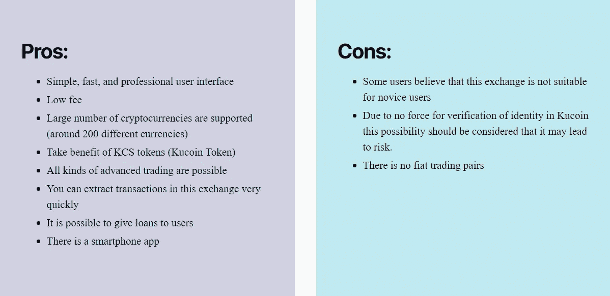

# 库科恩评论

> 原文：<https://medium.com/coinmonks/kucoin-review-b461925b618c?source=collection_archive---------55----------------------->

**Kucoin** exchange 是加密货币领域的领先交易所之一，拥有大量用户和极高的日均交易量。2017 年 9 月，为了在加密货币的广阔世界里大放异彩，Kucoin 交易所成立；这个声誉卓著、广受欢迎的交易所特别关注专门针对加密货币研究的项目。

该交易所是最可靠的交易平台之一，拥有最先进的软件设施，可兑换 200 多种不同的加密货币。

该交易所的平台受益于用户友好的界面，不同群体的经验丰富的交易者和新手可以很容易地与之合作。

目前，Kucoin 拥有来自 100 个不同国家的加密货币交易用户和爱好者。一个简单、快速、专业的用户界面，加上及时的支持和许多其他独特的功能，使这一交换从其他活跃的平台中脱颖而出。

**Kucoin 优点&缺点**

**库币交易类型**

在 Kucoin exchange 中，用户可以用四种不同的方式进行交易，在这方面，对每种方式的工作方法进行了解释:

1.  **限价单**

限价单或限价单是库币交易所的一种独家交易，你可能会对它的机制感到惊讶。在限价单中，您可以输入一个特定的价格，当价格达到您输入的数字时，订单就会完成。

**2。市场订单**

库币交易所的另一个独家交易叫做市价单或市价单。用户通常使用此订单来快速注册他们的交易。通过使用这类订单的功能，您可以自动选择不同加密货币的最佳价格；自动搜索这些价格的任务由 Kucoin 交换系统负责。

**3。止损限价单**

为了完成库币交易所的交易训练，有必要检查止损限价单。Kucoin exchange 中的这种订单是最受欢迎的功能之一，即使在非个人条件下，交易者也可以依赖它来进行交易。作为止损限价单的交易者，你可以避免损失，实现更多的盈利。

**4。停止市场订单**

或者说市场的止损，就是用户在所需货币价格通过某一点的瞬间，可以自动停止交易订单。

**库币交易费用**

选择加密货币交易所时要考虑的最重要的事情之一是费用的多少。幸运的是，Kucoin 的收费结构非常简单。交易双方期望的库币费用等于 0.1%。

在 Kucoin 的存款操作是完全免费的，但要在这个交易所提取加密货币，必须支付一定的费用。有趣的是，取款功能的美元价值取决于您想要的账户中资产的当前市场价格。

当然，这个交流把用户分成了 12 个等级。Kucoin exchange 中有三个用户分类标准，分别是:

最近一个月持有的 KCS 代币的最小数量

上个月基于比特币的现货交易价值

上个月基于比特币的期货交易价值

根据上述标准，用户被分为 12 个级别，每个级别的交易费用不同。在下表中，您可以看到 Kucoin exchange 中有关交易费用的完整信息。值得一提的是，如果每个用户只有右起第二至第四列所列条件中的一项，则认为是在级别中。

**库币服务**

*   库币交易所是目前全球第五家加密货币交易所。
*   这个交易所和币安一样，有自己的加密货币 Kucoin Token (KCS)，可以用来节省交易费用。
*   Kucoin 交易所的流动资金量很大，这对用户来说是一个很大的优势，可以使他们的资本更具流动性。
*   该交易所支持市场上 600 多种加密货币。
*   全球 200 多个国家的 1000 多万用户使用 Kucoin exchange。
*   这种交换的用户界面非常简单和用户友好。
*   网站上有在线问答服务，实时回答用户的问题。
*   与其他知名交易所相比，它收取的交易费用较低。
*   Exchange 服务每周 7 天、每天 24 小时为用户提供服务。
*   用户不需要身份验证就可以访问 exchange 服务。
*   在这种交易所中，可以直接相互交易加密货币。
*   在这个交易所中，用户可以使用期货、现货和保证金等各种交易功能。
*   该交易所的移动应用程序也向用户提供与其网站相同的功能。

**库币安全**

*   KuCoin 声称全球四分之一的密码交易商都在使用它，这使得它很容易成为网络攻击的潜在目标。市场上众所周知的加密货币交易所被认为更安全；因此，最重要的是，KuCoin 要把自己打造成这个领域最引人注目、最值得信赖的平台之一。

> 交易新手？试试[密码交易机器人](/coinmonks/crypto-trading-bot-c2ffce8acb2a)或[复制交易](/coinmonks/top-10-crypto-copy-trading-platforms-for-beginners-d0c37c7d698c)