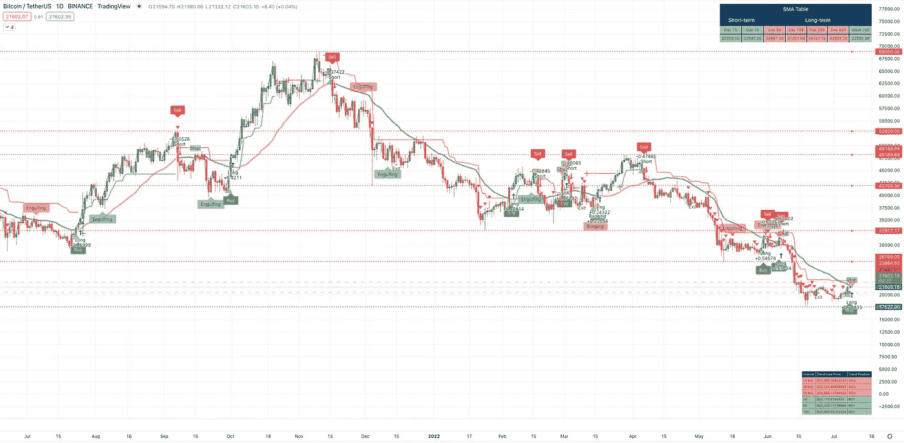
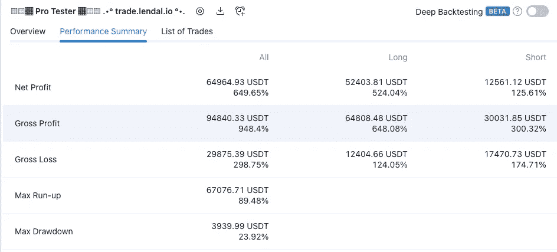

# lξNDAL 专业交易员测试计划启动

> 原文：<https://medium.com/coinmonks/l%CE%BEndal-pro-trader-beta-program-launches-68b91d2b36d?source=collection_archive---------4----------------------->

*The LΞNDAL Pro Trader (not all features are displayed)*

***lξNDAL 职业交易员测试版程序来了！*** 通过您的参与，我们知道您可以帮助我们成功发布 lξNDAL Pro Trader。我们将在最终版本中使用您的错误报告、功能增强请求、可用性反馈以及整体产品和社区设置反馈来改进我们的产品。关于如何加入测试程序的信息包含在本文中。

# 什么是 lξNDAL 专业交易员？

lξNDAL 专业交易员是趋势预测软件，专为 TradingView.com 图表系统打造。该软件提供了帮助您了解股票资产、加密货币资产或其他类型资产的市场趋势是看涨还是看跌的见解。这让你可以考虑在期货市场买入、卖出或做多或做空某项资产。

lξNDAL 专业交易者是专业的趋势预测软件，专为严肃的交易者设计。lξNDAL 专业交易者有盈利结果的跟踪记录，回溯测试持续显示每个测试资产的盈利能力。该软件是高度可配置的，并带有自己的回溯测试套件，以确保您生成更有可能产生有利可图的结果的伟大配置。

*Backtest Results Jul ’21 to Jull ‘22 Bitcoin with $10,000 USD principle*

**想加入 lξNDAL 发布会吗？**我们将在发布我们的 Discord、网站和新网页时通知您。

— **订阅于**[https://alerts . lendalpro . trade](https://alerts.lendalpro.trade)

# 我能拿到测试版的东西吗？

lξNDAL 正在寻求您对产品的反馈，如果您有任何意见，我们希望您能就我们的定价、面向服务的订阅、网站材料、营销内容和产品文档提供反馈。测试参与者如果**合理地**积极审查产品并提交任何类型的反馈、错误、功能增强或可用性反馈，将获得免费的终身许可 NFT。只要您尽了合理的努力参与，一旦您被接受为测试版参与者，您将获得参与的好处。这些参与者还将获得一个免费的为期一年的 lξNDAL 大师订阅时，lξNDAL 专业交易员终身许可证 NFT 铸造。随着公开发售的临近，我们将发布更多关于 lξNDAL 大师项目的信息。

测试版参与者必须在计划中途被验证为合法的测试版参与者，才有资格成为测试版参与者。这要求测试参与者积极参与帮助测试软件并提供反馈。我们只允许 20 名参与者加入这个项目。测试版参与者可能会因不参与或任何原因被替换，由 lξNDAL 自行决定。

> 交易新手？试试[加密交易机器人](/coinmonks/crypto-trading-bot-c2ffce8acb2a)或者[复制交易](/coinmonks/top-10-crypto-copy-trading-platforms-for-beginners-d0c37c7d698c)

# 我如何成为一名测试者？

—您是否满足下面描述的软件要求？

你是一个会使用 NDAL 专业交易者的人吗？

如果是，请在[**https://beta . lendalpro . trade**](https://beta.lendalpro.trade)填写申请表

别担心，我们既在寻找有经验的人，也在寻找没有经验的人。

请注意，入职培训网络研讨会将以小组形式进行，向主讲人提问。我们尝试为测试人员提供私人礼宾入职体验，这样我们可以最大限度地获得成功。使用您的摄像头和麦克风是可选的，不需要任何身份。

一旦我们加入您，我们将通过电子邮件发送确认，并提供额外的信息，以帮助您成功参与测试。

**—测试计划仅限 20 名测试参与者。**

# 谁使用 lξNDAL 专业交易员？

lξNDAL 专业交易员的主要用户是:

—希望交易 TradingView.com 上任何可用资产或市场数据的交易者。资产包括股票、加密货币等等。

—在进行短期和中期交易的实时交易时需要交易指标的交易者。

—希望使用机器人自动交易的交易者，这些机器人可以连接到交易所 API，并根据 TradingView 发送的命令进行交易。

—根据持牌金融顾问的意见和建议进行交易的交易员

# l NDAL 专业交易商许可证转售

lξNDAL 专业交易员执照是使用多边形区块链上的 NFT 技术验证的。除了合作伙伴许可证，lξNDAL 专业交易员 NFT 许可证完全可转售。使用 NFTs 作为许可证意味着当你不再需要使用它时，你可以在像 X2Y2、LooksRare 和 OpenSea 这样的交易所出售你的许可证。

# l NDAL 专业交易员许可证

任何 lξNDAL 专业交易员执照的持有人将获得以下:

—许可和访问使用 lξNDAL 专业交易员套件中的几个指标，该套件包含帮助交易员在多种交易策略、市场类型和资产上获利的功能

—获得使用策略指示器的许可和访问权，使您能够回测您的配置以获得更好的结果

—许可和访问预配置为与 lξNDAL 专业交易者指标一起使用的 bot 指令模板，这样您就可以在睡觉时进行交易

—作为有效的 NFT 驾照持有者，您可以提升进入 NDAL 社区的权限。该社区的特点是报告各种资产机会的机器人，来自我们阿尔法委员会的代表报告我们交易和阿尔法小组的机会，社区成员分享他们的阿尔法。同时，我们发布该领域的新盈利机会或新趋势，以在加密货币和 NFT 领域的任何地方进行投资。我们的社区分享了赚取更多损失更少的方法。

—(仅限 Genesis)免费使用 lξNDAL 大师赛，这是我们独家提供的基于订阅的盈利性礼宾服务。

lξNDAL 专业交易员套件许可证有三种配置:

lξNDAL 创世纪﹍这是我们的终身许可证——使用 lξNDAL 专业交易员套件没有经常性费用。终身许可也允许您使用 lξNDAL 将来发布的所有非计量产品。因为 lξNDAL 是创业工作室，未来会有很多 web3 的产品。lξNDAL Genesis 为持有人提供所有未来 lξNDAL 专业交易员套件更新，并提供免费的电子邮件和实时聊天产品支持，以解决限制可用性的问题，回答如何操作的问题，或帮助理解文档(或缺乏文档)。该许可证还提供了进入私人 NDAL 社区禁区的高架通道，以及免费进入 NDAL 大师赛的通道。

lξNDAL 创世纪在造币日的发行量为 1597 枚，每月将有一枚创世纪 NFT 被铸造给 lξNDAL 堆栈中的一名幸运持有者，这是我们的奖励系统。下一节将介绍多年来如何利用供应来获得回报，同时保持所有 lξNDAL Genesis 销售集中在二级市场。

**2—NDAL 动量**﹍NDAL 专业交易员套件通过我们基于订阅的 NFT 许可进行授权，名为 lξNDAL 动量。有一个月订阅价格，长期订阅有折扣。Momentum 许可证提供免费的电子邮件或实时聊天产品支持。该许可证还提供了进入 NDAL 私人社区的高架通道。随着 NFT 许可证到期，可以通过给许可证添加更多时间来恢复势头。到期时，动量 NFT 会在宽限期结束后自动烧录。区块链禁止在到期日 15 天内销售和转让动量 NFT。动量 NFT 的元数据包含许可的到期日期。当 Momentum 许可在宽限期后过期时，对产品的访问、提升的社区访问和 lξNDAL 大师赛将被拒绝。一旦 NFT 被烧毁，必须创造一个新的 NFT 势头来激活许可证的好处，并重新获得更高的社区地位。lξNDAL 社区排名可能会因为 Momentum 许可证被烧毁而丢失，因为您的社区排名与铸造的特定令牌 ID 相关联。

lξNDAL 将在 1597 台铸造完成后获得剩余的 lξNDAL Genesis NFT，并分配 20 台给 beta 测试者作为奖励，10 台给我们进行的有限预售的参与者。相比之下，我们的 lξNDAL 堆栈奖励系统将每月铸造一个创世纪 NFT，其中一个幸运的动量 NFT 持有者将升级到创世纪，作为使用 lξNDAL 专业交易者的奖励。持有动量 NFT 许可证可以提名他们的 NFT 每个奖励时代。NDAL·斯塔克斯有机会获得 NDAL·创世纪·NFT 作为奖励，此外每个人都可以获得 NDAL 浪涌令牌作为奖励。未来将提供更多关于 NDAL 浪涌的信息。

**3—lξNDAL 罢工**﹍lξNDAL 与能够通过罢工 NFT 许可证访问社区和使用 lξNDAL 专业交易员套件的合作伙伴合作。合作伙伴将获得由 NDAL 和合作伙伴共同商定的罢工许可分配。“NFT 罢工”许可证类似于“NDAL 创世”的终身许可证利益，但不包括“NDAL 创世”的确切利益。此外，只有当合伙人符合合伙企业的资格标准时，NDAL 罢工才有效。如果合作伙伴不再有资格获得 lξNDAL 罢工福利，则相关 NFT 的许可证将被吊销。由合作伙伴决定如何在其社区中分发许可证。

罢工许可证分配给特定的合作伙伴 NFT 令牌 ID，而优惠不能分配给不同的令牌 ID。当合作伙伴授予罢工许可时，用户在 lξNDAL 造币厂页面上签署钱包请求，以接收他们的 lξNDAL 罢工许可。lξNDAL 系统向能够证明他们是特定合作伙伴 NFT 的所有者的任何人分配合作伙伴期限永久许可证。通过这种方式，lξNDAL Pro Trader 权益将随着合作伙伴 NFT 将来从一个所有者到另一个所有者的任何转移而继续，并且对于该特定合作伙伴 NFT 而言，仍是半永久权益。一旦 NDAL 打击被编码到搭档 NFT 中，它就不能被分配到不同的 NFT。这种编码意味着不可能将 lξNDAL 罢工许可证与原始合作伙伴 NFT 分开。

合作伙伴的主要 NFT 或主要产品必须保持最低底价，才能继续成为 NDAL 生态系统中的合作伙伴，或者，合作伙伴必须为其社区支付一次性折扣批量许可费用。只要有可能，我们都会与合作伙伴合作，接受 lξNDAL Surge token 作为其生态系统内特定产品和服务的一种支付形式。

电子邮件和实时聊天支持**不是**提供给罢工许可证持有者。然而，罢工许可用户已提升了对 NDAL 社区的访问权限，因此他们可以获得 NDAL 社区的福利。一些通常提供给 NDAL 创世纪和 NFT 动量许可证持有者的社区频道不可用于罢工用户，除非他们订阅了 NDAL 大师。

# lξNDAL 专业交易员套件系统要求

使用软件需要满足以下系统、供应商和访问要求:

—能够进行现代网络浏览的宽带互联网连接、计算机和网络浏览器

—trading view“Pro+”订阅(起价 24.95 美元/月)或可选的 trading view“Premium”订阅

—通过 TradingView 桌面应用程序或桌面浏览器版本运行回溯测试的桌面计算机

—基于软件或硬件的加密货币钱包，与以太坊和多边形区块链兼容

—以太坊或多边形加密货币账户

—如果使用机器人进行交易，则使用文本编辑器来编辑机器人指令模板

—如果使用机器人进行交易，则是与用户希望通过其进行交易的所需资产交易所兼容的机器人服务(如 Alertatron)

要使用 lξNDAL 专业交易员套件，您需要拥有 TradingView 的有效订阅。根据您的交易视图订阅，它将提供不同级别的实用程序，帮助缩小 lξNDAL 专业交易者的最佳配置。我们建议订阅“Premium”以获得最佳回溯测试结果。不过，如果你订阅了 lξNDAL 大师赛，你可以使用 trading view“Pro+”计划。

lξNDAL 专业交易员套件包含几个指标产品，以帮助您交易。但是，该套件的两个主要元素是:

1—lξNDAL Pro**测试仪**

2—lξNDAL 专业版**交易员**

NDAL 专业测试者是一个交易观点策略，NDAL 专业交易者是一个交易观点指标。不同之处在于，您使用策略来确定最佳配置，该配置是基于已加载资产的策略选项卡中的回溯测试结果。该指标在图表上用于根据市场数据做出实时交易决策。使用 lξNDAL 专业交易员只需两个简单的步骤:

—首先，从图表顶部的“指示器”选择器加载测试仪后，在图表底部的“策略”选项卡中测试 lξNDAL 专业测试仪的各种配置。

—第二，您将 lξNDAL 专业测试器的最佳配置应用到 lξNDAL 专业交易器，使用实时图表数据进行实时交易决策。

# lξNDAL Pro Trader Bot 配置

对于 lξNDAL 专业交易者来说，使用机器人进行交易是完全可选的。lξNDAL 专业交易员旨在帮助您根据实时市场数据做出实时交易决策。我们还打算通过 bot 自动化使其产生积极的回报。

一般来说，交易是有风险的。机器人交易的风险更大，尤其是如果你错误地配置了你的机器人。在实施任何交易机器人之前，请咨询持牌交易商。Bot 交易是为更有经验的用户提供的，他们对自己的交易设置充满信心。机器人命令是一种教育工具，向用户展示如何使用像 Alertatron 这样的机器人平台来设置 lξNDAL 专业交易者自动交易趋势。我们的机器人命令没有一个是用来利用或实现的。使用它们需要您自担风险。

lξNDAL 专业交易员配备了预定义的交易策略，这些策略被写入简单的机器人命令中，可以复制并粘贴到 TradingView 警报中，并作为 webhook 发送给机器人服务提供商，以便机器人可以自动交易。Alertatron 是我们首选的 bot 供应商，我们所有的 bot 示例和产品支持都旨在使用 Alertatron 服务。然而，如果你喜欢不同的机器人供应商，我们很乐意为 lξNDAL 大师赛的订户提供同行评审。

Alertatron 支持几种(但不是全部)流行的交换。每个 bot 供应商都支持选择交换。受支持的主要交易所是币安。虽然我们使用并推荐 Alertatron，但是您可以为您选择的 bot 供应商制作 bot 说明。

机器人会赔钱，所以进行彻底的测试很重要，不要在超过 10-100 美元的账户中进行测试交易。我们的文档将帮助用户设置机器人，并提供最佳实践的教育建议。

# 项目信息

下面，你会找到关于我们项目的官方链接和信息，这样你就可以在将来使用它。在缺乏实时资源的情况下，我们利用我们的网站子域名作为占位符，以便您可以在未来使用它们，并确保您访问正确的资源。

**官方推特:** @LENDALPro

Twitter 网址将始终可用:
[https://Twitter . lendalpro . trade](https://twitter.lendalpro.trade)**(结尾为。贸易)**

**官网:** [https://lendalpro . trade](https://lendalpro.trade)(结尾为。贸易)

我们的网站尚未发布。在域名发布之前，我们的域名将重定向至谷歌主页。任何其他网站域名都不是官方网站域名，除非发布在我们的官方 Twitter 个人资料和 Discord 服务器上。

**官方不和:** [https://Discord . lendalpro . trade](https://discord.lendalpro.trade)(结尾为。贸易)

我们的不和已经结束，但很快就会开始。目前，该网址重定向到谷歌。打开 Discord，链接会打开实际的 Discord 服务器。任何其他不和谐链接都不是官方链接，除非发布在我们的官方网站、官方 Twitter 个人资料和官方媒体出版商账户文章上。

lξNDAL 创业工作室尚未公开推出。届时，它将在 [https://lendal.io](https://lendal.io) 上发布。**(结尾在。io)** 保存链接以备将来使用。不要被假网站骗了。

我们的网址都不会改变。对不同的网址保持怀疑。

我们的路线图将在公开造币厂推出前不久发布。

未来的公告将发布在我们的 Twitter 上，以及这个媒体发布者帐户上。一旦我们的网站和 Discord 可用，信息通常会在所有四个位置发布，以确保您可以验证这些信息。

我们永远不会做秘密造币厂。我们的造币厂会提前规划和公布。高度怀疑任何人声称薄荷是积极的，你赢得了一些东西，或者你需要用你的钱包做一些事情。我们绝不会向您发送您没有向 NDAL 申请的链接或请求。

我们采取极端措施来确保我们的系统是安全的，但这并不是万无一失的。不幸的是，即使是最安全的系统也可能受到威胁。**始终**检查以确保您的信息与您在我们的网站、Discord、Medium 文章、ama 和其他内容领域的发现一致。即使信息看起来来自 NDAL，你也必须核实信息。不被骗是你的责任。我们不会仓促行事，也不会只依赖一个信息来源，以防它被泄露。总会有足够的时间来核实你的消息来源。至少从三个来源核实你的信息。

我们将尽最大努力确保信息发布在官方网站上，让您有足够的时间来验证信息的正确性。期望是你会履行你的尽职调查，即使信息来源似乎没有妥协。同样，我们不会做出任何突然宣布、秘密薄荷糖、要求您使用钱包的自发赠品或任何其他要求您使用钱包的事情。任何时候你使用你的钱包，验证你是在正确的网址和你正在互动的区块链合同是在销售之前张贴的正式合同。

**我们会在造币前公布我们的合同地址，这样你可以检查合同。**

# 放弃

lξNDAL 专业交易者和本文仅供教育使用，不应被视为金融建议。

通过查看任何材料或使用本文中的信息，您同意这是普通教育材料，并且您不会让任何个人或实体对由 lξNDAL 提供的内容或普通信息造成的损失或损害负责。

交易有风险。你必须意识到风险，并愿意承担任何程度的风险投资于金融市场。过去的表现不一定代表未来的结果。本文以及与本文相关的所有个人和实体对您的交易结果或投资不承担任何责任。我们相信交易信息是可靠的，但我们不保证其完整性或准确性。

此外，我们的合作伙伴或附属公司与本文提供的专有信息没有任何关系。

lξNDAL 不对本文所含信息的准确性方面的任何错误或遗漏承担任何责任。lξNDAL 建议读者和用户在买卖证券之前向独立的财务顾问寻求建议。