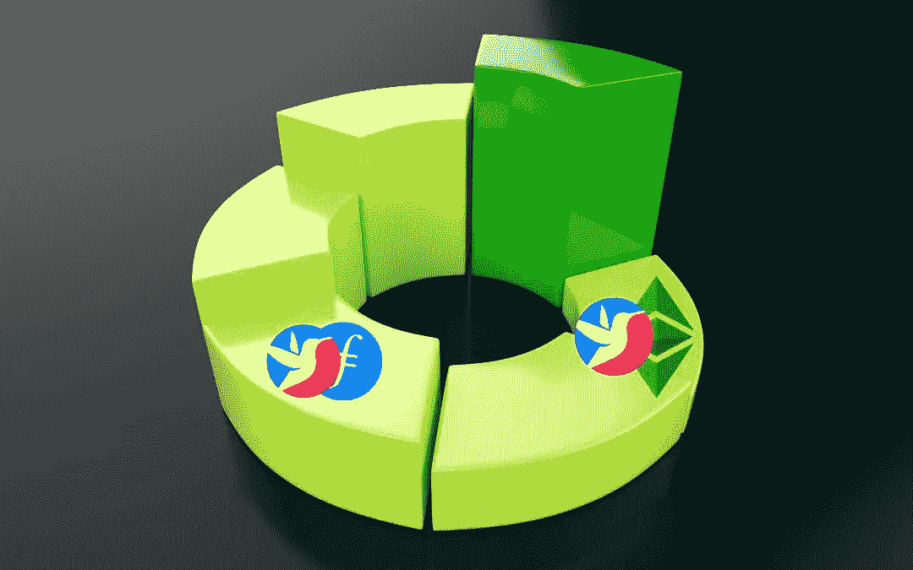

# 最新 biswap double launchpools |从一个赌注中赢取 2 个代币

> 原文：<https://medium.com/coinmonks/latest-biswap-double-launchpools-earn-2-tokens-from-one-stake-2aec739251a1?source=collection_archive---------29----------------------->

Biswap double launchpools

在我之前的文章中，我与你分享了 Biswap 上的 [4 个被动收入机会，你可以利用这些机会在睡觉的时候增加你的钱。](https://cryptosorted.info/passive-income-opportunities-on-biswap/)

其中之一是他们的 double launchpools，允许您下注您的 [Biswap](https://biswap.org?ref=e1c115c1b7975b28a3db) (BSW)代币，以赚取更多的 BSW 加其他高级代币。

截至 7 月，有 3 个启动池，您可以在其中下注 BSW，以赚取 BSW 加 BNB、阿达或 DOT 的丰厚年利率。

本月(2022 年 8 月)新增了两个 double launchpools，让您有更多机会赢取大奖。

这些新代币是什么，是什么让它们变得有趣？

这就是我们将在本文中讨论的内容。

但是首先…

# 关于 Biswap double launchpools 需要了解的 4 件重要事情

在我们开始讨论 Biswap 上的 double launchpools 之前，有几件重要的事情你必须先知道:

1.  [Biswap double launchpools](https://biswap.org/pools/stake_bsw?ref=e1c115c1b7975b28a3db) 是专为那些把 BSW 押在持有者池(HP)的人准备的。每个 double launchpool 都有最低金额的 BSW，你必须在 HP 中下注才有资格参加。目前，所有可用池的最小赌注是 HP 中的 500 BSW。
2.  Biswap 使用其营销和战略合作伙伴预算的一部分来购买双重启动池中的第二奖励令牌。BSW 来自块状排放物。
3.  这些双重启动池中的每一个都有一个固定的最大 BSW 金额。目前，您可以在任何可用的资金池中下注多达 1，500 BSW。设置这个限额是为了保证公平，给大家参与的机会。
4.  每个双重启动池都有一个通常为 30 天的终止阻止时间或持续时间。
5.  在这里，时间是至关重要的。如果你想利用双重启动池，你需要尽快行动，尽早进入其中。

说完了，让我们开始吧…

# 新的 Biswap 双启动池

1.  [下注 BSW，赚取 BSW +等](#h_20461506531660197145261)
2.  [入股 BSW，赚取 BSW + FIL](#h_85760769171660197151408)

下面我们逐一讨论。

# 1.下注 BSW，赢取 BSW +等

这个资金池允许您最多下注 1500 BSW，以高达 48%的年利率赢得 BSW 和 ETC

要有资格在这个池中下注，你必须在 BSW 持有者池中下注至少 500 BSW。

截至撰写本文时(2022 年 8 月 11 日)，该池将在大约 22 天后到期。那是 2022 年 9 月 2 日左右。

所以，你要抓紧时间，尽可能早地获得除 BSW 之外的免费 ETC。

## 1.1 什么是 ETC？

[以太坊经典(ETC)](https://www.coingecko.com/en/coins/ethereum-classic) 是 2016 年 7 月一个分叉产生的以太坊原始版本。

这是一个基于工作证明(POW)的智能合同平台，预计在以太坊于 9 月成为利益证明(POS)链后，它将获得更多支持。

ETC 现在很火。

现有的以太坊矿工正在将他们的资源转移到以太坊经典，我不会惊讶地看到在未来几个月链上增加的开发者活动。

# 2.下注 BSW，赢取 BSW + FIL

这个池让你的赌注高达 1，500 BSW，以赚取超过 76%的 BSW 和 FIL

要有资格加入该池，你必须在持有者池中下注至少 500 BSW。

该池的持续时间为 30 天，将在 29 天后到期，即 2022 年 9 月 9 日。

所以，如果你想利用它，你必须尽快行动，尽早进入。

## 2.1 什么是 FIL？

[FIL](https://www.coingecko.com/en/coins/binance-peg-filecoin) 是 Filecoin 的原生令牌，这是一个去中心化的存储网络，任何人都可以在这里出租他们未使用的存储资源。

从而创造了一个全球性的高效数据存储市场，任何人都可以用它来存储数据，而成本只是它的一小部分。

# Biswap 上的旧双启动池

其他双启动池包括:

1.  赌注 BSW 赚取 BSW +点
2.  下注 BSW，赚取 BSW + MATIC
3.  赌注 BSW 赚取 BSW +阿达

这些池与上面讨论的最后两个池具有相同的要求，但是它们很快就会到期。

点池将在 14 天后到期。MATIC 和 ADA 池将分别在 8 天和 2 天后到期。

所以，如果你感兴趣，你仍然可以在 DOT 和 MATIC 关闭之前进入它们的池。

# 用 Biswap 连接

要了解更多信息，请访问或加入 Biswap 社交媒体和当地社区

*   [网站](https://biswap.page/home)
*   [社区](https://biswap.page/community)

此外，查看我的 [Biswap 评论](https://cryptosorted.info/biswap-review/)以全面深入了解该项目的内容。

此外，如果你对 Biswap 充满热情，并希望通过推广该项目获得一些 BSW，那么就加入他们的[太空代理计划](https://biswap.org/space_agents) (SAP)。

例如，这篇文章进入 SAP，就有机会在 BSW 赢得每月高达 2500 美元的奖金。

# 结论

[bis WAP double launch pools](https://biswap.org/pools/stake_bsw?ref=e1c115c1b7975b28a3db)是在不购买代币的情况下向您的投资组合添加新代币的绝佳方式。

这些池中的所有令牌都是你无论如何都想购买和 HODL 的可靠项目，所以通过下注 BSW 免费获得它们很酷。

这里唯一的风险是你增加了对 BSW 的敞口，这也是我正在积累的一个标志，我对此非常乐观。

但是永远记得在投资之前做自己的研究(DYOR)并对任何项目形成自己的观点。

*原载于 2022 年 8 月 11 日*[*https://cryptosorted . info*](https://cryptosorted.info/biswap-double-launchpools/)*。*

> 加入 Coinmonks [电报频道](https://t.me/coincodecap)和 [Youtube 频道](https://www.youtube.com/c/coinmonks/videos)了解加密交易和投资

# 另外，阅读

*   [如何在 FTX 交易所交易期货](https://coincodecap.com/ftx-futures-trading) | [OKEx vs 币安](https://coincodecap.com/okex-vs-binance)
*   [CoinLoan 评论](https://coincodecap.com/coinloan-review) | [YouHodler 评论](/coinmonks/youhodler-4-easy-ways-to-make-money-98969b9689f2) | [BlockFi 评论](https://coincodecap.com/blockfi-review)
*   [XT.COM 评论](https://coincodecap.com/profittradingapp-for-binance)币安评论 |
*   [SmithBot 评论](https://coincodecap.com/smithbot-review) | [4 款最佳免费开源交易机器人](https://coincodecap.com/free-open-source-trading-bots)
*   [比特币基地僵尸程序](/coinmonks/coinbase-bots-ac6359e897f3) | [AscendEX 审查](/coinmonks/ascendex-review-53e829cf75fa) | [OKEx 交易僵尸程序](/coinmonks/okex-trading-bots-234920f61e60)