# 第 1 层生态系统增长深度探讨

> 原文：<https://medium.com/coinmonks/layer-1-ecosystem-growth-deep-dive-1db9a83928c8?source=collection_archive---------14----------------------->

深入探究新兴第一层区块链的相对表现。

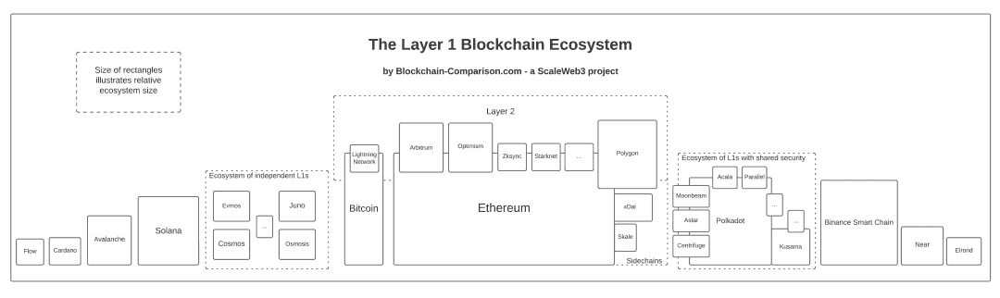

An overview of the layer 1 blockchain ecosystem, [SOURCE](https://blockchain-comparison.com/blockchain-protocols/)

区块链技术彻底改变了我们进行交易和存储数据的方式，现在新一代的第一层区块链正在兴起，以进一步推动这一界限。

这些创新平台正在迎头解决区块链的三难困境，提供闪电般的速度、可扩展的解决方案和低费用来满足日益互联的世界的需求。

根据世界经济论坛的一份报告，据估计，到 2025 年，全球 GDP 的 10%将储存在区块链。这表明了 L1 区块链在不久的将来颠覆和改变各种行业的巨大潜力。

# **什么是 L1 区块链？⛓**

把 L1 区块链想象成一个高速公路系统。正如高速公路系统为车辆从一个地方行驶到另一个地方提供基础设施一样，L1 区块链为其他区块链的运行提供基础设施。正如高速公路系统被各种车辆(包括轿车、卡车和公共汽车)使用一样，L1 区块链也被各种不同类型的区块链使用，包括用于金融交易、供应链管理甚至投票系统的车辆。

这些区块链也称为“第 1 层”区块链，是许多其他区块链的底层基础设施。它们是被称为“第二层”或“L2”区块链的其他区块链的基础。

一系列第一层协议在投资者和行业专家中迅速流行起来。尽管由于性能指标和数据的差异，很难比较区块链协议，但事务、可扩展性、节点和能效等元素有助于评估它们的相对优势。

# 问题:可伸缩性三难💊

可扩展性三难困境，也称为区块链三难困境，是指区块链系统在试图同时实现这三个理想属性时面临的挑战:

1.  **去中心化**指的是权力在网络中许多不同的参与者之间分配，而不是集中在少数人手中。这是区块链技术的一个关键特征，也是它能够抵抗审查和篡改的原因。
2.  **安全性**是指网络的稳健性和抵御攻击和破坏的能力。
3.  **可扩展性**是指网络处理大量事务或数据而不会变得拥塞或变慢的能力。

L1 区块链公司尤其受到影响，因为他们必须平衡分散化、安全性和可伸缩性的需求，以便有效地运行。

例如，增加分散化可能使网络更安全，但也可能降低其可扩展性。类似地，增加可扩展性可以使网络更有效，但也可能降低其安全性或分散性。

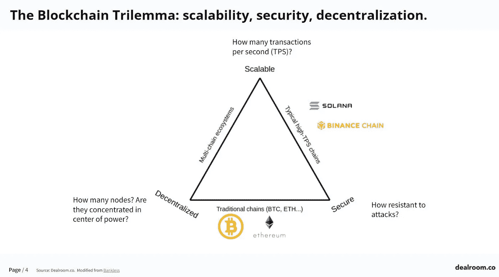

source: cryptostars

# L1·区块链是如何解决这个问题的:

Algorand、Ethereum 和 Solana 都是第 1 层区块链，它们试图以不同的方式解决可伸缩性三难问题。

以下是这些区块链如何应对这一问题的简要概述:

1.  **algrand 的纯利害关系证明(PPos)模型:**algrand 使用利害关系证明共识算法，用户因持有 ALGO 硬币而非采矿而获得[奖励](https://hackernoon.com/algorand-a-novel-incentive-design-and-a-lot-more-randomness)。阿尔格兰德区块链酒店采用了[拜占庭协议](https://www.prismmodelchecker.org/casestudies/byzantine.php)系统，在这个系统中，一群人可以做出决定，即使有些成员可能不可信。这里的假设是，大多数使用区块链的人是诚实的，如果任何人走错了一步，都会对他们持有的资产价值产生负面影响。Algorand 的交易吞吐量很高，每秒钟可以进行 1000 次[交易](https://academy.binance.com/en/glossary/transactions-per-second-tps)，而比特币每秒钟只能进行 5 次交易。
2.  **以太坊的股权证明模型:**以太坊是一个创新的合约平台，多年来实现了各种可扩展性解决方案，包括[分片](https://academy.binance.com/en/glossary/sharding)和[链外交易](https://academy.binance.com/en/glossary/off-chain) s，2022 年 6 月 8 日，以太坊网络成功测试了股权证明(PoS)共识机制，作为工作证明(PoW)的替代方案。
    在 PoS 中，验证者(以前称为矿工)不能处理超过一定限额的交易，该限额由他们下注的硬币数量决定。在一段时间内，押入的硬币不能取出。PoS 比 PoW 更节能，也更不容易受到 51%攻击。以太坊的 PoS 系统还允许使用侧链，侧链是由以太坊供电的独立区块链，可以帮助缓解主以太坊区块链的拥堵，提高其可扩展性。
3.  **Solana 的历史证明(PoH)共识机制:S** olana 是一种区块链，它使用利害关系证明共识算法和称为[“gossip protocol”](https://docs.solana.com/validator/gossip)的独特数据结构来实现快速和可伸缩的事务。gossip 协议允许网络中的节点快速传播新的块和事务，减少达成共识所需的时间，并增加网络的可扩展性。Solana 利用一种称为[“打包事务”](https://docs.solana.com/developing/on-chain-programs/overview#berkeley-packet-filter-bpf)的独特数据结构来最小化节点需要处理和存储的数据量。
    Solana 声称每秒能够处理高达 65，000 笔交易 [(TPS)，](https://docs.solana.com/cluster/performance-metrics#tps)使其成为现存最快的公共区块链之一。

值得注意的是，这些区块链仍在努力完全解决可伸缩性的三难问题，并且随着它们的不断发展，未来可能会面临挑战。

# **让我们从地理增长的角度来比较一下 L1 区块链。**

# 以太坊

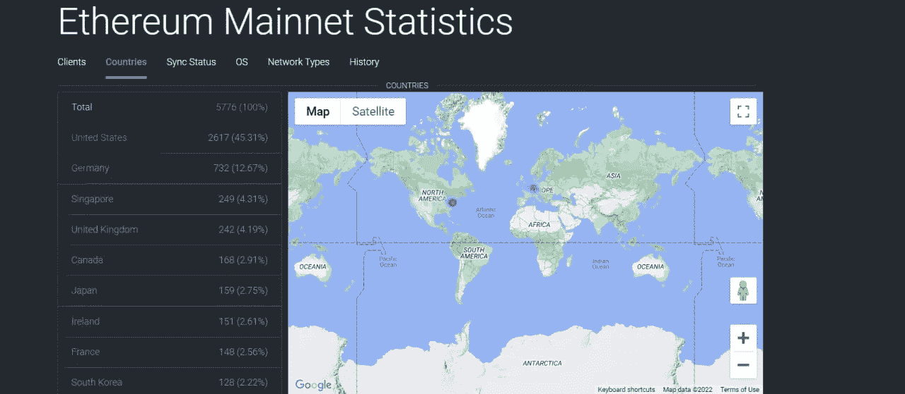

Source: Ethernodes

根据以太坊分析公司(Ethereum analytics)的数据，以太坊钱包地址排名前三的国家是以太坊、美国、德国和新加坡，占总数的近 62.29%。在美国，以太坊有着强大的存在，大量的用户和开发者位于该国。它在英国也获得了很大的吸引力，尤其是在区块链生态系统非常发达的加拿大和日本等国家。

# 索拉纳

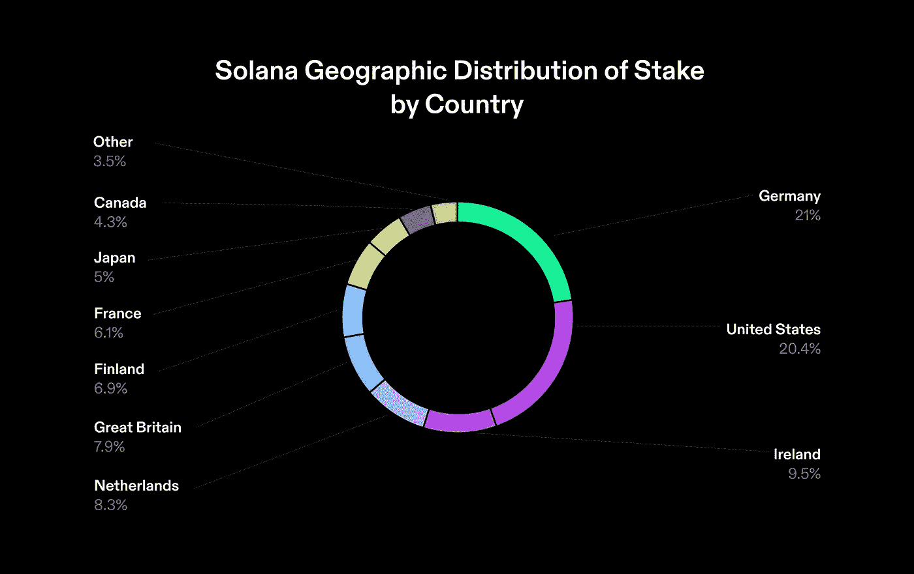

Source: [Solana](https://www.validators.app/data-centers?locale=en&network=mainnet)

根据 Solana analytics 平台的数据，SolanaScan、美国、德国和爱尔兰是 Solana 钱包地址的前三个国家，占总数的近 50.9%。在美国，索拉纳获得了巨大的吸引力，特别是在 DeFi 和 NFT 项目中。它在荷兰也取得了重大进展，在英国拥有大量活跃的用户，在芬兰也有越来越多的用户。

# 阿尔格兰德

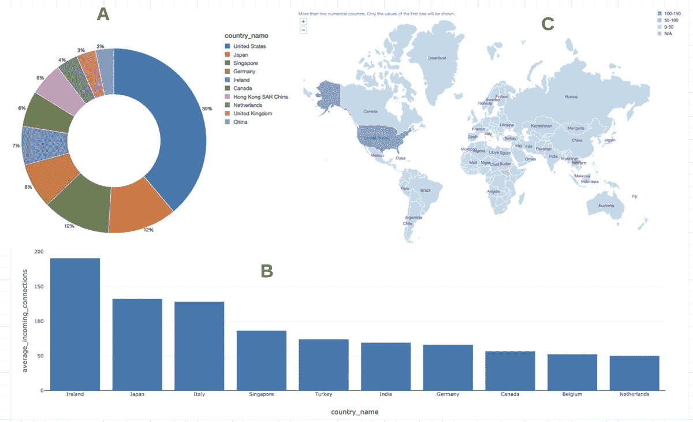

根据 DataBricks 的这份分析报告，Algorand 网络上节点和中继最集中的前 10 个国家主要集中在美国。然而，随着网络的持续增长和扩展，节点和中继的分布很可能会变得更加均匀，就像典型的分散式区块链一样。
传入连接的分布似乎相当均衡，除了爱尔兰、日本和意大利周围的地区，这些地区似乎处于较高的负载下。

# 让我们比较一下 L1 区块链在开发者增长方面的情况。

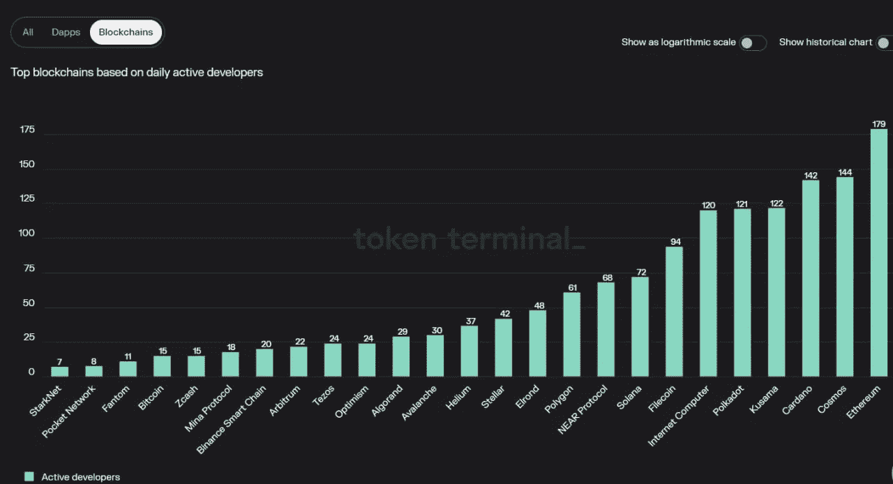

Source: Token Terminal

# 以太坊

以太坊的开发者生态系统自 2015 年成立以来增长显著。它现在是构建分散式应用程序(DApps)最流行的平台之一，拥有一个庞大而活跃的开发人员社区。

1.  在合并后的两周内，智能合同部署增加了 14%。
2.  尽管以太坊价格下跌了 62%，但智能合约的部署却创下了历史新高，增长了 40%。
3.  9 月，开发人员向块浏览器 Etherscan 提交了创纪录的 17，376 份智能合同，表明对分散协议的兴趣同比增长了 160%。

# 索拉纳

Solana 是一个第一层智能合同平台，它利用了 Rust 编程语言。2022 年第三季度，Alchemy 开始支持 Solana 开发者。从那以后，致力于 Solana 的活跃开发团队的数量同比增长了 1000%,而 API 的消耗量年初至今增长了 500%。

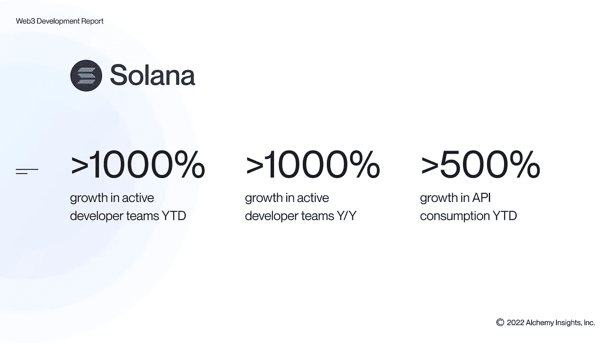

**这里是数字:**

*   年初至今，活跃的开发团队增长超过 1000%
*   活跃开发团队的年增长率超过 1000%
*   年初至今，API 消耗量增长超过 500%

# 阿尔格兰德

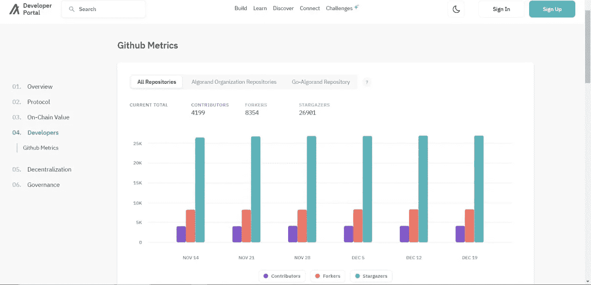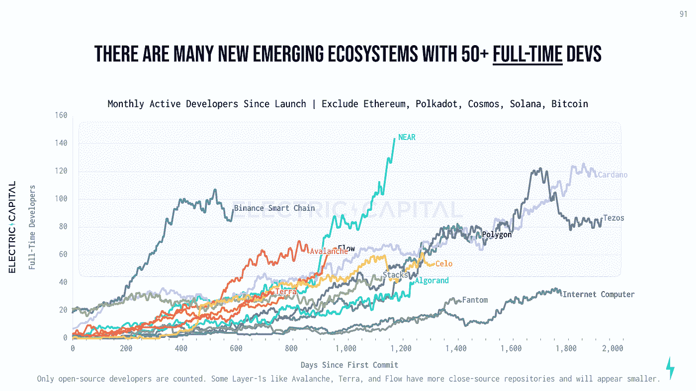

我看到的研究表明，在阿尔格兰德每月大约有 1500 名活跃的开发人员。

大多数网络的总开发人员(已经尝试过该网络)与每月活跃开发人员之间存在大约 10 倍的差距。

Algorand 报告称，迄今为止共有 15，000 名开发人员。algrand 开发人员门户网站提供了大量关于如何开始使用 algrand 的信息，包括关于 algrand 区块链及其各种组件的文档，以及大量面向开发人员的资源，如代码示例、开发人员工具和社区资源。

# L1·区块链在 2022 年的重大胜利和挑战

# 以太坊

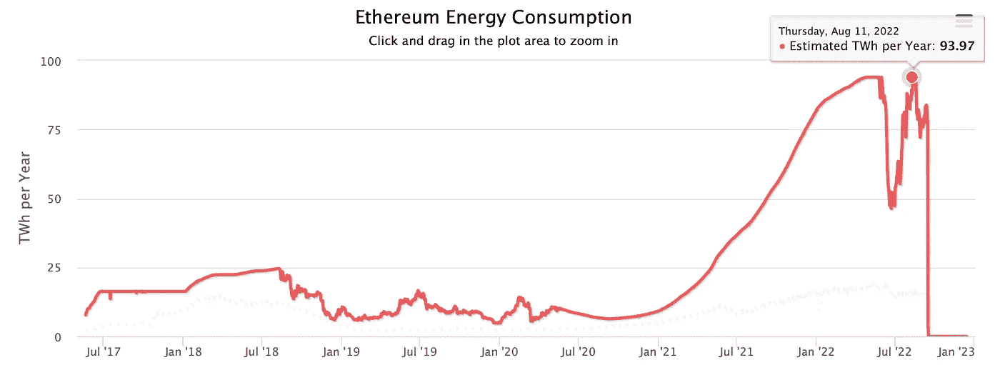

## 1.合并

据 Digiconimist 称，ETH 从工作证明(PoW)共识算法过渡到利益证明(PoS)共识算法，减少了 99%的碳足迹。在 PoW 系统中，矿工们竞相解决复杂的数学难题，以验证交易并将其添加到区块链中。这个过程消耗大量的能量，这对环境是有害的。

相反，PoS 系统允许用户“下注”他们的以太币来参与验证过程。这一过程资源密集程度较低，被认为更环保。它还允许更大程度的去中心化，因为拥有少量以太坊的用户仍然可以参与验证过程。

Eth2 升级还包括分片的实现，这是一种将以太坊区块链分割成更小的称为“分片”的块的方法这使得区块链可以并行处理更多的事务，从而提高其整体可伸缩性。

## 2.ZK 的创新

零知识证明虚拟机(ZK-EVMs)的使用代表了以太坊平台功能的重大进步。这些虚拟机支持生成零知识证明，以验证智能合约执行的各种操作的正确性。这代表着以太坊的发展和使用向前迈进了一大步，因为它允许在智能合约的执行中实现更高的安全性和信任度。

## 3.限制对可靠性的依赖

最大的挑战是以太坊对 solidity 的依赖，solidity 是用于在平台上构建智能合约和 dApps 的主要编程语言。Solidity 是一种相对较新的语言，仍在不断发展，这可能会使开发人员难以学习和使用。此外，如果一种编程语言存在问题或者已经过时，那么使用这种语言可能会产生潜在的故障点。

总的来说，以太坊的可扩展性和对单一编程语言的依赖是其主要限制之一。虽然以太坊开发团队正在努力解决这些问题，但它们可能会继续成为平台未来的挑战。

# 索拉纳

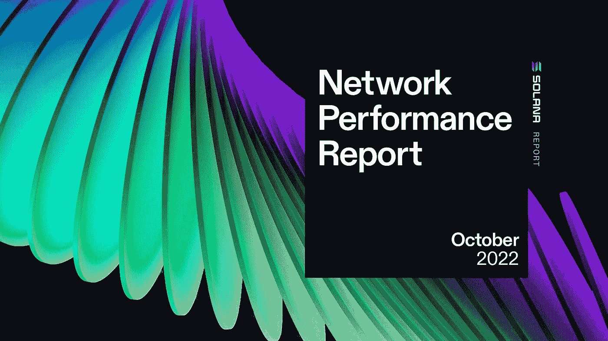

1.  今年 8 月， **Jump Crypto 宣布开发 Firedancer，**这是一款面向索拉纳区块链的新的开源验证客户端。这是 Solana 网络的一个重要里程碑，因为它将为交易验证提供一个替代的开源实现，从而提高网络的可靠性和吞吐量。
2.  2022 年 9 月 22 日，**Solana testnet 达到了创纪录的每秒 24000 个事务的事务吞吐量。**虽然测试网负载并不直接表明主网的性能，但它是网络未来性能的一个积极信号。这一成就是 Solana 平台向前迈出的重要一步，证明了其处理高水平交易量的能力。
3.  **索拉纳面临的最大挑战是应对停电。**
    9 月 30 日，由于 consensus 算法实现中的一个 bug 导致的分叉，mainnet-beta 出现了持续 6 小时 19 分钟的宕机。
    另一次重大宕机发生在 4 月 30 日，当时 Solana 的 mainnet beta 集群被大量入站事务(每秒 600 万)淹没，并因共识受损而经历了 7 小时的宕机。
    这些停电表明 Solana 需要提高其网络的稳定性和弹性，以防止未来发生类似的中断。

# 阿尔格兰德

source: unsplash

1.  **2022 年世界杯区块链官方合作伙伴:**阿尔格兰德与国际足球联合会(FIFA)合作申办 2022 年世界杯是该公司的一次重大胜利。
    作为国际足联的区块链官方平台，Algorand 有机会为管理机构及其附属活动提供基于区块链的解决方案，例如开发 [FIFA+ Collect](https://collect.fifa.com/) ，这是一个与足球相关的不可替代代币(NFT)的官方市场。
    这种合作也让 Algorand 有机会从寻求购买纪念历史性足球时刻的 NFT 的球迷中获益。此外，阿尔格兰德将是世界杯期间的主要赞助商，这将使该公司及其 ALGO 标志暴露给数百万可能有兴趣使用它的人。
    升级后的网络速度提高了 5 倍，市场资本总额[接近 30 亿美元](https://coinmarketcap.com/currencies/algorand/)，Algorand 已做好充分准备来利用这一机会，并有可能看到对其 ALGO 令牌的需求增加。
2.  **algrand 性能提升 5 倍:**algrand 升级为[性能提升 5 倍](https://developer.algorand.org/articles/algorand-boosts-performance-5x-in-latest-upgrade/)至 6,000 TPS，循环时间减少约 10%至<4 秒。
    随着对阿尔格兰德区块空间需求的增加，区块链一直走在采用曲线的前面，因此最终用户可以专注于 dApps 的 UX，而不是底层的区块链。
    在 Algorand 的 3.9 升级中，增加的块大小为 5 MiB，平均循环时间(块延迟)减少到了<4 秒。通过在每个块中装入更多的事务并更频繁地产生块，Algorand 区块链将能够在峰值吞吐量下处理每个块大约 26，000 个事务，相当于 6，000 TPS。
3.  **主要挑战:**algorrand 的一个潜在缺点是，它使用了利益相关证明(PoS)共识机制，这种机制依赖于一组用户(称为“验证者”)来验证交易并将其添加到区块链中。这意味着网络的安全性取决于参与其中的验证者，如果大量的验证者受到威胁或恶意行为，网络的安全性可能会受到威胁。
    此外，Algorand 使用了一种称为“纯利害关系证明”(PPoS)的 PoS 机制变体，该机制因可能允许富裕的个人或组织通过获得大量代币并成为验证者来控制网络而受到批评。这可能导致集中和减少分散，这是许多区块链系统设计中的重要原则。

# L1·区块链的下一步是什么？🤷‍♀️

近年来出现了许多新的第一层区块链，试图解决以太坊(第二大流行的加密货币)的可扩展性、速度和费用问题。
然而，这些新区块链还没有一个能够在采用方面超过以太坊，以太坊作为比特币之后的第二号区块链的地位可能会进一步保护它免受竞争。以太坊基金会还致力于通过即将到来的以太坊 2.0 升级来提高区块链的可扩展性，这将进一步巩固其在市场中的地位。
这些新的第 1 层区块链是否能够作为替代品长期存在还有待观察，特别是如果以太坊的改进被证明是成功的，并且可能的加密冬天会减缓对替代区块链的投资。

# 来源:

1.  [https://ethereum.org/en/](https://ethereum.org/en/)
2.  [https://solana.com/](https://solana.com/)
3.  [https://developer.algorand.org/](https://developer.algorand.org/)
4.  [https://www.alchemy.com/blog/web3-developer-report-q3-2022](https://www.alchemy.com/blog/web3-developer-report-q3-2022)
5.  [https://academy . binance . com/en/articles/区块链第一层是什么](https://academy.binance.com/en/articles/what-is-layer-1-in-blockchain)
6.  [https://www . binance . com/en/blog/fiat/layer-1-区块链-tokens-everything-you-need-to-know-421499824684903155](https://www.binance.com/en/blog/fiat/layer-1-blockchain-tokens-everything-you-need-to-know-421499824684903155)

> 交易新手？在[最佳加密交易](/coinmonks/crypto-exchange-dd2f9d6f3769)上尝试[加密交易机器人](/coinmonks/crypto-trading-bot-c2ffce8acb2a)或[复制交易](/coinmonks/top-10-crypto-copy-trading-platforms-for-beginners-d0c37c7d698c)