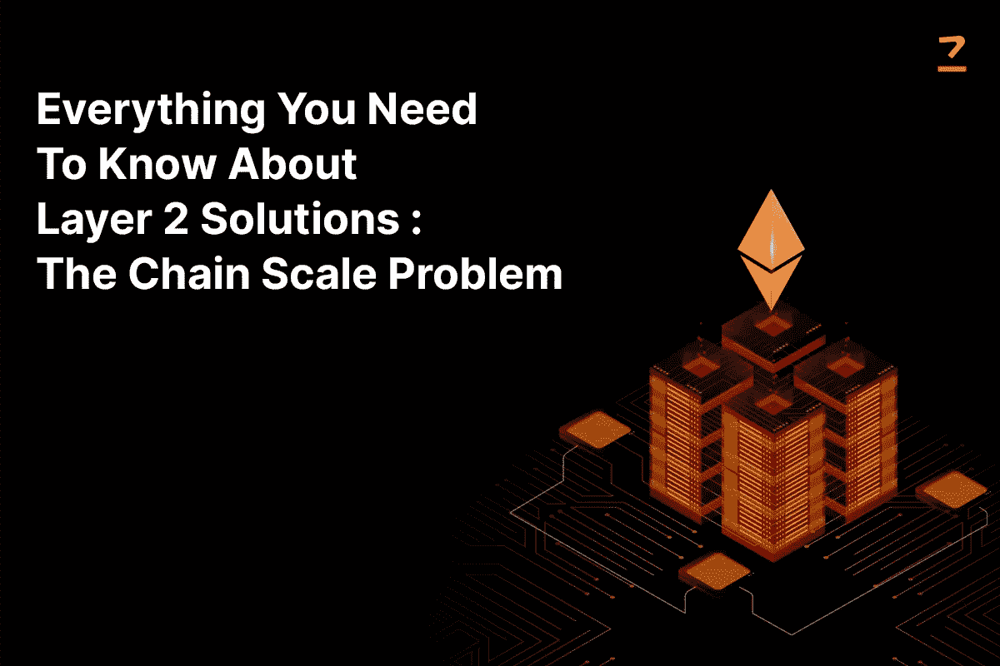

# 关于第 2 层解决方案您需要知道的一切:链规模问题

> 原文：<https://medium.com/coinmonks/layer-2-blockchain-solutions-ethereum-layer-2-solutions-cb7acf886826?source=collection_archive---------59----------------------->

itcoin 第一个解决了拜占庭将军的问题。如果你不熟悉，这是一种博弈论的思想实验，拜占庭军队，在将军的带领下，正在围攻一座城堡；但是他们只有一起进攻才能赢。

问题是所有的信息都被城堡的间谍截获了。那么，你如何传递准确可靠的信息，更重要的是，这不是一个骗局？你可能会忍不住说，“只要有一个中央集权的实体来发号施令就行了。”但是，它不会真的去中心化，不是吗？将军们如果有就不会有这个问题了吧？

这个问题也适用于我们的经济。如何建立一种社会全体成员都信任、认同、依赖的货币？你如何使它永远不必验证其真实性？

嗯，比特币通过**做到了所有这些，甚至更多，创造了一个不可信的、不可改变的分布式账本，存储所有交易的历史。**

**从那以后，我们走过了漫长的道路。我们有坐在游艇上无聊的猿类，我们现在有 ICOs 我不知道哪个更奇怪。**

> **交易新手？尝试[加密交易机器人](/coinmonks/crypto-trading-bot-c2ffce8acb2a)或[复制交易](/coinmonks/top-10-crypto-copy-trading-platforms-for-beginners-d0c37c7d698c)**

**我们现在的问题有点不同。现在的问题是如何扩展这个解决方案。**

****什么是第 2 层解决方案？****

****

**Layer 2 Blockchain Solutions | Ethereum Layer 2 Solutions | Codezeros**

**将主区块链、主总账视为第 1 层。简单地说，第 2 层是在此之上的。它独立于第 1 层，但仍然是第 1 层的一部分。**

**以以太坊为例。要和主链互动， [**以太坊 Mainnet**](https://www.codezeros.com/technology/ethereum) ，就要交气，有点 ETH。这种气体受供需机制的调节，这意味着如果在特定时间点有更多的交易要处理，它将花费更多的气体。事实上，ETH 的吞吐量大约为 15，这基本上是每秒钟可以处理的事务。客观来看，Visa 的吞吐量至少是 1700。**

**这是否意味着 [**区块链发展**](https://www.codezeros.com/services/blockchain-development) 是徒劳的？不。这意味着我们需要更多的发展。**

**这正是第二层。第 2 层在某种程度上充当了主链和信息之间的中介。它通常通过以下四种方式之一来实现:**

****1。侧链**:这些主要是在主区块链的‘侧边’操作。侧链介于第 1 层和第 2 层解决方案之间，侧链独立于区块链运行，使用自己的一致算法运行。它们与以太坊虚拟机兼容运行，但分散性较差，更容易受到协同恶意攻击。例如 xDAI 和 Skale。**

****2。roll ups**:roll ups 可能是最广泛使用的 L2 解决方案，它以一种交易发生在第 2 层的方式链接到区块链，但是交易数据的压缩版本存储在第 1 层。通常有两种。**

*   ****a .乐观汇总**假设交易默认有效，不执行任何计算；在一致质疑的情况下提供欺诈证据。例子包括 Arbitrum、Boba、Cartesi、Fuel Network。**
*   ****b .零知识汇总**离线运行计算，并将有效性证明提交给主链。例子有 Axtec 2.0，不可变 X，Loopring，Matter Labs zKSync，Polygon Hermez。**

****3。Channels** :他们提供了一种在链外进行多项交易的方式，并且他们只需在主层提交两项交易就可以解决所有这些问题。但是，它们有局限性，因为所有各方都应该事先知道；他们还被要求将资金存入一份多重合约，这引发了对资金进行持续监控的问题。它们有两种形式:国家渠道和支付渠道。**

****4。Plasma** : Plasma 使用一种叫做 Merkle trees 的东西来创建主链的附加链；在不涉及太多细节的情况下，提供更快交易、更低成本的功能，并且实际上没有必要在分类账上存储数据。**

****为什么需要第 2 层解决方案？****

**2022 年 6 月 9 日，经过大约一周的投票，大约 54%的 ApeCoin 用户投票反对将硬币从以太坊区块链扩展到其他网络..整个惨败导致社区分裂，大多数人勉强晋级。整个辩论，是否留在网络上，是由于虚拟土地销售期间天然气价格上涨而引发的；出于上述类似的供需原因，宇迦实验室在元宇宙出售的 Otherdeeds 项目中，买家最终支付的天然气费用超过了土地本身；客观地说，汽油平均价格超过 4000 美元。**

**分析师还表示，在实际推出期间，价值约 1.71 亿美元(60，235 瑞士法郎)的瑞士法郎用于交易已完成的造币厂。此外，由于大约 14000 次失败的交易，损失了大约 1700 ETH。**

**有人可能会说，如果集成了第 2 层解决方案，就可以避免整个失败。如果有人这样做了，那么他会同意一位匿名的 DAO 工程师的观点，这位工程师在惨败之后提出了 AIP-41 提案，随后宇迦实验室也发了推文。这只是现有问题的有效解决方案不得不面对链上的可伸缩性问题的许多实例之一。**

****结论****

**上面的例子是用户为开发者付费的众多事件之一；这实质上意味着，就其本身而言，这项技术可能并不完美。也许只是不完整。虽然我们现在已经将解放和分权的原则纳入了我们的金融体系；这曾经是一个遥不可及的想法，我们没有区块链菲亚特提供的可扩展性。第 2 层可能是所有这些问题的解决方案。**

***最初发表于*[T5【https://www.codezeros.com】](https://www.codezeros.com/blog/layer-2-blockchain-solutions)*。***