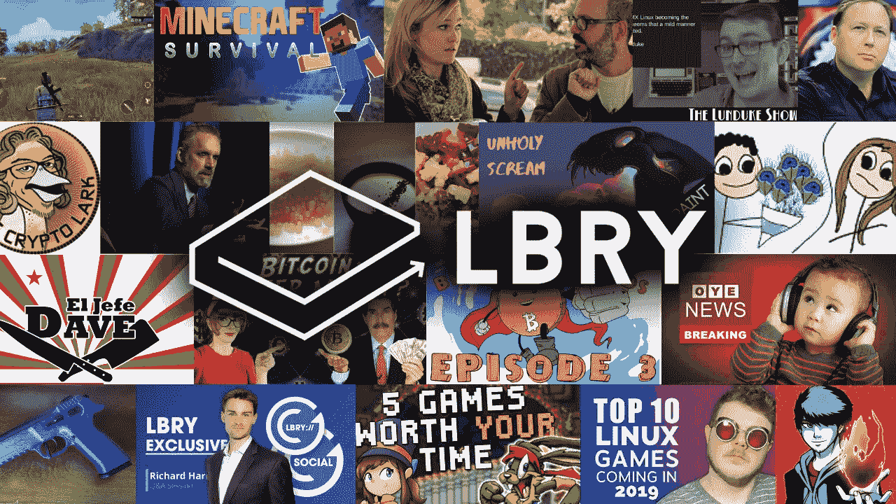
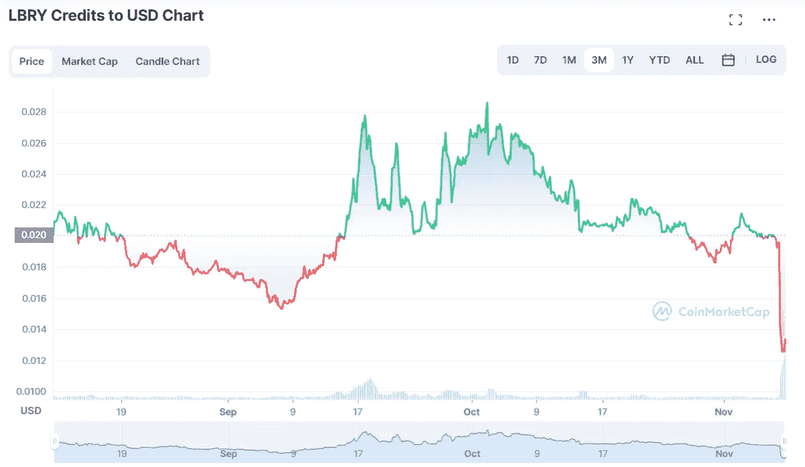

# LBRY 的不幸历程

> 原文：<https://medium.com/coinmonks/lbrys-unfortunate-odyssey-28c6748e1d03?source=collection_archive---------50----------------------->

**LBRY 区块链公司认为正在开发“去中心化”的 Youtube、** [**【奥德赛】**](https://odysee.com/) **，在与 SEC 的官司中败诉。观察家们看到了 Ripple casAe 的先例。**

> “因为没有一个合理的事实审判者可以拒绝证交会的论点，即 LBRY 提供 LBC 作为担保，而 LBRY 没有一个可审理的辩护，即它缺乏公平的通知，证交会有权作出判断。证交会申请简易判决的动议( [Doc。№55](https://ecf.nhd.uscourts.gov/doc1/11712791412) 批准，LBRY 的简易判决动议( [Doc。№61](https://ecf.nhd.uscourts.gov/doc1/11712791679) )驳回”——[*说*](https://odysee.com/@lbry:3f/secvslbrysummaryjudgementruling:a) *美国地方法官保罗·j·巴尔巴多审查此案的裁决。*

这意味着此案将不会进入审判阶段，美国证券交易委员会要求 T21 停止硬币流通和罚款的命令将会得到执行。

LBRY 在 Twitter 上发了一个戏剧性的帖子，请求所有人的原谅。

该公司成立于 2016 年，其想法是基于区块链技术开发一个去中心化的社交网络和视频平台。在撰写本文时，他们的开源视频托管和发布平台 Odysee 的月访问量为 3700 万，相比之下，广受欢迎的 Youtube 替代平台 Vimeo 的月访问量为 7400 万。

项目启动后，LBRY 电子铸造了自己的 LBC 硬币，用于激励其出版平台的早期采用者，支付产品开发和推广费用。尽管从未举行过正式的 ICO，但这些硬币也在交易所出售给公众、该项目的风投以及机构投资者。

2021 年 5 月，SEC 在美国地方法院提交了最初的[投诉](https://www.sec.gov/litigation/complaints/2021/comp25060.pdf)，提到了 1100 万美元的金额。然而，LBRY 的联合创始人兼首席执行官杰里米·考夫曼(Jeremy Kauffman)经常提到，他们在公司存在的整个五年里都在与 SEC“斗争”。杰里米·考夫曼因其对 SEC 的批评立场而闻名，他在 9 月的 Mainnet 会议上穿着“F*ck the SEC”的 t 恤。他对法官裁决的反应也用了同样的脏话。

作为平台发行商信用币的 LBRY coin，LBC 的信仰不明。它在 Coinmarketcap 上失去了价值，但仍在 Bittrex 和其他两个平台上交易。

LBRY LBC token 3 month chart. Source: Coinmarketcap.com

LBRY 称这是社区的“危险”先例，每个人都认为更重要的 [Ripple 案](https://www.observers.com/sec-vs-ripple-what-and-when-to-expect/)将在几个月内做出司法判决。一些专家[看到了这两种情况下的法律差异。无论如何，这是美国证券交易委员会的胜利，我们将观察加密社区如何回应。](https://twitter.com/JohnEDeaton1/status/1589811469570707457)

> 交易新手？试试[密码交易机器人](/coinmonks/crypto-trading-bot-c2ffce8acb2a)或[复制交易](/coinmonks/top-10-crypto-copy-trading-platforms-for-beginners-d0c37c7d698c)