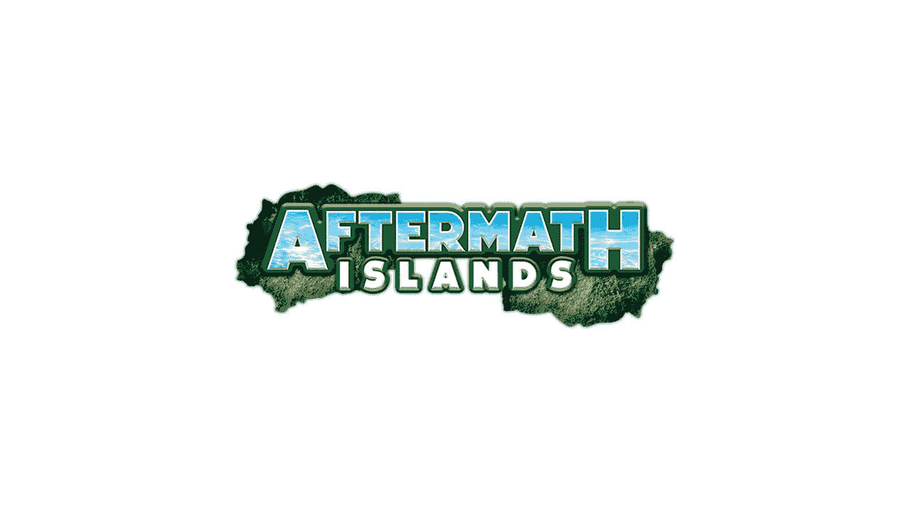

# LDA 资本投资 2500 万美元用于元宇宙余波群岛的重建

> 原文：<https://medium.com/coinmonks/lda-capital-commits-25-million-for-buildout-of-the-aftermath-islands-metaverse-4c96760c6841?source=collection_archive---------34----------------------->

余波群岛元宇宙有限公司是雄心勃勃的余波群岛元宇宙项目背后的开发公司，已从全球另类投资集团 LDA Capital Limited 获得 2500 万美元的承诺。

该公司在一份声明中表示，这笔资金将用于广泛的项目相关活动和计划，从用户入职和开发游戏赚取机会，到采用余波群岛元宇宙，以及支持余波群岛独特的 NFTs，数字身份解决方案，跨链兼容倡议，游戏赚取计划，以及元宇宙和现实世界中用户识别，游戏，娱乐，金融，虚拟化，协作和混合现实的交叉点上的其他尖端分散应用程序。

LDA Capitals 的承诺将支持元宇宙群岛的长期发展。余波群岛的元宇宙展示了数字身份如何支持在线和离线环境下的安全、隐私和安保，我们的高分辨率图形和像素流为用户提供了快速、无下载、在任何设备上逼真的游戏体验，提高了元宇宙和现实世界的标准并扩大了机会，”余波群岛的董事总经理大卫·卢卡奇在一份新闻稿中说。

“affairs Islands 的虚拟世界和游戏有能力改变玩家与游戏中可收集的 NFT 进行交互和交易的方式，LDA Capital 很自豪也很高兴能与项目团队合作开展这项活动。affairs Islands 是在线空间数字身份验证领域公认的领导者，它使用户和开发者能够构建一个全新的游戏中和现实世界互动的世界，并从中受益。最终,《余波群岛》将科幻小说转变为历史，我们很自豪能成为这个故事的共同作者。

LDA Capital 是一家专注于投资全球私人和公共市场的投资集团。该公司为在全球服务水平低下的市场和复杂条件下寻求融资的公司提供资本解决方案。在过去十年中，该团队已经在 40 多个国家执行了超过 100 亿美元的交易，并且是 affairs Islands 备受瞩目的合作伙伴和协作者之一。

据余波群岛元宇宙有限公司报道，2020 年元宇宙的机会价值约为 270 亿美元。预计未来十年 CAGR 约为 40%，预计到 2030 年，元宇宙的市值将超过 8200 亿美元。

LDA Capital 的 2500 万美元承诺将通过购买余波群岛公用设施代币提供非股权基金，前提是成功完成预定的项目里程碑。余波群岛项目团队的目标是在 2022 年底实现这些里程碑。根据承诺，LDA Capital 有权购买余波群岛元宇宙有限公司的股权。

本周早些时候，余波群岛发布了一个演示视频，让我们先睹为快。余波群岛将自己定位为“共享的虚拟开放世界，很像作家欧内斯特·克莱恩在他的科幻小说《一号玩家和二号玩家》中描述的元宇宙。”它将允许用户相互交流，创建内容和玩游戏，等等。元宇宙将以游戏中的虚拟经济为特色，拥有“无数的世界经济交易”和货币化内容、任务和应用的能力。

点击这里关注我们了解更多故事[。](http://t.me/etellworld)

> 交易新手？试试[密码交易机器人](/coinmonks/crypto-trading-bot-c2ffce8acb2a)或者[复制交易](/coinmonks/top-10-crypto-copy-trading-platforms-for-beginners-d0c37c7d698c)