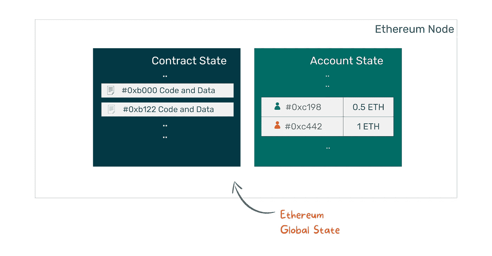
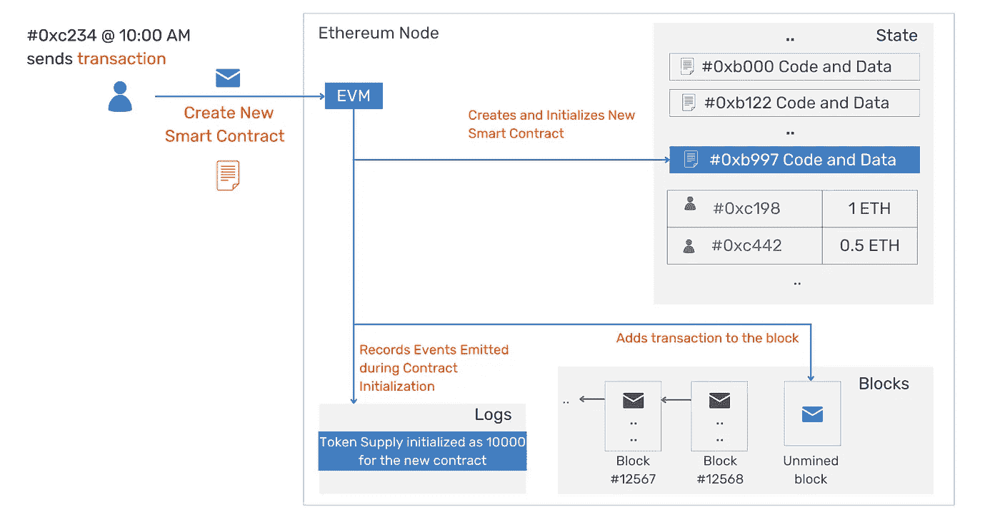
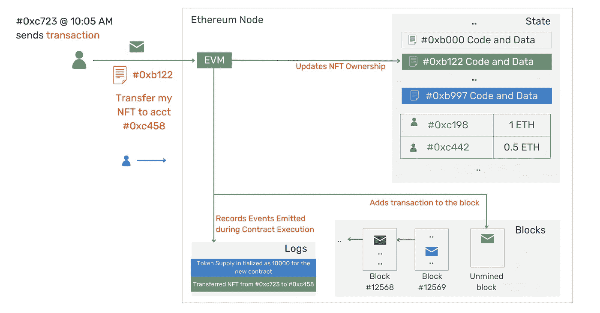
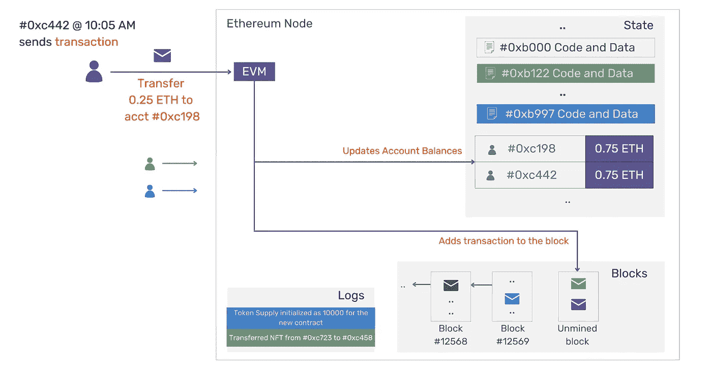
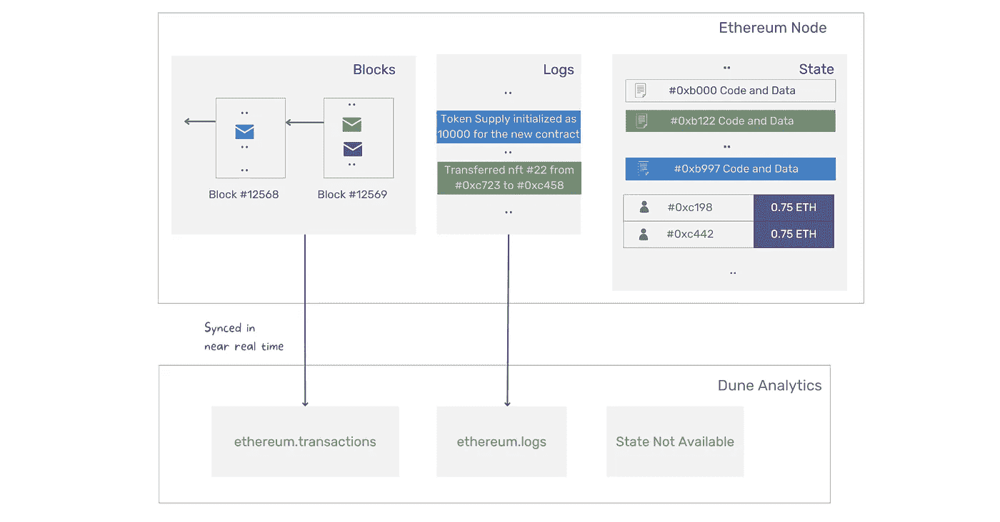
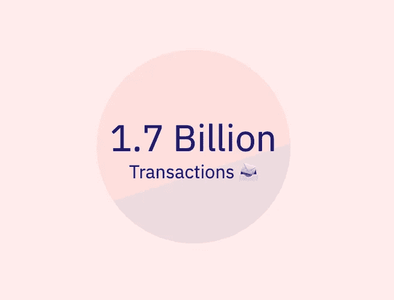

# 了解以太坊交易并编写您的第一个 Web3 SQL 从区块链中提取数据。

> 原文：<https://medium.com/coinmonks/learn-about-ethereum-transactions-and-write-your-first-web3-sql-to-extract-data-from-the-blockchain-8999e82c5467?source=collection_archive---------7----------------------->


Photo by [Esther Jiao](https://unsplash.com/@estherrj?utm_source=unsplash&utm_medium=referral&utm_content=creditCopyText) on [Unsplash](https://unsplash.com/s/photos/blocks?utm_source=unsplash&utm_medium=referral&utm_content=creditCopyText)

## 什么是交易？

以太坊是一台执行智能契约并存储其数据(一般称为契约状态)的全局计算机。

除了智能合同的状态，它还存储帐户余额，即帐户拥有的 ETH。



Ethereum Global State

以太坊的全局状态在以下三种情况下更新。

**交易类型一:创建智能合约**

为了在以太网上创建一个智能合同，用户签署并发送一个交易和代码。一旦交易被处理，以太坊虚拟机(也称为 EVM)更新全局状态以存储新合同的代码和数据。



Create Smart Contract Workflow

**交易类型二:调用智能合约**

为了对现有契约执行操作，用户签署并发送一个事务来调用所需的方法和输入数据。处理后，EVM 会更新合同数据以反映当前状态。

例如，当用户出售他们在特定合同中注册的 NFT 时，合同的状态将被更新以反映新的所有者。



Call Existing Contract Workflow

**交易类型三:转账 ETH**

当一个用户将 ETH 转移给另一个用户时，帐户状态会更新以反映新的余额。



ETH Transfer Workflow

正如我们所见，以太坊网络的任何变化都是通过交易实现的。事务是外部用户与系统交互的手段。因此，通过测量交易量，我们可以观察网络的活跃程度。

因为我们已经观察到每个事务都记录在块中(称为区块链)，所以我们可以通过查询块来计算出事务的总数。

Dune Analytics 从块中提取事务数据，并将它们加载到`ethereum.transactions`表中。



Dune Analytics Data Load

为了确定自开始以来的事务总数，我们可以只计算`ethereum.transactions` 表中的总行数。

```
/* Query to retrieve total number of transactions in Ethereum */SELECT
  --Divided by 1e9 to report results in billions
  COUNT(*)/1e9 AS transactions_count
FROM
  ethereum.transactions;
```



Total Ethereum Transactions (as of sep’2022) Since Inception

[叉](https://dune.com/queries/1028650)上面的查询并创建你自己的图表。

我们研究了事务，并用三行代码创建了第一个查询，从公共区块链中提取数据。

关注更多关于 web3/区块链数据分析的文章。

*原载于*[*https://www.twigblock.com*](https://www.twigblock.com/articles/eth-dune-transactions)*。*

> 交易新手？试试[加密交易机器人](/coinmonks/crypto-trading-bot-c2ffce8acb2a)或者[复制交易](/coinmonks/top-10-crypto-copy-trading-platforms-for-beginners-d0c37c7d698c)