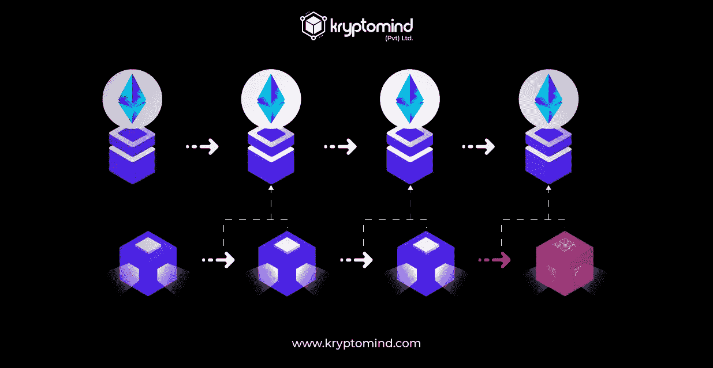

# 了解汇总协议

> 原文：<https://medium.com/coinmonks/learn-about-rollup-protocol-d4858722d7b8?source=collection_archive---------51----------------------->

乐观汇总是支持乐观的关键概念。我们将从较高的层次解释乐观汇总是如何工作的。然后我们将描述为什么乐观主义被设计成一个乐观的汇总，以及为什么我们认为它是满足我们所有设计目标的系统的最佳选择。

# 乐观向上滚动 TL；速度三角形定位法(dead reckoning)

乐观主义是一种“乐观汇总”，这是一种从另一个“父母”区块链的安全中受益的区块链的奇特说法。具体来说，乐观汇总使用其父链的一致流程(如 PoW 或 PoS ),而不是提供自己的流程。在乐观主义的例子中，这个区块链就是以太坊。

# 块存储器

所有乐观块都保存在一个特殊的以太坊智能契约中，称为 CanonicalTransactionChain(在一个新窗口中打开)(或简称为 CTC)。在 CTC 内部，乐观块存储在一个只附加的列表中(我们将在下一节描述如何将块添加到这个列表中)。乐观区块链就是由这个只加列表构成的。

CanonicalTransactionChain 包含确保新的以太坊交易不能修改现有块列表的代码。然而，如果以太坊区块链被重新安排，先前以太坊交易的顺序被改变，这个承诺就可能被违背。乐观主网可以承受多达 50 个以太坊街区的重组。如果以太坊经历更广泛的重组，乐观主义也将经历重组。

避免这种大规模重组是以太坊的核心安全目标。因此，只要以太坊共识进程存在，乐观主义就不会受到大规模重组的影响。乐观主义通过这个环节从以太坊(至少部分)获得了它的安全特性。

> *交易新手？试试* [*密码交易机器人*](/coinmonks/crypto-trading-bot-c2ffce8acb2a) *或* [*复制交易*](/coinmonks/top-10-crypto-copy-trading-platforms-for-beginners-d0c37c7d698c)

# 批量生产

乐观块的产生通常由称为“定序器”的单个实体来协调，定序器通过提供以下服务来协助网络:

提供实时交易确认和状态变化。

L2 街区建设和执行

L1 正在接收用户交易。

序列器中没有内存池。因此，交易按照收到的顺序被接受或拒绝。当用户向 sequencer 提交一个事务时，sequencer 会对其进行验证(支付适当的费用)，然后将该事务添加到其本地状态，作为一个挂起的块。这些待定区块经常被大批量提交给以太坊进行最终确定。这种批处理方法通过在一个批处理中分配固定成本和事务，大大降低了总体事务费用。定序器采用一些基本的压缩方法来减少广播到以太坊的数据量。

因为定序器对 L2 链具有优先写访问权，所以它可以确保一旦它停留在新的挂起块上，什么状态将被完成。换句话说，交易的结果是准确知道的。因此，L2 国家可能会持续快速地发生变化。这提供了快速的用户体验，并具有诸如近实时 Uniswap 价格更改等功能。

或者，用户可以完全省略 sequencer，而是通过以太坊事务将他们的事务提交给 CanonicalTransactionChain。一种通常更昂贵，因为用户支付提交该交易的全部固定成本，该成本不在许多这样的交易中分摊。然而，这种替代提交方法的优点是不受定序器审查的影响。即使定序器故意阻止用户，他们仍然可以利用乐观主义，并使用这种方法来获得他们的钱回来。

目前，唯一的区块生产商是乐观 PBC。

# 块执行

以太坊节点从以太坊的对等网络获取块。相反，乐观节点直接从 CanonicalTransactionChain 契约的仅附加块列表中下载块。有关如何在此契约中保存数据块的更多详细信息，请参见上面关于数据块存储的部分。

乐观客户端软件和以太坊数据索引器是乐观节点的两个主要组件。以太坊数据索引器(或 DTL)从提交给 CanonicalTransactionChain 契约的块中重建乐观区块链。DTL 查找由 CanonicalTransactionChain 生成的事件，这些事件指示新乐观块的发布。然后，它查看生成这些事件的事务，使用典型的以太坊块格式重新创建发布的块。

乐观客户机程序是乐观节点的第二个组件，是 Geth 的一个普通版本。这意味着在幕后，乐观主义几乎等同于以太坊。具体来说，乐观和以太坊共享相同的以太坊虚拟机、帐户和状态结构、气体计量系统和费用表。这种设计被称为“EVM 等价”，它暗示了大多数以太坊工具(包括最复杂的工具)“简单地工作”是乐观的。

乐观客户机程序不断地监视 DTL，寻找新索引的块。当一个新块被索引时，客户端程序下载它并执行其中包含的事务。要在乐观上执行事务，使用与 Ethereum 相同的步骤:首先，加载乐观状态，然后对其应用事务。最后，记录出现的状态变化。然后对每个新的 DTL 索引块重复该方法。

# 桥接层之间的资产

乐观允许用户在乐观和以太坊智能合约之间传递任意消息。这允许资产，尤其是 ERC20 令牌，在两个网络之间传输。进行这种通信的精确技术根据信息传输的方向而变化。

乐观主义使用标准桥的这一功能，使用户能够将资产(ERC20 令牌和 ETH)从以太坊转移到乐观主义。用户可以从乐观中提取相同的资产，并将其发送回以太坊。

# 从以太坊过渡到乐观主义

用户只需要激活以太坊上的 CanonicalTransactionChain 契约，就可以在乐观块上生成一个新的块，将以太坊的消息传递给乐观。有关更多信息，请参见上文关于块创建的章节。用户生成的块可能包括似乎来自该地址的交易。

# 从乐观主义走向以太坊

同样，以太坊合约可能很容易产生乐观的交易，这对于乐观的合约是不可行的。因此，将数据从乐观主义返回以太坊需要更多的努力。我们需要能够对以太坊合约的乐观性做出可验证的声明，而不是自动产生可验证的交易。

对乐观状态做出可以被证明的声明需要以 trie 的根的形式的加密承诺。由于乐观的状态发生了变化，这一承诺在每一个街区后都会改变。以太坊上一个名为 StateCommitmentChain 的智能合同大约每小时发布一两次承诺。

用户可以使用这些承诺来产生关于乐观情况的 Merkle 树证明。以太坊智能合约可以验证这些证明。乐观主义管理的 L1CrossDomainMessenger 是一个方便的跨链通信契约，它可以代表其他契约验证这些证明。

这些证据可能支持关于在特定街区高度的乐观主义的任何契约中存储的信息的可证实的主张。然后，利用这一基本能力，乐观合约将有可能与以太坊合约进行沟通。乐观契约可以利用 L2ToL1MessagePasser 契约(预先部署到乐观网络)来存储乐观状态下的消息。然后，用户可以通过证明 L2ToL1MessagePasser 契约已经保存了消息的散列，向以太坊契约证明某个乐观契约想要传递特定的消息。

# 故障证明

相反，在一段时间内，这些承诺被视为待定(称为“挑战窗口”)。如果拟议的国家承诺在质疑期内没有受到质疑，则被视为最终承诺，目前的质疑期定为 7 天。在以太坊上，智能合约可以安全地接收基于承诺的乐观状态的证据，该承诺被认为是最终的。

当一个国家承诺受到质疑时，一个“缺陷证明”程序——以前被称为“防欺诈”方法——可以用来使其无效。如果挑战成功，该承诺将从 state commitment 链中撤销，此时另一个提议的承诺将取而代之。重要的是要明白，只有公开的关于链条状态的承诺会被成功的挑战逆转，而不是乐观主义本身。防错挑战使事务排序和乐观性保持不变。

11 月 11 日的 EVM 等价更新对现在正在进行重大重建的防错过程产生了不利影响。本网站的协议规范部分有关于此程序的更多信息。

*原载于 2022 年 7 月 25 日*[*【https://kryptomind.com】*](https://kryptomind.com/learn-about-rollup-protocol/)*。*