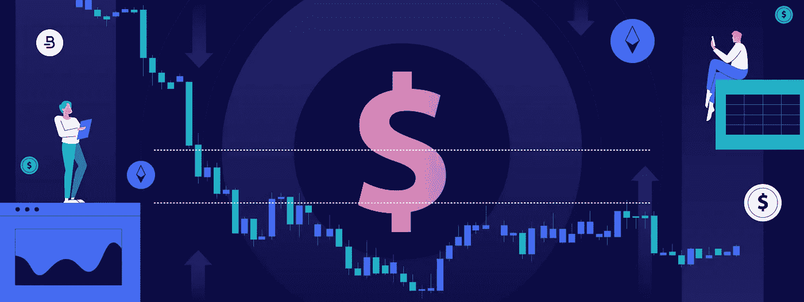
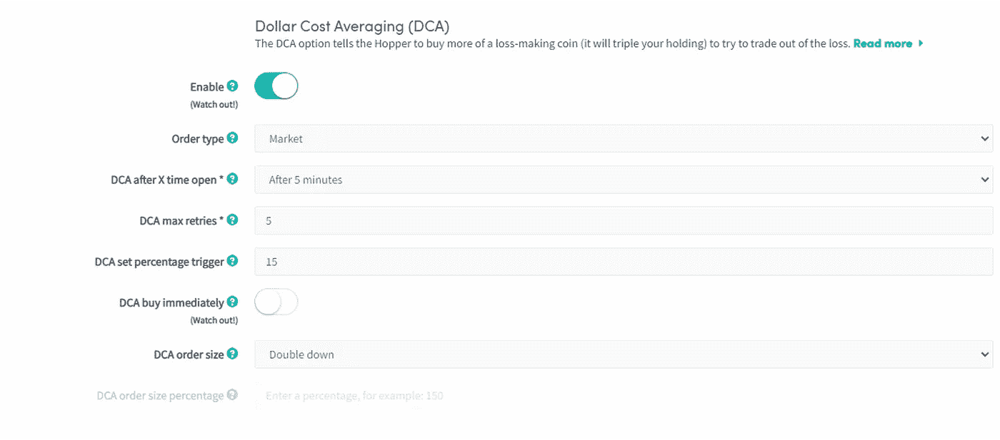

# 使用 Cryptohopper 的 DCA 交易机器人学习加密的平均成本

> 原文：<https://medium.com/coinmonks/learn-dollar-cost-averaging-for-crypto-with-cryptohoppers-dca-trading-bot-5a521dc0f2e3?source=collection_archive---------23----------------------->

加密货币交易以其波动性和极端的价格波动而闻名。在加密市场，投资者需要选择交易策略，将风险降至最低，增加盈利机会。美元成本平均法(DCA)就是这样一种交易策略，它帮助投资者通过长期积累资产来获利。

让我们回顾一下什么是 DCA，以及如何使用 Cryptohopper 交易机器人将 DCA 应用到您自己的交易中。

# 美元成本平均法简介

[美元成本平均法](https://www.cryptohopper.com/blog/4277-what-is-dollar-cost-averaging-dca)是一种投资计划，涉及到在固定的时间间隔以固定的金额购买一种资产类别，不管价格如何变化。投资者不是一次性购买加密货币，而是以预定的时间间隔(如每周、每月、每半年等)分发他们的购买。假设市场价格最终会上涨，投资者也可以使用 DCA 来计算损失。

运用 DCA 有助于投资者随着时间的推移稳步积累资产。通过这种方式，投资者可以避免根据自己的情绪采取行动，这可能导致在 FOMO 以外购买加密货币。DCA 特别适合新手和不花太多时间在技术分析上的长线投资者。

# 如何使用 Cryptohopper 建立 DCA 策略

加密货币的价格会在短时间内大幅变化。当你意识到市场价格并决定采取行动时，这些不稳定资产的价格已经改变了。

[Cryptohopper 的交易机器人](https://www.cryptohopper.com/features/dollar-cost-averaging)自动化您的交易策略，以增加提高您利润的可能性。自动化您的购买和其他交易行为将帮助您在正确的时间执行订单。

DCA 是一个简单而强大的投资策略，适合试图建立长期财富的加密投资者。Cryptohopper 交易机器人使你能够对加密货币应用 [DCA 策略](https://docs.cryptohopper.com/docs/explore-features/dca/)。

以下是在 Cryptohopper 上配置 DCA 设置的逐步过程，以便您现在就可以改进您的长期策略:

*   **第 1 步** —在 Cryptohopper 页面的左侧菜单中，转到“配置”选项并选择“Baseconfig”。您可以在 Baseconfig 子菜单的最后找到“DCA”选项。在这里，您可以通过提供所需的输入来配置 DCA。
*   **步骤 2** —点击启用按钮继续。DCA 的第一个输入是“订单类型”。您可以选择“限价”或“市价”订单。
*   **步骤 3** -下一个选项是“X 次打开后的 DCA”如果您希望在某个时间段后自动应用 DCA 购买资产，您可以在此输入时间段。当选定的时间框架交叉时，您的机器人将为头寸创建 DCA 订单。
*   **步骤 4**—“DCA 最大重试次数”是下一个输入。“DCA max retries”是可以为特定资产创建的 DCA 订单数。每次成功销售 DCA 订单后，该号码将被重置。如果您将这个数字保持得很高，一定要小心，因为它可能会产生很高的损失。
*   **第 5 步**——“DCA 设定百分比”是基本设置，如果您对由于价格下跌已经亏损的头寸使用 DCA。输入价格必须下降的百分比，超过该百分比后，您希望 DCA 功能下新订单。当平均价格下降到给定的百分比时，您的漏斗将发出 DCA 订单。
*   **第 6 步** -下一个输入是“DCA 立即购买”。如果您启用此选项，DCA 功能将在达到给定百分比损失时立即买入。但是，如果你想在你的策略信号和百分比损失都达到时购买 DCA 功能，你需要禁用它。否则，Hopper 可以在不使用任何策略的情况下，仅考虑百分比损失触发来买入。
*   **第 7 步**--“DCA 订单大小”是最后一个必需的输入。您可以选择订单的大小，有三个选项—双倍、三倍和自定义百分比。如果您选择更大的订单规模，平均购买价格会更好。然而，如果市场价格继续下跌，这也可能增加你的损失。

配置您的 DCA 设置后，您可以在您的开仓位置检查它们。如果您单击空缺职位旁边的“查看”按钮，您可以看到 DCA 选项卡。在这里，您可以查看 DCA 状态、当前平均费率、利润/亏损、DCA 数量以及 DCA 设置等信息。

# 手动 DCA

您也可以通过转到仪表板并选择“批量操作”来创建手动 DCA 订单在这里，您可以看到“创建 DCA 订单”，这使您能够设置 DCA 策略。您可以通过选择“未结头寸”旁边的“查看”来检查 DCA 配置。除了在此检查 DCA 设置和历史记录，您还可以创建 DCA 订单。

DCA 是最适合加密货币等易变资产类别的投资策略。然而，选择具有长期潜力的硬币也很重要。您可以在使用 Cryptohopper trading bot 进行的购买中包含 DCA 策略，并在不考虑短期价格变化的情况下积累长期财富。

# 常见问题解答

## 什么是 DCA 交易机器人？

DCA 交易机器人是自动化交易机器人。他们帮助你定期自动购买预定数量的硬币。

## 什么是 DCA 交易机器人策略？

DCA 交易机器人发出第一笔购买订单，如果价格下降，就会增加订单数量，反之亦然。

## DCA 是一种好的投资方式吗？

是的。DCA 是一种有用的投资策略，尽管短期价格变化，它仍能帮助你积累长期财富。

## 为什么 DCA 是一个好的投资策略？

DCA 允许您通过最小化市场风险来稳步建仓。

*最初发表于*[*【https://www.cryptohopper.com】*](https://www.cryptohopper.com/blog/7964-learn-dollar-cost-averaging-for-crypto-with-cryptohopper-s-dca-trading-bot)*。*

> 交易新手？尝试[加密交易机器人](/coinmonks/crypto-trading-bot-c2ffce8acb2a)或[复制交易](/coinmonks/top-10-crypto-copy-trading-platforms-for-beginners-d0c37c7d698c)