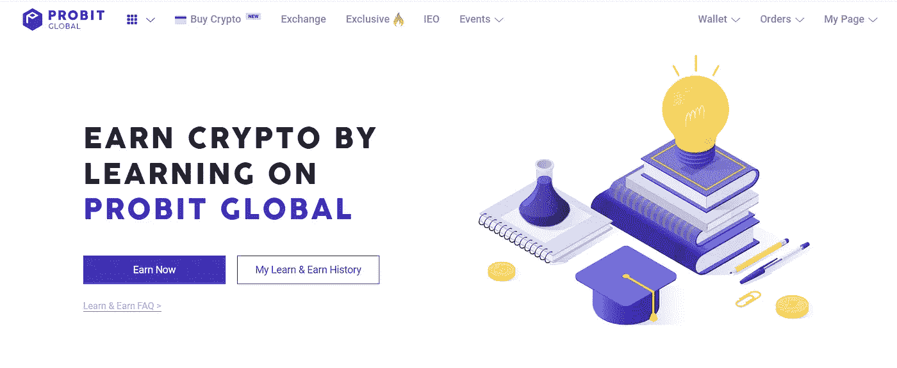
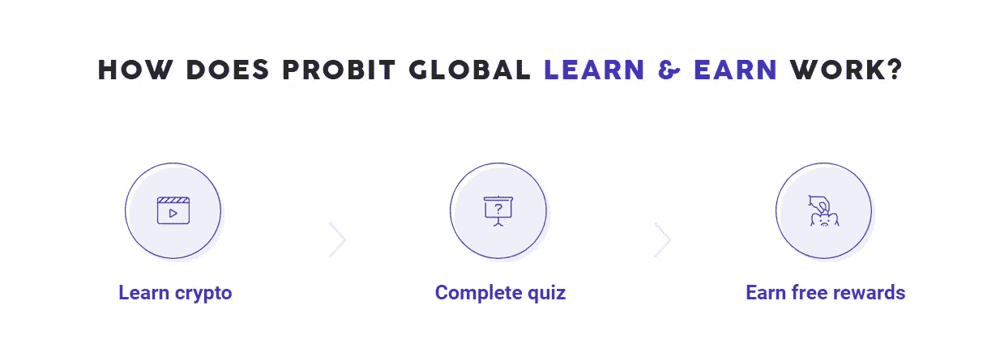
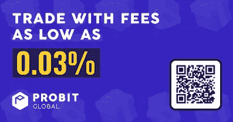
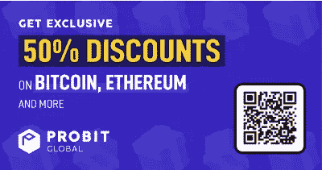

# 学习和收获:概率版本

> 原文：<https://medium.com/coinmonks/learn-earn-probit-version-4d666fb21b1?source=collection_archive---------28----------------------->

第三部分:🙇‍♂️只是学习，然后赚取

TLDR:

*   第一门课程仅在 2022 年 9 月 26 日 02:00 AM ~ 2022 年 10 月 31 日 12:59 AM (+02:00)提供
*   仅含 0.03%的 fess
*   获得独家 50%的费用折扣。

嗨，朋友们，我总是试图给你们提供信息，让你们不用太多努力就能以合法的方式积累资产。今天我将向大家介绍一个不太熟悉的交易所， [ProBit](https://www.probit.com/r/71643865) 。在 [ProBit](https://www.probit.com/r/71643865) ，你可以通过参加那里的学习和获得项目获得一些免费的密码。那我们开始吧。

> probit Exchange(www.probit.com)将自己描述为一个全球性的硬币对硬币加密货币交易所。ProBit Exchange 只列出它认为“合格和值得”的加密货币项目。据报道，ProBit Exchange 的订单匹配速度超过每秒 150 万个订单，并具有可定制的用户界面。此外，ProBit Exchange 声称除了双因素身份验证之外，还为用户提供了硬件安全密钥选项。

## 它是如何工作的？

建立您的加密知识，ace 测验，并通过 ProBit Global 的新学习和学习计划获得免费加密奖励。这个程序允许每个人探索不同的加密货币，了解来龙去脉，实际拥有它们，并亲自试用它们！

课程只能完成一次，每个人获得的奖励将取决于测验期间提交的正确答案数量。课程也会定期更新，带来更多精彩的话题和兴趣。

挑战自我，一路赚！要开始学习，请单击下面的按钮，查看最新的可用课程！

## **备注**

[概率单位](https://www.probit.com/r/71643865)的学习和收获计划有时间和配额限制。原则是先到先得。目前，他们正在开始他们的第一个课程。

使用我的推荐链接获得奖励。这将激励我更经常地给你带来这样的消息。[https://www.probit.com/r/71643865](https://www.probit.com/r/71643865)

> 交易新手？尝试[加密交易机器人](/coinmonks/crypto-trading-bot-c2ffce8acb2a)或[复制交易](/coinmonks/top-10-crypto-copy-trading-platforms-for-beginners-d0c37c7d698c)