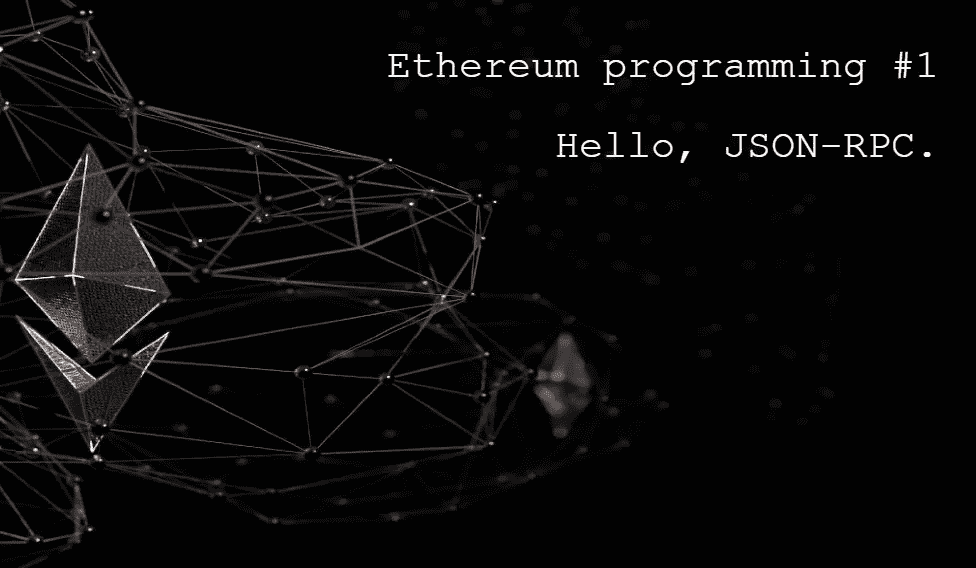
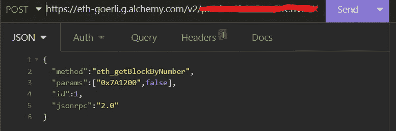
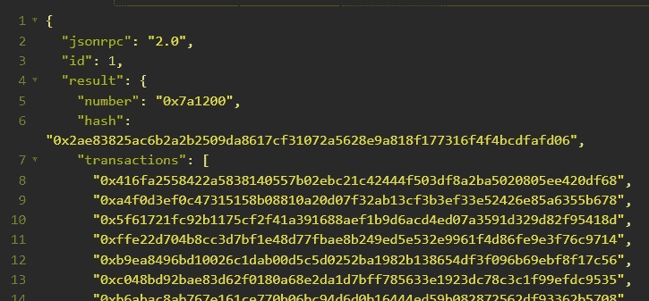

# 学习以太坊编程#1。你好，JSON-RPC。

> 原文：<https://medium.com/coinmonks/learn-ethereum-programming-1-hello-json-rpc-aa66faf0e5c1?source=collection_archive---------4----------------------->



Photo by [Shubham Dhage](https://unsplash.com/@theshubhamdhage?utm_source=unsplash&utm_medium=referral&utm_content=creditCopyText) on [Unsplash](https://unsplash.com/s/photos/ethereum?utm_source=unsplash&utm_medium=referral&utm_content=creditCopyText)

以太坊是一个允许书写智能合同的区块链。尽管名称如此，智能合约是由虚拟机执行的代码片段。因此，以太坊可以被认为是一种全球计算机。

区块链是分布在世界各地计算机之间的分布式系统，其中每台计算机被称为一个网络节点。这种节点以一种八卦机制进行对等通信，互相发送消息。以太坊执行客户端使用的消息传递协议称为 devp2p。

目前，以太坊也使用共识客户端，在迁移到利害关系证明共识机制之后。共识客户端使用 libp2p 协议，而不是 devp2p。在我们的研究中，这种协议的细节并不重要，只要理解这种节点相互通信的想法就行了。

节点需要就以太坊的单一状态达成共识。这是通过共识机制实现的，每个区块链都实施自己的机制。工作证明、利益证明和权威证明是众所周知的达成共识的机制。也使用其他机制。以太坊目前使用基于状态证明的共识。

我们说需要对网络的状态达成共识，因为以太坊是一个状态机。简单地说，状态是存储在数据库中的一组信息。每个节点都需要对同一组信息达成一致，这样网络中就不会缺乏共识。

以太坊的状态是通过交易改变的。没有其他方法可以改变网络状态。在免许可的区块链上，任何用户都可以发送交易，只要他们支付所需的费用。在以太坊上，发送交易的费用是用网络令牌 ether 支付的。

网络用户是那些在网络上有帐户的人。以太坊账户有两种类型:外部拥有的账户和合约账户。可以通过特定的交易创建合同账户。

在以太坊，没有监管权力为了创建账户。帐户由用户自己创建，并从该帐户进行的第一笔交易开始就存在于网络上。以太坊账户不过是一个 32 字节的随机数。这样的数字被称为私钥，其所有者不得泄露。有了私钥和以太支付费用，就有可能发送交易。

以太坊的参与方式基本有两种。一个是成为一个节点，成为网络的一部分。所以我们可以在自己的电脑上发起交易。目前，这对于普通用户来说不太可行，因为在计算机上保存区块链的副本需要近 1TB 的磁盘空间，最好是固态的。

幸运的是，网络节点往往会打开一个通往外界的网关。可以通过 JSON-RPC 协议，通过 HTTP、WebSocket，在某些情况下还可以通过 gRPC 向这样的节点发送请求。以太坊上的 JSON-RPC 方法之一允许发送事务。

因此，可以在不作为网络节点的情况下向以太坊发送事务。为此，只需找到一个接收 JSON-RPC 请求的节点。为此目的有公共节点，但是像 Alchemy、Infura 和 Moralis 这样的公司提供更可靠的节点服务。对于数量有限的请求，此类服务通常有一个免费计划。

本系列文章的目的不是详细解释区块链是如何工作的。我们将重点讨论如何编程以太坊。然而，让我们快速看一下区块链的基本结构。

# 一串积木

我们已经看到以太坊有一个通过事务改变的全局状态。事务被分组到一个更大的结构中，称为块。这种结构并不是绝对必要的，一些“区块链”并不形成块，所以我们有时使用分布式总账系统，而不是区块链。

之所以取这个名字，是因为交易集形成了一种分类账。在(老式的)银行系统中，分类账是银行职员记录交易的地方:例如，爱丽丝给鲍勃寄了 10 英镑。每个区块都包含类似于账本的一页。

块通过加密技术相互链接，形成一个链。这就是为什么它被称为区块链。链的形成方式相对简单:通过加密散列函数，块中包含的所有信息被用来生成块的指纹。该指纹然后被合并到下一个块中，以此类推。

包含在所有块中的所有事务由所有网络(完整)节点存储。一些节点还存储网络状态的整个历史，从被称为起源块的第一块开始。因此，可以恢复例如块 34500 中某个对象的值。

这个时候我们不打算安装节点客户端，所以不打算做以太坊节点。但是我们将向一个节点发送请求，请求一些信息。我们开始吧。

# JSON-RPC

为了从以太坊获取信息，我们将向一个节点发送请求。这样的请求必须使用相对简单的 JSON-RPC 协议发送。你需要发送一个带有 4 个参数的 JSON 对象: *jsonrpc* 、 *id* 、*方法*和 *params* 。

*   **jsonpc** :要使用的版本。以太坊用的是 2.0 版本。
*   **id** :指定请求的编号，以防同时发送多个请求。可以使用任何数量。
*   **方法**:远程执行的方法。以太坊有一套明确定义的方法。
*   **params** :如有必要，发送给方法的参数。

在使用 HTTP 的情况下，请求必须使用 POST 方法发送。也可以使用 WebSocket，但这里我们将使用 HTTP。

我打算用*失眠*软件发送请求，但是*邮差*也一样好。我将把请求发送到一个炼金术节点。您需要创建一个 Alchemy 帐户来生成一个密钥，我将在下一篇文章中向您展示。此刻，我只想发送一个请求，并向您展示结果。

以太坊的执行层可以调用的所有方法都可以在[这里](https://ethereum.org/en/developers/docs/apis/json-rpc/)找到。共识层客户端使用 rest api，而不是 JSON-RPC。

让我们发送一个请求，查找有关 8，000，000 块的信息。为此，您必须使用 **eth_getBlockByNumber** 方法，该方法需要两个参数:十六进制的块号和一个布尔值，该值指示响应是应该返回完整的事务，还是只返回事务的散列。

要发送的 JSON 如下:

```
{
    "method":"eth_getBlockByNumber",
    "params":["0x7A1200",false],
    "id":1,
    "jsonrpc":"2.0"
}
```



Sending a JSON-RPC request to an Alchemy node.

如果请求成功，响应也是一个 JSON，有 3 个字段: *jsonrpc* 、 *id* 和*结果*。

*   **jsonrpc** :使用的协议版本。
*   **id** :请求的 id，与发送的 Id 相同。
*   结果:要求回应。

*eth_getBlockByNumber* 方法的返回量非常大，因为它返回了一个块的很多信息。我们可以在下图中看到这种回报的一部分。



Part of the response of a JSON-RPC request.

在本文中，我们不会逐字段分析返回。我只是想让你注意到*哈希*字段，里面的结果。哈希是块的指纹，由块头的加密哈希函数 keccak256 生成。

要向网络节点发出 JSON-RPC 请求，没有必要拥有以太坊帐户。账户只需要发送交易，因为交易改变了区块链的全局状态。现在我们只是在读取数据，而不是改变什么。

在接下来的文章中，我们将学习如何在以太坊全局状态下创建对象并改变现有状态。

**感谢阅读！**

欢迎对本文提出意见和建议。

欢迎任何投稿。[www.buymeacoffee.com/jpmorais](http://www.buymeacoffee.com/jpmorais)。

> 交易新手？尝试[加密交易机器人](/coinmonks/crypto-trading-bot-c2ffce8acb2a)或[复制交易](/coinmonks/top-10-crypto-copy-trading-platforms-for-beginners-d0c37c7d698c)