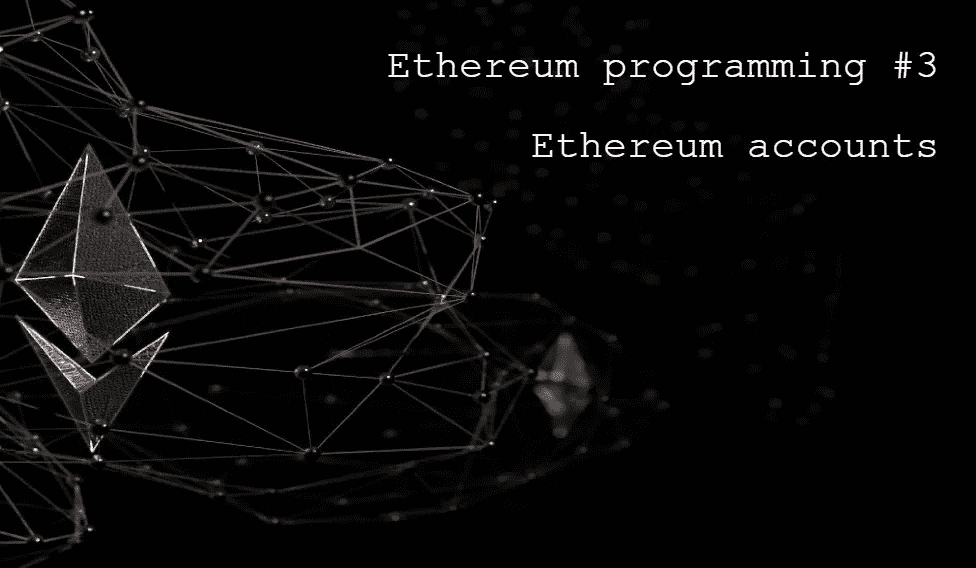
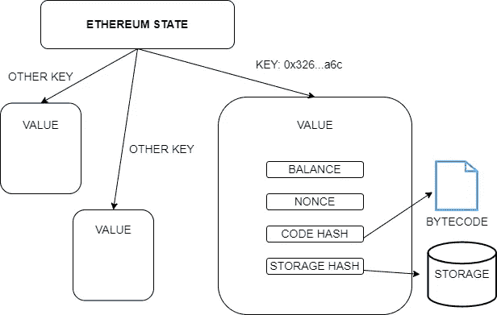
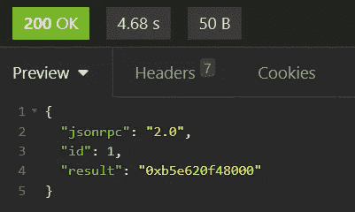

# 学习以太坊编程#3。以太坊账户。

> 原文：<https://medium.com/coinmonks/learn-ethereum-programming-2-ethereum-accounts-fca60dcb191b?source=collection_archive---------7----------------------->



以太坊上有两种账户，**外部自有账户** (EOAs)和**合约账户**。eoa 由私钥控制，而契约账户由代码本身控制。合约帐户不能发送交易，但可以通过向其他帐户发送消息来对交易做出反应(也称为内部交易)。

> 从顶级交易者那里复制交易机器人。免费试用。

eoa 由用户自己通过生成一个 32 字节的随机数来创建。合同账户通过发送到地址 0 的交易创建。任何人都可以创建一个合同帐户，只需支付所需的燃气费。

eoa 只在以太坊上注册，可以说，当他们参与他们的第一笔交易时，无论是他们发送的交易还是为他们发送的交易。没有必要“警告”网络创建帐户。为了更好地理解这一点，我们先来了解以太坊的世界状态是什么样子的。

全局状态是一个键值数据库，其中的键是一个 20 字节的数字。关键是账户地址。EOAs 的地址是根据私钥计算的，而协定的地址是根据创建该协定的帐户及其 nonce 计算的(见后面)。

只要一个账户没有与以太坊进行交易，该地址对应的密钥值就会为空。从第一笔交易开始，以太坊就开始存储账户信息。

账户有 4 条信息:**余额**、**随机数**、**代码哈希** e **存储哈希**。最后两个字段仅对于契约帐户是非空的，并且保存契约代码散列(字节码散列)及其存储散列。字节码是以太坊虚拟机执行的代码。存储器是存储契约的所有状态变量的地方。

在下图中，我们看到了以太坊的状态。给定一个 20 字节的密钥，它的值是一组 4 个字段。



The world state.

我们可以通过 JSON-RPC 使用方法检索关于帐户的信息。我们开始吧。

# 正在检索帐户信息

以太坊中使用最多的方法之一就是恢复账户余额: *eth_getBalance* 。这种方法需要两个参数:帐户的地址和我们想要在哪个块中恢复余额。可以用十六进制或具有值的字符串来通知块号，“最早”、“最新”、“待定”、“安全”和“已完成”。

以太坊上的所有历史信息都由称为*档案节点*的节点存储。因此，可以在过去的任何时间恢复任何帐户的余额。并非每个节点都是归档节点。一些节点只存储以太坊最近状态的信息。

让我们在网络的最后一个区块恢复一个帐户的余额。

```
{
    "method":"eth_getBalance",
    "params":["0xC66d07097f4823343bf116463070B3be5e941C4E","latest"],
    "id":1,
    "jsonrpc":"2.0"
}
```

请求的返回可以在下图中看到。



An account balance.

结果以十六进制形式返回，`0xb5e620f48000`。十进制的话，值`200000000000000`。这个值以卫为单位，这是乙醚的最小值，1 个乙醚值 10 个卫。一个非常有用的把卫转换成以太和把以太转换成卫的地方是 eth-converter.com。以上数值换算成 0.0002 乙醚。

**Nonce** 是一个唯一的数字，表示在外部账户的情况下，给定账户进行了多少次交易。对于合同帐户，nonce 表示该合同已经创建了多少个合同。

我们可以使用 *eth_getTransactionCount* 方法检索一个帐户的 nonce。让我们检索一个帐户的总交易量。

```
{
    "jsonrpc": "2.0",
    "method": "eth_getTransactionCount",
    "params": ["0x27E0155021E63842aFb79F99da8B9592F429f614", "latest"],
    "id": 0
}
```

在戈利那里，结果如下:

```
{
  "jsonrpc": "2.0",
  "id": 0,
  "result": "0x2d"
}
```

这意味着随机数是 45。nonce 是从零开始的，所以这个帐户已经发送了 46 笔交易。当发送下一个事务时，我们必须指示当前 nonce，即 45。

合同账户代码，字节码，也可以通过 JSON-RPC，通过 *eth_getCode* 方法来检索。下面我们来看一个例子。

```
{
    "jsonrpc": "2.0",
    "method": "eth_getCode",
    "params": ["0x24a1f370c33aF7476490d8fe70Fde5629A82842F", "latest"],
    "id": 0
}
```

结果将是字节码，一个长的十六进制数。

我们还可以通过*eth _ getstoraget*方法检索关于合同账户的状态变量的信息。但是，为了更好地理解这种方法，我们必须首先了解存储的结构。我们将在下一课中看到这一点。

# 如何创建一个以太坊帐户，简要回顾

外部拥有的账户是一对密钥，公共的和私人的。公钥是从私钥派生出来的，所以只需要定义一个私钥。基本上，私钥是一个 32 字节的数字。我们可以天真地随机选择一个 32 字节的数字，但是人类不擅长选择真正的随机数。我们最好让软件为我们做这件事。

创建和管理账户的软件被称为钱包。在本课程中，我们将看到更多关于钱包的内容。一些以太坊客户端如 Geth (Go-Ethereum)有钱包功能，但目前不建议将执行客户端作为钱包使用。建议使用另一个软件作为钱包。

没有创建帐户的 JSON-RPC 方法，因为不仅不需要，而且发送私钥也不安全。我要明确的是，是用户远程创建自己的账户。只要账户没有与以太坊互动，网络就不会保留任何关于它们的信息。

**感谢阅读！**

欢迎对本文提出意见和建议。

欢迎任何投稿。www.buymeacoffee.com/jpmorais[。](http://www.buymeacoffee.com/jpmorais)

> 加入 Coinmonks [电报频道](https://t.me/coincodecap)和 [Youtube 频道](https://www.youtube.com/c/coinmonks/videos)了解加密交易和投资

# 另外，阅读

*   [Bookmap 评论](https://coincodecap.com/bookmap-review-2021-best-trading-software) | [美国 5 大最佳加密交易所](https://coincodecap.com/crypto-exchange-usa)
*   [加密交易机器人](/coinmonks/crypto-trading-bot-c2ffce8acb2a) | [造币评论](https://coincodecap.com/coingate-review)
*   最佳加密[硬件钱包](/coinmonks/hardware-wallets-dfa1211730c6) | [Bitbns 评论](/coinmonks/bitbns-review-38256a07e161)
*   [新加坡十大最佳加密交易所](https://coincodecap.com/crypto-exchange-in-singapore) | [购买 AXS](https://coincodecap.com/buy-axs-token)