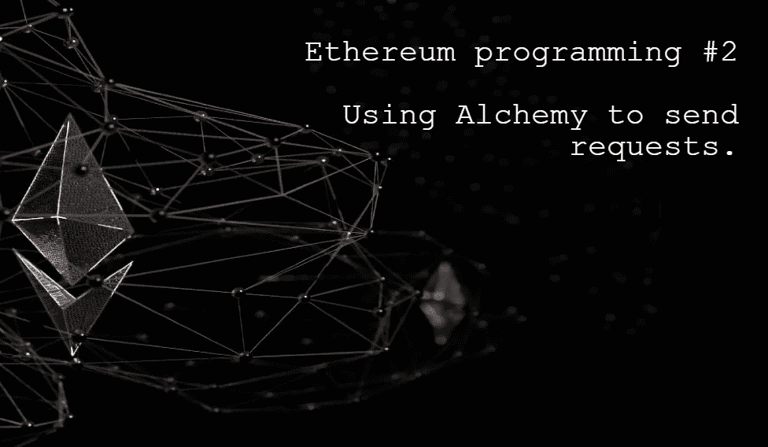
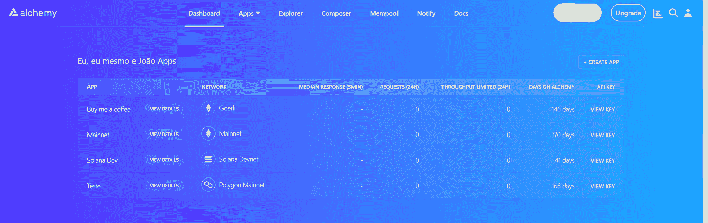
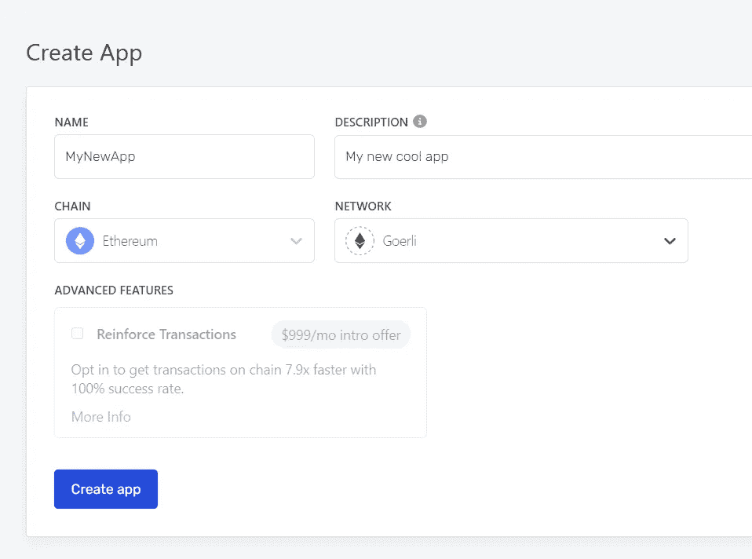
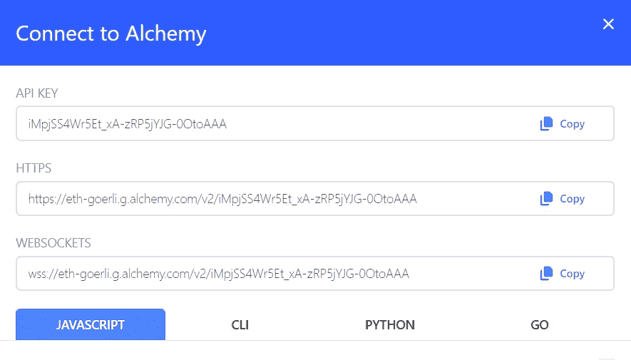
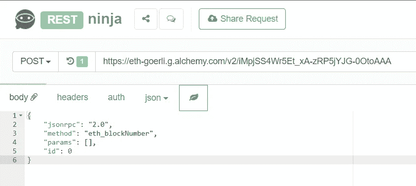
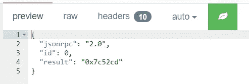

# 学习以太坊编程#2。使用炼金术发送请求。

> 原文：<https://medium.com/coinmonks/learn-ethereum-programming-2-using-alchemy-to-send-requests-a1ee1b5f8296?source=collection_archive---------4----------------------->

目前，要成为以太坊节点，您需要运行至少两个客户端:一个执行客户端和一个共识客户端。要成为以太坊验证器，您需要运行第三个程序，该程序执行块验证和证明。在这种情况下，您需要将至少 32 个以太锁定到一个合约中。

很多时候，作为程序员，我们会向执行客户端发送请求，请求中包含了所有关于块的信息以及以太坊的全局状态。共识客户端维护关于验证器和验证的信息，这并不经常使用。无论如何，consensus 客户端的引入是相对较新的，现在说它们在以太坊编程的未来中的重要性还为时过早。

目前使用最多的执行客户端叫做 Geth，是 Go Ethereum 的缩写，用 Go 语言编写。在以后的文章中，我们将向您展示如何安装 Geth 并使用它的一些特性。然而，一般来说，我们会向某个公司提供的外部节点发送请求。

有几家公司提供这项服务。其中一些是炼金术，Infura 和道德。我提到这些是因为它们是我已经测试过的公司，并且有免费的计划。两者都非常适合在以太坊上编程，最大的区别是它们支持的网络。当然，它们都支持以太坊主网，但很多时候我们希望与以太坊兼容的网络一起工作，如 Polygon、BNB 链、Avalanche 或第 2 层，如 Arbitrum 和 Optmism。并非所有这些公司都支持所有这些提到的链。

除了接受执行客户端的请求，这些公司还提供其他服务，比如他们自己的 API 和事件监控。我们不会使用任何其他服务，但它们肯定很有趣。

提到的公司目前都不接受共识客户的请求。一个有趣的事实是，以太坊的共识客户端使用 Rest 而不是 JSON-RPC 接收请求，JSON-RPC 是自比特币以来的标准。

我认为 Alchemy 的服务很好，使用起来也很简单，所以我将在这里简单地展示如何创建一个 API 键并生成一个端点。

# 使用炼金术

除了有一个接受每月大量请求的免费计划，Alchemy 还有一个主动水龙头服务。例如，一个炼金术账户允许你向格利请求乙醚。这很有帮助。

创建了一个非常简单的 Alchemy 帐户后，主页面就指向了仪表板，如下图所示。Alchemy 的免费计划允许您创建多达 5 个应用程序，每个应用程序在一个特定的网络上，并有自己的密钥。

The dashboard.

要创建新的应用程序，请在顶部菜单中选择“应用程序”选项卡和“创建应用程序”按钮。这一点可以从下图中看出。

Creating a new app.

在下一个屏幕上，填写应用程序的基本信息。应用程序名称和描述并不重要，但您必须选择正确的网络。在连锁，让我们选择*以太坊*，在网络，*歌尔利*。我们可以在下图中看到这一点。

Filling in the information about the application.

以太坊目前有两个测试网，Goerli 和 Sepolia。两者都使用利益相关者共识机制，但 Goerli 是分散的，而 Sepolia 是集中的。到目前为止，还不能在炼金术中使用赛波利亚。

创建新应用程序后，它将出现在控制面板上，如下图所示。

The created application appears on the dashboard.

创建应用程序后，可以通过点击**查看键**按钮来检索端点。它位于右侧角落，在面板的项目行中。这一点可以从下图中看出。

It is possible to use HTTPS, WebSocket or Alchemy’s own SDKs.

Alchemy 有自己的几个语言的 SDK，但是我们不打算使用它们中的任何一个。我们需要的是 HTTPS 端点，它应该有以下路径:[https://eth-goerli . g . alchemy . com/v2/[YOUR-KEY](https://eth-goerli.g.alchemy.com/v2/[YOUR-KEY)

现在可以通过 Alchemy 的端点用 JSON-RPC 向 Goerli 网络发送请求。为此，我们需要一些发送 HTTP 请求的客户机。

浏览器发送 HTTP 请求，但是使用 POST 方法发送请求并不简单。有一些程序做起来容易得多，比如[邮递员](https://www.postman.com/)或者[失眠](https://insomnia.rest/)。也可以使用在线应用程序发送此类请求，如[https://restninja.io/](https://restninja.io/)。

在下图中，我使用 restninja 网站向 Alchemy 发送请求。注意，我使用的是上面检索到的端点，我选择了 POST 方法(重要的是，通常默认方法是 GET ),并将请求以 JSON 格式写在主体中。

Sending a JSON-RPC request to Alchemy.

正如我们在上一篇文章中看到的，我们必须编写的 JSON 有 4 个属性: *jsonrpc* ， *id* ，*方法*和 *params* 。以太坊有几个我们可以执行的方法，有些方法有强制和可选参数。

# JSON-RPC 请求技巧

在上面的例子中，我们发送了一个执行 *eth_blockNumber* 方法的请求。以太坊方法以 *eth_* 开始，并以 camel case 格式继续。在处理数字时，数字必须被发送，并且将以十六进制返回。

下图显示了方法 *eth_blockNumber* 的返回。该方法要求最后一个块号。值为 *0x7c52cd* ，其中 *0x* 表示数字为十六进制。有几个网站可以把十六进制转换成十进制。上面的数字是十进制的 8147661。

The return of the request is in hexadecimal.

我们可以运行的另一个方法是 *eth_chainId* 方法，它应该返回网络 Id。每个兼容以太坊协议的网络都有一个 ID，Goerli 的 ID 是 5。试试看！

并不是每个以太坊的方法都会被炼金术所接受。有些节点还充当钱包，因此有一些方法是要发送到钱包的，比如请求帐户，甚至要求节点签署交易。炼金术不是钱包，所以这样的方法不会被接受。

然而，完全有可能将炼金术与钱包一起使用。因此，在将交易发送给 Alchemy 之前，钱包会在交易上签名。

**感谢阅读！**

欢迎对本文提出意见和建议。

欢迎任何投稿。[www.buymeacoffee.com/jpmorais](http://www.buymeacoffee.com/jpmorais)。

> 交易新手？尝试[加密交易机器人](/coinmonks/crypto-trading-bot-c2ffce8acb2a)或[复制交易](/coinmonks/top-10-crypto-copy-trading-platforms-for-beginners-d0c37c7d698c)
> 
> 多样化的密码持有，了解币安的选择
> 
> 加入 Coinmonks [电报频道](https://t.me/coincodecap)和 [Youtube 频道](https://www.youtube.com/c/coinmonks/videos)获取每日[加密新闻](http://coincodecap.com/)

# 另外，阅读

*   [复制交易](/coinmonks/top-10-crypto-copy-trading-platforms-for-beginners-d0c37c7d698c) | [加密税务软件](/coinmonks/crypto-tax-software-ed4b4810e338)
*   [网格交易](https://coincodecap.com/grid-trading) | [加密硬件钱包](/coinmonks/the-best-cryptocurrency-hardware-wallets-of-2020-e28b1c124069)
*   [密码电报信号](/coinmonks/top-3-telegram-channels-for-crypto-traders-in-2021-8385f4411ff4) | [密码交易机器人](/coinmonks/crypto-trading-bot-c2ffce8acb2a)
*   [最佳加密交易所](/coinmonks/crypto-exchange-dd2f9d6f3769) | [印度最佳加密交易所](/coinmonks/bitcoin-exchange-in-india-7f1fe79715c9)
*   [开发者最佳加密 API](/coinmonks/best-crypto-apis-for-developers-5efe3a597a9f)
*   最佳[密码借贷平台](/coinmonks/top-5-crypto-lending-platforms-in-2020-that-you-need-to-know-a1b675cec3fa)
*   [免费加密信号](/coinmonks/free-crypto-signals-48b25e61a8da) | [加密交易机器人](/coinmonks/crypto-trading-bot-c2ffce8acb2a)
*   杠杆代币的终极指南