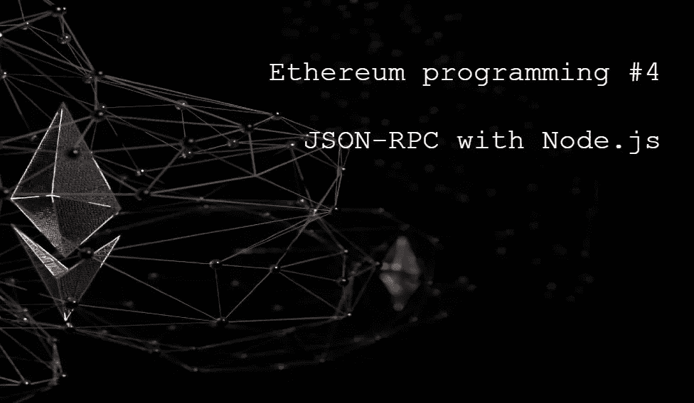
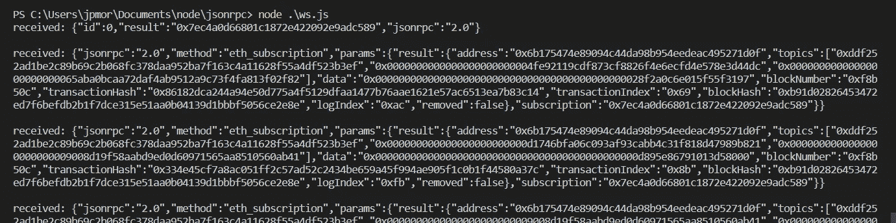

# 学习以太坊编程#4。带有 Node.js 的 JSON-RPC

> 原文：<https://medium.com/coinmonks/learn-ethereum-programming-4-json-rpc-with-node-js-6e0ca00c3c50?source=collection_archive---------9----------------------->



JSON-RPC 是一个远程调用协议，它的数据是用 JSON 编码的。大多数区块链客户端通过 JSON-RPC 发送请求。发送 JSON-RPC 的协议可以是 http、WebSocket，在某些情况下也可以是 gRPC。实际上，每种编程语言都有一个通过 HTTP 发送请求的模块，所以我们可以使用这些语言中的任何一种连接到区块链。

在本课中，我们将使用 Node.js 发送请求。理论上，这就是我们在 Ethereum 上编写一个分散式应用程序所需的全部内容，还有一些加密库来签署我们的事务。在现实生活中(不是在理论上)，我们使用具有专门方法的库来与区块链进行交互，以便使我们的生活更容易。

在任何情况下，理解事情如何在幕后工作，以及了解以太坊执行客户端接受的方法都是很重要的。许多 web3 库方法只不过是可以通过 JSON-RPC 执行的方法的简单包装。

首先，我将在某个目录下创建一个名为 *jsonrpc* 的文件夹，并在其中启动 Visual Studio 代码。之后，我会用`npm init -y`指令启动一个程序。然后我们将安装 3 个包: *axios* 、 *ws* 和 *dotenv* 。

```
npm i axios ws dotenv 
```

Axios 是一个创建 HTTP 客户端的库。Ws 是一个使用 WebSocket 的库。Dotenv 是一个在 Node 中使用环境变量的模块。

# 遵守守则

向 Alchemy(或任何其他)节点发送请求的代码非常简单。考虑下面的代码。

```
require("dotenv").config();
const axios = require("axios");

const payload = {
    jsonrpc: "2.0",
    id: 0,
    method: "eth_getBalance",
    params: ["0x8303539291922EF29B518B5B93e8Ab07F22F2D1d","latest"]    
};

(async () => {
    const response = await axios.post(`https://eth-goerli.g.alchemy.com/v2/${process.env.ALCHEMY_KEY}`, payload)
    console.log(response.data)
})(); 
```

首先我们导入两个我们需要的库， *dotenv* 和 *axios* 。有效负载是必须作为 JSON 发送的 javascript 对象，它要求执行`eth_getBalance`方法。我将它与两个参数一起使用，一个是恢复余额的地址，另一个是我想要最近余额的指示(可选)。

> 交易新手？在[最佳加密交易](/coinmonks/crypto-exchange-dd2f9d6f3769)上尝试[加密交易机器人](/coinmonks/crypto-trading-bot-c2ffce8acb2a)或[副本交易](/coinmonks/top-10-crypto-copy-trading-platforms-for-beginners-d0c37c7d698c)

然后我编写一个异步函数并立即执行，使用 *axios* 库发送 HTTP 请求。它需要两个参数:节点地址和作为 JSON 发送的 JavaScript 对象。

注意，我使用`process.env.ALCHEMY_KEY`作为键。为此，您需要在同一个目录中创建一个`.env`文件，并声明 Alchemy 密钥，如下所示。

```
ALCHEMY_KEY=1P_1HHvUYb...nZhZ5DY
```

最后，我只将响应的*数据*属性写入控制台，因为在那里可以找到返回数据。注意使用 Node.js 发送 HTTP(或 HTTPS)请求是多么简单

# HTTP 或 WebSocket

大多数以太坊客户端同时使用 HTTP 和 WebSocket 接受请求。它们是不同的协议，行为也不同。使用 WebSocket，在客户端和服务器之间打开一个通信通道，并且该通道保持打开，直到它被显式关闭。

当我们只想要特定的信息时，使用 HTTP 就足够了。然而，有时我们希望持续接收信息，比如当我们订阅一个请求以持续接收智能合约发出的事件信息时。在这种情况下，有必要使用 WebSocket。

让我们修改代码来发送订阅请求。在其中，我们将请求接收以太坊上由戴令牌发出的所有事件。让我们看看下面的代码。

```
require("dotenv").config();
const WebSocket = require("ws")

const payload = {
    jsonrpc: "2.0",
    id: 0,
    method: "eth_subscribe",
    params: [
        "logs",
        {
            address: '0x6b175474e89094c44da98b954eedeac495271d0f',
            topics: []
        }
    ]    
};

const ws = new WebSocket(`wss://eth-mainnet.g.alchemy.com/v2/${process.env.ALCHEMY_KEY}`)

ws.on('open', () => {
    ws.send(JSON.stringify(payload))
})

ws.on('message', (data) => {
    console.log(`received: ${data} \n`)
})
```

比上一部长一点，但也不复杂。首先，我们不再使用 axios，而是使用一个名为 *ws* 的库。

我们的有效负载也不同，因为我们现在要求执行`eth_subscribe`方法。在第一个参数中，我们指出我们想要接收什么，日志，在第二个参数中，我们指出我们想要接收事件的契约的地址。在本课中将看不到名为“主题”的字段，我们可以将其留空。

我们使用带有支持 WebSocket 的 Alchemy 节点地址的`new WebSocket` 创建 WebSocket 对象的新实例。请注意，我将节点地址更改为 Mainnet，因为我要监控的契约就在上面。

在创建的实例中，我们为两个事件定义了回调。

在 *open* 事件中，我们发送我们创建的有效载荷，编码为 JSON。在*消息*事件中，我们将接收到的数据写入控制台。每次智能合约发出事件时，都会执行*消息*事件。

在下图中，我们可以看到执行上述代码的回报。该连接将保持活动状态，接收来自 Alchemy 的消息，直到被其中一方终止。



Subscribing to receive events.

我希望清楚使用 Node.js 与区块链交互是多么简单，不需要任何以太坊专用的库。

**感谢阅读！**

欢迎对本文提出意见和建议。

欢迎任何投稿。www.buymeacoffee.com/jpmorais。