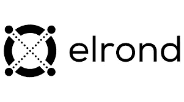

# 了解更多关于埃尔隆德区块链的信息

> 原文：<https://medium.com/coinmonks/learn-more-about-elrond-blockchain-5aece946043d?source=collection_archive---------25----------------------->

埃尔隆德网络是一个高度可扩展、超高速、安全的平台，专为创建分布式应用而构建。使用本地埃尔隆德令牌(EGLD)，埃尔隆德区块链正在为“新互联网经济”创造创新的新用例。自网络的 mainnet 于 2020 年 7 月推出以来，埃尔隆德桩设施和 Maiar 应用程序的引入为该平台带来了巨大的采用浪潮。但是，什么是埃尔隆德，埃尔隆德是如何运作的？嗯，我们是来讨论这个问题的！

# 那么，埃尔隆德是什么？

埃尔隆德是一个超级快速、高度安全和可扩展的区块链，帮助企业和个人从新的 web3 互联网经济中受益。

全球企业都在使用埃尔隆德，它为新的数字金融格局提供了一条简单的道路。埃尔隆德区块链比许多竞争对手的区块链快 1000 倍。此外，可伸缩性的范围是前所未有的。

埃尔隆德正在向世界介绍新开发的科技金融模式，埃尔隆德网络是这一举措的核心。

此外，埃尔隆德有几个主要特点。这些包括赌注、治理、智能合同、验证者奖励和廉价交易。

**埃尔隆德历史**

埃尔隆德是由经验丰富的企业家、工程师和研究人员组成的团队建立的，他们有着丰富的区块链背景以及在微软、谷歌、英特尔和 NTT 数据公司的技术经验。该团队包括两名计算机科学和人工智能博士，多名数学、计算机科学和人工智能奥林匹克冠军，以及一名前 NEM 核心团队成员。

埃尔隆德由卢西恩·托迪亚和明库兄弟于 2017 年底创建并推出。Beniamin 和 Lucian Mincu 还共同创立了初始硬币发行信息聚合器 ICO Market Data 和数字资产投资基金 MetaChain Capital。埃尔隆德团队组织了一轮私人投资，为该项目带来了近 200 万美元。

2020 年 7 月，埃尔隆德举行了一次 ICO，通过出售其总供应量的 25%筹集了超过 320 万美元。最初，埃尔隆德以 ERD 的名字进行交易，而一旦 mainnet 发布，股票代码就变成了 EGLD (eGold)。

# 那么是什么让埃尔隆德与众不同呢？

埃尔隆德的独特之处在于它以自适应状态分片的形式使用分片，将网络分成更小的部分，以便节点可以通过一次解析一个分区来验证事务和网络操作。这确保了网络每秒可以处理成千上万的交易，同时只需要很低的费用。

埃尔隆德项目希望创造一种新的数字经济，在这种经济中，去中心化和可伸缩性是其区块链基础设施不可或缺的特征。埃尔隆德允许用户创建新的资产，分散应用程序，并以低成本进行交易。该项目也是独一无二的，因为它支持企业级 Dapps，同时支持扩展并提供三种编程语言。

在该平台推出至 2020 年 9 月期间，埃尔隆德使用了一种被简称为埃尔隆德的本币，符号为 ERD。从 2020 年 9 月开始，发生了一次转换，导致 ERD 持有者每拥有 1，000 个 ERD 获得 1 个 EGLD。虽然 ERD 没有最大供应量，但 EGLD 的供应量上限为 31，415，925 枚硬币

如今，埃尔隆德的生态系统包含了超过 100 个项目，包括 stablecoins、wallets、validators 和支付提供商。埃尔隆德还整合了 Orion 和 Reef 等分散融资项目，而在区块链建设的其他项目包括 UTU 和 ARPA。

Egold 的限量供应从 2000 万代币开始，总供应量约为 31.415.926。从技术上讲，这一数字将会减少，因为每笔交易的一部分费用会被烧掉，因此流程交易的数量会增加。

埃尔隆德价格经常受到价格变化的影响，价格变化主要受加密货币市场波动的影响。EGLD 的价格也会受到许多因素的影响，这些因素会影响埃尔隆德的市场价值。

除了市场情绪、交易所的资产流动和整体经济等传统因素之外，EGLD 的价格还受到赌注的代币数量以及用于支付赌注奖励的协议费用和通货膨胀之间的平衡的影响。

您可以安全地将您的 eGold tokens 存储在任何可用的 mainnet 钱包中，例如埃尔隆德钱包，它的交易费用低一百倍，并且完全托管您的资金。Maiar 是埃尔隆德区块链支持的另一款官方电子钱包。您可以在 wallet 应用程序中注册您的电话号码，以便轻松使用您的资金并激活 wallet 帐户。万一你丢失了钱包，你可以使用密码来恢复访问。您也可以将 EGLD 的 Frontier wallet 与埃尔隆德应用程序结合使用来激活该服务。

有很多其他地方可以存放你的电子钱包，你选择的钱包很可能取决于你想用它做什么以及你需要存放多少。

现在有超过 100 万人在埃尔隆德区块链拥有账户，其中超过 80 万人也下载了 [Maiar](https://get.maiar.com/referral/pn9gju1pu3) 。对他们来说，数百名开发人员正在构建 220 多个项目、NFT、市场、资源和工具。

随着采用抛物线，跟踪埃尔隆德生态系统中发生的一切似乎几乎是不可能的。

与其他 3.0 cryptos 不同，埃尔隆德团队自己已经并将在生产中发布易于使用的软件。他们不会将工作外包给其他 launchpad 项目，也不会简单地为它们提供资金，但他们自己正在构建核心基础设施，你可以用它来体验伟大的底层技术。

mainnet、web wallet、 [Maiar](https://get.maiar.com/referral/pn9gju1pu3) iOS 和 Android 应用以及 staking 都是在发布后的前 6 个月推出的。在接下来的两周内，一个 DEX+standard token(ESDT)+launch pad 将上线供您玩。

但当我们考虑采用区块链技术和加密货币时，最大的障碍是新技术固有的复杂性。只要尝试向普通人解释区块链和加密货币的效用，你很快就会发现这是真的。

埃尔隆德团队看到了 ERD 的这一障碍，并知道要覆盖超过 10 亿人，他们需要彻底反思和重新设计埃尔隆德本币的象征经济学。

谢谢你一直读到最后！下次见，管好你的钱！

[**网站**](https://www.b-successful.com/)**|**[**YouTube**](https://www.youtube.com/channel/UCWrfC_w5wVnrOr8jy0ICoDw)**|**[**推特**](https://twitter.com/BSuccessful_)**|**[**insta gram**](https://www.instagram.com/bsuccessful.crypto/)**|**[**电报**](https://t.me/+NQbP3V_iaKQwMDYy) **|** [**脸书**](https://www.facebook.com/Bsuccesful/?_rdc=2&_rdr)**|**

> **交易新手？试试[加密交易机器人](/coinmonks/crypto-trading-bot-c2ffce8acb2a)或[复制交易](/coinmonks/top-10-crypto-copy-trading-platforms-for-beginners-d0c37c7d698c)**