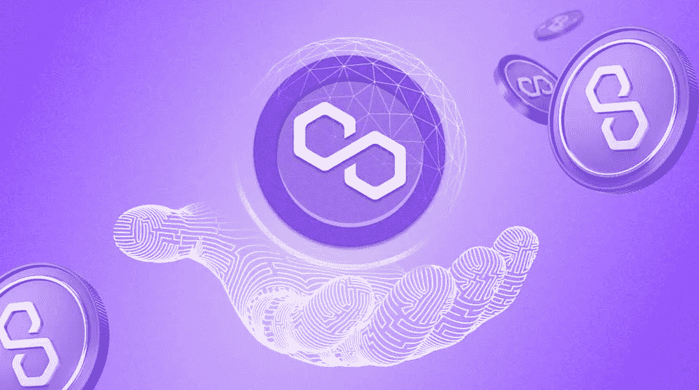

# 了解有关面网络(MATIC)的详细信息

> 原文：<https://medium.com/coinmonks/learn-more-about-polygon-network-matic-d548426a2e1d?source=collection_archive---------3----------------------->

Polygon 以前被称为 Matic Network，这是一个扩展解决方案，旨在提供多种工具来提高速度，降低区块链网络上交易的成本和复杂性。

Polygon Network (MATIC)

Polygon 是一个多层平台，其目标是扩展以太坊，因为有大量的侧链，所有这些都旨在以经济高效和有利的方式去聚合主平台。因此，Polygon 可以与 Polkadot、Cosmos 和 Avalanche 等其他竞争网络进行比较。

您是否对多边形网络感兴趣，但不确定它是关于什么或从哪里开始？一直读到最后，你会发现你需要知道的一切。

Polygon 的创始人是谁？

Polygon 是一个开源项目，由一个分散的全球开发团队组成，它是从成功的 MATIC network 发展而来的。Matic Network 最初是作为一个扩展解决方案设计的，它使用一个带有基于 PoS(服务点)的侧链的 Plasma 改编版本，为以太坊带来了大规模的扩展。

它的持续成功以及与分散土地(MANA)和 MakerDAO (MKR)等项目的合作，加上来自比特币基地和币安等行业领袖的支持，使该团队能够扩大项目的雄心和技术范围。

首席执行官兼联合创始人 Jaynti Kanani 是一位富有创造力的技术架构师，拥有丰富的经验。作为 Housing.com 的首席数据科学家，Jaynti 帮助确保了其作为印度第一本土搜索平台的地位。

印度最大的专业服务市场 Scopewaver.com 的前首席执行官、联合创始人首席运营官·桑德普·内尔瓦尔是德勤的前管理顾问。

Polygon 团队相信他们可以成功地将任何额外的可伸缩性整合到他们自己的解决方案中。这是一个大胆的声明，可能是确保 Polygon 在快速发展的以太坊区块链生态系统中的主要地位的关键因素。

**多边形网络是如何工作的？**

Polygon 的最终愿景是建立一个互联的 L2 侧链生态系统，恰如其分地命名为以太坊区块链互联网。这个概念涉及一种分支方法，包括一个协议和一个框架，用于构建和连接以太坊兼容的区块链网络。Polygon 以前称为 MATIC network，它提供了一个由一系列层组成的多面(模块化)以太坊扩展框架。其长期愿景是成为一个无缝集成分散服务和产品的中心。

Polygon 被视为每个开发人员创建专用区块链网络的一种方式，它结合了独立区块链的最佳特性(灵活性、主权和可伸缩性)和以太坊的最佳特性(安全性、开发人员体验和互操作性)。

Polygon 的主要目标是提供一个构建区块链网络的框架，这些网络可以相互连接，而不是被封闭在一起。Polygon 有许多计划中的功能，包括 ZK 汇总，将大量的链外转移聚合到单个交易中，以及乐观汇总，在以太坊上运行，以提供近乎即时的交易。这两个特性在扩展以太坊的竞争中提供了独特的优势，并解决了当前网络拥塞和高交易费用的问题。

网络的未来听起来不错，Polygon 在 2021 年推出了 Polygon Studios，这是 Polygon 的子公司，专注于区块链游戏和不可替代的代币(NFTs)。如果成功，Polygon 工作室可以成为分散式游戏和 NFTs 的领先技术提供商。

2022 年 1 月，Polygon 迎来了新的首席执行官(CEO)。Ryan Watts 加入 Polygon 之前是 YouTube 的游戏主管

**为什么 MATIC 是一种成功的加密货币？**

Polygon 被认为是专注于区块链互操作性和伸缩性的最令人兴奋的项目之一，这是该技术最常受到批评的一些问题。该网络已经超越了其最初对 Matic 的愿景，为开发人员提供了一套详尽的工具来创建高性能、高可扩展性的区块链协议和 dApps。

MATIC 是 Polygon 网络的本地加密货币，用于促进整个网络的发展，并可用于赌注和支付交易费用。

用户可以通过向多边形网络提供计算资源和服务来获得自动令牌。这可以通过验证交易或在网络上执行智能合同来实现。

此外，通过拥有和下注 MATIC，用户可以对网络更新进行投票，每一票都与他们下注的 MATIC 加密货币的金额成比例。

与许多其他加密货币一样，MATIC 令牌的供应是有限的，这意味着，根据软件的规则，将只有 100 亿 MATIC 硬币在流通。

**有多少马克硬币在流通？**

Matic token 目前有 8，006，803，953 枚流通硬币，固定总量为 10，000，000，000 枚。拥有固定的硬币供应量而不是无限的供应量，理论上可以增加代币的价值，但这取决于许多因素，尤其是代币设计的感知价值以及通过积极的设计解决方案/技术吸收取得的成功。

当供应不足导致稀缺性增加时(如比特币的情况)，剩余的代币可能被认为具有独立于功能的稀缺价值。作为公用令牌，Polygon 的未来价格变动还取决于使用令牌支付网络交易费用的网络交易吞吐量。MATIC 令牌既用于支付交易费用，也用于参与利害关系的共识证明。

总之，Polygon 为整个区块链生态系统带来了一个定制的功能集——不仅有望减少以太坊面临的挑战，还有助于创造一个区块链互操作性成为常规的未来。Polygon 的模块化主权安全选项牢固地建立在 MATIC 网络与 Plasma 的迭代(这被证明是简化交易流程的有用工具)的进展之上，使其成为许多项目的一个有吸引力的环境。

作为 Polkadot 的强大竞争对手，Polygon 最近于 2021 年 2 月推出的产品赋予了它一种进化优势，这部分来自于一种看法，即即使是它的前辈也没有完全实现他们的目标。该项目旨在成为区块链的互联网，是全自动化机器经济发展的一个重要里程碑。

感谢您的阅读！请告诉我们你对多边形生态系统的看法。下次见，管好你的钱！

页（page 的缩写）S

如果你想听一些视觉效果的信息，你可以在这里观看我们的 YouTube 视频[。](https://www.youtube.com/watch?v=8bILE_fN_-A&t=177s)

[**网站**](https://www.b-successful.com/)**|**[**YouTube**](https://www.youtube.com/channel/UCWrfC_w5wVnrOr8jy0ICoDw)**|**[**推特**](https://twitter.com/BSuccessful_)**|**[**insta gram**](https://www.instagram.com/bsuccessful.crypto/)**|**[**电报**](https://t.me/+NQbP3V_iaKQwMDYy) **|** [**脸书**](https://www.facebook.com/Bsuccesful/?_rdc=2&_rdr)**|**

> **交易新手？试试[加密交易机器人](/coinmonks/crypto-trading-bot-c2ffce8acb2a)或者[复制交易](/coinmonks/top-10-crypto-copy-trading-platforms-for-beginners-d0c37c7d698c)**