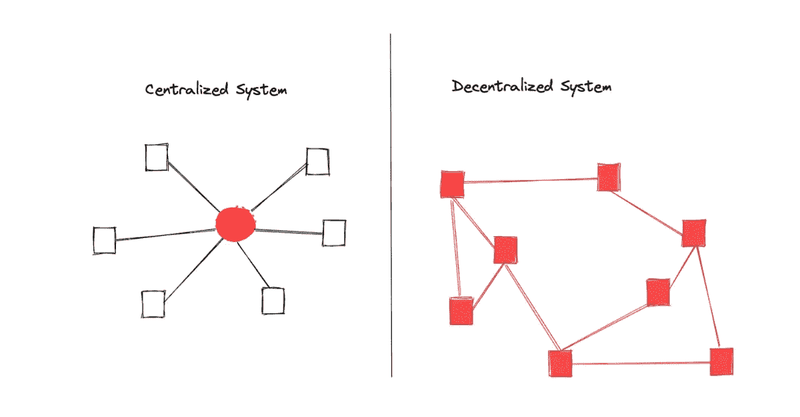
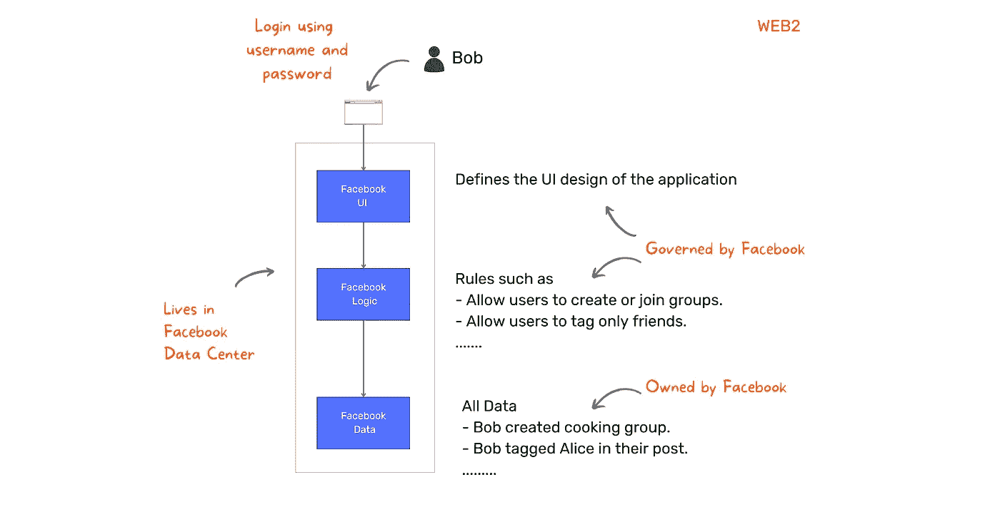
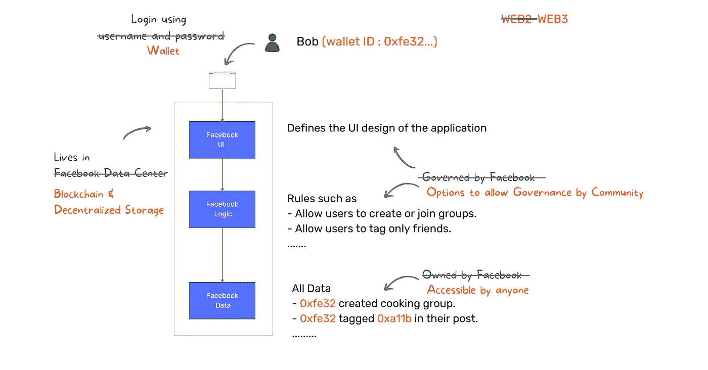

# Web3 架构——简单介绍

> 原文：<https://medium.com/coinmonks/learn-more-about-the-decentralized-protocol-7d3f10aa0cf0?source=collection_archive---------6----------------------->

Network Architecture

以太坊是一个支持智能契约执行的分散式协议。

那是什么意思？

让我们解码权力下放

一个集中的系统由一个或一组实体拥有。它们通过促进参与者之间的交易来提供价值，除非否则很难实现。我们与之互动的绝大多数系统都是集中式的。

例如，脸书使我们能够与世界各地的朋友和社区联系。虽然他们在民主化交流中发挥了巨大作用，但他们是中央集权的，是网络的唯一权威。

Web2 Architecture

这有问题吗？

一些常见的问题是:

🔒数据隐私:他们向我们提供免费服务，以换取我们自己数据的权利。我们如何知道它能防止黑客攻击和滥用？

🧠审查和偏见:我们不得不相信他们的系统能给我们提供公正的信息。他们可以随时改变规则，如禁止团体或个人，增加广告费用等。

🛂数据可移植性:我们的数据被封闭在他们的墙后，我们很难在平台之间转移数据。结果是，不管发生什么，我们都被他们缠住了。

💲货币化:虽然他们基于用户生成的数据来货币化，但内容所有者没有得到公平的回报。

这些问题不是任何一个系统所独有的，而是集中式系统中的常见问题。

在分散式体系结构中，没有单一的实体来控制系统。相反，它是由一群独立的参与者经营的。资源不属于任何实体，每个参与者都可以完全访问它。

它有望解决我们今天面临的集中式系统的问题。

**那么，以太坊是去中心化的脸书还是去中心化的银行或者？**

不，以太坊是一个分散的网络，它提供了在其上构建任何分散的应用程序(dapps)的基础设施。

我们可以建造

🌐社交网络(如脸书、推特、媒体)

🏦金融服务(银行、交易所、贷款机构)

🎮娱乐(游戏、艺术)

🏢组织

诸如此类。

机会是无穷无尽的。

一个分散的应用程序将运行在一个区块链上，而不是一个中央服务器，每个人都可以访问它的数据。

如果像脸书这样的社交网络建立在以太坊之上，会发生什么？

Web3 Architecture

定义系统规则和参与者之间交互的逻辑被部署到以太坊网络，而不是中央服务器。这就是我们所说的“智能合约”。

智能合约是在区块链上存储和运行的计算机程序。通过部署到网络上，任何人都可以检查代码。由于网络执行代码，因此不需要中介来托管和执行代码。

智能合约的数据将以分散的方式存储。

*   用户及其帖子所有权将被记录在区块链中。
*   实际内容(图像、视频等)将存储在分散的存储器中(如 IPFS/Arweave ),因为区块链不适合大文件。

任何人都可以访问上述数据来开发竞争洞察力。

例如，我们不能查询脸书数据库来检索所有的病毒帖子。然而，有了这样一个分散的系统，这是可能的。

听起来很酷，不是吗？

除了上面的例子之外，还有其他基于以太坊区块链的真实应用吗？

以太坊网络上运行着 2000+dapp。检查[这里的](https://www.stateofthedapps.com/platforms/ethereum)

如果你有兴趣了解更多关于区块链分析的信息，请注册接收关于即将发布的文章和[项目](https://www.twigblock.com/projects)的通知。

【https://www.twigblock.com】最初发表于**。**

> *交易新手？尝试[加密交易机器人](/coinmonks/crypto-trading-bot-c2ffce8acb2a)或[复制交易](/coinmonks/top-10-crypto-copy-trading-platforms-for-beginners-d0c37c7d698c)*