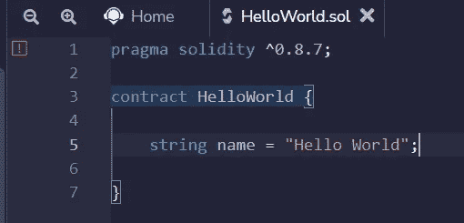

# 学习第一课的可靠性。你好世界。

> 原文：<https://medium.com/coinmonks/learn-solidity-lesson-1-hello-world-ff774182c8a8?source=collection_archive---------0----------------------->


稳健是撰写智能合同最常用的语言。它为以太坊虚拟机 **EVM** 编译。它是一种静态类型的高级语言，集成了一些面向对象的特性。

智能合约就像能够修改以太网状态的小程序。状态是存储在区块链上的信息(通常由智能合约中定义的变量创建)。例如，给定账户的以太(或其他基础硬币)余额是以太币状态。广义地说，EVM 是一台根据交易改变状态的机器。

以太坊的主要特点是它是一个去中心化的网络。它的世界状态(完整状态)在世界各地的几台计算机(客户机/服务器)上复制，称为节点。确保所有节点保持完全相同的世界状态的是区块链共识机制。

以太坊是一个基于 **p2p** (点对点)协议的分散式网络，这一事实表明，我们称与区块链分散式应用程序(dApps)交互的应用程序为应用程序。

在本课程中，我们将教您如何为 EVM 创建智能合约，即可以在任何实施 EVM 的区块链上运行的智能合约。在这个过程中，我们将理解什么是世界状态，以及事务如何修改这样的状态。

**混音 IDE**

以太坊虚拟机有自己的汇编语言，无论使用什么高级语言，都需要针对 EVM 进行编译。为 EVM 编译 Solidity 的编译器是 solc。还有其他语言可以为 EVM 编译，比如 **Vyper** ，但是最常用的语言是 Solidity。

编写、编译和部署智能合约的最简单方法是使用集成开发平台 IDE。在本课程中，我们将使用名为 **Remix** 的在线 IDE。

混音可以在[remix.ethereum.org](http://remix.ethereum.org)获得。


The online IDE Remix.

要开始新合同，请在位于屏幕左侧的\textit{contracts}文件夹中创建一个新文件。我们可以在下图中看到这一点。


Creating a new file on Remix.

让我们把这个新文件叫做 *HelloWorld.sol* (没人会惊讶)。Solidity 的扩展名是*。sol* 。Remix 将打开这个新文件，我们可以开始编写智能合同。

我们首先用 **pragma** 指令通知我们想要运行的编译器版本，如下所示

```
pragma solidity ^0.8.7;
```

这意味着要使用的编译器是 0.8.7 或更高版本，即最后一个数字可以大于 7，但第二个数字不能大于 8。

有几种方法可以定义要使用的编译器版本。最简单的就是标明完整版本，比如 0.8.7。然而，一般来说，我们希望使用比指定版本更高的任何版本，只要它没有发生任何可能破坏向后兼容性的变化。为了实现这一点，我们使用了帽子的“^''符号”。这意味着编译器可以是 0.8.8、0.8.9 等版本，但不是 0.9.x 或更高版本。

**你好世界**

为了表示我们将开始一个新的合同，我们使用了*合同*这样的句子

```
contract HelloWorld {...}
```

Solidity 使用了一种基于花括号{ }的语法，类似于 C，Java，JavaScript 等。在*契约*中的所有东西都将是我们契约的一部分，但是编译器也会使用这个范围之外的声明，我们将在以后的课程中看到。

程序员可能认为*契约*声明类似于声明一个新类。事实上，契约可以被其他契约实例化，类似于我们对对象所做的。这个后面会看到。

> 交易新手？尝试[加密交易机器人](/coinmonks/crypto-trading-bot-c2ffce8acb2a)或[复制交易](/coinmonks/top-10-crypto-copy-trading-platforms-for-beginners-d0c37c7d698c)

合同的结构由几个部分组成。我们将看到的第一个是状态变量的声明，它将成为区块链世界状态的一部分。在这个例子中，我们将从声明一个 string 类型的状态变量开始。

```
string name = "Hello World";
```

Solidity 是一种类型化语言，所以我们需要明确地指出我们所声明的变量的类型。字符串是一种实体引用类型(在后面的课程中将详细介绍)。变量名为 *name* 并被初始化为值 *Hello World* 。

变量在 Solidity 中不需要显式初始化，但如果在声明时没有初始化，则初始化为默认值。在字符串的情况下，它将为空，或为' ' ' '。

我们在函数之外定义的所有变量都称为状态变量，它们在区块链上是永久的。在部署契约时，会分配一个专用空间来存储其值。我们希望成为永久变量(即创建状态)的所有变量都必须在这个范围内声明。

要保存合同，请使用 **Ctrl+S** (或您的操作系统上的同等工具)。合同将自动编译。当你这样做的时候，注意编译器已经指出了一个警告，用一个橙色的感叹号表示。见下图。



Remix warns that something is not correct in the code.

当鼠标悬停在感叹号上时，会显示警告原因。在我们的例子中，警告的原因如下:
*警告:源文件中没有提供 SPDX 许可证标识符。在发布之前，考虑在每个源文件中添加一个包含“SPDX-License-Identifier:”的注释。*

出现该警告是因为建议包含许可证指示，因为您的代码将是公共的。虽然这不是强制性的，但是让我们通过在编译器指令前添加下面一行来实现这一点。

```
//SPDX-License-Identifier: MIT
```

我们必须注意编译器警告。虽然它们不妨碍合同的编制，但必须在发布前进行更正。

在将上面一行作为第一行代码包含进来之后，保存文件，注意警告将会消失。祝贺你，你已经在 Solidity 中编写了你的第一个智能契约，尽管它除了在以太坊上将值 *Hello World* 作为状态变量存储之外什么也没做。

**展开**

完成合同编制后，我们必须将其部署到区块链。将它发送到以太坊主网需要耗费以太，这是我们想要避免的。因此，我们将合同部署到测试网络。

最初我们将在本地测试网络中实现它，模拟以太坊的行为。在 Remix 上，左边的第四个菜单项打开部署屏幕，如下图所示。


Deployment can be done in the fourth menu item.

目前，不要太关注屏幕上的选项。只要确保*环境*设置为 JavaScript VM(伦敦或柏林)即可。伦敦和柏林是 EVM 的不同版本，但它们之间没有太大的区别。

点击*部署*注意一些新的信息会出现在 Remix 的底部。


Remix will indicate whether the transaction was successful or not, and will show the contract address.

在屏幕的左下方，Remix 列出了已发布的合同。请注意，它现在将指示有一个已发布的合同，以及其各自的地址。

在右下角，Remix 列出了最后一次交易的结果。在这种情况下，只有一个事务，即合同的部署。绿色标志表示交易成功。

再次祝贺你，除了写了你的第一份合同，你还把它发布给了一个区块链(尽管是本地的测试版)。

**感谢阅读！**

> 加入 Coinmonks [电报频道](https://t.me/coincodecap)和 [Youtube 频道](https://www.youtube.com/c/coinmonks/videos)了解加密交易和投资

# 另外，阅读

*   [BlockFi vs Celsius](/coinmonks/blockfi-vs-celsius-vs-hodlnaut-8a1cc8c26630)|[Hodlnaut 点评](/coinmonks/hodlnaut-review-best-way-to-hodl-is-to-earn-interest-on-your-bitcoin-6658a8c19edf) | [KuCoin 点评](https://coincodecap.com/kucoin-review)
*   [Bitsgap 审查](/coinmonks/bitsgap-review-a-crypto-trading-bot-that-makes-easy-money-a5d88a336df2) | [Quadency 审查](/coinmonks/quadency-review-a-crypto-trading-automation-platform-3068eaa374e1) | [Bitbns 审查](/coinmonks/bitbns-review-38256a07e161)
*   [密码本交易平台](/coinmonks/top-10-crypto-copy-trading-platforms-for-beginners-d0c37c7d698c) | [Coinmama 审核](/coinmonks/coinmama-review-ace5641bde6e)
*   [印度的加密交易所](/coinmonks/bitcoin-exchange-in-india-7f1fe79715c9) | [比特币储蓄账户](/coinmonks/bitcoin-savings-account-e65b13f92451)
*   [OKEx vs KuCoin](https://coincodecap.com/okex-kucoin) | [摄氏替代品](https://coincodecap.com/celsius-alternatives) | [如何购买 VeChain](https://coincodecap.com/buy-vechain)