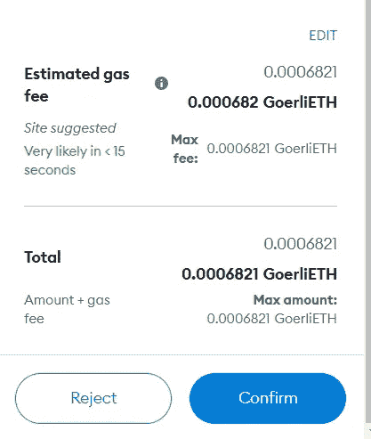
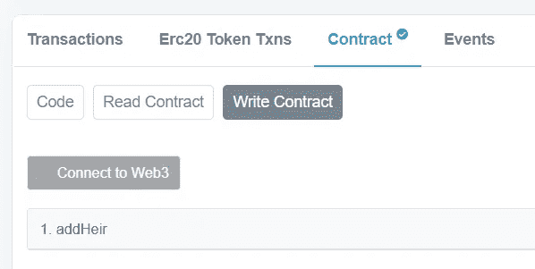

# 学习第 11 课坚固性。创建合同并与之交互。

> 原文：<https://medium.com/coinmonks/learn-solidity-lesson-11-creating-and-interacting-with-a-contract-18ce50879063?source=collection_archive---------1----------------------->


在这节课中，我们将使用我们已经学过的材料来写一份智能合同。然后，我们将部署到一个以太坊测试网络，如 Goerli，并使用一个块浏览器来验证和交互合同。

假设有人想把他们的意愿放在区块链上，为此他们会为它写一个聪明的契约。这个人打算只把钱留给别人作为遗产。因此，这个人需要在契约中存储的所有信息就是一个将姓名与值相关联的变量，如下所示:对于 Ana，这个人将留下 100 美元。对于鲍勃，这个人会留下 80 美元。对于汤姆，这个人会留下 120 美元。诸如此类。

这个变量的类型必须是`mapping`，因为映射将值(留给继承人的值)与键(继承人的名字)相关联。这个名为`inheritance`的变量创建如下。

```
mapping(string => uint) inheritance;
```

注意，在创建变量时，我们没有指明它的可见性，所以它采用了它的默认值: *internal* 。因此，变量`inheritance`不能从外部访问。

我们需要创建一个函数来添加新的继承人。也就是说，向映射添加新的键/值对的函数。这可以通过下面的函数来实现。

```
function addHeir(string memory _name, uint _value) public {
   inheritance[_name] = _value;
}
```

函数`addHeir` 有两个参数，一个类型为*字符串*，另一个类型为 *uint* 。记住，在字符串的情况下，我们需要指定变量在内存中。关于这一点我们将在另一节课中解释。

该函数具有公共可见性，因为我们希望它能够被外部调用。函数体只包含一条语句，它将新值(`_value`)关联到新键(`_name`)。如果键已经存在，它将改变它的值。

为了检索关于继承的信息，必须创建第二个函数，即读取变量`inheritance`。这个函数必须接收一个密钥并返回密钥的值。

```
function recoverInheritance(string memory _name) public view returns (uint) {
   return inheritance[_name];
}
```

上述函数只有一个参数，即键，并返回与该键相关联的值。为了读取映射的*类型的变量，我们使用语法**变量[key]** 。在我们这里，`inheritance[_name]`。*

该函数必须是公共的，以便从外部调用。可变性修饰符*视图*用于向编译器表明该函数不会改变区块链的世界状态。

如果我们将变量`inheritance`定义为 public，上面的函数可以省略。当我们这样做时，编译器为我们创建了一个与上面一模一样的函数，目的是检索变量值。

完整的合同可以在下面找到。

```
pragma solidity ^0.8.7;contract Inheritance {
   mapping(string => uint) inheritance; function addHeir(string memory _name, uint _value) public {
      inheritance[_name] = _value;
   } function recoverInheritance(string memory _name) public view returns (uint) {
      return inheritance[_name];
   }
}
```

我们可以将它部署到 Remix 虚拟机上。之后，可以调用创建的两个函数，如下图所示。


Public functions can be invoked externally.

函数`recoverInheritance`不会改变区块链的状态，所以它可以被调用。函数`addHeir`改变了一个状态变量，因此只能通过事务调用。

# 在测试网上部署

在上一课中，我们在浏览器中安装了 MetaMask，因此现在我们可以部署到真实的区块链。我会把它部署到格利。为此，我们需要通过水龙头获得的格利醚。

在 Goerli 上部署合同就像在本地部署一样简单。只需将环境选项改为*注入提供者—元掩码*，如下图所示。


In ENVIRONMENT, change the option to Injected Provider — Metamask.

现在，当您单击 *Deploy* 按钮时，MetaMask 应该会打开，询问您是确认还是拒绝交易。我们可以在下图中看到这一点。



We must confirm or reject the transaction on MetaMask.

在用您的私钥签署任何交易(或签署任何东西)之前，MetaMask 将要求您确认这样的请求。

让我们记住程序。Remix 编写了部署契约的事务，并发送给 MetaMask 进行签名。既然是交易，就需要签名，Remix 没有权限访问你的私钥。一旦您确认了请求，MetaMask 将对其进行签名，并将其发送到网络中的一个节点，这是在 MetaMask 中配置的。

确认交易后，Remix 将以与本地部署相同的方式进行。确认后，事务将显示在调试区域，如下图所示。


Transaction submission is confirmed by Remix.

请注意，在 etherscan 上的调试区域中有一个名为*视图的链接。通过此链接，用户可以在块浏览器中查看事务。我们将在下面看到什么是块浏览器。之前，我只想指出，Remix 将创建一个与契约交互的环境，正如它在本地部署中所做的那样，显示了两个可调用的函数*

唯一的区别是，现在，当调用一个作为事务的函数时，需要在 MetaMask 中确认该事务，以便它用您的私钥对它进行签名。

# 块浏览器

一个**区块浏览器**是一个网站(或任何环境)，允许用户查看关于区块链、其区块和其交易的信息。

以太坊网络最著名的 block explorer 是 [etherscan.io](http://etherscan.io) ，歌力思网络的 block explorer 可以在 goerli.etherscan.io/的[访问。](http://goerli.etherscan.io/)

在下图中，我们看到了在 Goerli 网络的 block explorer 中生成合同部署的事务。


The transaction in the block explorer.

在本节中，我们将学习如何在 block explorer 中验证契约并与之交互，类似于我们使用 Remix 所做的。

要验证合同并查看有关合同的其他信息，请访问地址**goerli . ethers can . io/address/【合同地址】**，或在页面右上角的搜索栏中搜索合同地址。我的网址是 goer Li . ethers can . io/address/0xb 383 C4 ad 3 e 327d 13 a 571956 ca 0061051 e 3167112。


Click the Contract tab to see information about the contract code.

因为契约还没有被验证，所以只显示它的字节码。为了让块浏览器显示用 Solidity 编写的合同代码，必须对其进行验证。注意在句子*‘您是合同创建者吗？立即验证并发布您的合同源代码！*。点击*验证并发布*。

单击该链接时，将打开一个表单，其中包含一些可供选择的选项。在*中，请选择编译器类型*，选择 *Solidity —单个文件*，因为我们的整个合同包含在一个文件中。在*请选择编译器版本*中，您必须选择 Remix 使用的编译器版本。如果你不记得，检查 Remix 的 *Solidity 编译器*标签，如下图所示。


The tab *Solidity Compiler* indicates which compiler version was used to compile the contract.

您还必须为合同选择一个许可证，但此选择不会影响验证。

点击继续，在下一页的标题为*的字段中粘贴合同代码，在*下方输入实体合同代码。因为这个契约没有构造函数，所以我们只需要验证这个契约。

勾选复选框以证明你不是机器人(我假设你不是机器人)，然后点击*验证并发布*按钮。下一次您访问上面的同一个地址时，块浏览器将显示可靠的契约代码，而不仅仅是它的字节码。这一点可以从下图中看出。


Once verified, the Solidity code is displayed.

一旦通过验证，还可以通过块浏览器与合同进行交互。

# 使用块管理器与合同交互

当我们使用 Remix 与契约进行交互时，Remix 负责编写事务并发送给 MetaMask 进行签名。块资源管理器也能够写入事务，如下图所示。



Interacting with the contract in the block explorer.

要连接到 MetaMask(或任何其他钱包)，您需要点击*连接到 Web3* 。一旦连接到元掩码，只需填写功能字段并点击*写*按钮。

元掩码将再次被触发，您需要确认交易。记住:**每次 MetaMask 要签交易的时候，都会要求你确认。**

要调用合同，单击位于*写合同*旁边的*读合同*按钮。打电话不需要连接 MetaMask，因为不需要表明身份。您可以使用块浏览器与合同进行交互，就像您使用 Remix 一样。

块资源管理器不仅仅在与契约交互时有用。可以列出和搜索所有交易，不仅包括合同，还包括任何以太坊账户。基本上，任何有关区块链历史的信息都可以在块管理器中检索到。

在本课程中，我们不会涵盖 block explorer 的所有可能性，但强烈建议您了解其功能。这是区块链发展最重要的工具之一。

**感谢阅读！**

欢迎对本文提出意见和建议。

欢迎任何投稿。[www.buymeacoffee.com/jpmorais](http://www.buymeacoffee.com/jpmorais)

> 交易新手？尝试[加密交易机器人](/coinmonks/crypto-trading-bot-c2ffce8acb2a)或[复制交易](/coinmonks/top-10-crypto-copy-trading-platforms-for-beginners-d0c37c7d698c)