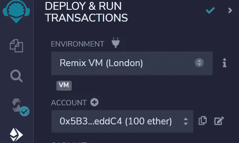
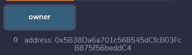
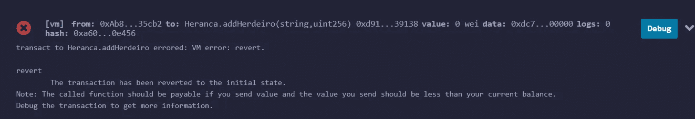

# 学习第 12 课坚固性。地址和唯一的所有者。

> 原文：<https://medium.com/coinmonks/learn-solidity-lesson-12-addresses-and-only-owner-5022234848fe?source=collection_archive---------5----------------------->


我们已经看到了 Solidity 中的几种类型，比如 uint 和 strings。现在让我们来看一个新的非常重要的类型:地址。地址代表区块链上的账户，因此被广泛使用。

我们还看到，地址是从公钥派生出来的。更准确地说，帐户的地址是公钥散列的最后 20 个字节。因此，Solidity 中的地址类型是 20 字节的十六进制数。

在下面的代码中，我们通过它的文字声明了一个 address 类型的变量。前缀 *0x* 表示这是一个十六进制数。

```
address myAddress = 0xC66d07097f4823343bf116463070B3be5e941C4E
```

Solidity 中还有另一种地址，即**应付地址**。在合同中，有可能将基础硬币发送到某个地址，但是，为此，该地址必须是可支付类型。

要将一个地址声明为应付款，只需使用关键字 **payable** ，如下所示。

```
address payable myAddress = 0xC66d07097f4823343bf116463070B3be5e941C4E
```

即使我们没有声明一个应付地址，也有可能向它发送基础货币。为此，您需要将变量转换为 payable。我们将在下一课中看到这一点。

现在让我们更好地理解以太坊账户。

# 外部拥有的账户和合同账户

以太坊有两种账户:所谓的**外部自有账户** ( **EOA** )和**合约账户**。两者都由一个地址指定，但是它们之间有很大的不同。

我已经说过好几次了，以太坊上的账户是公钥/私钥对，但这只适用于 EOA。合同帐户没有私钥或公钥。

为什么会这样？因为合同不用签什么。合同不能启动交易，它们只对交易作出反应。这意味着没有人拥有合同；一旦放在区块链上，它就是公共的，任何人都可以与之互动。如果创建者想要契约中的特权，那么这个特权需要被明确地编程到契约代码中。我们会知道怎么做的。

合约是账户，因为像外部账户一样，它们在基础货币中有余额，也就是说，它们可以持有以太。事实上，合约账户在区块链上存储了 4 条信息。

*   它的平衡。
*   随机数。这是区块链正常工作所必需的唯一号码(我们将在后面详细解释)。
*   字节码。
*   由协定定义的状态变量的值。

字节码是契约代码，因此它必须存储在区块链上，契约状态变量也是如此。合同有余额这一事实表明，我们可以把乙醚送到这样的账户上。但是有一个区别:我们需要在契约中写函数，允许这样的以太的撤销。由于契约没有私钥，所以它们不会主动发送以太网。契约没有自己的意志。

> 重要的是要记住，合同不会引发交易。

eoa 只有前两个数据字段:余额和随机数。它们既没有字节码，也没有状态变量。

# 唯一所有者

让我们记住，我们的最后一份合同是负责在区块链上存放遗嘱。你注意到它有一个重大的安全缺陷吗？任何人都可以调用合同的公共功能，并改变每个继承人将获得的金额。例如，恶意继承人可以调用该函数并增加其可继承金额。

正如我所说的，如果写合同的人想要合同中的特权，他/她需要将它编程到代码中。这就是我们在这一部分要做的事情。

首先，让我们声明一个 address 类型的状态变量，名为`owner`。将以下代码行添加到协定中，不包含任何函数。

```
address owner;
```

这将创建一个新的状态变量。这个变量将存储它的拥有者的地址，他将拥有特殊的特权。例如，我们将要求，为了改变每个继承人应得的金额，交易必须由所有人签字。

在合同中，可以访问提交交易的帐户地址。为此，使用全局变量 **msg** 的**发送方**属性，如下所示。

```
msg.sender
```

使用 *msg.sender* 有一个微妙之处，因为契约有可能调用其他契约中的函数，所以 *msg.sender* 并不总是指示谁发起了事务。我们以后会明白的，我们现在不需要担心。

现在我们需要要求发送调用函数`addHeir`的事务的地址与契约的所有者相同。这是按照下面的语句完成的。

```
require(msg.sender == owner);
```

这一陈述很有解释力，完全符合我们的意图。就这样，我们解决了问题。让我们看看新功能`addHeir`是什么样子的。

```
function addHeir(string memory _name, uint _value) public {
   require(msg.sender == owner);
   heranca[_name] = _value;
}
```

当被调用时，该函数做的第一件事是检查 *msg.sender* 是否与所有者的地址相同。如果是，交易继续进行。否则，事务恢复(回滚)。

当事务**回复**时，它不会引起区块链状态的任何改变。基本上，调用的函数不会有任何效果。

这是一种“唯一所有者”策略，只有合同的所有者才能使某些功能生效。任何人都可以调用这个函数，但如果他们没有所有者的地址私钥，调用将只是浪费汽油费。它将恢复原状，没有任何效果。

# 构造函数

我们现在需要给状态变量`owner`赋值。我们希望保存部署合同的帐户的地址。记住，契约的部署是一个事务，所以我们可以使用 *msg.sender* 属性来获取部署它的帐户的地址。

在部署时，契约调用一个特殊的函数，该函数只在部署时执行。以后不能调用它。这样的函数称为**构造函数**，必须声明如下。

```
constructor([parameters]) {
   // body of the function
}
```

在我们的契约中，构造函数不使用任何参数，它只是将进行事务的地址存储在变量`owner`中。

```
constructor() {
   owner = msg.sender;
}
```

合同现在已经完成。下面，我们可以看到他的全身。

```
...
mapping(string => uint) inheritance;
address public owner;constructor() {
   owner = msg.sender;
}

function addHeir(string memory _name, uint _value) public {
   require(msg.sender == owner);
   inheritance[_name] = _value;
}function recoverInheritance(string memory _name) public view returns (uint) {
   return inheritance[_name];
}
...
```

我将变量`owner`的可见性更改为 public，这样我们就可以在 Remix 中验证它是否采用了部署契约的地址的值。

在下图中，我们看到部署是由地址`0x5B3…eddC4`完成的。



Deployment is done by a transaction generated by the address 0x5B3…eddC4.

由于变量`owner`是公共的，我们可以检索它的值。这在下图中可以看到。



The variable \textit{owner} holds the address 0x5B3…eddC4.

由于没有编写改变变量`owner`的函数，一旦其值被赋值，就不会被改变。

此外，如果我们试图使用除了`0x5B3…eddC4`之外的任何帐户调用函数`addHeir`，事务将会恢复。这一点可以从下图中看出。



Transactions that invokes the function addHeir, sent by any other address than the owner, will revert.

将 *msg.sender* 的地址分配给变量`owner`的另一种方法是在声明变量时进行分配，如下所示。

```
address owner = msg.sender;
```

因此，没有必要显式声明构造函数。两种方法结果相同。

# 常量和不可变变量

我们可以将变量声明为**常量**和**不可变**。两种类型的变量在初始化后都不能更改，但是常量变量必须在声明时(编译时)初始化，而不可变变量可以在构造函数中初始化(部署时)。

常量变量的一个例子如下。

```
uint const MY_NUMBER = 42;
```

以这种方式声明，变量`MY_NUMBER` 将保存值`42`并且不能改变。事实上，称`MY_NUMBER`为变量是不正确的，因为区块链没有为它分配专用空间。`MY_NUMBER`的值直接写入字节码，不是状态变量。

在前面的例子中，既然变量`owner` 不会改变，我们是否可以将其声明为常量？我们可以做如下声明吗？

```
address public constant owner = msg.sender;
```

答案是否定的。常量必须在声明时初始化，在编译时定义。在上面的例子中，变量`owner`只在部署时初始化。还记得我们在构造函数中初始化了变量`owner` 吗？上面的语句就像变量是在构造函数中初始化的一样。

因此，变量`owner`可以被声明为*不可变*，但不能被声明为常量。下面的句子是正确的。

```
address immutable public owner = msg.sender;
```

任何时候试图改变变量`owner`都会产生编译器错误。

**感谢阅读！**

欢迎对本文提出意见和建议。

欢迎任何投稿。[www.buymeacoffee.com/jpmorais](http://www.buymeacoffee.com/jpmorais)