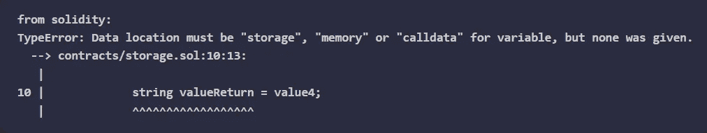

# 学习第 13 课坚固性。存储、内存、调用数据和堆栈。

> 原文：<https://medium.com/coinmonks/learn-solidity-lesson-13-storage-memory-calldata-and-the-stack-56342b6e5ed0?source=collection_archive---------0----------------------->


在本章中，我们将了解区块链上存储数据的位置。共有四个存储空间:**存储**、**内存**、**堆栈**和 **calldata** 。

存储器是存储状态变量的地方。记住我们在契约中声明状态变量，它们是永久的。我们在事务期间对状态变量所做的任何更改都会在事务结束后存储起来。

我们可以把存储想象成一个数据库(事实上它是由数据库实现的)。存储就像一个键/值字典，键和值都是 32 字节长。

我将更详细地解释存储是如何工作的，但是如果你对存储是如何工作的细节不感兴趣，关于存储要记住的最重要的事情是它是一个永久的存储位置。

记忆不是永久的。变量放在内存中，只在函数执行期间使用。在功能执行结束时，存储在存储器中的所有内容都将被删除。

Solidity 可以访问内存，程序员既可以在内存中创建新变量，也可以读取和更改已经在内存中创建的变量。

Calldata 是传递给函数的参数临时存储的地方。这不是一个我们可以创建变量的地方，因为它是函数参数所独有的。也不能更改 calldata 的值:它是只读的。

最后，我们有了堆栈。正是在堆栈上进行 EVM 处理。EVM 将信息放入堆栈或从堆栈中取出，通过操作堆栈中的信息来执行程序。Solidity 没有对栈的访问权，除非我们想在底层编程，否则这个时候不需要太担心栈。

当我们谈到在 Solidity 中使用汇编语言时，我们会对堆栈进行更多的研究，但这是一个更高级的主题。

# 仓库

存储器是存储状态变量的地方。在部署时，EVM 在存储中为状态变量保留专用空间。该空间只能在部署时预留。

因为契约的存储区域是在部署时定义的，所以状态变量只能在函数外部声明。执行功能时无法创建新的存储空间。

让我们看看下面的代码。

```
contract Storage {
   uint256 public value1;
   uint128 public value2;
   uint128 public value3;
   string public value4;

   function newValue() public {
      uint256 value5;
   }
}
```

在函数外部，定义了四个状态变量:`value1`、`value2`、`value3`和`value4`。这些变量的值存储在存储器中，它们的值在部署时初始化。

变量`value5`是在函数内部定义的，所以它存储在内存中。一旦函数`newValue`被调用，内存中的一个空间将被分配来存储变量`value5`的值。当函数执行结束时，该值以及对它的任何引用都将从内存中删除。

存储是一个键/值数据库，其中键和值都是 32 字节长。存储器中的存储是顺序的，密钥从`0`开始。让我们明白这一点。

我们可以把存储器想象成一个充满编号容器的地方，大小固定为 32 字节。契约中定义的第一个状态变量是`value1`，类型为 uint256。它将被存储在第一个容器中，密钥为`0`，并将占用其所有空间，因为 uint256 类型的长度为 32 个字节。

第二个变量`value2`将存储在第二个容器中，键为`1`。但是，由于它只占用 16 个字节(128 位)，因此不会占用所有空间。下一个变量`value3`也是 uint128 类型，也就是说，它也只占用 16 个字节。因为它“适合”第二个容器中剩余的空间，所以它也将被存储在第二个容器中。

而下一个变量，`value4`？它属于字符串类型。这意味着它可以是从一个小单词到一个长文本的任何东西。也就是说，不可能事先知道它的大小。不可能知道它将占用多少集装箱。

这就是为什么字符串类型是引用类型，而不是值类型。第三个容器不会存储字符串值，但是会引用我们可以在哪里找到该字符串，以及它的长度。

# 内存与存储

下面我们稍微修改一下上一个例子的功能。

```
function newValue() public view returns(uint256) {
   uint256 valueReturn = value1;
   valueReturn = 10;
   return valueReturn;
}
```

当在函数中定义时，每个 value 类型的变量都被自动放入内存中。因此，变量`returnValue`是内存中的变量，它采用状态变量`value1`的值。

在下一行，变量`returnValue`的值被设置为`10`。由于变量在内存中，这个值在函数执行结束时被删除。变量`value1`没有被修改，所以将这个函数声明为*视图*是完全合法的:它不改变任何状态变量。

现在让我们修改函数，使用字符串类型的变量，而不是无符号整数类型的变量。

```
function newValue() public view returns(string memory) {
   string valueReturn = value4;
   valueReturn = 'Hello World';
   return valueReturn;
}
```

尝试编译时，编译器会提示错误，如下图所示。



We must indicate the place where the variables of reference type are located.

与总是放在内存中的值类型变量不同，引用类型的变量可以在内存、存储或 calldata 中。

指示变量`returnValue` 在内存中会在内存中创建一个新变量。让我们看看下面的代码。

```
function newValue() public view returns(string memory) {
   string memory valueReturn = value4;
   valueReturn = 'Hello World';
   return valueReturn;
}
```

以上函数完全合法，会编译。函数的返回将总是字符串`‘Hello World’`。然而，如果我们指出变量`returnValue`是存储类型的，我们将得到一个错误。将函数声明更改如下。

```
string storage valueReturn = value4;
```

上面的行是完全合法的，但是下一行将显示一个错误，如下图所示。


The variable returnValue is a pointer to the storage.

变量`returnValue` 是一个指针(引用)。它指示变量`value4`的值在存储器中的位置。我们不能改变指针，只是使用它。下面的代码完全有效。

```
function newValue() public view returns(string memory) {
   string storage valueReturn = value4;
   return valueReturn;
}
```

返回的将是变量`value4`的值。当然，在上面的情况下，直接返回变量`value4`会更实际。

在字符串的情况下，使用指向存储的指针不是很有用，但在处理更复杂的类型(如映射和数组)时会很有用。我们将在另一节课回到这个话题。

# 内存与呼叫数据

内存是我们可以临时创建和存储变量的地方。Calldata 是函数实时接收参数的地方。让我们看看下面的代码。

```
function concatenate(string memory s1, string memory s2) public pure returns (string memory) {
   return string.concat(s1, s2);
}
```

函数`concatenate` 将两个字符串连接成一个。注意函数参数，`s1`和`s2`，我们表示在内存中。这样做时，我们在内存中创建变量`s1`和`s2`，并在函数中操作它们。让我们通过显式地改变变量`s2.`来给上面的函数添加一个新行

```
function concatenate(string memory s1, string memory s2) public pure returns (string memory) {
   s1 = "Hello";
   return string.concat(s1, s2);
}
```

由于变量`s1` 在内存中，我们可以随意改变它。现在让我们修改上面的函数，表明变量`s1` 和`s2` 指向 calldata 而不是内存。

```
function concatenate(string calldata s1, string calldata s2) public pure returns (string memory) {
   s1 = "Hello";
   return string.concat(s1, s2);
}
```

编译器现在将抛出一个错误，如下图所示。


Calldata is a read-only space.

Calldata 是一个只能读取，不能更改的存储空间，在上面的代码中我们试图显式修改它的值。这产生了一个错误。

使用 calldata 的好处是，在很多情况下，我们不需要在内存中不必要地创建一个新变量。这可以节省汽油费，而这通常是智能合同开发中的一个关键要求。

**感谢阅读！**

欢迎对本文提出意见和建议。

欢迎任何投稿。[www.buymeacoffee.com/jpmorais](http://www.buymeacoffee.com/jpmorais)

> 交易新手？试试[密码交易机器人](/coinmonks/crypto-trading-bot-c2ffce8acb2a)或者[复制交易](/coinmonks/top-10-crypto-copy-trading-platforms-for-beginners-d0c37c7d698c)