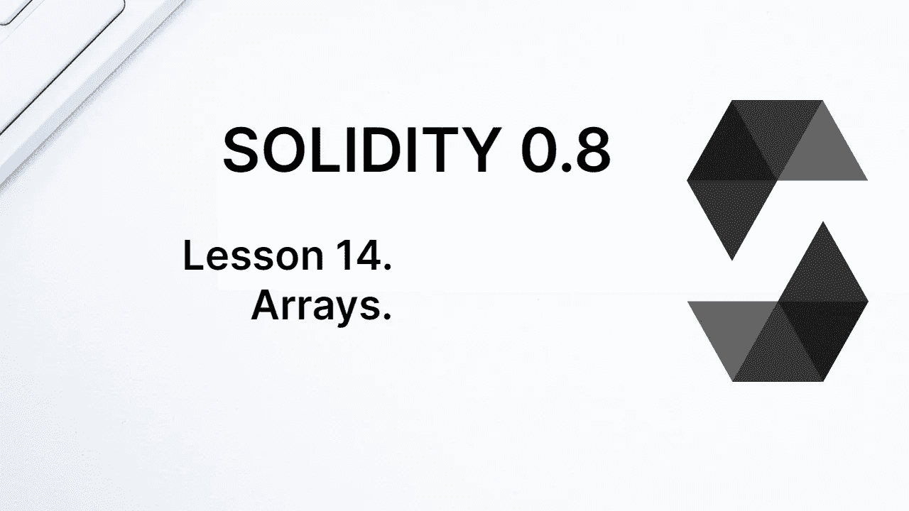
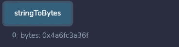
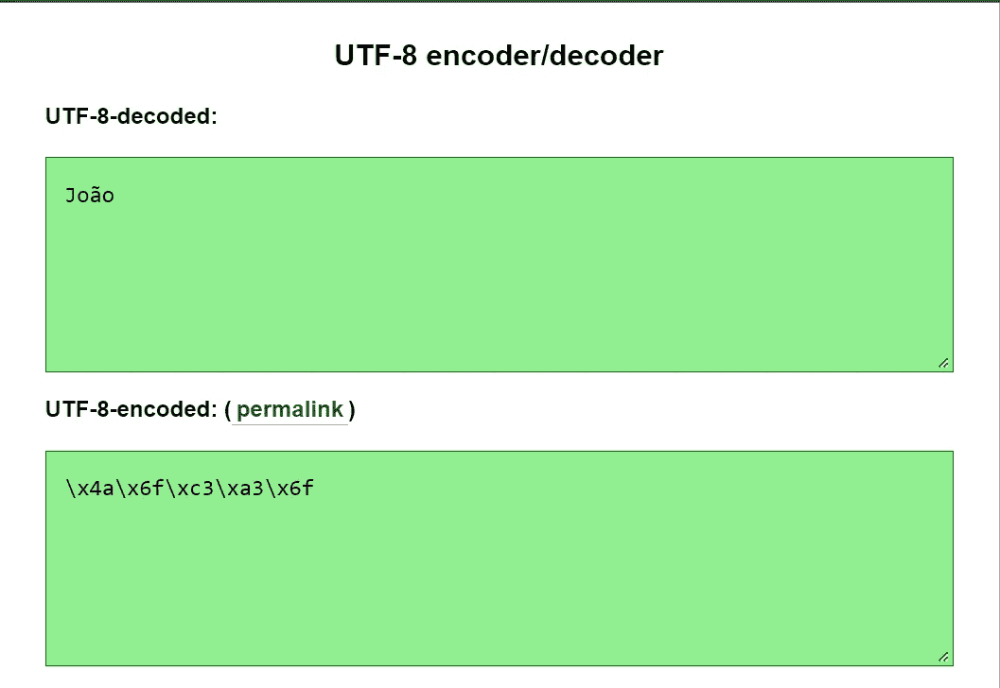

# 学习第 14 课坚固性。数组。

> 原文：<https://medium.com/coinmonks/learn-solidity-lesson-14-arrays-64111b18fa07?source=collection_archive---------4----------------------->



**数组**是编程语言中广泛使用的数据结构。它是价值观的集合，在坚固性上是同类型价值观的集合。

例如，整数数组是整数值的集合。字符串数组是字符串类型的值的集合。集合是有序的，因此每个值都放在数组中的某个位置(我们称之为索引)。

solidity 中有两种类型的数组:静态数组和动态数组。在静态数组中，存储值的数量在数组声明时定义。至于动态数组，没有定义值的总数，可以动态添加新值。

让我们首先创建一个 uint 类型的数组，如下面的代码所示。

```
uint[5] staticArray;
```

上面创建的数组是一个静态数组，我们定义它将存储 5 个类型为 *uint* 的值。要创建一个动态数组，不要包括数组的大小，如下面的语句所示。

```
uint[] dynamicArray;
```

静态数组在声明时被初始化。变量`staticArray`包含 5 个类型为 *uint* 的值，这 5 个值用默认值`0`初始化。

如果未初始化，动态数组假定初始大小为 0 项。动态数组中的每个新项在被添加到数组中时都会被初始化。

# 初始化数组

可以在声明数组值的同时初始化数组。下面的声明用 5 个值初始化静态数组。

```
uint[5] staticArray = [10, 20, 30, 40, 50];
```

动态数组也是如此。

```
uint[] dynamicArray = [10, 20, 30, 40, 50];
```

两个数组现在都存储了 5 个项目，但是我们可以向动态数组添加新项目，而静态数组不接收新项目。我们能做的就是改变它的值。

还有另一种初始化数组的方法，使用**新的**构造函数。让我们在下面的声明中看到这一点。

```
uint[] dynamicArray = new uint[](5);
```

因此，数组中的前五项被初始化为它们的默认值。不可能对静态数组使用 *new* 构造函数，也没有意义，因为它们的项在声明时已经初始化了。

# 内存中的数组

内存中的数组与存储中的数组行为不同。一旦定义了它们在内存中将要占据的空间，这个空间就不能被拉伸。也就是说，不可能在内存中创建动态数组。

下面的代码，在函数内部，是有效的，但是无害的。

```
uint[] memory newArray;
```

在内存中创建了一个动态数组，但是由于它没有初始化，所以它的大小为 0。由于不能放大，它的大小将始终为 0。

要在内存中创建新数组，必须用构造函数将其声明为静态数组或动态数组。下面的代码显示了这两种方式。

```
uint[3] memory staticArrayMemory;
uint[] memory dynamicArrayMemory = new uint[](3);
```

# 管理阵列

可以使用文字来改变数组。正如我们已经看到的，文字是类型的表示。数组文字是一组用方括号括起来的值，用逗号分隔。在下面的代码中，我们使用文字来改变数组。

```
dynamicArray = [1, 2, 3, 4, 5, 6, 7];
```

变量`dynamicArray` 是存储中的一个数组，我们用 5 个条目对其进行了初始化。现在我们改变这个变量来存储一个 7 项的数组。因为它是一个动态数组，所以没有问题。如果是静态数组，编译器会抛出一个错误。

更常见的是更改数组中的单个值。为了访问数组中的一个项目，我们使用方括号，如下所示。

```
dynamicArray[3] // access to the fourth item in the array
```

当数组的索引在`0`开始计数时，索引`3`对应于第四项。要改变与索引相对应的数组的值，只需像其他变量一样赋值即可。

```
dynamicArray[3] = newValue;
```

动态数组有两种操作方法。 **push()** 方法在数组的最后一项后添加一个新元素，如下所示。

```
dynamicArray.push(6) // includes a new item of value 6 at the end of the array
```

方法从数组中移除最后一项。push()和 pop()都会改变数组的大小。也可以使用 **delete** 操作符将给定的数组索引更改为默认值，如下所示。

```
delete dynamicArray[3] // makes the value of index 3 return to its default value
```

注意，delete 操作符并不删除该项，它只是改变它的值。上述操作的结果与将值`0`赋给`dynamicArray[3]`相同。

数组具有长度属性，该属性返回数组的大小。

# 特殊数组

坚固性有两种类型，基本上是特殊的数组:字符串和字节。数组是引用类型，所以字符串和字节也是引用类型。

我们可以认为字符串是一个字符数组，但它实际上是一个字节数组。它的行为与动态数组不同。例如，我们不能将 *push* 和 *pop* 操作符应用于字符串，并且 *length* 属性甚至不存在于字符串中。

Solidity 中的字符串操作不像大多数其他编程语言那样简单，但有外部库可以帮助我们完成这项工作。

类型**字节**也是一种特殊类型的数组，一个字节数组。它与数组 *bytes1[]* 有相似之处，后者显式地是 1 字节类型的数组，但是字节类型占用的内存更少。

在下面的代码中，我将展示 bytes 类型的用法，正如我将展示 string 类型是一个字节数组一样。

```
function stringToBytes() public view returns(bytes memory) {
   string memory name = unicode"João";
   bytes memory nameToBytes = bytes(name);
   return nameToBytes;
}
```

在函数内部，我首先在内存中创建一个字符串。我需要使用前缀 *unicode* ，以便 Solidity 接受字母 `‘a’`的重音。然后我创建一个 bytes 类型的变量，它将接收 string 类型的变量的字节。为此，我们需要将变量从字符串类型转换为字节类型。下图可以看到函数返回。



Converting strings to bytes.

这是什么回报？它是用 UTF-8 编码的字符串“joo ”,这是 Solidity 使用的标准。有几个网站，你可以很容易地编码/解码字符串到 UTF 8。在下图中，我以其中一个网站为例。



Strings is an array of bytes with UTF-8 encoding.

字节类型比字符串类型更具延展性，因为它接受使用像 *push* 和 *pop* 这样的方法。让我们看看下面的代码。

```
bytes public name = unicode"Joã";function bytesAsStrings() public {
   bytes1 letter = 0x6f;
   name.push(letter);
}
```

bytes 类型接受字符串作为赋值，Solidity 自动将字符串转换为 UTF-8 格式。注意，该函数向数组中添加了一个新字节，相当于字母`‘o’`。使用字符串类型不可能做到这一点。

随着课程的进展，我们将更多地使用数组。

**感谢阅读！**

欢迎对本文提出意见和建议。

欢迎任何投稿。[www.buymeacoffee.com/jpmorais](http://www.buymeacoffee.com/jpmorais)

> 交易新手？尝试[加密交易机器人](/coinmonks/crypto-trading-bot-c2ffce8acb2a)或[复制交易](/coinmonks/top-10-crypto-copy-trading-platforms-for-beginners-d0c37c7d698c)