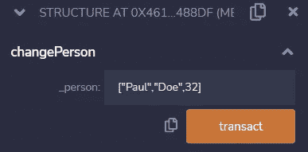

# 学习第 15 课坚固性。结构。

> 原文：<https://medium.com/coinmonks/learn-solidity-lesson-15-structures-85dde79ed042?source=collection_archive---------9----------------------->


结构是用户定义的类型。这是一种将不同类型组合成更复杂结构的方式。

假设我们想要创建一个包含多个信息字段的记录。这可以使用如下结构来完成。

```
struct Person {
   string firstName;
   string lastName;
   uint8 age;
}
```

这些变量被组合在一个结构中，而不是必须管理三个独立的变量。

要声明一个结构类型的变量，只需使用该结构的名字。例如，创建一个新的类型为 *Person* 的状态变量。

```
Person person;
```

由于结构是引用类型的值，如果我们想在函数中声明一个新的结构，我们必须指出它们是在内存中还是存储中。

结构可以包含复杂的值，如数组，甚至其他结构。也可以使用结构作为*映射*中的值。下面的代码完全有效。

```
struct Document {
   Person person;
   uint id;
}struct Person {
   string firstName;
   string lastName;
   uint8 age;
}mapping(bytes32 => Document) documents;
```

# 初始化结构

有几种方法可以初始化一个结构。仅仅声明一个类型为 *struct* 的新变量就会将其字段初始化为默认值。

在名为`Person`的结构中，字段`firstName`和`lastName`将初始化为空字符串，而字段`age`将初始化为`0`。

也可以在声明时初始化该结构，如下所示。

```
Person person = Person("John","Doe",41);
```

# 管理结构

结构模型一旦定义就不能更改，但是每个对象的值可以更改。

为了访问类型为 *struct* 的对象的某个字段，我们使用句点(。)，后跟字段的名称。在下面的代码中，我们展示了两种改变类型为 *struct* 的对象的类似方法。

```
// Directly as a struct
person = Person("Paul","Doe",32);// Changing the fields individually
person.firstName = "Paul";
person.lastName = "Doe";
person.age = 32;
```

很多时候我们只想改变对象的某个字段，为此我们必须使用使用句点的语法。我们可以认为结构是一种有属性但没有方法的对象。

用结构作为参数声明函数是可能的，我们把参数作为数组传递给这个函数。让我们看看创建修改类型为 *struct* 的对象的函数的两种方法。

```
function changePerson(Person calldata _person) public {
   person = _person;
}function changePersonByFields(string calldata _firstName, string calldata _lastName, uint8 _age) public {
   person.firstName = _firstName;
   person.lastName = _lastName;
   person.age = _age;
}
```

这两个函数有相同的目的，改变*人*类型的`person`状态变量。第一个函数将结构作为参数，而第二个函数将各个字段作为参数。

一个简短的旁白:我使用了关键字 calldata 而不是 memory，因为我们不需要在内存中为参数创建一个新的变量，因为它们只会在变量`person`的赋值中使用。

这两种方法有区别吗？虽然结果一样，但是函数`changePerson` 的气费更低。

由于该结构是一个复杂的类型，要将参数传递给函数`changePerson`，我们必须将其作为一个没有定义类型的静态数组或枚举来传递。这一点可以从下图中看出。



Structure-type objects are passed as arguments in square brackets.

也可以在函数中返回结构，就像我们返回其他类型一样。

```
function getPerson() public view returns (Person memory) {
   return person;
}
```

上面的代码与我们将变量`person`声明为 public 时的代码相同。我们可以通过两种方式访问返回结果，或者作为一个数组，通过它的索引，或者作为一个对象，通过它的属性。这在编写与区块链交互的应用程序代码时表现得最为明显。

**感谢阅读！**

欢迎对本文提出意见和建议。

欢迎任何投稿。【www.buymeacoffee.com/jpmorais 

> 交易新手？尝试[加密交易机器人](/coinmonks/crypto-trading-bot-c2ffce8acb2a)或[复制交易](/coinmonks/top-10-crypto-copy-trading-platforms-for-beginners-d0c37c7d698c)