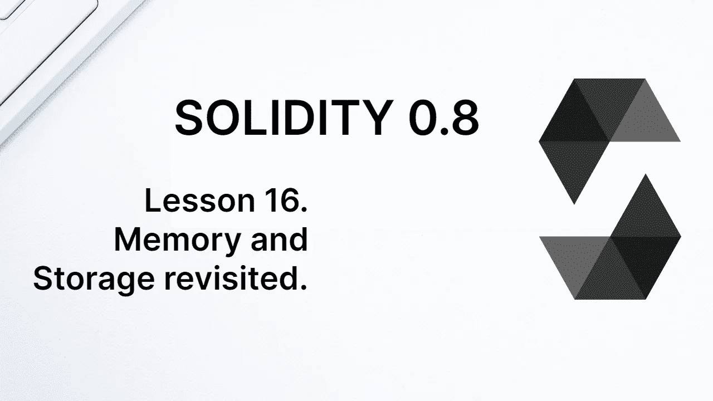

# 学习第 16 课坚固性。记忆和存储再探。

> 原文：<https://medium.com/coinmonks/learn-solidity-lesson-16-memory-and-storage-revisited-5bf0d1c45bb9?source=collection_archive---------6----------------------->



现在，我们有了新的工具来更详细地研究内存中的值和存储中的值之间的差异。让我们抓住机会，用我们已经学过的一些类型写一个契约。

让我们首先创建一个结构来存储关于怪物游戏角色的信息。

```
struct Monster {
   string name;
   uint8 force;
}
```

游戏参与者，也就是网络账号，可以拥有一个怪物。存储此类信息的最佳数据结构是映射。

```
mapping(address => Monster) public monsters;
```

由于变量`monsters`是公共的，我们不需要显式地编写一个函数来检索给定地址所拥有的怪物。谢谢你，坚实。

让我们先写一个函数来创建一个新的怪物。它将属于发起交易的账户，并且只有`1`的强度。

```
function createMonster(string calldata _name) public {
   monsters[msg.sender] = Monster(_name, 1);
}
```

现在我们写一个函数来改变怪物的力量。最简单的方法是直接在存储器中改变值，如下面的函数所示。

```
function changeForceStorage(address _address, uint8 _newForce) public {
   Monster storage  monster = monsters[_address];
   monster.force = _newForce;
}
```

在函数内部声明的变量`monster`是一个指向存储器中一个值的指针。它不会在存储中创建新的变量，因为不可能在运行中创建新的存储变量。所有状态变量都是在部署时创建的。

因为它是一个指针，所以不可能直接给它分配一个怪物。不允许使用下面的代码。

```
Monster storage monster = monsters[_address];
monster = Monster("Paul",3);
```

用怪物来代替指针是不可能的，但是我们可以使用指针来改变一个怪物变量的字段，就像我们在下面的代码行中所做的那样。

```
monster.force = _newForce;
```

另一种改变怪物强度的方法是在内存中创建一个新的怪物，并在某个时候在内存中替换它。

```
Monster memory monster = monsters[_address];
monster.force = _newForce;
monsters[_address] = monster;
```

这第二种方法在气体方面更昂贵，因为它在将对象存储到存储器之前在存储器中创建它。但是，在将该对象永久存储在存储中之前，协定可能希望对其进行其他操作，因此这将是理想的方法。

# 内存和存储之间的引用类型

引用类型的值是那些保存一个指向值实际存储位置的指针的值。该数组是引用类型值。让我们在下面的代码中看到这一点。

```
function memoryToMemory() public pure returns (uint) { uint[3] memory array1 = [uint(1),2,3];
   uint[3] memory array2 = array1; array1[0] = 4;
   return(array2[0]);
}
```

我们有两个数组，都在内存中。首先我们创建变量`array1`，包含 3 个元素`[1,2,3]`。当我们声明`array2` 为 `array1`时，`array2`接收与`array1`相同的指针。这意味着值`[1,2,3]`对于变量`array1`和`array2.`是相同的

当改变`array1`的值时，`array2`的值也会改变，因为它们都指向内存中的相同位置。这是引用类型变量的典型行为。

让我们现在做一些类似的，但完全不同的事情。让我们看看下面的代码。

```
uint[3] array1 = [uint(1),2,3];

function storageToMemory() public view returns (uint, uint) {
   uint[3] memory array2 = array1;
   array2[0] = 4;
   return(array1[0], array2[0]);
}
// return: 1, 4
```

同样，我们有两个数组。但是现在`array1`在内存中，而`array2`在内存中。当`array2`接收`array1`时，它现在接收的是`array1`的副本，而不再是它的指针。

这是因为存储和内存是不同的存储位置。变量不能共享同一个对象，因为每个对象都需要在它的存储位置:一个在内存中，一个在存储器中。

当混合使用内存和存储时，你必须对引用类型的变量小心一点。但是，稍微反思一下就会发现，上述行为越自然越好。

**感谢阅读！**

欢迎对本文提出意见和建议。

欢迎任何投稿。[www.buymeacoffee.com/jpmorais](http://www.buymeacoffee.com/jpmorais)

> *加入 Coinmonks* [*电报频道*](https://t.me/coincodecap) *和* [*Youtube 频道*](https://www.youtube.com/c/coinmonks/videos) *获取每日* [*加密新闻*](http://coincodecap.com/)

# 另外，阅读

*   [复制交易](/coinmonks/top-10-crypto-copy-trading-platforms-for-beginners-d0c37c7d698c) | [加密税务软件](/coinmonks/crypto-tax-software-ed4b4810e338)
*   [网格交易](https://coincodecap.com/grid-trading) | [加密硬件钱包](/coinmonks/the-best-cryptocurrency-hardware-wallets-of-2020-e28b1c124069)
*   [密码电报信号](/coinmonks/top-3-telegram-channels-for-crypto-traders-in-2021-8385f4411ff4) | [密码交易机器人](/coinmonks/crypto-trading-bot-c2ffce8acb2a)
*   [最佳加密交易所](/coinmonks/crypto-exchange-dd2f9d6f3769) | [最佳加密交易所](/coinmonks/bitcoin-exchange-in-india-7f1fe79715c9)
*   [开发人员的最佳加密 API](/coinmonks/best-crypto-apis-for-developers-5efe3a597a9f)