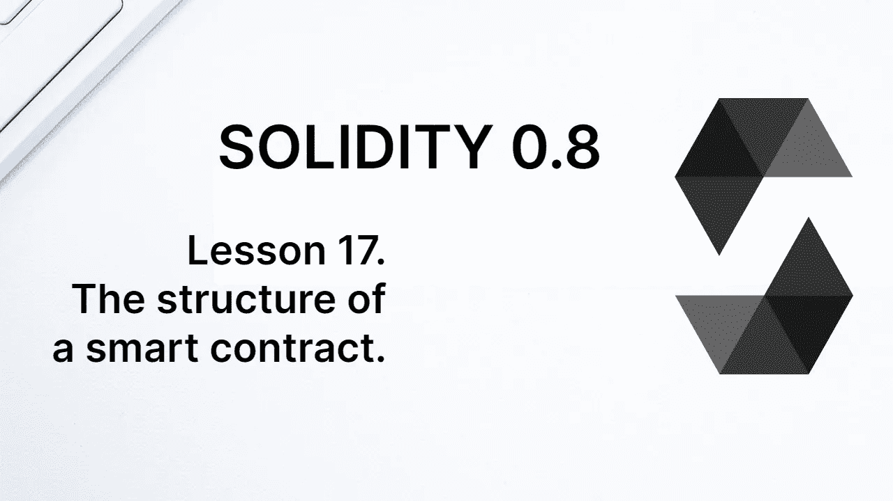

# 学习第 17 课坚固性。智能合约的结构。

> 原文：<https://medium.com/coinmonks/learn-solidity-lesson-17-the-structure-of-a-smart-contract-9dca379f66e1?source=collection_archive---------4----------------------->

在这一章中，我们将看到智能合同的结构，以及它的所有可能性。智能协定文件具有. sol 扩展名，并且可以在其中声明一个或多个协定。

我们已经看到，契约的声明是通过语句 *contract* 来完成的，但是仍然有两种未探索的可能性:库和接口。

**库**看起来像契约，但是没有状态变量。这是一种纯方法类型的契约，旨在由其他契约使用，而不是由它自己使用。

**接口**就像契约模式。定义了状态变量和方法，但没有任何实现。这就像是写了一个带有空功能的契约，要在未来实现。

我们将在以后的课程中学习更多关于库和接口的知识。目前，我们将只与合同合作。

合同中可以(并且经常)定义以下项目。

*   状态变量
*   功能
*   修饰语
*   事件
*   错误
*   结构
*   枚举

在前面的课程中，我们已经看到了其中的一些项目，而其他项目在本课程中仍然是未知的。我们将简要讨论每一个项目，甚至是我们已经看过的项目。

# 状态变量

当我们想在区块链上存储一些信息时，我们需要为这些数据预留一个专用空间。我们通过状态变量做到这一点。它们是值被永久存储的变量，就像在数据库中一样。

这类变量是静态类型的，也就是说，它们的类型必须在创建时声明，并且不能修改。

Solidity 中可用的类型有: *int* (整数)、 *uint* (无符号整数)、 *bool* (布尔值)、*字节*、*地址*、*字符串*、*数组*和*映射*。

其中一些类型有细分，例如整数，范围从 *int8* 到 *int256* 。最大值总是 32 字节，因为存储是一种键/值数据结构，其中键和值都是 32 字节长。

坚实度没有未定义的值或空值。每个变量在声明时都被初始化；当它的值没有被显式声明时，它被赋予一个默认值。数字的默认值为 0，字符串为空字符串，布尔值为 false。

部署后无法创建新的状态变量。在函数中创建的变量要么是在内存中创建的，要么是指向已经存在于内存中的状态变量的指针。

# 功能

函数在以太坊中扮演着一个基本而特殊的角色。在许多编程语言中，函数作为代码块供重用，同样的应用程序可以不使用函数来编写。在以太坊上，函数不仅仅是一段代码。

函数是事务的入口，它们的基本作用是操纵状态变量。当帐户向区块链提交交易时，它必须明确指出要调用哪个函数。如果未指定该函数，将调用合同的默认函数(*回退*)，如果它存在的话。

所有契约逻辑都存在于函数中，函数可以理解为执行块。在一个事务中，不可能直接调用一个以上的函数；然而，契约的一个函数可能会从同一个契约或其他契约中调用另一个函数。

# 修饰语

可以定义函数修饰符。**修饰符**是可重用的代码块，可以包含在一个或多个函数中。我们将在另一课中看到如何设置和使用修改器。

修饰语在智能合同的写作中并不重要。当同一段代码在项目中不断重复时，会使用它们，从而避免重复。

# 事件

**事件**是在区块链上记录信息的一种方式，类似于*日志*。可以对外部客户端进行编程，以监控此类事件的发射，然后将区块链状态的任何变化通知给外部客户端。

事件在函数中发出，但不能被协定读取。一旦发布，只能从 EVM 以外的地方查询。它们记录在交易收据中，而不是存储中。一旦发出，也不能删除。

除了用于向外部客户端通知区块链的状态变化之外，事件还可以用于以较低的价格存储信息。记录(发出)一个事件比改变存储中的状态变量花费更少的气体。

我希望明确事件是由契约定义和发出的，但不能被契约读取。它们的功能是与区块链以外的世界互动。

# 错误

我们经常希望交易被拒绝。例如，当我们要求交易的来源是授权账户时，就会发生这种情况。我们已经看到，我们可以使用表达式`require(msg.sender == owner)`进行这样的检查。如果发送交易的帐户不是所有者，则交易必须恢复。

此时，可以确定交易被拒绝的原因，并将该信息发送给客户端。这种识别可以使用字符串来完成，但是也有可能向客户端返回一个自定义错误。

为此，我们首先定义自定义错误，如果事务恢复，可以将这些错误发送给客户端。

返回自定义错误的最大好处是节省汽油。可以定义自定义错误并在事务恢复时发送这些自定义错误，而不是多次使用同一个字符串。

我们将在另一课中看到更多关于自定义错误的内容。

# 结构

结构是自定义类型，是包含不同类型的几个变量的数据结构。结构也可以包含其他结构。

在使用它们之前，需要对它们进行定义。一旦定义，就不能更改。我们已经在前面的课程中使用过结构，并将在整个课程中再次使用。

# 枚举

可枚举数也是用户定义的类型，但它是 8 位固定长度的类型。可枚举定义为一组标识符，对应于一个正整数，从数字 0 开始。

可枚举只存在于定义它们的协定中。可枚举类型的状态变量通过它们的整数写入区块链，并且仅在协定内转换为标识符。

在上一课中，我们已经使用了可枚举数。

**感谢阅读！**

欢迎对本文提出意见和建议。

欢迎任何投稿。www.buymeacoffee.com/jpmorais

> 加入 Coinmonks [电报频道](https://t.me/coincodecap)和 [Youtube 频道](https://www.youtube.com/c/coinmonks/videos)了解加密交易和投资

# 另外，阅读

*   [最佳比特币保证金交易](/coinmonks/bitcoin-margin-trading-exchange-bcbfcbf7b8e3) | [比特币保证金交易](https://coincodecap.com/bityard-margin-trading)
*   [加密保证金交易交易所](/coinmonks/crypto-margin-trading-exchanges-428b1f7ad108) | [赚取比特币](/coinmonks/earn-bitcoin-6e8bd3c592d9)
*   [WazirX vs CoinDCX vs bit bns](/coinmonks/wazirx-vs-coindcx-vs-bitbns-149f4f19a2f1)|[block fi vs coin loan vs Nexo](/coinmonks/blockfi-vs-coinloan-vs-nexo-cb624635230d)
*   [BlockFi 信用卡](https://coincodecap.com/blockfi-credit-card) | [如何在币安购买比特币](https://coincodecap.com/buy-bitcoin-binance)
*   [火币交易 Bot](https://coincodecap.com/huobi-trading-bot) | [如何购买 ADA](https://coincodecap.com/buy-ada-cardano) | [Geco？一次回顾](https://coincodecap.com/geco-one-review)