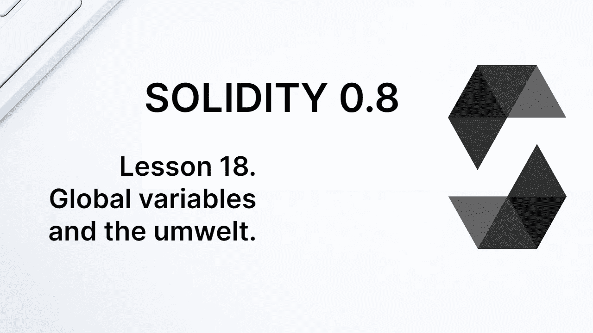
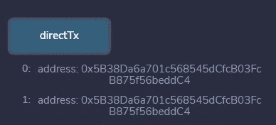
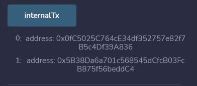
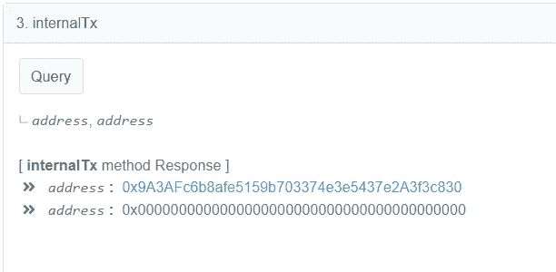

# 学习第 18 课坚固性。全局变量和 Umwelt。

> 原文：<https://medium.com/coinmonks/learn-solidity-lesson-18-global-variables-and-the-umwelt-efcf7336d2df?source=collection_archive---------6----------------------->



Umwelt 是生物学家 Thomas A. Sebeok 创造的一个术语，意思是“生物周围的环境”。虽然它与区块链无关，但我真的很喜欢这个术语，在这节课中，我们将谈论 EVM 周围的环境。

需要了解的区块链的一个特征是，它是一个封闭的、完全确定的环境。智能合同不能访问区块链的外部；例如，它不能访问 API。它甚至不能生成随机数，这很容易理解为什么。

区块链包含一个状态变量数据库，这些变量会随着交易而变化。该数据库在所有网络节点上必须是相同的，并且一旦在网络上验证，每个节点就在本地执行所有事务。

如果可以与外部 API 进行交互，也许一个节点在执行事务时会记录一个结果，而另一个节点会记录另一个结果，因为在此期间 API 服务已经失败，不再可用。

让我们看一个新的例子，一个叫做薛定谔彩票的合同。这种合同有一个功能，接受一定数量的乙醚，并根据系统生成的一个假定的随机数，决定你是否中奖。

有人向契约提交了一个事务，该事务在被挖掘(或验证)后必须由网络中的所有节点执行。如果这个数字真的是随机的，那么每个节点都会产生一个不同的数字，所以对于某些节点来说，你会获奖，而对于其他节点来说，你不会获奖。你会成为薛定谔的富人。

我希望这些争论足以让你意识到区块链需要自我约束。它无法与外部世界互动，因此需要将外部世界注入区块链。世界是通过全局变量来实现的。至少是一小部分。

# 通过全局变量的块和事务信息

契约能够访问关于其周围环境的一些信息；已执行事务的数据以及包含该事务的块。我们可以通过全局变量获得这些信息。

我们已经在 *msg.sender* 属性中看到了这些变量之一，它返回调用该函数的地址。全局变量 *msg* 有另一个常用属性 *msg.value* ，返回事务中发送的 *wei* 中的值。

下面是 Solidity 中最常用的全局变量和属性的简短列表。

*   **msg.sender.** 外部调用函数的地址。它不一定是发起交易的账户的地址。
*   **msg.value.** 交易中发送的金额，单位为魏。
*   **block.number.** 包含交易的块号。
*   **block . timestamp .**Unix 时间中的块日期，以秒为单位。是自 1970 年 1 月 1 日午夜以来的秒数。
*   **gasleft()。**执行该功能时剩余的气体量。
*   **tx.origin.** 发送原始交易的账户地址。

# msg.sender 和 tx.origin 的区别

*msg.sender* 和 *tx.origin* 的区别可能很微妙，所以让我们进一步解释一下。契约中的函数可以调用其他契约中的函数。当他们这样做时，就创建了一个内部事务。

*tx.origin* 属性总是包含原始交易发送方的地址，因此它总是一个外部地址(EOA)。它永远不会是合同地址，因为合同从不启动交易。

*msg.sender* 是从外部调用该函数的地址。如果该函数被某个契约通过内部事务调用，那么 *msg.sender* 将返回调用该函数的契约的地址。

让我们在合同中看到这一点。

```
pragma solidity ^0.8.7;contract Transactions {function directTx() public view returns(address, address) {
        return (msg.sender, tx.origin);
}function internalTx() public view returns(address, address) {
   return this.iAmExternal();
}function iAmExternal() external view returns(address, address) {
        return (msg.sender, tx.origin);
}
}
```

`directTx`和`iAmExternal`功能都可以直接调用。因此， *msg.sender* 和 *tx.origin* 将具有相同的值，因为调用该函数的是启动事务的同一个地址(在这种情况下，它只是一个调用，但如果它是一个事务，它将是相同的)。我们可以在下图中看到这一点。



Msg.sender and tx.origin have the same value.

当我们调用函数`internalTx`时，它会调用函数`iAmExternal`，但是它会像外部调用一样进行调用。请注意，函数`iAmExternal`具有外部可见性，也就是说，它不能从契约内部调用。这就是为什么我们在表达式`this.iAmExternal()`中使用前缀`this`，而不仅仅是`iAmExternal()`。

调用的结果可以在下图中看到。现在 *msg.sender* 将是合约本身的地址，而 *tx.origin* 仍然是发送交易的账户的地址。



Msg.sender indicates the address that generated the internal transaction, and tx.origin holds the address of the account that sent the original transaction.

为什么 *msg.sender* 是合同地址？记住 *msg.sender* 是产生内部交易的账户地址。是契约本身生成了调用函数的内部事务，而不是发送事务的帐户。

契约通常从外部调用不同的其他契约的函数。但是为了简化这个例子，我只使用了一个契约。

在这个例子中，我还想展示从契约本身内部调用可见性在外部的函数是可能的。然而，当我们这样做时，它被认为是一个内部事务，并且 *msg.sender* 将不再是 *tx.origin* ，正如我们已经看到的。如果可见性是公共的，我们可以正常调用函数，而不必生成内部事务。

# Ps:通话的*消息发送者*

要将交易发送到区块链，您需要一个帐户，毕竟，交易需要用私钥签名。然而，呼叫可以是匿名的，因为它们不会在区块链中传播。那么，谁是电话的发件人呢？

因为调用不会改变区块链的状态，所以您不需要太担心。即使调用的 *msg.sender* 值不明确，也不会干扰区块链的确定性行为。

出于好奇，我将合同部署到一个 testnet，并使用 etherscan 调用函数，当涉及内部事务时，该函数返回 *msg.sender* 和 *tx.origin* 。获得的结果如下图所示。



The tx.origin is address zero, but msg.sender takes the contract address, as it was supposed to.

不明确的地址，也就是呼叫者，是地址零。 *msg.sender* 是契约的地址，应该是这样。

这次会议只是一个好奇心，因为在交易中使用 *msg.sender* 和 *tx.origin* 比在通话中更有意义，但我是一个好奇的人，我希望你也是。

# 区块链上的随机数

正如我所说，由于区块链的确定性行为，不可能在其上生成真正的随机数。当我们想生成随机数的时候应该怎么做？

一种可能是使用全局变量，如 *block.timestamp* 。每个 Solidity 教程都不建议使用全局变量，因为它们并不是真正随机的，但根据项目的大小，这并没有太大的问题。尤其是当我们使用像块时间戳这样的值的散列时。

矿工确实可以操纵块时间戳，但除非你的合同涉及大量资金，否则这并不重要。此外，以太坊正在迁移到 PoS，所以我们很快就会随机选择验证器而不是挖掘器。无论如何，应该明确的是，时间戳不是一个随机数。

如果你需要一个真正的随机数，无论花费多少，你都应该使用 Oracle 的服务。区块链的神谕是智能合约与外界沟通的方式。他们不施法，遵守游戏规则。

我们将在以后讨论更多关于神谕的内容，但是让我们来看一个创建神谕的简单方法。通过请求一个随机数，一个契约可以发出一个事件，这个事件由外界监控。假设同一个契约有一个接收随机数的函数。

先知，在外面的世界，监视着事件。在接收到对随机数的请求时，它生成随机数，并通过事务将该数发送给该函数。请注意，区块链在任何时候都不接触外部世界，是外部世界注入了它。

**感谢阅读！**

欢迎对本文提出意见和建议。

欢迎任何投稿。【www.buymeacoffee.com/jpmorais 号

> 加入 Coinmonks [电报频道](https://t.me/coincodecap)和 [Youtube 频道](https://www.youtube.com/c/coinmonks/videos)了解加密交易和投资

# 另外，阅读

*   [Bookmap 评论](https://coincodecap.com/bookmap-review-2021-best-trading-software) | [美国 5 大最佳加密交易所](https://coincodecap.com/crypto-exchange-usa)
*   [如何在 FTX 交易所交易期货](https://coincodecap.com/ftx-futures-trading) | [OKEx vs 币安](https://coincodecap.com/okex-vs-binance)
*   [CoinLoan 评论](https://coincodecap.com/coinloan-review) | [YouHodler 评论](/coinmonks/youhodler-4-easy-ways-to-make-money-98969b9689f2) | [BlockFi 评论](https://coincodecap.com/blockfi-review)
*   《XT.COM 评论》的[《币安评论》的](https://coincodecap.com/profittradingapp-for-binance)|
*   [SmithBot 评论](https://coincodecap.com/smithbot-review) | [4 款最佳免费开源交易机器人](https://coincodecap.com/free-open-source-trading-bots)