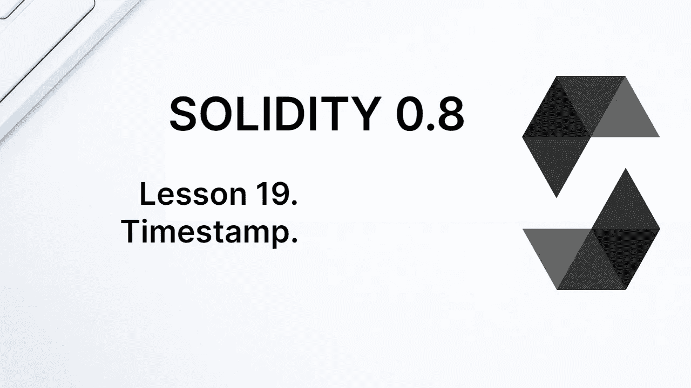
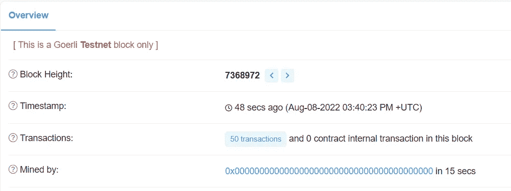
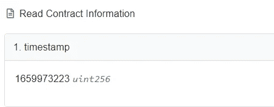
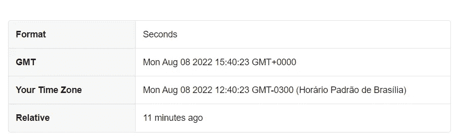

# 学习第 19 课坚固性。时间戳。

> 原文：<https://medium.com/coinmonks/learn-solidity-lesson-19-timestamp-7ba91290c245?source=collection_archive---------2----------------------->



在下面的课程中，我们将看到一些全局变量的使用。让我们从 *block.timestamp* 属性开始，该属性返回从 Unix 时间到在网络上挖掘(验证)该块的时刻之间经过的时间值，以秒为单位。

这是一个让学习者感到困惑的话题。由于区块链是一个分散的网络，每个事务由网络上的所有节点执行，并且它们在不同的时间执行。那么什么是街区时间呢？

为了理解这一点，我们必须了解一个区块是如何添加到区块链的。如果共识机制是工作证明，则可以对其进行挖掘，如果共识机制是利害关系证明，则可以对其进行验证。无论如何，该块通过一个和单个节点被“添加”到区块链。

让我说得更清楚些。每个节点最终都会将该块添加到其区块链中，但只有一个节点可以决定链中的下一个块是什么。这个节点以下面的方式获得决定哪个块的权利:在工作证明的情况下，通过发现解决困难问题的随机数，或者在利害关系证明的情况下，随机地。

无论如何，每个区块链区块都有一个关联的帐户，负责最初将其添加到链中。正是这个帐户(这个节点)决定了添加块的确切时间，也就是说，谁决定了时间戳将是什么(有一些限制)。

当 EVM 在代码中遇到以下表达式时:

```
block.timestamp
```

它所做的是在块的头中检查其时间戳的值。每个数据块都有一个包含大量信息的头，包括它的时间戳。

# 块和事务哪个先出现？

一组事务形成一个块，但是事务需要来自该块的信息来读取属性，比如它们的时间戳。那么，事务和块哪个先出现？

他们同时出现；或者我们可以考虑街区优先。事务被分组到一个块中，并且那些事务基于关于该块的信息被执行。

让我们看看这是怎么发生的。下面来看看合同。

```
pragma solidity ^0.8.7;

contract Timestamp { uint public timestamp; function saveTimestamp() public {
      timestamp = block.timestamp;
   }}
```

它所做的只是将*块.时间戳*分配给变量`timestamp`。现在让我们发送一个事务来调用这个函数，它将包含在一个块中。块信息被记录在块头中。使用 etherscan，我们可以检索这些信息，如下图所示。



Information about the block that includes the transaction.

请注意块时间戳值:2022 年 8 月 8 日，下午 3:40:23。现在让我们检索分配给变量`timestamp`的 *block.timestamp* 的值。

由于变量`timestamp`是公共的，Solidity 自动生成一个函数来检索它(一个 getter 函数)。结果可以在下图中看到。



The current value of the variable timestamp.

让我们将变量值转换为人类可以理解的日期/时间。请记住，时间戳是自 1970 年 1 月 1 日午夜以来经过的秒数。

如果你热衷于做数学，你可以用纸和笔进行转换。或者使用像 unixtimestamp.com/ T4 这样的网站来进行转换。



Converting a value in seconds to date format.

我们可以看到，转换后的值与块头相同:2022 年 8 月 8 日 15:40:23。每当我们执行一个新的事务时，变量`timestamp` 将接收新的值，以秒为单位，注册在包含该事务的块的头中。

# 带有 block.timestamp 的时间

我们可以使用 *block.timestamp* 属性来处理智能合约中的时间流逝。让我们写一份合同来做这件事。

```
contract AboutTime { uint public start; constructor() {
      start = block.timestamp;
   } function withdraw() public {
      require(block.timestamp > start + 1 hours);
      payable(msg.sender).transfer(address(this).balance);
   }

}
```

上面的合同很简单。构造函数仅在部署时执行，并在部署契约时初始化变量`start`。

另一个功能，`widthdraw`，可以用来将合同中包含的所有以太网发送到呼叫者的地址。下面的句子做到了这一点。

```
payable(msg.sender).transfer(address(this).balance);
```

在其他课程中，我会更好地解释这句话中包含的所有项目。我现在穿上它只是为了激起你的好奇心。现在，只要相信它发送以太到一个地址。

我想引起注意的是下面这句话。

```
require(block.timestamp > start + 1 hours);
```

要求交易执行的时刻(包含交易的块的标题中包含的日期)至少在合同部署后 1 小时。

当在部署后不到 1 小时尝试调用此函数时，事务将被恢复。例如，这种方法可用于强制某些资产(如乙醚或代币)在合同中保留一段时间，并且只能在该时间后提取。

# 时间单位

坚实度接受一些时间单位。他们是:

*   秒
*   分钟
*   小时
*   天
*   周；星期

这些表达式以秒为单位转换为各自的值。我们可以在下面的声明中看到这一点。

```
uint public constant week = 1 weeks;
```

由于变量是公共的，我们可以称它为。结果可以在下图中看到。


The week unit is an alias for the value of a week, in seconds.

**感谢阅读！**

欢迎对本文提出意见和建议。

欢迎任何投稿。[www.buymeacoffee.com/jpmorais](http://www.buymeacoffee.com/jpmorais)

> 加入 Coinmonks [电报频道](https://t.me/coincodecap)和 [Youtube 频道](https://www.youtube.com/c/coinmonks/videos)了解加密交易和投资

# 另外，阅读

*   [密码本交易平台](/coinmonks/top-10-crypto-copy-trading-platforms-for-beginners-d0c37c7d698c) | [Coinmama 审核](/coinmonks/coinmama-review-ace5641bde6e)
*   [印度加密交易所](/coinmonks/bitcoin-exchange-in-india-7f1fe79715c9) | [比特币储蓄账户](/coinmonks/bitcoin-savings-account-e65b13f92451)
*   [OKEx vs KuCoin](https://coincodecap.com/okex-kucoin) | [摄氏替代品](https://coincodecap.com/celsius-alternatives) | [如何购买 VeChain](https://coincodecap.com/buy-vechain)
*   [币安期货交易](https://coincodecap.com/binance-futures-trading)|[3 comas vs Mudrex vs eToro](https://coincodecap.com/mudrex-3commas-etoro)
*   [如何购买 Monero](https://coincodecap.com/buy-monero) | [IDEX 评论](https://coincodecap.com/idex-review) | [BitKan 交易机器人](https://coincodecap.com/bitkan-trading-bot)