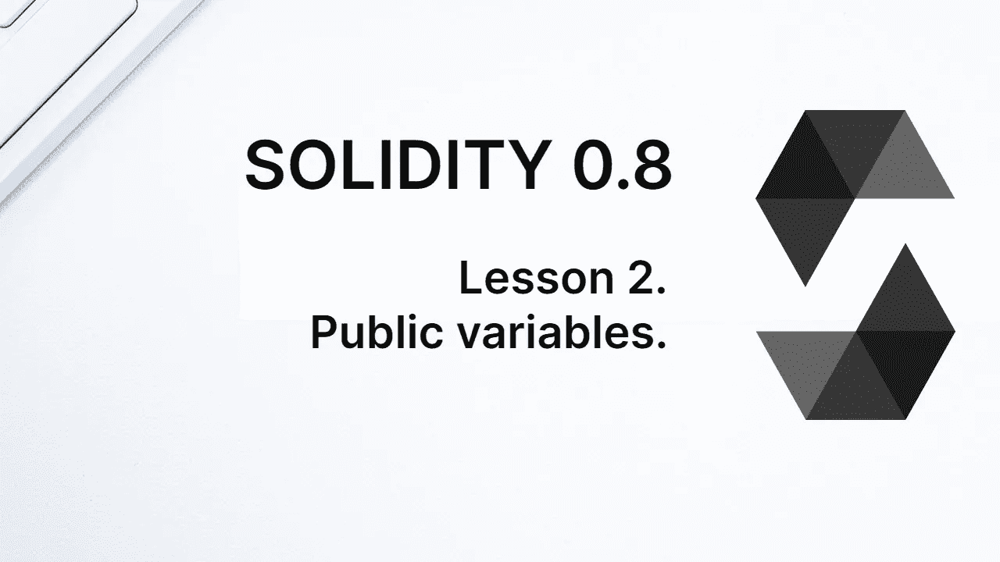
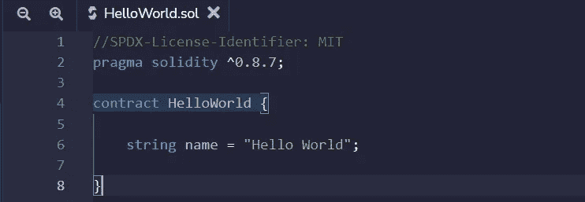
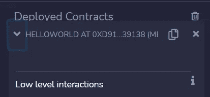
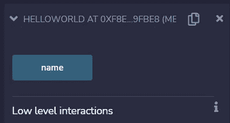
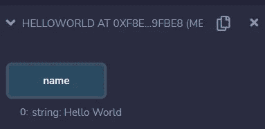

# 学习第二课的可靠性。公共变量。

> 原文：<https://medium.com/coinmonks/learn-solidity-lesson-2-public-variables-2f79389a3a44?source=collection_archive---------0----------------------->



所有区块链国家的集合是它的世界国家。当我们进行交易时，我们改变了这个世界状态。例如，部署一个契约会在几个方面改变世界状态。最显而易见的是，一个新的契约在区块链诞生了，但这不是唯一的契约。

合同有一个地址，指定一个以太坊账户。以太坊上有两种类型的账户，合约账户和外部拥有的账户( **EOA** )。当我们部署合同时，会创建一个新的合同帐户。

与合同帐户相关联的有四个值。其中之一是我们部署的合同的二进制代码，即**字节码**。另一个是由契约创建的所有变量的映射，即契约状态变量。

请记住，变量是在声明时初始化的(如果没有设置，则使用默认值)。因此，变量在部署时被初始化，这导致新的状态在此时被定义和创建。

对世界状态的其他修改不太明显。其中之一是部署合同的帐户余额的变化。以太坊上的每一笔交易都要耗费以太，所以部署契约的账号必须以以太支付这笔费用。我想指出的是，账户的余额是世界状态的一部分，任何交易都改变了账户的余额，从而改变了世界状态。

到目前为止，我们的合同代码可以在下图中看到。它定义了一个状态变量，*名称*，类型*字符串*，这将是区块链世界状态的一部分。



A “Hello World” smart contract.

如果我们想改变这个状态变量，我们必须写一个函数来实现。我们很快就会看到。在此之前，我们将看到如何以简单的方式读取这个状态变量。

**公共变量**

在 solidity 中，变量有三种类型的可见性:**公共**、**私有**或**内部**。当我们没有明确定义变量的可见性时，它被认为是内部的。在我们的例子中，变量名称*就是这种情况。*

内部变量可以由协定本身和子(继承的)协定访问。我们稍后将研究继承的问题。私有变量只能由契约本身访问，这更受限制。

> 交易新手？试试[加密交易机器人](/coinmonks/crypto-trading-bot-c2ffce8acb2a)或者[复制交易](/coinmonks/top-10-crypto-copy-trading-platforms-for-beginners-d0c37c7d698c)

另一个选项，public variables，让编译器为它创建一个 *getter* 函数。随着课程的进行，这一点会变得更加清楚。现在，只需要理解公共变量可以从契约外部访问。让我们看看怎么做。

在 Remix 中，在 deployed contracts 选项卡中，单击您刚刚部署的合同。请注意，它没有要执行的方法，如下图所示。



When the variable is private, there is no getter associated with it.

现在让我们对契约进行修改，将变量 *name* 的可见性改为 public。将这行代码改为

```
string public name = "Hello World";
```

再次部署。新合同将在“已部署的合同”选项卡中列出。当你点击它，你会看到现在有一个方法被执行，叫做*名称*，如下图所示。



When the variable is public, a getter is automatically created to fetch the variable’s value.

此方法用于获取网络上变量的值。对于每个公共变量，编译器生成一个等价的 getter，这样每个公共变量都可以很容易地被其他契约和区块链的任何客户端读取。

我们必须澄清的一个问题是，区块链的任何一个州在某种程度上都是公有的。即使变量被声明为 internal 或 private，它仍然可以被客户端间接检索。将变量声明为 public 只是为变量创建一个 getter 方法，使它对网络上的其他契约可见。

**通过 Remix 进入合同**

我们已经看到，当设置一个状态变量 public 时，Remix 会生成一个按钮，允许我们从区块链中检索该变量。当点击蓝色按钮*名称*时，我们得到值“*Hello World”*作为返回。



Interaction with the contract via Remix.

这是使 Remix 成为一个伟大的 IDE 的特性之一。对于与区块链交互的每种方法，它都会创建一个按钮来执行该方法。另一方面，这个功能可能会给那些刚开始学习 DApps 的人带来一些困惑。

仅仅从区块链中检索某个状态，而不改变它，不需要事务。请记住，事务会以某种方式改变世界状态。要检索(读取)状态，必须进行调用。

呼叫就像是对网络的信息请求，它必须被发送到某个节点(客户端)。请求协议被称为 **JSON-RPC** ，我们将在未来看到更多相关内容。现在，让我们了解一下 Remix 是做什么的。

创建请求按钮时，Remix 会为您编写*调用*。如果合同是为非本地测试虚拟机的区块链发布的，则有必要通知 Remix 该调用将被发送到哪个节点。在我们的例子中，契约被发布到本地 EVM，由 Remix 自己管理，因此不需要通知节点进行通信。

按钮的颜色，在 Remix 中，表示正在讨论的方法是事务还是调用。蓝色按钮表示呼叫，而橙色按钮表示交易，我们很快就会看到。红色按钮表示涉及发送以太网的交易。

在下一课中，我们将在契约中创建第一个函数。

**感谢阅读！**

> 加入 Coinmonks [电报频道](https://t.me/coincodecap)和 [Youtube 频道](https://www.youtube.com/c/coinmonks/videos)了解加密交易和投资

# 另外，阅读

*   [MXC 交易所评论](/coinmonks/mxc-exchange-review-3af0ec1cba8c) | [Pionex vs 币安](https://coincodecap.com/pionex-vs-binance) | [Pionex 套利机器人](https://coincodecap.com/pionex-arbitrage-bot)
*   [我的密码交易经验](/coinmonks/my-experience-with-crypto-copy-trading-d6feb2ce3ac5) | [比特币基地评论](/coinmonks/coinbase-review-6ef4e0f56064)
*   [CoinFLEX 评论](https://coincodecap.com/coinflex-review) | [AEX 交易所评论](https://coincodecap.com/aex-exchange-review) | [UPbit 评论](https://coincodecap.com/upbit-review)
*   [AscendEx 保证金交易](https://coincodecap.com/ascendex-margin-trading) | [Bitfinex 赌注](https://coincodecap.com/bitfinex-staking) | [bitFlyer 审核](https://coincodecap.com/bitflyer-review)
*   [麻雀交换评论](https://coincodecap.com/sparrow-exchange-review) | [纳什交换评论](https://coincodecap.com/nash-exchange-review)