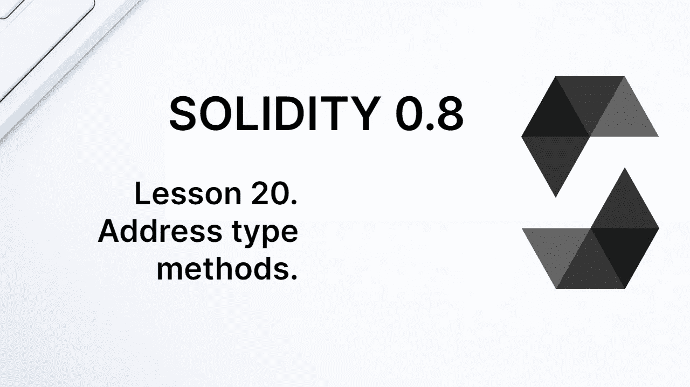
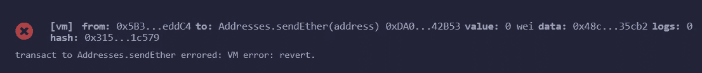

# 学习第 20 课固体。地址类型方法。

> 原文：<https://medium.com/coinmonks/learn-solidity-lesson-20-address-type-methods-65cd2b4daa6f?source=collection_archive---------5----------------------->



地址类型是 Solidity 中最常用的类型之一，因为它表示区块链上的帐户。

每个帐户都有一个基础硬币余额。在以太网的情况下，一个账户在以太网中有余额。在其他 EVM 兼容的区块链上，比如 Polygon，平衡是在网络的一些本地令牌中，比如 MATIC 代表 Polygon。

在 Solidity 中，可以从合同中检索帐户的硬币/代币余额信息。这是使用 address 类型变量的 *balance* 属性完成的，如下所示。

```
address myAddress = 0x5B38Da6a701c568545dCfcB03FcB875f56beddC4;
myAddress.balance; // returns uint256
```

我用的是 Remix 创建的账户地址。值 *myAddress.balance* 属于类型 *uint256* 。我们还可以使用地址文字表达式来访问 balance 属性，如下所示。

```
0x5B38Da6a701c568545dCfcB03FcB875f56beddC4.balance;
```

帐户余额返回其全部值，包括所有小数位。在以太坊的情况下，该值以 Wei 为单位返回。

一个非常常见的用途是查看合同本身的帐户余额。在 Solidity 中，有一个对象 **this** ，表示当前的契约实例。我们可以使用*这个*来检索合同地址，通过*地址(这个)*。这样我们就可以收回合同的余额。

```
address(this).balance;  // returns uint256
```

还可以使用 *code* 属性检索契约字节码，如下所示。

```
address(this).code;    // returns bytes
```

合同的代码是一个类型为*字节*的变量。我们可以通过地址检索任何契约的字节码。

# 发送以太网

我们可以将以太(或区块链的基础硬币/代币)从合同内发送到网络上的任何账户。有不止一种方法可以做到这一点，我们将看到它们之间的区别。

从合同内部发送以太网的帐户是合同本身的帐户，因此以太网中必须有正余额才能发送以太网。

需要注意的是，只有*应付*地址有这样的方法。试图调用*(地址)。例如，对于不属于类型*应付款*的地址，transfer* 方法将抛出一个错误。

如果地址是不可支付的，可以转换变量，如下所示。

```
payable(address).(...);
```

# 转移

方法**传送**发送以太到给定的地址。如果在发送以太网时发生错误，整个事务将被恢复。让我们用这种方法写一个送乙醚的合同。

```
contract Addresses { constructor() payable {} function sendEther(address payable _address) public {
      _address.transfer(10 ether);
   }    
}
```

我们首先在部署时向契约发送以太网。为此你需要在构造函数中使用*应付款*修饰符。为了能够在被调用时接收值，函数的类型必须是 payable。构造函数是在部署时调用的函数。

10 个醚的数量将被发送到一个帐户，该帐户的地址是函数`sendEther`的一个参数。注意，函数参数是类型*地址应付*，而不仅仅是*地址*。这是使用方法*转移*所必需的。

坚实度有三个值单位:**卫**、**鬼卫**和**以太**。在上面的例子中，我们使用单元*乙醚*。

可能导致方法*转移*恢复的一种情况是合同账户没有足够的余额。另一种可能性是尝试将乙醚发送到不具有可支付功能的合同账户。



The transfer method will revert if it encounters any errors.

# 派遣

另一种可能是用**发送**的方法将乙醚发送到账户。让我们在下面的声明中看到这一点。

```
_address.send(10 ether);
```

*传输*和*发送*的区别在于*发送*方法不会在出错时恢复。如果发送成功/失败，返回*真* / *假*。

测试*发送*方法的返回是可能的(而且几乎总是可取的)，如下所示。

```
bool success = _address.send(10 ether);
if (!success) {
   revert();
}
```

我们没有研究上面代码的所有成分，但是让我们试着理解它。方法 *send* 返回 true 或 false，这取决于发送 Ether 是否成功。在上面的例子中，返回被分配给变量`success`。

然后我们检查变量`success`在表达式`if (!success)`中的值是否为假(读为“如果不成功”)。如果不成功，我们执行方法`revert()`，该方法恢复事务。

# 呼叫

方法 **call** 不仅用于向某个账户发送以太，还可以与某个合约账户进行交互，能够调用函数。但是，可以使用此方法仅发送以太网，因为这是向任何帐户(外部或合同)发送交易时的一个选项。

在另一课中，我们会有更多关于方法*调用*的内容。暂且就让我们来看看怎么用它发以太吧。

```
_address.call{value: 10 ether}("");
```

由于方法*调用*可以调用一个契约函数，它必须返回两个值:一个泛型值，它是被执行函数的返回，以及事务是否成功的信息。

这意味着 call 方法返回一对值。第一个返回参数是*布尔值*，而第二个是类型*字节*。由于我们只对发送以太网的成功或失败感兴趣，我们可以使用下面的代码。

```
(bool success, ) = _address.call{value: 10 ether}("");
```

我们只获取发送成功与否的信息，而忽略其他参数。

# 我应该使用转接、发送还是呼叫？

我们需要知道使用*转接*、*发送*和*呼叫*的区别。前两种方法仅将 2300 单位的气体转移到目标帐户，这仅够执行乙醚转移。*调用*方法将所有可用的 gas 转发到目标帐户。

让我解释一下。*调用*方法的目的比仅仅发送以太要广泛得多。它将调用另一个契约中的函数，并且不可能知道这个函数将需要多少气体。因此，所有可用的气体都被输送。

从其他契约调用函数时必须小心。他们可以使用转发的 gas 来执行恶意操作，包括入侵发送呼叫的合同。这不仅可以像在被称为可重入性的利用中那样完成。

直到最近，还推荐使用*转移*方法转移乙醚。*转账*方法只转发 2300 单位的气，是为了防止收款账号利用可用气进行某种恶意的态度。

但是，目前推荐的方法是使用*调用*。想法是以太坊气表是灵活的，可能是将来运以太要 2300 单位以上的气。这可能会破坏版本之间的兼容性。

无论如何，你需要了解这三种方法之间的区别，并知道每一种方法的工作原理。

# Call、delegatecall 和 staticcall。

方法 *call* 用于调用其他契约中的函数，但不是唯一的选项。可以通过其接口以更简单的方式与其他协定进行交互，而无需使用本课中描述的任何方法。

call 方法以及方法 *delegatecall* 和 *staticcall* 都是底层的，需要显式编码函数和将要发送的参数。

方法*调用*和*静态调用*有很多相似之处，然而*委托调用*引入了一些不同之处。它主要用于调用充当库的契约中的函数。

这种方法的使用是一个更高级的主题，将在以后的课程中更详细地研究。

**感谢阅读！**

欢迎对本文提出意见和建议。

欢迎任何投稿。[www.buymeacoffee.com/jpmorais](http://www.buymeacoffee.com/jpmorais)

> 加入 Coinmonks [电报频道](https://t.me/coincodecap)和 [Youtube 频道](https://www.youtube.com/c/coinmonks/videos)了解加密交易和投资

# 另外，阅读

*   [Bookmap 点评](https://coincodecap.com/bookmap-review-2021-best-trading-software) | [美国 5 大最佳加密交易所](https://coincodecap.com/crypto-exchange-usa)
*   [加密交易机器人](/coinmonks/crypto-trading-bot-c2ffce8acb2a) | [硬币门评论](https://coincodecap.com/coingate-review)
*   最佳加密[硬件钱包](/coinmonks/hardware-wallets-dfa1211730c6) | [Bitbns 评论](/coinmonks/bitbns-review-38256a07e161)
*   [新加坡十大最佳加密交易所](https://coincodecap.com/crypto-exchange-in-singapore) | [购买 AXS](https://coincodecap.com/buy-axs-token)
*   [红狗赌场评论](https://coincodecap.com/red-dog-casino-review) | [Swyftx 评论](https://coincodecap.com/swyftx-review)