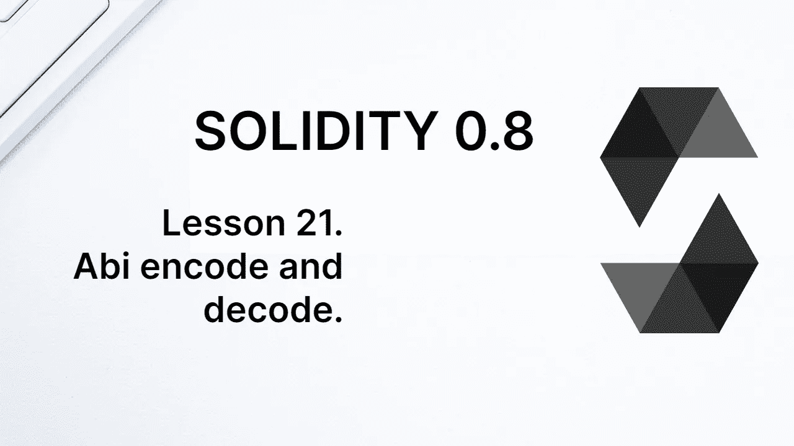
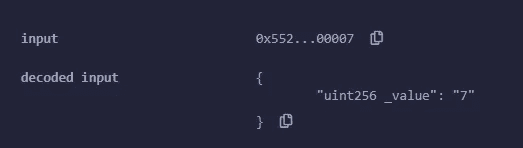
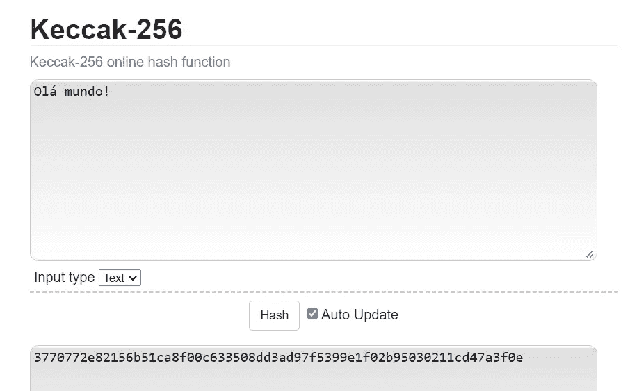
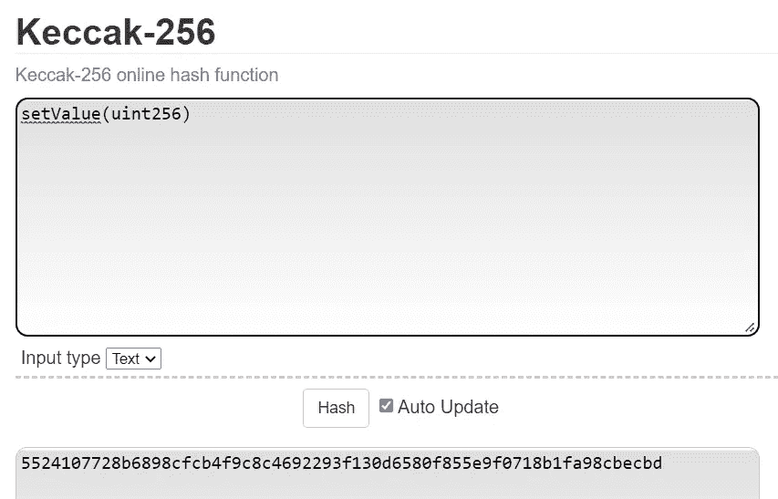
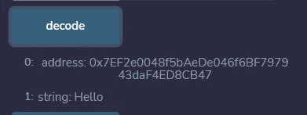

# 学习第 21 课坚固性。Abi 编码和解码。

> 原文：<https://medium.com/coinmonks/learn-solidity-lesson-21-abi-encode-and-decode-e99ed3524098?source=collection_archive---------0----------------------->



当我们想在契约中调用一个函数时，我们编写类似于 *function(arguments)* 的表达式。然而，EVM 不理解这种表达方式。我们需要发送给区块链的是一个二进制表达式，按照它的 **ABI** ( **A** 应用 **B** 二进制 **I** 接口)进行编码。

合同的 ABI 可以理解为如何与合同交互的手册。在 ABI 中，我们可以找到关于其所有公共或外部函数的信息，以及每个函数接收的参数的数量和类型。

有了这些信息和编码规则，就有可能对将要发送到 EVM 的交易进行编码。人类更容易理解表达式 *function(arguments)* ，但 EVM 只理解二进制(实际上是十六进制)。

通过一个例子更容易理解这种编码是如何工作的。让我们写下面的合同。

```
pragma solidity ^0.8.7;contract Abi { uint256 public value; function setValue(uint256 _value) public {
      value = _value;
   }
}
```

要调用函数`setValue`，将`7`的值作为参数`_value`的参数，我们必须将以下数据(通常称为有效载荷)发送到 EVM。

```
0x552410770000000000000000000000000000000000000000000000000000000000000007
```

信不信由你(最好相信)，上面的十六进制数是 EVM 调用带有参数值`7`的函数`setValue`的指令。

这可以在 Remix 控制台中看到。部署契约后，使用上述参数创建一个调用该函数的事务，并在调试面板(右下角)中打开该事务。寻找输入。



In Remix, you can see the data that was sent in the transaction.

问题是:知道了函数`setValue`的结构，我们如何构造这个有效载荷？我们如何对这个事务进行编码？让我们看看。

# 函数的签名

Solidity 中的每个函数都有一个签名，它是作为函数的 Keccak256 散列的前 4 个字节以及它的参数计算出来的。明白了吗？也许我应该解释得更清楚些。

**Keccak256** 是一个哈希函数。哈希函数是加密函数，它将任何数据作为输入，并返回一个固定值(在本例中为 32 字节)。有几个库实现了函数 keccak256，包括 Solidity。

现在我们不使用 Solidity 来计算 keccak256，而是使用一个在线站点来生成一个字符串的散列。例如，你可以使用 emn178.github.io/online-tools/keccak\_256.html 的网站。如果没有，谷歌搜索几乎肯定会把你指向一个可以计算字符串 keccak256 的站点。



Hashing the string ‘’Olá mundo!’’

字符串“Hello World”的 hash 在上面的底部，即 *37707…3f0e* 。请注意，哈希是一个 64 位数字，因为它可以是介于“a”和“f”之间的数字或字母。我们正在处理一个十六进制数(基数为 16)。每个字节需要 2 个数字，所以这是 32 个字节。

要计算函数`setValue`的签名，只需计算函数名及其参数的 hash，就像这样:**keccak 256(setValue(uint 256))**。签名是前 4 个字节(8 位数)。

这是在下图中完成的。hash 是一个很长的数字 *5524107728b6…becbd* ，但是签名只是前 4 个字节: **55241077** 。



Hashing the string setValue(uint256)

让我们记住发送到 EVM 的有效载荷，以执行函数`setValue`:*0x 55241077000000…000007*。前 4 个字节正是函数签名。在签名之后，我们有 32 个字节来表示函数参数，数字 7。

# 对参数进行编码和解码

函数参数的编码可能简单也可能复杂，这取决于参数的数量，尤其是参数的类型。尽管对整数进行编码非常简单，但对字符串和数组进行编码却有些复杂。

幸运的是，Solidity 为我们提供了一个名为 **abi** 的全局变量，有几种方法可以对函数和参数进行编码和解码。

幸运的是，我们通常不需要对函数调用进行编码，因为各种编程语言中有几个库可以为我们做这些。然而，理解 ABI 和函数签名是很重要的。

让我们使用 solidity 全局变量 *abi* 来编码函数的参数，遵循 abi 协议。

```
function encode() public pure returns (bytes memory) {
   return abi.encode(7);
}
```

我们使用方法`abi.encode`来编码一个假定函数的参数。因为参数的数量是任意的，所以返回的总是类型为*字节*。在上面的示例中，该函数返回:

```
0x0000000000000000000000000000000000000000000000000000000000000007
```

基本上就是十六进制写的数字 7，用 32 个字节来表示。

本课的目的不是详细解释 EVM 如何编码和解码函数参数，而是让我们看一些例子。

```
abi.encode(14, 22); 
// 0x000000000000000000000000000000000000000000000000000000000000000e0000000000000000000000000000000000000000000000000000000000000016abi.encode(0x7EF2e0048f5bAeDe046f6BF797943daF4ED8CB47, "Hello") 
//
0x0000000000000000000000007ef2e0048f5baede046f6bf797943daf4ed8cb470000000000000000000000000000000000000000000000000000000000000040000000000000000000000000000000000000000000000000000000000000000548656c6c6f000000000000000000000000000000000000000000000000000000
```

Solidity 也有解码一个先前在 ABI 协议中编码的值的方法。我们来解码之前的编码。

下面我们来看看函数。

```
function encode() public pure returns (bytes memory) {
   return abi.encode(0x7EF2e0048f5bAeDe046f6BF797943daF4ED8CB47, "Hello");
}function decode() public pure returns (address, string memory) {
   bytes memory encodedData = encode();
   return abi.decode(encodedData, (address, string));
}
```

我们使用 encode 方法对参数进行编码。为了解码参数，我们使用方法`abi.decode`。这个方法有两个参数:第一个是编码值，类型为*字节*，第二个是具有期望值类型的元组。在上面的例子中，我们期望返回一个地址和一个字符串。回报可以在下图中看到。



Decoding the arguments using abi.decode.

# 全局变量 abi

全局变量 *abi* 有几种方法。我们看到了上面的方法 *abi.encode* 和 *abi.decode* 。让我们看看这个全局变量的其他一些方法。

## 用签名编码

让我们记住，当我们在 EVM 中调用一个函数时，有效载荷的前四个字节代表函数的签名。可以使用方法 *abi.encodeWithSignature* 将函数的参数与其签名一起编码。

让我们使用这个方法对函数`setValue(uint256 _value)`进行编码，将数字 7 作为它的参数。

```
abi.encodeWithSignature("setValue(uint256)", 7); // 0x552410770000000000000000000000000000000000000000000000000000000000000007
```

如果函数有多个参数，参数的类型必须用逗号分隔，中间不能有空格。见下文。

```
abi.encodeWithSignature("setTwoValues(uint32,uint32)",7,12); 
// 0xd80aa9ea0000000000000000000000000000000000000000000000000000000000000007000000000000000000000000000000000000000000000000000000000000000c
```

计算函数签名时的一些重要提示。

*   字符串中错位的空格表示该函数将为该函数生成不同的签名。“setTwoValues(uint32，uint32)”的哈希与“setTwoValues(uint32，uint32)”不同(逗号后有空格)。
*   类型 *uint* 和 *int* 分别是 *uint256* 和 *int256* 的别名。在哈希中始终使用 *uint256* 和 *int256* 。

请注意，参数以 32 字节的块进行编码，即使其中一些需要更少的空间来这样做。虽然上述两个参数都只占用 8 个字节，但它们是用 32 个字节编码的。这就是 EVM 所期望的事务负载。

有一种方法可以对值进行编码，只占用其类型所需的大小，方法是 *encodePacked* 。

## abi.encodePacked

使用方法 *abi.encodePacked* ，参数被编码成只占用它们需要的大小。这不是 EVM 在接收函数时的工作方式，我们不能从以这种方式编码的函数中发送参数，但这种“打包”编码在某些情况下是有用的。

首先，让我们通过一个例子来看看它是如何工作的:

```
abi.encodePacked(string("Hello"), uint8(134), bool(false), string("World!")); // 0x48656c6c6f8600576f726c6421
```

请注意，我们需要通过类型转换显式通知要编码的变量的类型。如果您不知道什么是类型转换，不要担心，它将在后面的课程中介绍。

我将把返回分成几部分，这样我们可以更好地理解编码是如何完成的。

```
// 0x48656c6c6f8600576f726c6421 
// 48656c6c6f -> "Hello" in UTF-8
// 86 -> 134 in hexadecimal
// 00 -> false
// 576f726c6421 -> "World!" in UTF-8
```

请注意，每个变量只占用其类型所需的空间。字符串“Hello”占用 5 个字节；类型 *uint8* 占用 1 个字节；布尔型占用 1 个字节；字符串“世界！”占用 6 个字节。这与普通编码完全不同，普通编码使用 32 字节的块。

当我们想要连接不同类型的值时，方法 *abi.encodePacked* 是有用的，例如，生成数据集合的散列。我们将在更高级的课程中看到它的用途。

当我们想要直接处理存储在*存储器*中的值时，它也是有用的，因为它们是以“打包”的方式写入的。

**感谢阅读！**

欢迎对本文提出意见和建议。

欢迎任何投稿。【www.buymeacoffee.com/jpmorais 

> 交易新手？尝试[加密交易机器人](/coinmonks/crypto-trading-bot-c2ffce8acb2a)或[复制交易](/coinmonks/top-10-crypto-copy-trading-platforms-for-beginners-d0c37c7d698c)