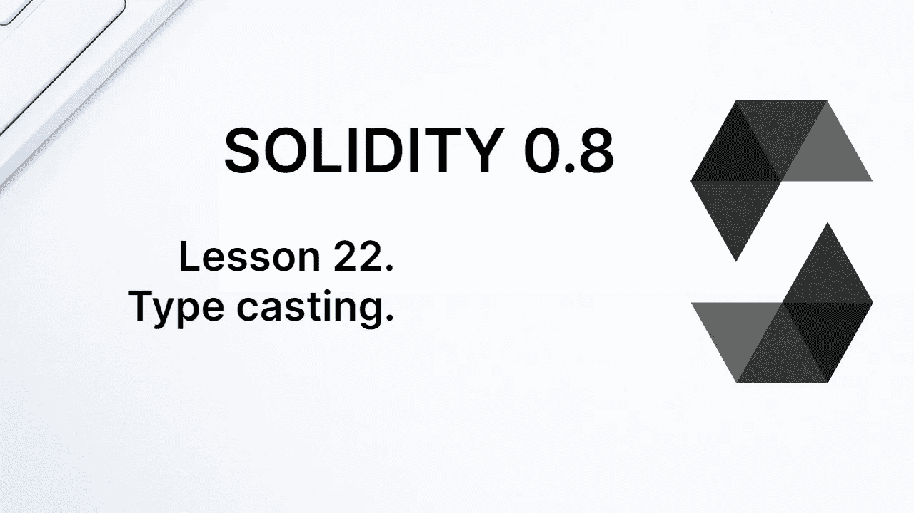
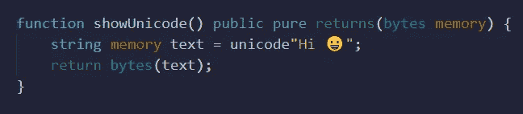
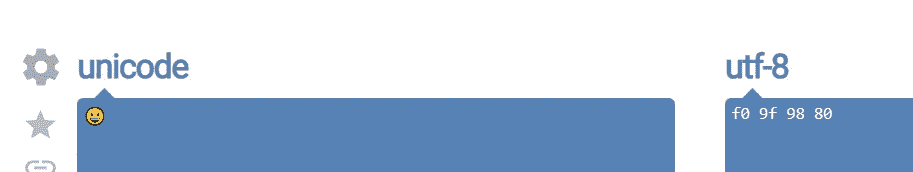

# 学习第 22 课坚固性。铅字铸造。

> 原文：<https://medium.com/coinmonks/learn-solidity-lesson-22-type-casting-656d164b9991?source=collection_archive---------3----------------------->



Solidity 是静态类型语言，所以所有变量都有固定的类型；在声明变量后，不能改变变量的类型。这是必要的，因为状态变量在存储器中有一个专用空间。

然而，将一种类型转换成另一种类型是可能的。这叫做类型转换。有两种方法可以做到这一点:显式和隐式。

当表达式有逻辑意义并且在转换时没有信息丢失时，就会发生隐式转换。这听起来可能有些武断，但是通过一些例子应该会变得更加清晰。

假设我们有两个变量，一个类型为 *uint8* ，一个类型为 *uint16* 。为方便起见，我们分别称它们为`narrow`和`broad`。变量`narrow`接受 0 和 2⁸-1 之间的值，而变量`broad`接受 0 和 2⁶-1 之间的值。因此，变量`narrow`接受的所有值也被变量`broad`接受，但反之则不然。

下面的代码完全符合逻辑，没有任何信息丢失。

```
uint8 narrow = 140;
uint16 broad = narrow; // 140
```

隐式转换的另一个例子发生在不同类型(无符号)的整数之间有和的时候。下面的代码也是完全合法的，没有信息丢失。

```
uint8 valor1 = 140;
uint16 valor2 = 480;
uint16 valor3 = valor1 + valor2; // 620
```

虽然变量`value1`和`value2`是不同的类型，但是求和不会有问题。没有信息丢失。

其他编程语言中允许的一些转换，比如从*字符串*到*整数*的转换，或者从*布尔*到 0/1 的转换，在 Solidity 中并不存在。不允许使用类似下面的表达式。

```
uint8 number = 100 + false; // error
uint8 number = 100 + "2"; // error
```

# 显式转换

在 Solidity 中进行显式类型转换是可能的，但是在这样做的时候你需要非常小心。让我们看一个从类型 *int8* 转换为 *uint8* 的例子。首先，我们来了解一下计算机是如何表示数字的。

我们假设下面的 8 位代表一个数:11111111。它代表什么数字？没有正确的答案。如果它表示无符号整数，则其十进制值为 255。但是如果它表示一个既可以是正数也可以是负数的整数，那么它的十进制值就是-1。

现在考虑一个具有以下主体的函数，其中我们显式地将 int 类型转换为 uint。

```
int8 negative = -1;
return uint8(negative);
```

变量`negative`的位值是 11111111，不管它代表什么。对于无符号整数，其值为 255。注意，通过进行显式转换，我们将-1 的值转换为 255。


The 8-bit value 11111111 can be either -1 or 255, depending on the type.

在上面的例子中，我们将 8 位类型转换为 8 位类型。我们已经看到，将 8 位无符号整数转换为 16 位很简单，转换是隐式的。但是有可能从 16 位转换到 8 位吗？如果不丢失信息，就不可能将 16 位值存储在 8 位中。这就像试图把一个大盒子放进一个小盒子而不折叠它。

考虑 16 位二进制值 0000101000001001。十进制写成 2569。现在让我们做一个到 *uint8* 的显式转换。你认为结果应该是什么？

仅保留最后 8 位。值 0000101000001001 被转换为 00001001，即 9 位小数。当从较大的整数类型转换为较小的整数类型时，右边的位会保留，而左边的位会丢失。

在转换字节类型时，情况正好相反。当一个较大的字节类型被转换成较小的类型时，前几个字节被保留，最后几个字节丢失。当将较小的字节转换为较大的字节时，空字节会附加到右边。让我们在下面的例子中看到这一点。

```
bytes4 value = 0x12345678;
bytes1 smallValue = bytes1(value); // 0x12
bytes5 largeValue = value; // 0x1234567800;
```

请注意，当信息丢失时，需要进行显式转换。当没有信息丢失时，就会发生隐式转换。

# 字节、字符串和地址

类型*地址*是一个 20 字节的十六进制数，所以您可以通过 20 类型将*地址*和*相互转换。转换必须是显式的。*

```
address myAddress = 0x5B38Da6a701c568545dCfcB03FcB875f56beddC4
bytes20 addressInBytes = bytes20(myAddress)
```

*字节*和*字符串*也可以转换，转换需要明确。字符串是以 UTF-8 编码的字节数组，使用 Unicode 表示符号。

**Unicode** 是表示文本和表情符号等符号的标准。每个符号需要 1 到 4 个字节来表示。普通字母只使用 1 个字节，而表情符号使用 4 个字节。我们来看看下图的函数`showUnicode`。它将 2 个普通字母、一个空白和一个表情符号转换成类型*字节*。



Converting string to bytes.

在 Remix 中调用该函数，我们得到如下结果:

```
0x486920f09f9880
```

它是一个 14 位的十六进制数字，意味着 7 个字节:2 个字节用于普通字母，1 个字节用于空格，4 个字节用于表情符号。

要明白 Unicode 和 UTF-8 是两码事。Unicode 是一种将值与符号联系起来的标准；每个符号都有一个相关的值，这个值最多可以占用 4 个字节。UTF-8 是一种以 8 位数据包或 1 字节表示 Unicode 符号的方式。与 UTF-16 相比，后者代表 16 位包中的 Unicode。

有几个网站可以找到 Unicode 符号的 UTF-8 表示。网站[onlineunicodetools.com/convert-unicode-to-utf8](http://onlineunicodetools.com/convert-unicode-to-utf8)就是一个例子。在下图中，我们将一个笑脸转换为 UTF-8。



UTF-8 representation of a smiley.

请注意，结果 *f0 9f 98 80* ，正好是函数`showUnicode`返回的最后 4 个字节。这表明 Solidity 使用 UTF-8 来表示 Unicode 中的符号。

当我们将*字符串*转换为*字节*时，不可能将*字节*显式转换为*字符串*。

应该清楚的是，将字符串转换为字节不会改变变量的值。字符串变量是一个静态的字节数组，这正是我们在转换为字节时所看到的。将字符串转换为字节的一个原因是能够使用类型为 *bytes* 的方法。让我们看看下面的例子。

```
string memory value = "Hello";
bytes1 firstByte = bytes(value)[0]; // ok
bytes1 firstByteFail = value[0]; // error
```

为了检索字符串“Hello”的第一个字节，我们需要将其类型转换为*字节*。类型*字符串*没有检索单个字节的方法。

**感谢阅读！**

欢迎对本文提出意见和建议。

欢迎任何投稿。[www.buymeacoffee.com/jpmorais](http://www.buymeacoffee.com/jpmorais)

> 交易新手？试试[加密交易机器人](/coinmonks/crypto-trading-bot-c2ffce8acb2a)或[复制交易](/coinmonks/top-10-crypto-copy-trading-platforms-for-beginners-d0c37c7d698c)